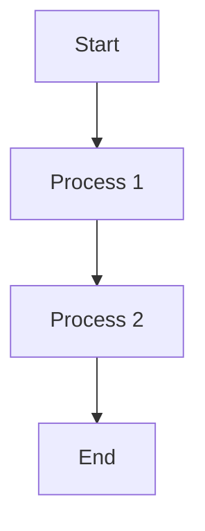
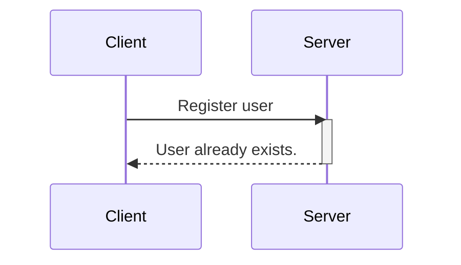
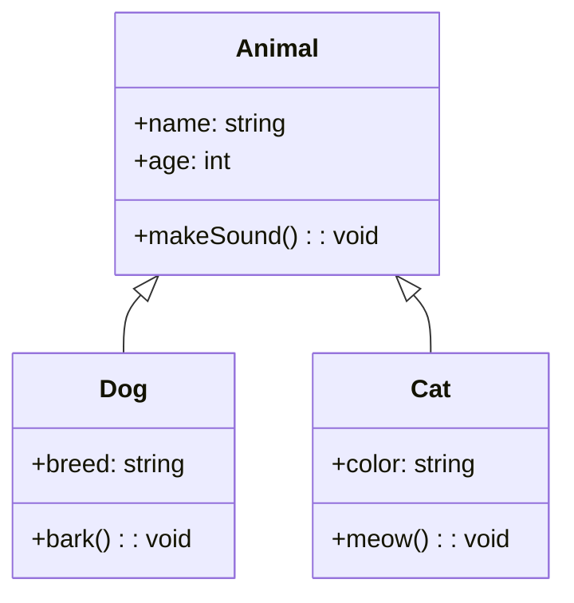
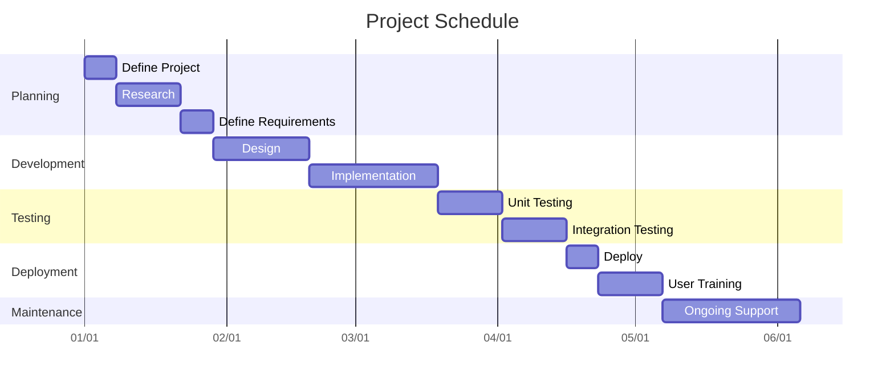
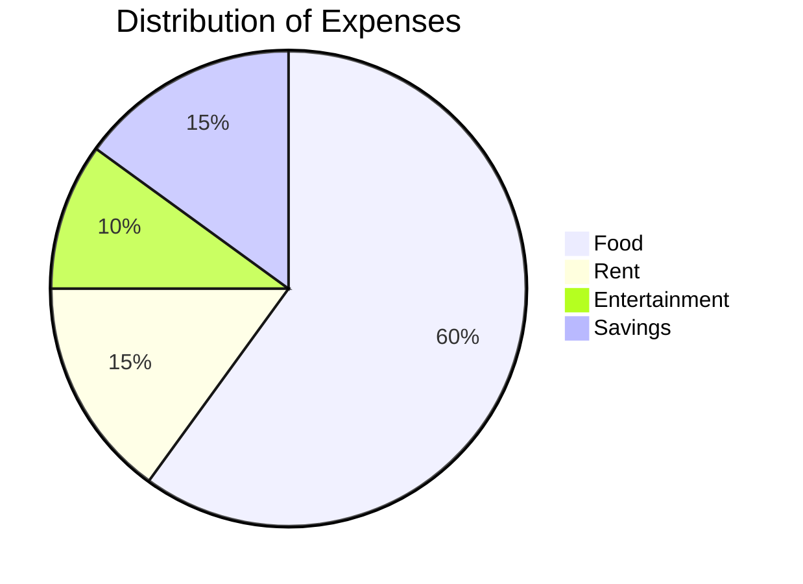

# Cómo crear diagramas como código con Mermaid, GitHub y Visual Studio Code


[Zaira Hira](https://www.freecodecamp.org/news/author/zaira/)


Los diagramas son una parte importante de la documentación técnica. En este artículo exploraremos cómo podemos usar código para generar diagramas y aprovecharlos en Markdown.

A continuación se muestra un ejemplo de cómo se ve un diagrama generado por código:


Diagrama generado por código.

Sin herramientas, sin arrastrar, alinear y ajustar formas a lugares. Sólo código. Interesante ¿verdad?

## Requisitos previos

Para seguir este tutorial, debe tener lo siguiente:

- Una comprensión básica de Markdown. Echa un vistazo a [esta guía](https://www.freecodecamp.org/news/markdown-cheat-sheet/) si no estás familiarizado con Markdown.
- Visual Studio Code con una extensión de vista previa de Markdown (que se trata en detalle en las siguientes secciones).
- GitHub, para comprender cómo se pueden representar diagramas allí.

## Ventajas de generar diagramas como código

Hay varias ventajas de generar diagramas como código en lugar de utilizar métodos tradicionales para "crear" diagramas manualmente. Veamos algunos de ellos:

- **Dinámico** : los diagramas generados por código son dinámicos, lo que significa que puede actualizarlos fácilmente actualizando el código.
- **Editable** : con las imágenes generadas por código, no depende de herramientas complejas de generación de imágenes. Simplemente puedes editar el código en un editor de texto y obtener una imagen actualizada.
- **Eficiente** : las imágenes generadas por código se cargan rápidamente en comparación con las imágenes estáticas. Además, no es necesario alojarlos por separado como una imagen en su sitio web.
- **Rápido de crear** : puede usar una plantilla y crear diagramas rápidamente simplemente usando código. No es necesario invertir tiempo y esfuerzo en aprender herramientas de creación de imágenes, que suelen resultar abrumadoras al principio.

## Cómo renderizar y ver el código de sirena

Hay varias formas de crear y ver diagramas de sirena.

### Código VS

Primero, instale una vista previa de Markdown que sea compatible con Mermaid. A continuación se muestra un ejemplo de dicha extensión: [Markdown Preview Mermaid Support](https://marketplace.visualstudio.com/items?itemName=bierner.markdown-mermaid) .

Cree un archivo Markdown vacío usando la extensión `.md`. Escriba su código en este archivo y abra la vista previa en el panel derecho:


Código y vista previa en VSCode

### pila

[StackEdit](https://stackedit.io/) es una vista previa de Markdown en línea basada en navegador. Proporciona una ventana de edición y una vista previa en el lado derecho.


Código y vista previa en StackEditar

### GitHub

Puede agregar diagramas de sirena para crear atractivos archivos README en GitHub. Simplemente edite el `README.md`archivo Markdown o cualquier otro en GitHub para representar diagramas de sirena.


Editar código en GitHub


Ver y renderizar el diagrama de sirena en GitHub

## Cómo generar diagramas como código con Mermaid

Mermaid es una herramienta basada en JavaScript que transforma texto estilo Markdown en diagramas dinámicos, permitiéndole crearlos y modificarlos sin esfuerzo.

Mermaid facilita la generación de diagramas y elementos visuales utilizando texto y código simples.

Sigue una sintaxis simple:

````
```mermaid
	your code goes here
    .
    .
    .
    
```
````

Con Mermaid, puedes generar los siguientes tipos de diagramas:

- Diagrama de flujo
- Diagrama de secuencia
- Diagrama de clase
- Gantt
- Gráfico circular

Exploremos uno por uno.

### Cómo crear un diagrama de flujo

Un diagrama de flujo es una imagen que muestra los pasos de un proceso mediante símbolos, ayudando a explicar el proceso de forma clara y organizada. Un diagrama de flujo se compone de nodos que están conectados por flechas.

Puedes representar diagramas de flujo en sirena usando este ejemplo:

````

````

**Resultado:**


Diagramas de flujo en sirena.

**Desglose de sintaxis:**

- `flowchart`: Esta palabra clave indica que estamos creando un diagrama de flujo.
- `TD`: esta es la orientación del diagrama de flujo y significa de arriba a abajo. Las otras orientaciones del diagrama de flujo son:  
    – `TB`- De arriba a abajo, igual que TD.  
    – `BT`- De abajo hacia arriba  
    – `RL`- De derecha a izquierda  
    – `LR`- De izquierda a derecha
- `-->`: La dirección de la flecha que conecta los nodos.

### Cómo crear un diagrama de secuencia

Un diagrama de secuencia es una representación ilustrativa de las interacciones entre procesos, que demuestra su flujo operativo y la secuencia de ejecución.

Puedes representar diagramas de secuencia en sirena usando esta sintaxis:

````

````

**Resultado:**


Diagrama de secuencia en sirena.

**Desglose de sintaxis:**

- `sequenceDiagram`: Esta palabra clave especifica que estamos haciendo un diagrama de secuencia.
- `participant`: Estos son los participantes o actores en un diagrama de secuencia.
- `activate/ deactivate`: Es posible activar y desactivar un actor. La activación se muestra como un pequeño rectángulo entre interacciones.
- `-->>`: Líneas de conexión (discontinuas).
- `->`: Líneas de conexión (sólidas).

### Cómo crear un diagrama de clases

Los diagramas de clases se utilizan para visualizar la estructura y las relaciones de clases, interfaces y sus interacciones en la programación orientada a objetos (OOP). Puedes representar diagramas de clases en Mermaid usando esta sintaxis:

````

````

**Resultado:**  


Diagrama de clases en sirena.

**Desglose de sintaxis:**

- Definición de clases: una clase individual se define con la `class`palabra clave seguida del nombre de la clase.
- Agregar propiedades de clase: las propiedades de clase se agregan con un `+`signo. En el ejemplo anterior, `+breed`es una propiedad.
- Agregar métodos: los métodos son reconocidos por la sirena usando `()`las llaves redondas. Tenga en cuenta que todas las propiedades y métodos están agrupados en la misma clase utilizando llaves.
- Definición de tipos de retorno: los tipos de retorno se definen después del nombre del método/nombre de la clase. `string`y `void`son los tipos de devolución en el código anterior.
- Definición de relaciones: En POO, las relaciones son los tipos específicos de conexiones lógicas que se encuentran en los diagramas de clases y objetos. Los siguientes tipos de relaciones son compatibles con sirena:

|TIPO|DESCRIPCIÓN|
|---|---|
|<\|--|Herencia|
|*--|Composición|
|o--|Agregación|
|-->|Asociación|
|--|Enlace (sólido)|
|..>|Dependencia|
|..\|>|Realización|
|..|Enlace (discontinuo)|

Aquí hay una implementación rápida de la herencia:


Herencia

### Cómo crear un diagrama de Gantt

Un diagrama de Gantt sirve como representación visual en forma de gráfico de barras. Muestra de manera efectiva el cronograma de un proyecto, revelando la duración requerida para que los componentes individuales del proyecto lleguen a completarse.

Puedes representar diagramas de Gantt en Mermaid usando este ejemplo:

````

````

**Resultado**


Diagramas de Gantt en sirena.

**Desglose de sintaxis:**

- `gantt`especifica que desea representar un diagrama de Gantt en forma de sirena.
- `title`representa el título del proyecto.
- `dateFormat YYYY-MM-DD`es el formato de fecha de entrada para el gráfico.
- `axisFormat %m/%d`representa el formato de fecha mostrado, la fecha de salida, en el eje x.
- `section`se utiliza para separar diferentes partes del proyecto.

El eje x representa el tiempo y el y registra las diferentes tareas y el orden en que deben completarse.

### Cómo crear un gráfico circular

Un gráfico circular, también conocido como gráfico circular, es una representación visual redonda que se utiliza para mostrar datos estadísticos. Se divide en segmentos o porciones para transmitir visualmente las proporciones numéricas de diferentes categorías o valores.

A continuación se muestra un ejemplo para crear un gráfico circular en forma de sirena:

````

````

**Resultado**


Gráficos circulares en sirena.

**Desglose de sintaxis:**

En este ejemplo:

- `pie`indica que estamos creando un gráfico circular.
- `title`establece el título del gráfico circular.
- Los elementos entre comillas dobles representan las categorías (por ejemplo, "Comida", "Alquiler", "Entretenimiento", "Ahorros").
- Los números después de los dos puntos representan las proporciones o porcentajes de cada categoría. En este caso, “Comida” ocupa el 60% del ranking, “Alquiler” el 15%, “Entretenimiento” el 10% y “Ahorro” el 15%.

## Terminando

En este artículo, apenas arañamos la superficie de la representación de diagramas en Mermaid. Los diagramas son altamente personalizables y también le permiten crear diagramas muy complejos.

Mermaid admite aún más tipos de diagramas que no se mencionan en este tutorial. Para obtener más información sobre Mermaid, consulte su [documentación oficial](http://mermaid.js.org/) .

Espero que este artículo te haya resultado útil. Me encantaría conectarme contigo en cualquiera de estas [plataformas](https://zaira_.bio.link/) .

Nos vemos en el próximo tutorial, feliz codificación 😁