# Titulo

- [Diagramas como código con Mermaid](https://www.freecodecamp.org/news/diagrams-as-code-with-mermaid-github-and-vs-code/)
- [Markdown Preview Mermaid Support](https://marketplace.visualstudio.com/items?itemName=bierner.markdown-mermaid)
- [StackEdit](https://stackedit.io/)

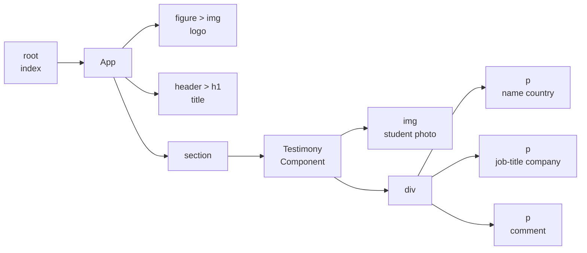

  
   

## Sirena

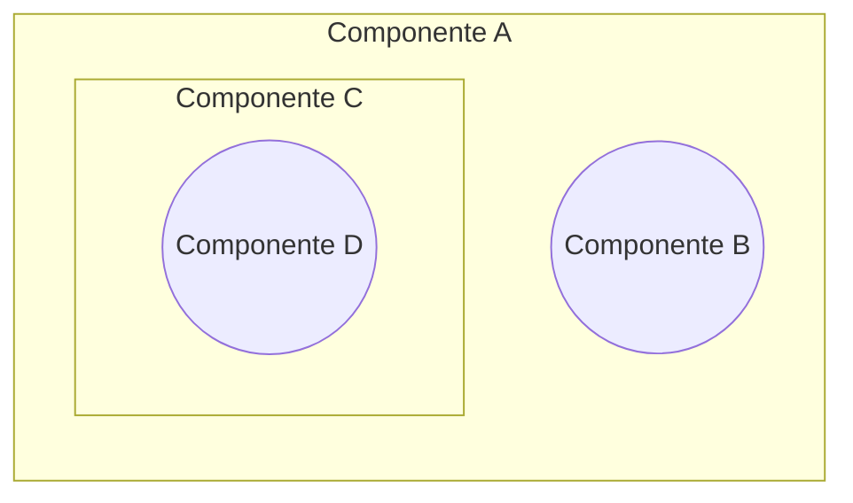

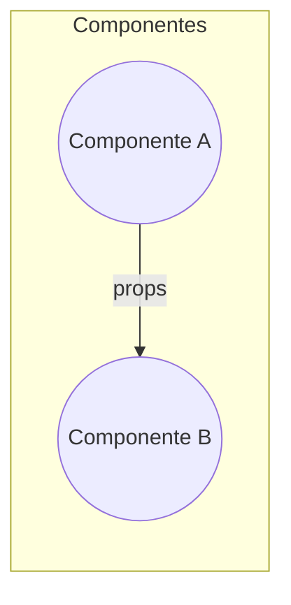

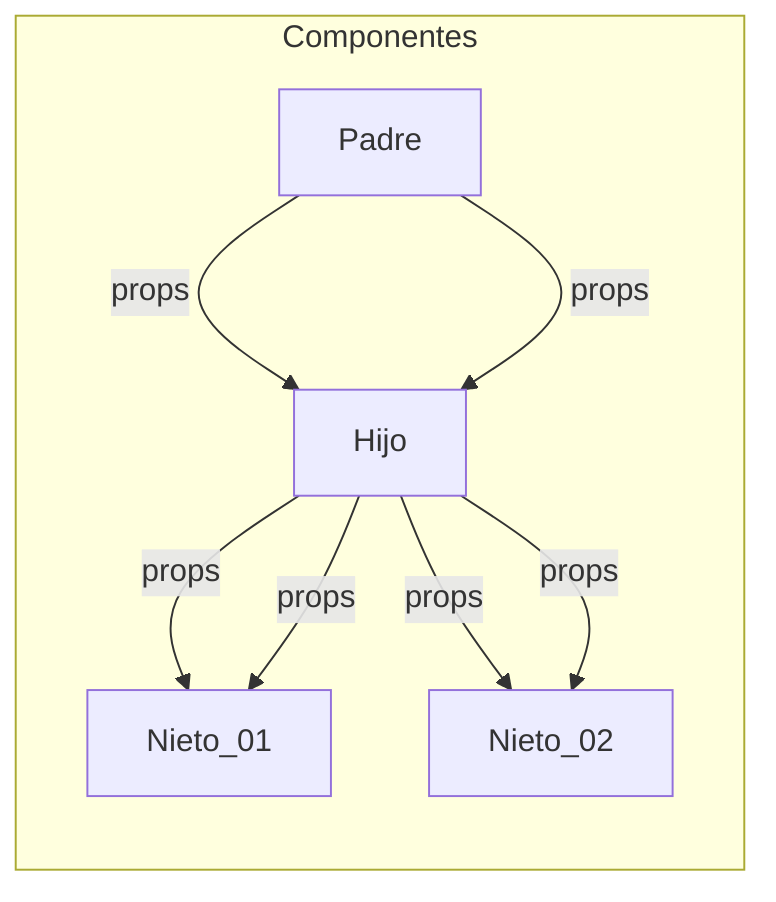

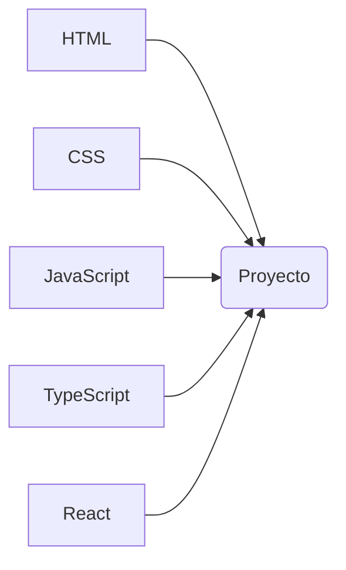

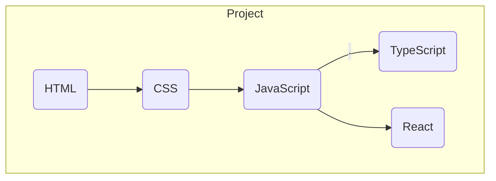

```mermaid
pie
    title Tecnologías
    "HTML" : 20
    "CSS" : 15
    "JavaScript" : 25
    "TypeScript" : 10
    "React" : 30
```

```mermaid
graph TB
    subgraph Project
    style Project fill:#090b10, stroke:#4f46e5
    HTML(HTML) --> CSS(CSS) --> JavaScript(JavaScript)
    JavaScript --> TypeScript(TypeScript)
    JavaScript --> React(React)
    end

    style HTML fill:#00204A, stroke:#00204A
    style CSS fill:#005792, stroke:#2965F1
    style JavaScript fill:#00BBF0, stroke:#00BBF0
    style TypeScript fill:#071952, stroke:#071952
    style React fill:#82A0D8, stroke: #D8B4F8
```

```mermaid
graph TB
    %% Add the following line to set the background color %%
    linkStyle default fill:#4f46e5, stroke:#4f46e5

    subgraph Project
    style Project fill:#090b10, stroke:#4f46e5
    HTML(HTML) --> CSS(CSS) --> JavaScript(JavaScript)
    JavaScript --> TypeScript(TypeScript)
    JavaScript --> React(React)
    end

    style HTML fill:#0C134F, stroke:#0C134F
    style CSS fill:#1D267D, stroke:#1D267D
    style JavaScript fill:#5C469C, stroke:#5C469C
    style TypeScript fill:#AD7BE9, stroke:#AD7BE9
    style React fill:#F266AB, stroke: #F266AB
```

## Technologies

- HTML: 🌐
- CSS: 🎨
- JavaScript: 🚀
- TypeScript: 🆕
- React: ⚛️

| HTML 🌐 | CSS 🎨 | JavaScript 🚀 | TypeScript 🆕 | React ⚛️ | 🌱  |
| ------- | ------ | ------------- | ------------- | -------- | --- |

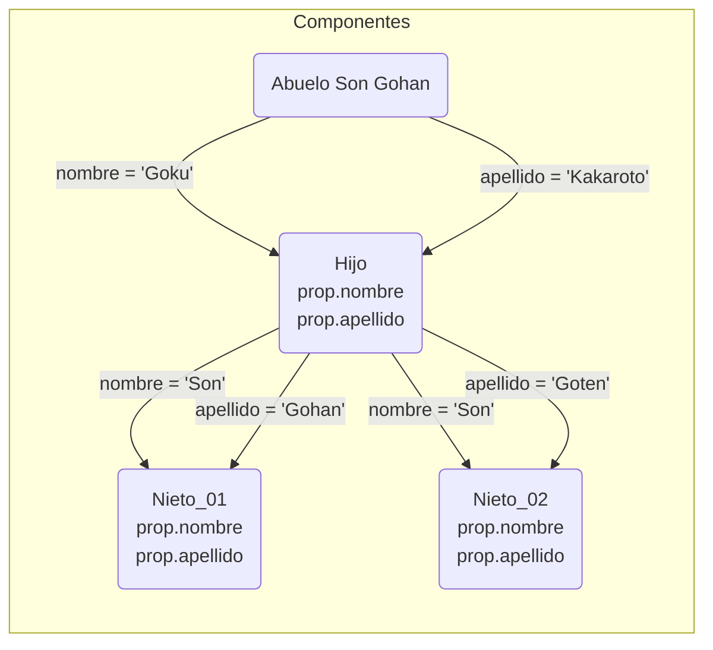

En React, cuando utilizas la sintaxis prop.apellido estás accediendo a una propiedad (prop) llamada "apellido" que ha sido pasada al componente como un dato desde su componente padre.

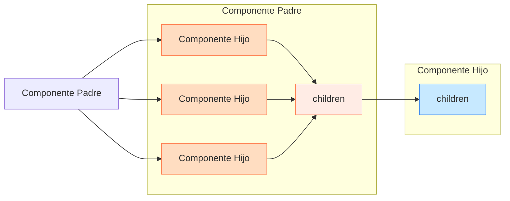

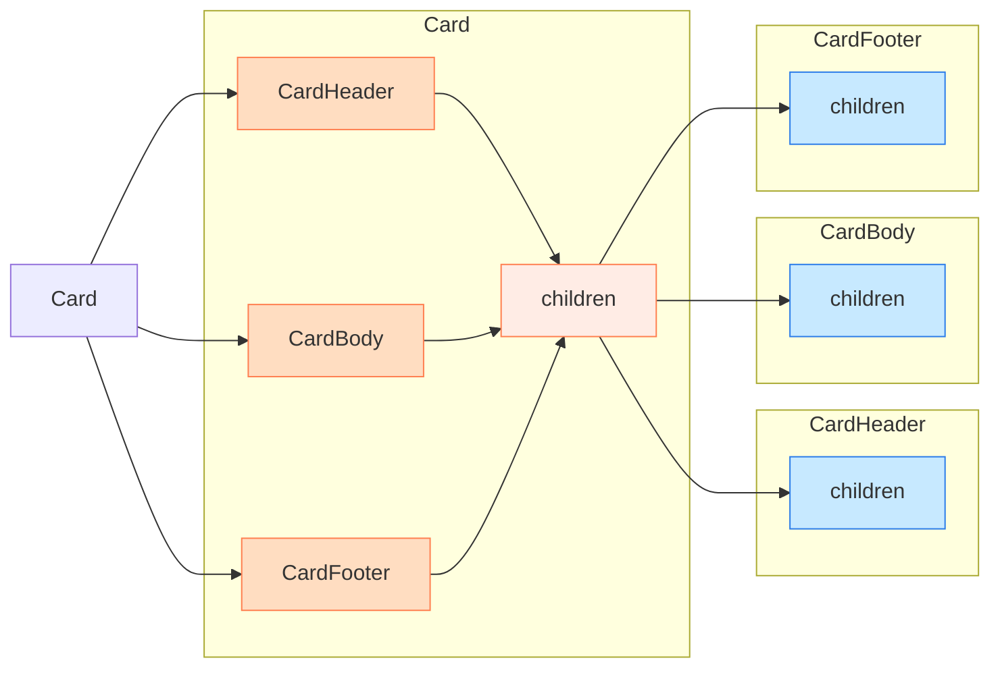
