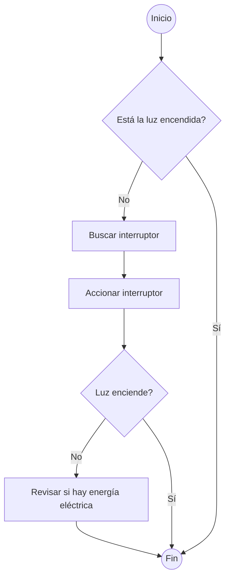
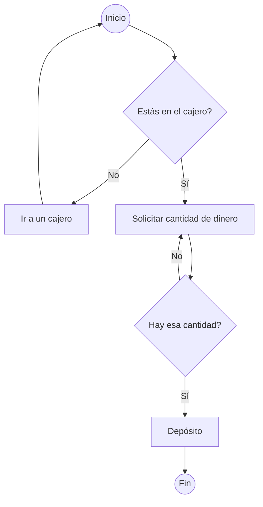
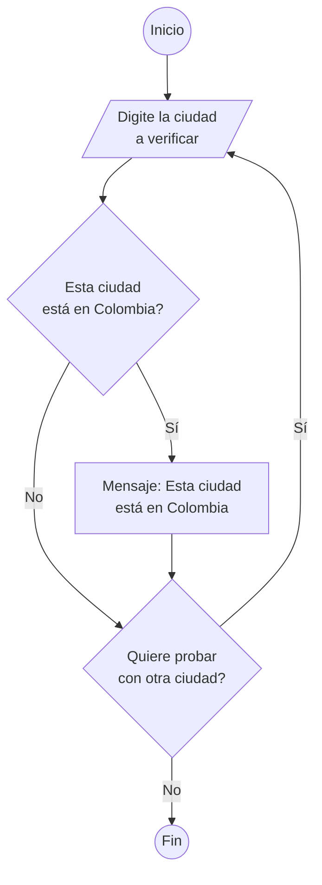
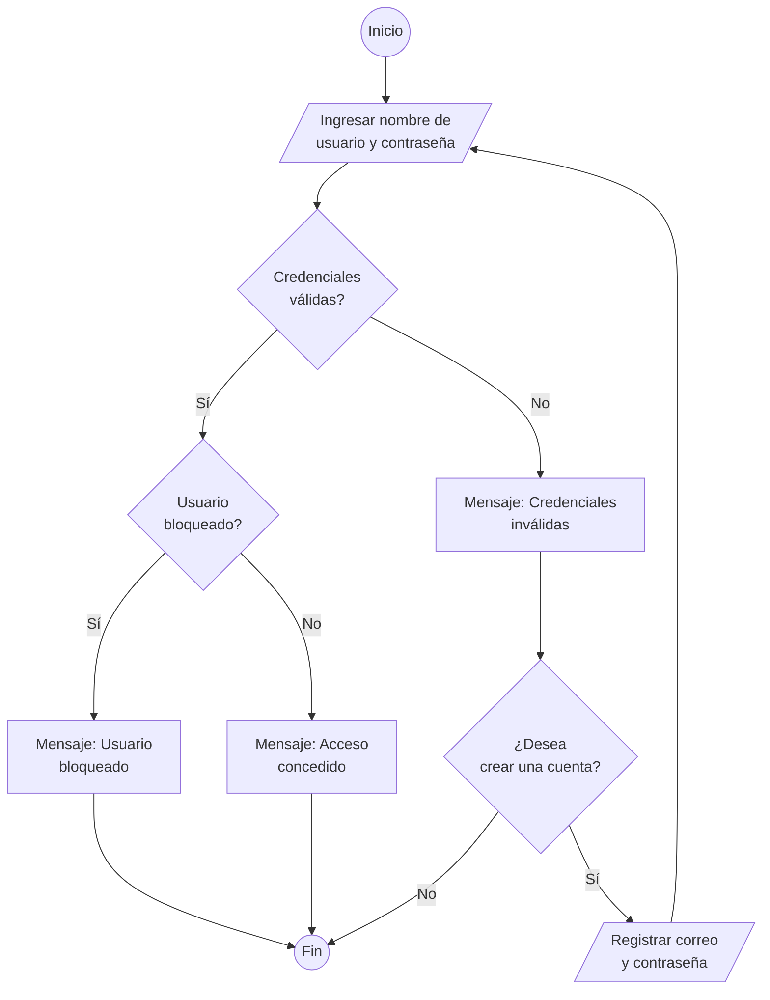

# Curso de Pensamiento Lógico: Algoritmos y Diagramas de Flujo

> Inicio: 19/01/2024  
> Final: 21/01/2024

## **1.** ¿Qué es una operación matemática?

Una operación matemática es un proceso. El objetivo del proceso es obtener un resultado. Dicho resultado se obtiene con base en entradas, que serían los números a sumar. Por ejemplo; si sumamos 8 + 6, 8 y 6 serían las entradas y 14 sería el resultado.

Además, las operaciones matemáticas tienen un tercer componente, este es conocido como símbolo, su función es indicar que se necesita hacer para llegar al objetivo.

### ¿Por qué son importantes las operaciones matemáticas en programación?

Para responder a la pregunta ¿Por qué son importantes las operaciones matemáticas en programación? Debemos recordar que El **desarrollo de software** más halla de la escritura de código es la resolución de problemas cotidianos a través del software y en muchas ocasiones se necesitan las matemáticas de forma literal para solucionar algún problema o para crear algún producto que le facilite la vida a las personas.

### ¿Existe código para las matemáticas?

La respuesta a esta pregunta es sí. Las matemáticas juegan un gran papel al codificar. Por ello, es importante conocer la simbología que representa a las operaciones a la hora de programar, aunque esto depende del lenguaje de programación.

### ¿Cómo se usa una operación matemática en programación?

En programación las operaciones matemáticas se usan de forma muy similar a como se usan en la vida cotidiana, aunque en el mundo de la programación se encuentran una serie de componentes y símbolos que pueden ayudar a agregar complejidad.

### ¿Qué es el pensamiento lógico?

El pensamiento lógico es la habilidad que tenemos para resolver diferentes problemas con las herramientas que tengamos a la mano. La lógica nos ayuda a buscar soluciones óptimas a problemas simples y complejos, por lo que es útil profesionalmente y también para la vida.

### Reto

Tomando en cuenta que las operaciones matemáticas básicas son suma, resta, multiplicación y división; elige 3 de estas 4 y realiza operaciones a mano, en las que practiques diferentes combinaciones de números y obtengas diferentes resultados. Además, debes hacer al menos 3 operaciones de cada una que elijas.

Por ejemplo; 3 sumas, 3 multiplicaciones y 3 divisiones.

## **2.** Propiedades y orden de las operaciones

Las propiedades matemáticas se usan para simplificar expresiones algebraicas. El tener un buen entendimiento de estas propiedades facilita la resolución de los problemas matemáticos. Dentro de las matemáticas existen 4 propiedades, estas son:

- [Propiedad conmutativa](https://en.wikipedia.org/wiki/Commutative_property)
- [Propiedad asociativa](https://en.wikipedia.org/wiki/Associative_property)
- [Propiedad distributiva](https://en.wikipedia.org/wiki/Distributive_property)
- [Propiedad de identidad](https://es.wikipedia.org/wiki/Identidad_(matem%C3%A1tica))

Las propiedades y el orden de las operaciones son reglas matemáticas que se utilizan para determinar cómo se deben realizar las operaciones en una expresión matemática. Las propiedades matemáticas se usan para simplificar expresiones algebraicas. El tener un buen entendimiento de estas propiedades facilita la resolución de los problemas matemáticos. Dentro de las matemáticas existen 4 propiedades, estas son: Propiedad conmutativa, Propiedad asociativa, Propiedad distributiva y Propiedad de identidad.

### ¿Qué es la Propiedad Conmutativa?

La propiedad conmutativa es una propiedad matemática que se aplica a las operaciones de adición y multiplicación. Esta propiedad nos enseña que en una suma o multiplicación, el orden de los factores o números, no altera el resultado.

Su enunciado nos dice:

> _"El orden de los factores no altera el producto"._

Ejemplo de la Propiedad Conmutativa:

```js
9 + 7 = 16 👈👀 7 + 9 = 16

8 * 5 = 40 👈👀 5 * 8 = 40
```

En ambos ejemplos, vemos que aunque invirtamos los números, el resultado siempre será el mismo. Cabe destacar que esto aplicaría igualmente si fuesen más de dos números en la operación. No importa la cantidad.

### ¿Qué es la Propiedad Asociativa?

Su enunciado nos dice:

> _"Cuando se suman o multiplican tres o más números, la operación es la misma sin importar el modo en el que los números son agrupados"._

Debemos tomar en cuenta que en matemáticas llamamos agrupación a números dentro de un paréntesis. Por ejemplo, si fuese:

```js
(3 + 7) + 5
```

Los números agrupados son 3 y 7. Al estar agrupados, siempre se debe realizar primero la operación de dentro de los paréntesis y luego el resto. En este caso sumaríamos primero el 3 con el 7, y el resultado que es 10, se sumaría con el 5.

Ahora que sabes esto, puedes entender que sin importar cómo agrupemos los números, siempre el resultado será el mismo siempre y cuando sea suma o multiplicación. Por ejemplo:

```js
3 * 2 * 5 = 30
(3 * 2) * 5 = 30
3 * (2 * 5) = 30
```

Es importante tomar en cuenta que esta propiedad también aplica a operaciones con muchos más números, no tienen que ser solo 3 necesariamente.

### ¿Qué es la Propiedad Distributiva?

Su enunciado nos dice:

> _"La suma de dos números multiplicada por un tercer número, es igual a la suma de cada sumando multiplicado por el tercer número"._

Este enunciado puede ser el más confuso, pero la propiedad en realidad es muy fácil de entender. La mejor forma es con un ejemplo. Digamos que tenemos la siguiente operación:

```js
8 * (4 + 15)
8 * 19
152
```

Lo que nos indica la propiedad, es que podemos realizar esa misma operación de la siguiente forma:

```js
(8 * 4) + (8 * 15)
32 + 120
152
```

Dicho de otra forma, en este ejemplo concluimos que lo que nos indica el enunciado, es que multiplicar 8 por la suma de 4 + 15, es lo mismo que sumar las multiplicaciones de 8 * 4 y 8 * 15.

### ¿Qué es la Propiedad de Identidad?

La propiedad de identidad es una propiedad matemática que se aplica a las operaciones de adición y multiplicación.

La propiedad de identidad es una propiedad matemática que se aplica a las operaciones de adición y multiplicación. Esta propiedad tiene una particularidad, y es que se subdivide en 2 "sub-propiedades". Una para la suma y otra para multiplicación.

#### Propiedad de identidad en la Suma

La propiedad de identidad en la suma se refiere al hecho de que el cero es el elemento neutro de la adición.

El enunciado de esta propiedad dice:

> _"La suma de cualquier número y cero da como resultado el mismo número"._

En realidad esta propiedad la aplicamos sin darnos cuenta. En pocas palabras, nos dice que:

```js
4 + 0 = 4
```

Es decir, si sumamos un número con el 0, no cambia nada.

#### Propiedad de identidad en la Multiplicación

La propiedad de identidad en la multiplicación se refiere al hecho de que el uno es el elemento neutro de la multiplicación.

El enunciado de esta propiedad dice:

> _"El producto de cualquier número y uno da como resultado ese mismo número"._

Al igual que la anterior, la aplicamos sin darnos cuenta. Simplemente nos dice que:

```js
4 * 1 = 4
```

Dicho de otra forma, al multiplicar cualquier número con 1, nos dará como resultado ese mismo número.

### Reto

Para que mejores tu lógica, te invito a que realices ejercicios con todas las propiedades que has aprendido hoy. Utiliza diferentes números, agrupaciones y cuéntanos en los comentarios como te fue, o si tienes cualquier duda.

¡Para que complementes la información vista en esta clase te invitamos a visitar el curso de [Fundamentos de Matemáticas](https://platzi.com/cursos/fundamentos-matematicas/)!

##  Quiz: Introducción

1. El orden de los factores NO altera el producto.
	- Propiedad conmutativa
2. El producto de cualquier número y 1 siempre da como resultado el mismo número
	- Propiedad de identidad
3. ¿Qué propiedad usarías para resolver el siguiente problema: `15 x (2 + 7)` ?
	- Propiedad distributiva

## **3.** ¿Qué es el sistema binario?

El **sistema binario** es un sistema de numeración distinto al que conocemos, que es el decimal. A diferencia del sistema tradicional o decimal (que se compone por los números 0 - 1 - 2 - 3 - 4 - 5 - 6 - 7 - 8 - 9), el binario únicamente se compone por 1 - 0.

```js
// Sistema decimal
0 1 2 3 4 5 6 7 8 9

// Sistema binario
1 0
```

### ¿Por qué es importante el sistema binario?

Todas las computadoras (a excepción de las cuánticas), funcionan haciendo uso del sistema binario. Dentro de una computadora, el 1 representa una señal de corriente y el 0 la ausencia de la misma.

Básicamente, el 1 y 0 funcionan como un verdadero y falso. Solo tenemos dos opciones, o hay corriente, o no hay. Por lo tanto, el sistema binario es suficiente para las computadoras.

### ¿Cómo funcionaría en un ejemplo?

A pesar de que el sistema binario solo tiene dos números, las computadoras juntan varios de estos para crear una secuencia. Por ejemplo:

1011101

En este caso, cada 1 representa una señal eléctrica y cada 0 representa cada vez que no hubo una señal eléctrica. A ese grupo de números, le llamamos secuencia. Podemos ver de mejor forma cómo se vería este proceso en un gráfico. 


## **4.** Conversión entre binario y decimal

Los procesos de conversión entre binario y decimal, se hacen utilizando 2 de las [operaciones aritméticas](https://en.wikipedia.org/wiki/Operation_(mathematics)) más utilizadas en el día a día, estas son **multiplicación y división.**

### ¿Como convertir un número decimal a binario?

Para convertir un número **decimal** a **binario**, hay que realizar una serie de divisiones continuas entre 2 y escribir los distintos resultados de las divisiones en orden inverso al que se obtuvieron. Como se puede ver en la siguiente imagen.


En el proceso de conversión, se debe coger el número decimal que se desea convertir y dividirlo hasta que el divisor (2), sea mayor al dividendo (El número que se desea dividir).

### Convirtiendo un número binario en un número decimal

Una de las formas en la que se puede convertir un número binario a un número decimal es a través de los siguientes pasos:

En este ejemplo vamos a partir del mismo número con el que se hizo la conversión anterior, este es el **11100**. Recordemos que la representación de este número binario en el sistema decimal es el 28.

1. Se cogen los decimales del número binario de derecha a izquierda, se colocan en forma vertical y cada dígito se multiplica x2.

```js
| Números | Operador | Multiplicador | 
| --------| -------- | ------------- |
| 0       | *        | 2             |
| 0       | *        | 2             |
| 1       | *        | 2             |
| 1       | *        | 2             |
| 1       | *        | 2             |
```

2. Cada una de las unidades del sistema binario será la potencia del 2 que le pertenece.

```js
| Números | Operador | Multiplicador | 
| ------- | -------- | ------------- |
| 0       | *        | 2 ^ 0         |
| 0       | *        | 2 ^ 1         |
| 1       | *        | 2 ^ 2         |
| 1       | *        | 2 ^ 3         |
| 1       | *        | 2 ^ 4         |
```

3. Se hacen las operaciones de las potencias.

```js
| Números | Operador | Multiplicador | OP |
| ------- | -------- | ------------- | -- |
| 0       | *        | 2 ^ 0         | 1  |
| 0       | *        | 2 ^ 1         | 2  |
| 1       | *        | 2 ^ 2         | 4  |
| 1       | *        | 2 ^ 3         | 8  |
| 1       | *        | 2 ^ 4         | 16 |
```

4. Los resultados de la potencia se multiplican por el decimal que lo compone

```js
| Números | Operador | Multiplicador | OP | Productos | 
| ------- | -------- | ------------- | -- | --------- | 
| 0       | *        | 2 ^ 0         | 1  | 0         | 
| 0       | *        | 2 ^ 1         | 2  | 0         | 
| 1       | *        | 2 ^ 2         | 4  | 4         | 
| 1       | *        | 2 ^ 3         | 8  | 8         |
| 1       | *        | 2 ^ 4         | 16 | 16        |
```

En este caso se están multiplicando las columnas, números y multiplicación.

1. Se suman los productos de las multiplicaciones y el resultado es el número decimal equivalente al binario que se está convirtiendo.

```js
| Números | Operador | Multiplicador | OP | Productos | 
| ------- | -------- | ------------- | -- | --------- |
| 0       | *        | 2 ^ 0         | 1  | 0         |
| 0       | *        | 2 ^ 1         | 2  | 0         |
| 1       | *        | 2 ^ 2         | 4  | 4         |
| 1       | *        | 2 ^ 3         | 8  | 8         |
| 1       | *        | 2 ^ 4         | 16 | 16        |
|         |          |               |    | **28**    |
```

### Reto de la clase

Escoge dos números del sistema decimal y pásalos al sistema binario. Una vez logres hacerlo, escoge dos números del sistema binario y pásalos a decimal.

### Otra explicación 

- [BINARIO. ¿Cómo pasar de decimal a binario y viceversa?](https://www.youtube.com/watch?v=bScw3CNb_fM)
- [Sistemas numéricos: Binario, Decimal y Hexadecimal](https://www.youtube.com/watch?v=g9-MRBBcvdg)

## **5.** Suma y resta de binarios

La **suma** y **resta** de **binarios** se ejecutan aplicando una serie de reglas, que nos dan los distintos resultados de operar los dos números que componen este sistema (0 y 1).

### Suma de números binarios

Para sumar números binarios se tienen que seguir las reglas proyectadas en la siguiente tabla:

```js
| Reglas | Resultados    | 
| ------ | ------------- | 
| 0 + 0  | 0             | 
| 0 + 1  | 1             | 
| 1 + 0  | 1             | 
| 1 + 1  | 0 y acarreo 1 |
```

Una vez se tienen claras estas reglas, se procede de la misma forma en la que se opera cuando se suman números del sistema decimal, es decir, se comienzan a operar los números de derecha a izquierda. Ejemplo:

```js
  1 1 0
+ 0 0 1
---------
  1 1 1
```

El resultado de sumar los números binarios 110 y 001 es 111. Esto se debe a que las reglas nos dicen que 0 +1 = 1 y que 1 + 0 = 1.

### Resta de números binarios

Para rectar números binarios se tienen que seguir las reglas proyectadas en la siguiente tabla:

```js
| Reglas | Resultados    | 
| ------ | ----------    | 
| 0 - 0  | 0             | 
| 0 - 1  | 1 y acarreo 1 | 
| 1 - 0  | 1             | 
| 1 - 1  | 0             |
```

En la resta de número binario, la resta 0 - 1 se resuelve de forma idéntica a como se resuelve en el sistema decimal. Esto concité en tomar una unidad del decimal que sigue: 0 - 1 = 1 y se acarrea 1.


- [Calculadora de binarios](https://es.planetcalc.com/911/)
- [Sumas y Restas con Binarios](https://sites.google.com/a/educacion.navarra.es/tecnologia-y-tic/home/los-sistemas-de-numeracion-en-informatica/suma-y-resta-binaria)

## **6.** Multiplicación y división de binarios

La multiplicación de binarios se realiza teniendo en cuenta dos reglas, la primera regla dice. **Todo número multiplicado por cero es igual a cero y la segunda, que uno por uno, es igual a uno.**

Las divisiones de números binarios se pueden realizar contestando la siguiente pregunta. **¿Es el divisor menor que el dividendo?**, si la respuesta es que no, se coloca un 0 en el cociente y se baja el siguiente dígito del dividendo. Si la respuesta es que si, se realiza una resta.

### Multiplicación de números binarios

La multiplicación en el sistema binario se puede hacer de la misma forma a la que se hace en el sistema decimal, esto consiste en multiplicar el **multiplicando** por cada uno de los dígitos del **multiplicador** y luego se realiza la suma de los productos.

Al momento de ejecutar la operación, se debe seguir las siguientes reglas:

```js
| Reglas | Resultados | 
| ------ | ---------- | 
| 0 * 0  | 0          | 
| 0 * 1  | 0          | 
| 1 * 0  | 0          | 
| 1 * 1  | 1          |
```

**Veamos un ejemplo en la siguiente imagen:**

```js
  1 1 0
*   1 0
--------
  0 0 0
1 1 0
--------
1 1 0 0


| 512 | 256 | 128 | 64 | 32 | 16 | 8 | 4 | 2 | 1 |
| --- | --- | --- | -- | -- | -- | - | - | - | - |
| 0   | 0   | 0   | 0  | 0  | 0  | 1 | 1 | 0 | 0 |

8 + 4 = 12
```

En el ejemplo proyectado en la imagen anterior, se realizó una multiplicación de binarios, entre el número 110 y 10, este dio como resultado el número 1100.

### División de números binarios

De las operaciones aritméticas, es en la división es donde encontramos la mayor variación o la mayor diferencia entre como se hace esta operación en el sistema decimal y como se hace en el sistema binario.

**Veamos un ejemplo en la siguiente imagen para comprender esto de mejor manera:**

```js
     0 1 0 1 1
   ------------
10 | 1 0 1 1 0
     1 0
     -----
     0 0 1 1
         1 0
         ----
         0 1 0
           1 0
           ----
           0 0 

Dividendo 10110
Divisor      10
Cociente  1 0 1 1

10 <= 1 = No = 0
10 <= 10 = Si = 1
10 <= 11 = Si = 1 

| 512 | 256 | 128 | 64 | 32 | 16 | 8 | 4 | 2 | 1 |
| --- | --- | --- | -- | -- | -- | - | - | - | - |
| 0   | 0   | 0   | 0  | 0  | 0  | 1 | 0 | 1 | 1 |

8 + 2 + 1 = 11
```

**El ejercicio proyectado en la imagen anterior se resolvió siguiendo los siguientes pasos:**

1. Se identificó el dividendo y el divisor

**Dividendo:** 10111 **divisor:** 0

2. Se respondió a la pregunta, **¿Es el divisor menor o igual que el dividendo?**, cuando la respuesta fue que no, se colocó un 0 en el cociente y sé bajo el siguiente dígito del dividendo. Cuando la respuesta fue, que es mayor o que es igual, se realizó una resta.

Este segundo paso se realizó de forma **iterativa** hasta terminar de bajar todos los números del **dividendo**.

Al final del proceso se obtuvo en él cociente el número 010100, por lo que el resultado de dividir **10110 entre 10 es 1011**, esto se debe a que el primer cero que aparece en el cociente se ignora.

## Quiz: Sistema binario

1. Multiplica `111` por `101` en sistema binario.

	- 100011

2. ¿A cuál sistema de numeración pertenece el número 3?

	- Al sistema decimal.

3. Las operaciones matemáticas en sistema binario funcionan exactamente igual que en el sistema decimal.

	- Falso

4. Convierte el número 41 a sistema binario:

	- 101001

5. Divide 110 por 10 en sistema binario.

	- 11

## **7.** ¿Qué son las tablas de verdad?

Las tablas de verdad son una herramienta que nos ayudan a determinar cuáles son las condiciones necesarias para que sea verdadero o válido un enunciado propuesto. Estas se usan como respaldo para tomar decisiones a partir de un resultado dado.

### Conociendo los tipos de tablas de verdad

Existen 3 tipos de tablas de verdad, estas son; **negación, conjunción y disyunción**, a continuación conoceremos más acerca de su funcionamiento.

#### Tabla de verdad de negación

Esta tabla se caracteriza por ser la más simple de todas, debido a que es la que menos actores tiene.

La forma en la que esta funciona es devolviendo el valor opuesto de la proposición considerada, es decir; si una afirmación es verdadera, la negación de esta va a hacer falsa o viceversa, si se tiene que la condición es falsa al negarse se va a tener un resultado verdadero.

|A  |-A |
|---|---|
|V  |F  |
|F  |V  |

Con binarios:

|p  |~p |
|---|---|
|1  |0  |
|0  |1  |

#### Tabla de verdad de conjunción

La conjunción se puede ver como la unión de dos valores. La forma en la que esta funciona es que algo es verdad cuando ambas partes involucradas son verdaderas y cuando las partes son diferentes, el resultado es falso.

|A  |B  |A^B|
|---|---|---|
|V  |V  |V  |
|V  |F  |F  |
|F  |V  |F  |
|F  |F  |F  |

Con binarios:

|p  |q  |p^q|
|---|---|---|
|1  |1  |1  |
|1  |0  |0  |
|0  |1  |0  |
|0  |0  |0  |

#### Tabla de verdad de disyunción

##### Disyunción débil

En la disyunción algo será verdadero cuando por lo menos una de las proposiciones es verdadera, de lo contrario será falsa.

|A  |B  |A∨B|
|---|---|---|
|V  |V  |V  |
|V  |F  |V  |
|F  |V  |V  |
|F  |F  |F  |

Con binarios:

|p  |q  |p∨q|
|---|---|---|
|1  |1  |1  |
|1  |0  |1  |
|0  |1  |1  |
|0  |0  |0  |

##### Disyunción fuerte

**Una disyunción Fuerte** solamente es verdadera cuando ambas proposiciones tienen valores diferentes y es falsa si las dos proposiciones son ambas verdaderas o ambas falsas.

|A  |B  |A∨B|
|---|---|---|
|V  |V  |F  |
|V  |F  |V  |
|F  |V  |V  |
|F  |F  |F  |

Con binarios:

|p  |q  |p🔺q|
|---|---|---|
|1  |1  |0  |
|1  |0  |1  |
|0  |1  |1  |
|0  |0  |0  |

## **8.** Operadores lógicos

Los operadores lógicos son herramientas que nos permiten realizar pruebas en [expresiones lógicas](https://www.ibm.com/docs/es/spss-statistics/29.0.0?topic=expressions-logical#:~:text=Las%20expresiones%20l%C3%B3gicas%20pueden%20ser%20simples%20variables%20l%C3%B3gicas%20o%20relaciones,controlar%20el%20orden%20de%20evaluaci%C3%B3n.), estos proporcionan un resultado negativo o positivo a partir de que se cumpla o no una condición.

A la hora de utilizar estos es muy importante tener en cuenta que el resultado siempre va a depender de que las condiciones estén dadas a partir de lo que necesita, en ocasiones vas a necesitar que el resultado sea positivo y en otras vas a necesitar que sea negativo.

### Operador lógico no

El operador lógico no, invierte el valor de una afirmación. Este se usa para crear una **negación lógica** en una expresión.

Ejemplo: Si tenemos que la luz está prendida y usamos el operador lógico no con esta sentencia, estaríamos diciendo que la luz está apagada o que la luz no está prendida.

### Operador lógico Y

**Este operador devuelve true, cuando las dos expresiones que están relacionas son verdaderas**. Por ejemplo: Imagina que tienes dos elementos, el primero es un monitor y el segundo es la energía eléctrica. Si tienes el monitor y no la energía eléctrica no podrás usar el monitor, necesitas de los dos elementos para poder usar el monitor.

### Operador lógico O

**Devuelve true cuando una de las dos expresiones es verdadera**, no necesita que las dos condiciones estén dadas para que el resultado sea positivo o pueda suceder, por ejemplo:

Imagínate que en un salón de clase hay dos marcadores, cada marcador lo tiene guardado un estudiante diferente, pero ninguno de los dos estudiantes se encuentra en el salón y tú necesitas escribir en la pizarra o tablero. Para que tú puedas escribir solo necesitas que uno de los dos estudiantes llegue.

### Operador lógico Xor

Este operador lógico **devuelve true si una de las dos expresiones es verdadera**, pero si ambas expresiones son verdaderas devuelve false.

### Operadores lógicos relacionales 

|🚀         |Python |C#  |C++ |C   |JS  |Java |VB.net |Dart |PHP |
|------------|-------|----|----|----|----|-----|-------|-----|----|
|Igualdad    |==     |==  |==  |==  |==  |==   |=      |==   |==  |
|Desigualdad |!=     |!=  |!=  |!=  |!=  |!=   |<>     |!=   |!=  |
|O           |or     |\|\||\|\||\|\||\|\||\|\| |Or     |\|\| |or  |
|Y           |and    |&&  |&&  |&&  |&&  |&&   |And    |&&   |and |
|Negación    |not    |!   |!   |!   |!   |!    |Not    |!    |!   |

## **9.** Operadores aritméticos

Los [operadores aritméticos](https://support.microsoft.com/es-es/office/tabla-de-operadores-e1bc04d5-8b76-429f-a252-e9223117d6bd#:~:text=Los%20operadores%20aritm%C3%A9ticos%20se%20usan,positivo%20a%20negativo%20o%20viceversa.&text=Suma%20dos%20n%C3%BAmeros.&text=Busca%20la%20diferencia%20entre%20dos,valor%20negativo%20de%20un%20n%C3%BAmero.&text=Multiplica%20dos%20n%C3%BAmeros.) son los símbolos que permiten identificar, cuáles son los procesos y cuáles son sus resultados. Estos por lo general se usan para realizar las operaciones aritméticas conocidas que implican el cálculo de valores, dentro de los básicos encontramos (suma +, resta -, multiplicación *, división /).

Es importante comprender cuáles son los operadores aritméticos que mantienen dentro de la programación, los mismos símbolos que los representan en la vida cotidiana o en papel y cuáles cambian sus símbolos a la hora de representarlo en la programación.

### Operador aritmético de la suma

**El operador aritmético de la suma está representado por el símbolo más +. Este tiene como objetivo indicar la unión de dos valores**.

Un ejemplo de uso de este operador, es cuando queremos saber cuanto dinero quedo en la caja del restaurante al final del día, para esto hay que agarrar el total de dinero de las ventas y adicionarles el total de dinero recolectado en las propinas.

### Operador aritmético de la resta

**El operador aritmético de la resta está representado por el símbolo menos -.** Este tiene como objetivo buscar la diferencia entre dos números

Un ejemplo de esto, es cuando se quiere realizar un descuento sobre un precio total. Para lograr esto se toma el valor total del producto y se le resta la cantidad que se desea descontar.

### Operador aritmético de la multiplicación

**Este operador tiene como función multiplicar dos números.** La multiplicación está representada con el símbolo de asterisco *. Aquí surge una ligera variación entre el símbolo que estamos acostumbrados a ver en la vida cotidiana y el símbolo que la representa en la programación, debido a que es normal encontrar a la multiplicación representada con una x.

Como ejemplo de la multiplicación, podemos pensar en lo siguiente: Imaginemos que tenemos diez unidades de un producto y queremos saber cuanto representan esas diez unidades en dinero, para cumplir este objetivo multiplicamos el precio del producto por las unidades que tenemos.

### Operador aritmético de la división

El operador aritmético de la división es la barra inclinada /. Este operador aritmético también tiene una ligera variación con respeto a su simbología debido a que nos acostumbramos a ver otro elemento que representa esta operación. **La función de este es dividir el primer número entre el segundo número.** Por ejemplo:

Supongamos que tenemos el total de la compra de diez unidades de un producto y queremos saber cuanto nos costó cada producto. Para llegar a esa respuesta lo que se debe hacer es dividir el total de la compra entre las diez unidades comprada, el resultado de esta operación es el valor unitario.

### Operador aritmético módulo 

Se representa con “%”, este operador divide el primer número por el segundo y da como resultado la parte restante.

```js
  ---
75|8
72 9
 3 ---> MOD
```

## **10.** Operadores de comparación

**Los operadores de comparación se utilizan para comparar valores.** Muestran true o false según si una comparación es verdadera o falsa. Estas comparaciones suceden entre dos partes, un lado A y un lado B.

Las expresiones donde los operadores de comparación operan funcionan de la siguiente manera. El primer valor siempre está al lado izquierdo de la expresión, este se compara con un segundo valor que está al lado derecho de la expresión y en el centro de todo, se encuentra el operador de comparación, este último es el que coloca la regla.

```js
1 < 2
```

### Operador de comparación menor que

El operador de comparación menor que <, **devuelve True si el primer valor es menor que el segundo valor**

### Operador de comparación menor o igual que

El operador de comparación menor o igual que **devuelve True si el primer valor es menor o igual que el segundo valor.** Y está representada por el símbolo menor que seguido del símbolo de igualdad <=.

### Operador de comparación mayor que

**El Operador de comparación mayor que devuelve true si el primer valor es mayor que el segundo valor**. El símbolo que identifica a este operador es >.

### Operador de comparación mayor o igual que

**El Operador de comparación devuelve true si el primer valor es mayor o igual que el segundo valor**. Las comparaciones de tipo mayor o igual que, se representan con el símbolo mayor que, seguido del símbolo de igualdad >=.

### Operador de comparación igual

**El Operador de comparación devuelve True si el primer valor es igual que el segundo valor**. Está representado por el símbolo =.

### Operador de comparación diferente de

Este representado por los símbolos menor que y mayor que <>. **Este operador devuelve True si el primer valor no es igual que el segundo valor**.

### Reto

Toma distintos valores numéricos y utiliza los operadores de comparación, para comparar un lado A con un lado B. Realiza este proceso con cada uno de los operadores mencionados.

## **11.** Reto 0: identifica los operadores

Te invito a que encuentres casos de usos para los [operadores lógicos](https://platzi.com/clases/3221-pensamiento-logico/50677-operadores-logicos/) y de [comparación](https://platzi.com/clases/3221-pensamiento-logico/50679-operadores-de-comparacion/). Intenta resolver ejercicios usando números decimales o mejor aún, **busca casos de la vida cotidiana donde estos operadores estén presente**.

### Ejemplos de casos de usos de los operadores lógicos y de comparación

A continuación se mostrarán algunos ejemplos, donde se podrían usarse los distintos tipos de operadores.

- Para ducharme, necesito agua **AND** jabón (**true**, puesto que ambos elementos son indispensables para ducharme. Si alguno de estos dos elementos no se encuentran presente, el resultado seria **False**, debido a que no se podría cumplir el objetivo).
    
- 7 < 10 **AND** 10 => 10 **AND** 12 > 6 (**true**, puesto que todas las condiciones devuelven un valor verdadero).
    
- 8 < 4 **OR** 31 <= 10 **OR** 5 > 6 (**false**, puesto que todas las condiciones devuelven un valor falso. Ninguna se cumple).
    
- 8 < 4 **XOR** 45 > 43 (**true**, puesto que se cumple una sola condición.).

## Quiz: Operadores 

1. Devuelve el valor opuesto de la proposición considerada.

	- Negación
2. Es verdadero cuando ambos enunciados son verdaderos.

	- Conjunción
3. Es verdadero cuando uno o ambos enunciados es verdadero.

	- Disyunción

## **12.** ¿Qué es un algoritmo? ¿Cómo resolver problemas con algoritmos?

Un algoritmo es una serie de pasos definidos, que van secuencialmente y logran un objetivo de la mejor forma.

### ¿Cómo construir un algoritmo?

Para poder tener la mejor respuesta posible a esta pregunta, vamos a ir realizando un ejemplo en paralelo a darle respuesta a la pregunta. El ejemplo o el problema es el siguiente:

**“Quiero encender la luz de la habitación donde estoy en este momento”.**

Una forma efectiva para crear cualquier algoritmo es seguir los siguientes pasos **(Analizar el problema, crear un paso a paso y Buscar la forma de optimizar el algoritmo)**.

### Analizando el problema

Analizar el problema, nos lleva a entender el objetivo general del algoritmo y nos permite encontrar los recursos que se tienen disponibles y los que hay que crear.

Al analizar nuestro reto, encontramos que hay una habitación, hay una luz que es posible encender y por último, tenemos que para poder encender la luz se necesita que esta esté apagada.

**Después de haber hecho el análisis, tenemos como resultado que la luz está apagada, que estamos en una habitación que permite encenderla y el objetivo es encender la luz.**

#### Construyendo el paso a paso que permitirá lograr el objetivo

En este punto se debe organizar un poco más la idea, se debe buscar encontrar todos esos detalles que nos permitirán cumplir el objetivo.

**Paso a paso de nuestro ejemplo:**

1. Se necesita validar que la luz está apagada, esta es la condición base para poder encenderla.
2. Identificar donde se va a encender la luz
3. Presionar el elemento o hacer la acción que me permita encender la luz en ese momento.

Una vez se establezca el paso a paso, **debemos hacernos una pregunta que permita determinar si hacer esos pasos de manera secuencial permitirán cumplir con el objetivo**. Si la respuesta es si, se puede continuar en el proceso, si la respuesta es no se debe volver analizar el problema.

En el caso de nuestro ejemplo, si realizamos los tres pasos anteriores, podremos cumplir nuestro objetivo.

#### Buscar la forma de optimizar el algoritmo

En este punto se deben crear los pasos que se van a necesitar para que el algoritmo tenga respuesta a los distintos problemas que se pueden presentar. También se debe buscar la forma de llegar al objetivo consumiendo la menor cantidad de recursos posibles.

**Veamos un ejemplo siguiendo con la secuencia del algoritmo que estamos creando.**

**¿Qué pasaría, si el paso uno del paso a paso no se cumple?**, Es decir, cuál va a hacer la respuesta de nuestro algoritmo cuando se encuentre que la luz no está apagada. La lógica que el algoritmo debería seguir en este punto es la de finalizar el proceso, debido a que no se necesita encender la luz.

### Usando Mermaid 



[Probar Markdown + Mermaid](https://stackedit.io/app#)

## **13.** ¿Qué es un diagrama de flujo?

Un diagrama de flujo, es un conjunto de símbolos y elementos que nos permiten representar cada uno de los pasos que componen un proceso. Los diagramas de flujo también nos ayudan a encontrar errores que cometimos al momento de diseñar los algoritmos.

Los diagramas de flujo están compuestos por elementos o figuras que tienen significados específicos y juegan un papel muy importante en la composición de estos.


### Elementos que componen un diagrama de flujo

Los elementos que componen los diagramas de flujo son una serie de símbolos que representan diferentes tipos de acciones. Entre los más comunes encontramos: **el elemento que indica el inicio, elemento de toma de decisión y el elemento que indica o representa un proceso.**

Existen más elementos que se utilizan en los diagramas de flujo, pero los anteriormente mencionados son los más relevantes.

#### Representación de inicio o fin del proceso dentro de los diagramas de flujo

**El símbolo o la figura que se utiliza para indicar el inicio o el final de un flujo es un óvalo.**

#### Representación de toma de decisión dentro de los diagramas de flujo

**La figura geométrica que representa la toma de decisiones dentro de los diagramas de flujo es el rombo**. El rombo es uno de los elementos más importantes dentro de los diagramas de flujo, debido a que representa la decisión. Este elemento siempre contiene una pregunta en su interior, la respuesta a esta pregunta se debe poder responder con un sí o con un no.

Es importante, que la figura de toma de decisión (Rombo) tenga dos casos, el caso cuando la respuesta es si y el caso cuando la respuesta a la pregunta es no.

#### Representación de procesos dentro de los diagramas de flujo

**Los procesos están representados con la figura geométrica del rectángulo**. Los rectángulos se usan para indicar y representar un proceso, es decir, los rectángulos siempre contienen algo que está sucediendo, puede ser una operación, un mensaje, un algoritmo. En conclusión, la figura del rectángulo, nos indica que está sucediendo algo.

#### Conector de elementos dentro de los diagramas de flujo

**El conector, dentro de los diagramas de flujo, está representado por la figura de una flecha**, esta indica cuál es el inicio de un proceso y cuál es el final. Si este conector no está claramente especificado entre un símbolo y otro, no va a existir una conexión entre ellos, lo que llevaría a que el flujo se rompa.

## **14.** Reto 1: ¿hay dinero en el cajero electrónico?

Con los elementos que componen un [diagrama de flujo](https://platzi.com/clases/3221-pensamiento-logico/50682-que-es-un-diagrama-de-flujo/), vamos a representar el proceso que nos permite retirar fondos de un cajero electrónico.

### Identificar el proceso que se va a representar

Identificar cuál de todos los proceso que están implicados en el problema a resolver o el [algoritmo](https://platzi.com/clases/3221-pensamiento-logico/50681-que-es-un-algoritmo-como-resolver-problemas-con-al/) a plantear, es el que se va a representar en el diagrama de flujo, nos permitirá tener un mayor nivel de detalle y esto a su vez nos llevará a encontrar posibles errores que estén presente dentro de nuestro flujo de trabajo.

### Construyendo el diagrama de flujo de nuestro cajero electrónico

Nuestro diagrama de flujo va a estar compuesto por un elemento de inicio, un elemento de fin, dos elementos de toma de decisión y 3 elementos de representación de proceso. Cada uno de estos elementos representa una parte vital del proceso. A continuación, se mostrarán los pasos para construir nuestro diagrama de flujo.

1. Elemento de inicio:

Este elemento es transcendental en nuestro diagrama debido a que marca en que parte comienza el proceso.

2. ¿Estás en el cajero?

Nuestro segundo elemento es un **elemento de toma de decisión**, este contiene la primera condición que se tiene que cumplir, para que podamos hacer una transacción en un cajero, esta es, estar en uno.

Esta pregunta se puede resolver con un sí o un no, si la respuesta es no, la persona debe ir a un cajero, si la respuesta es sí, podemos seguir con el proceso.

3. Ir a un cajero:

Cuando la respuesta al primer **elemento de decisión** sea negativa, se crea un **proceso** que nos envía al inicio del flujo, debido a que la condición que indica que la persona debe estar en un cajero es vital para realizar el proceso.

4. Solicitar cantidad de dinero:

Si la respuesta a la primera **toma de decisión** fue positiva, inicia un **proceso** donde debemos insertar o indicar la cantidad de dinero que se desea retirar.

5. ¿Hay esa cantidad?:

Este es el segundo proceso de **toma de decisión**, debido a que el cajero debe validar que tiene disponible la cantidad de dinero que estamos solicitando.

Si el cajero no cuenta con la cantidad solicitada, nos devuelve al **proceso** donde indicamos la cantidad a retirar, para que insertemos una cantidad válida. Si la respuesta a la pregunta es positiva, se inicia un proceso donde el cajero nos entregara la suma de dinero indicada.

6. Depósito

En este **proceso**, el cajero electrónico nos entrega la cantidad de dinero que solicitamos.

7. Fin

Al igual que indicar el inicio, indicar el final, también es trascendental dentro de los diagramas de flujo, debido a que de esta manera los usuarios de nuestro diagrama de flujo, pueden saber, donde termina todo el proceso.

Hemos construido un diagrama de flujo que representa el proceso que tenemos que hacer para retirar dinero de un cajero. En el proceso de construir este diagrama nos encontramos con que existen dos condiciones trascendentales para poder completar el proceso, la primera, es estar en un cajero y la segunda es que el cajero tenga fondos.

Además, nos encontramos con que se puede crear un bucle entre el proceso de toma de decisión, donde el cajero válida si tiene los fondos solicitados, y el proceso donde como usuarios indicamos el monto a retirar.

### Diagramando con Mermaid 



## **15.** Reto 2: buscador de ciudades

Vamos a crear un diagrama de flujo en el cual **evaluaremos que ciudades hacen parte de un país y cuáles no**. Este ejemplo nos llevará a comprender que en ocasiones es necesario que la persona que está creando el diagrama de flujo cree las condiciones para que el flujo nos lleve al resultado deseado.

En este ejemplo, trabajaremos con 4 ciudades **(Bogotá, New York, París y Medellín)**. Vamos a llevar este ejemplo a un diagrama de flujo que nos permita validar, si estas ciudades pertenecen o no pertenecen a nuestro **país de ejemplo que será Colombia.**

### Construyendo el diagrama de flujo del buscador de ciudades

Nuestro diagrama de flujo va a estar compuesto por un elemento de inicio, un elemento de fin, un elemento de toma de decisión y 2 elementos de representación de proceso. A continuación, se mostrarán los pasos para construir nuestro diagrama de flujo.

1. Elemento de inicio:

Este elemento es transcendental en nuestro diagrama debido a que marca en que parte comienza el proceso.

2. Proceso iterativo

El primer elemento del diagrama de flujo, es un elemento que representa un proceso, este recibirás cada uno de los nombres de las ciudades que se quieren evaluar.

3. ¿Está la ciudad en Colombia?

El tercer elemento es un elemento de decisión, este tiene como función llevarnos a la respuesta de sí la ciudad está en Colombia o no, si la respuesta es negativa se finaliza todo el flujo, pero si la respuesta es positiva se sigue avanzando por el flujo.

4. Sí es Colombia

El cuarto elemento es de proceso, a este punto solo llegan las ciudades que son de Colombia. Este punto es muy importante debido a que cuando se esté creando el algoritmo aquí se puede ejecutar alguna acción, como por ejemplo mostrar un mensaje en pantalla confirmando que la ciudad si pertenece a Colombia.

5. Fin

Al igual que indicar el inicio, indicar el final, también es trascendental dentro de los diagramas de flujo, debido a que de esta manera los usuarios de nuestro diagrama de flujo, pueden saber, donde termina todo el proceso.

Hemos construido un diagrama de flujo que representa el proceso donde se confirma si una ciudad pertenece a Colombia o no. **En este ejemplo, descubrimos que en ocasiones los flujos pueden finalizar, cuando una condición no se cumple.**

### Diagramando con Mermaid



## **16.** Reto 3: login de usuarios

Crearemos el diagrama de flujo de un login de usuario. **En este ejemplo se armará una secuencia lógica que tendrán que suceder para que el acceso a una cuenta de usuario sea correcto.**

Nuestro diagrama de flujo va a estar compuesto por un elemento de inicio, un elemento de fin, dos elementos de toma de decisión y 3 elementos de representación de proceso. A continuación, se mostrarán los pasos para construir nuestro diagrama de flujo.

### Elemento de inicio

Este elemento es transcendental en nuestro diagrama debido a que marca en que parte comienza el proceso.

### Ingresar usuario

El primer elemento representa un proceso, en este se recibe el usuario que quiere acceder al sitio.

### Ingresar contraseña

En este elemento de proceso se recibe la contraseña correspondiente al usuario ingresado en el primer proceso.

### ¿Ingreso los datos?

Este elemento, es el primero de toma de decisión, aquí se busca validar que el usuario haya proporcionado los datos. Si la respuesta es negativa se devolverá al usuario al inicio del flujo, pero si la respuesta es positiva se procederá a validar la información.

### Validación de usuario

En este elemento de toma de decisión, se validan los datos que el usuario ingreso, si los datos coincide con la información existente, recibirá acceso a la plataforma, pero si los datos no son conocidos se devolverá al inicio del flujo.

### Dar acceso

El penúltimo elemento es un elemento de proceso, en este, sele da acceso al usuario a la plataforma, sitio o información que está buscando. A este punto solo se llega, después de haber validado, toda la información.

### Fin

Al igual que indicar el inicio, indicar el final, también es trascendental dentro de los diagramas de flujo, debido a que de esta manera los usuarios de nuestro diagrama de flujo, pueden saber, donde termina todo el proceso.

Hemos construido un diagrama de flujo que representa el proceso de login de usuario. **En este ejemplo, tuvimos que tomar muchas decisiones que no estaban determinadas por la naturaleza del ejercicio, sino que nos tocó elegir que pasaría a nosotros.**

### Diagramando con Mermaid



## Quiz: Algoritmos y diagramas de flujo

1. ¿Qué figura usarías para representar una decisión en diagramas de flujo?

	- Rombo 
2. ¿Qué elemento usarías para representar con diagramas de flujo que tu algoritmo debe imprimir un mensaje?

	- Cuadrado
3. ¿Qué elemento usarías para representar con diagramas de flujo que tu algoritmo debe hacer una pregunta para determinar si tomará un camino u otro?

	- Rombo
4. ¿Qué figura usarías para representar el inicio o fin de un algoritmo con diagramas de flujo?

	- Óvalo
5. ¿Qué figura usarías para representar un proceso en diagramas de flujo?

	- Cuadrado

## **17.** Toma el Curso de Pensamiento Lógico: Tipos de Datos y Estructuras de Control

🎉¡Lo has logrado! 🙌 Completaste todas las clases del Curso de Pensamiento Lógico: Algoritmos y Diagramas de Flujo.

En este curso aprendimos:

- Propiedades y orden de las operaciones
- Que es el sistema binario
- Conversiones entre binario y decimal
- Operaciones aritméticas con binarios
- Tablas de verdad
- Operadores de comparación
- Diagramas de flujo
- Algoritmos

Lo que sigue en tu camino es tomar el [curso de Pensamiento Lógico: Manejo de Datos, Estructuras y Funciones](https://platzi.com/cursos/pensamiento-logico-estructuras/).

Y recuerda, ¡Nunca pares de aprender! 💚

  
## Examen 📌

<details>
	<summary>Haz clic para ver los resultados 👀</summary>
	<br/>

1. Las tablas de verdad nos ayudan a determinar cuáles son las condiciones necesarias para que sea verdadero o falso un enunciado.

	- ✅ Verdadero

2. ¿Cuál es el resultado de la siguiente división de binarios: 1001 / 1001?

	- ✅ 1

3. ¿Cuál es el resultado de la siguiente suma de binarios: `1101 + 110` ?

	- ✅ 10011

4. ¿Cuál es la propiedad matemática conocida por la afirmación “el orden de los factores no altera el producto”?

	- ✅ Conmutativa

5. ¿Cuál es el propósito del operador lógico Xor?

	- ✅ Devuelve True si Expresión1 es verdadera o Expresión2 es verdadera, pero no ambas.

6. Convierte el número binario `1100100` a decimal:

	- ✅ 100

7. ¿Cuál es el propósito del operador lógico Y (Expresión1 Y Expresión2)?

	- ✅ Devuelve `True` cuando `Expresión1` y `Expresión2` son verdaderas.

8. ¿Cuántos dígitos tiene el sistema binario?

	- ✅ Dos

9. ¿Cuál es el propósito del operador de comparación `<>` ( `Número1 <> Número2` )?

	- ✅ Devuelve `True` si `Número1` es diferente que `Número2`.

10. Para crear un algoritmo es necesario analizar la situación antes de empezar a diseñar o programar.

	- ✅ Verdadero

11. Convierte el número decimal `456` a binario:

	- ✅ 111001000

12. La Negación de Falso (!F) da como resultado:

	- ✅ V (verdadero)

13. ¿Cuál es el resultado de la conjunción F `Ʌ` V?

	- ✅ F

14. Todos los diagramas de flujo siempre deben tener un operador de decisión.

	- ✅ Falso

15. El operador aritmético dado por el símbolo `*` se utiliza para:

	- ✅ Multiplicación

16. Un diagrama de flujo siempre debe contar con un inicio.

	- ✅ Verdadero

17. ¿Cuál es el resultado de la siguiente multiplicación de binarios: `1001 * 1001`?

	- ✅ 1010001

18. ¿Cuál es el resultado de la disyunción F `V` V?

	- ✅ V

19. ¿Cuál es el resultado de la siguiente resta de binarios: `1001 - 100` ?

	- ✅ 101

20. Verdadero o falso: ¿en programación también se pueden aplicar las operaciones matemáticas básicas?

	- ✅ Verdadero
</details>