# Curso de Optimización Web

## 1. Todo lo que aprenderás sobre optimización web

## 2. ¿Vale el esfuerzo optimizar un sitio web?

Performance: Se refiere al rendimiento, desempeño y la velocidad de carga.

La optimización web tata de las personas

### Dato

- Amazon descubrió que cada 100 milisegundos de latencia les cuesta 1% de las ganancias
	- Amazon gano el 2019 280 billones de dólares
- El 50% de usuarios que están en dispositivos móviles van a dejar el sitio web si tarda 3 segundos en cargar

RESUMEN: Mientras más rápido sea un sitio web, se tendrá mayores beneficios para el que propone el sitio web, entre ellos está una mejor experiencia de usuario.

## 3. ¿Cuándo realmente un sitio es rápido o lento?

**RAIL** es un modelo de rendimiento centrado en el usuario que proporciona una estructura para pensar en el rendimiento. El modelo desglosa la experiencia del usuario en acciones clave (por ejemplo, tocar, desplazarse, cargar) y le ayuda a definir objetivos de rendimiento para cada uno de ellos.

### Rail Model

- Response ⇒ Tiempos ideales en las cuales las acciones de nuestras paginas web deberían responder
- Animation ⇒ Animaciones que el sitio web realiza
- Idle ⇒ Tiempos muertos del navegador como ser cargar recursos que no son necesarios al momento
- Load ⇒ Cuando tarda un sitio en cargar, una vez que el usuario ingrese a la URL del sitio

### Tiempos de carga recomendados

- Entre 0 a 300 milisegundos son perfectos 😄
- desde 1000 milisegundos son buenos 🙂
- Cuando tarda más de 1500 milisegundos ya el usuario percibe que está pasando algo malo 😐
- Luego de los 2 segundos todo es malo 🤨

**RESUMEN:** Cuando tenemos un sitio web lo importante es tener un limite que no exceda los 3 segundos de carga.

## 4. Aprendiendo a medir

> Lo que no se mide, no se mejora

- Rail Model:
    - Centrado en el usuario
    - Métricas de rendimiento basadas en la **experiencia de usuario**

> Entregar el contenido y ser interactiva en menos de 5 segundos

- Esta frase parcialmente es cierta por que debemos recordar que no todos los usuarios tendrán la misma velocidad de internet

> Cumplir las métricas para los usuarios del percentil 75%

- No basta concentrarse en un numero concreto si no que consiste en dar un buen recorrido por todas la pagina

**RESUMEN:** Lo importante es dar una experiencia de usuario en TODO el sitio web.

## 5. User Performance Metrics

### Web Vitals

#### **Largest Contentful Paint (LCP):** 

Mide el rendimiento de carga. Para proporcionar una buena experiencia de usuario, el LCP debe ocurrir dentro de los 2.5 segundos posteriores al inicio de la carga de la página.

#### **First Input Delay (FID):**

Mide la interactividad. Para proporcionar una buena experiencia de usuario, las páginas deben tener un FID de menos de 100 milisegundos.

_**El FID mide por el mayor tiempo de respuesta.**_

#### **Cumulative Layout Shift (CLS):**

Mide la estabilidad visual. Para proporcionar una buena experiencia de usuario, las páginas deben mantener un CLS de menos de 0.1.

## 6. Nuestro proyecto

```bash
git clone git@github.com:jonalvarezz/platzi-optimizacion-web.git
cd platzi-optimizacion-web
npm install
```

Trabajar con tags:

```bash
git fetch --tag
git tag

# Obtenemos
0-inicio
1-css
10-with-audits
2-webfonts
3-imagenes
4-javascript
5-before-ssr
5-with-ssr
6-with-ssg
7-with-ssg
8-with-gh-actions
9-with-sw

❯ git add . && git commit -am "package-lock.json changes"

# Ver explicación más abajo
git checkout -b 0-optimizations 0-inicio
npm install
npm run start
```

Si te da errores ejecuta esto:

```bash
npm i webpack@latest webpack-cli@latest webpack-dev-server@latest
```

Y luego revisa el archivo `webpack.config.js`, debe ser igual al siguiente:

```js
const webpack = require('webpack')
const path = require('path')

const nodeEnv = process.env.NODE_ENV || 'development'

const config = {
  mode: nodeEnv,
  entry: './src/index.js',
  output: {
    path: path.resolve(__dirname, 'dist'),
    publicPath: '/dist',
    filename: 'bundle.js',
  },
  devServer: {
    static: './',
  },
  output: {
    path: path.resolve(__dirname, 'dist'),
    publicPath: '/dist/',
    filename: 'bundle.js',
  },
}

module.exports = config
```

Revisa el Lighthouse de las `devtools` y genera un reporte.

### `git checkout -b`

El comando `git checkout -b 0-optimizations 0-inicio` se desglosa en varias partes:

1. `git checkout`:
   - Este comando se usa para cambiar de una rama a otra en tu repositorio de Git. También puede ser usado para restaurar archivos en tu directorio de trabajo.

2. `-b`:
   - Esta es una opción que se usa junto con `git checkout` para crear y cambiar a una nueva rama al mismo tiempo. En lugar de simplemente cambiar a una rama existente, esta opción crea una nueva rama y cambia a ella inmediatamente.

3. `0-optimizations`:
   - Este es el nombre de la nueva rama que se va a crear. En este caso, la nueva rama se llamará `0-optimizations`.

4. `0-inicio`:
   - Esto indica el punto de partida para la nueva rama. En este caso, `0-inicio` es una referencia a un commit o tag existente en el repositorio. La nueva rama `0-optimizations` se creará a partir de este commit o tag específico.

En resumen, el comando `git checkout -b one-optimizations 0-inicio` crea una nueva rama llamada `one-optimizations` a partir del commit o tag identificado por `0-inicio` y cambia a esa nueva rama inmediatamente.

- [Repo a clonar](https://github.com/jonalvarezz/platzi-optimizacion-web)
- [Despliegue](https://platzi-optimizacion-web.netlify.app/)

## 7. Etapas de render del navegador

### Ideas/conceptos claves

- **Critical Render Path:** es el proceso de tomar el código HTML, CSS y JS para convertirlos en pixeles en la pantalla.
- **DOM:** Document Object Model
- **CSSOM:** Un árbol similar al DOM, pero para CSS

### Critical Render Path

Se compone de 5 etapas.

#### Object Model [etapas 1 y 2]

- Tenemos un index.html

```html
<body>
  <h2>Hallo</h2>
  <p>Platzi</p>
</body>
```

- Tenemos un CSS

```css
h1 {
  color: salmon;
}

p {
  display: none;
}
```

- Se construye el DOM
- Construye un árbol de arriba hacia abajo
- También se construye el CSSOM


#### Render Tree [etapa 3]

- Seguiríamos teniendo los mismos elementos HTML
- solo que en este proceso se distingue que va a pintar y que no


#### Layout | Paint [etapas 4 y 5]

- Lo primero que hace es ver el ancho disponible para pintar ⇒ Viewport ⇒ width-device
- Dependiendo del ancho se estima algunas cosas como el box model


**RESUMEN:** Lo que ha sucedido aquí fue que se construyó el:

- DOM [HTML]
- CSSOM [CSS]
- Se renderizo [HTML + CSS]
- Se hizo el layout [cálculos geométricos]
- Pintó en la pantalla [Dibujar los pixeles en la pantalla].


[Gif de las Etapas del navegador](https://twitter.com/lydiahallie/status/1231255327032541185?s=20)

## 8. Network waterfall y recursos que bloquean el navegador

**Tanto JavaScript como CSS son recursos bloqueantes**. 

Esto quiere decir que cada vez que el navegador encuentra estos archivos, debe parar e interpretarlos mientras sigue haciendo parsing (análisis sintáctico) del HTML.

### **Script por defecto** 

Bloquea el parsing durante la descarga y ejecución del script


### **Script Defer** 

Descarga el script JS pero no lo ejecuta hasta que se finaliza el parsing del HTML.


### **Script Async**

Descarga el script JS durante el parsing y una vez se termine de descargar lo ejecuta inmediatamente, bloqueando solo una "pequeña" parte del parsing.


Usando `mermaid` se ve así:

```mermaid
---
displayMode: compact
---
gantt
    title script async
    dateFormat  X
    axisFormat  %s s
	tickInterval 1week
    HTML parsing           :active, a1, 0, 2
    HTML parsing paused    :crit, after a2, 2, 4
    Script download        :a3, 1, 2
    Script execution       :a4, 2, 4
    HTML parsing           :active, a1, 4, 6
```



### En nuestro proyecto

- `Lighthouse/Analyze-page-load`
- Performance

Por defecto es bloqueante.

```html
<!-- Scripts -->
<script async src="https://unpkg.com/unfetch/polyfill"></script>
<script async src="dist/bundle.js"></script>
```

Agregamos `async` por lo que al evaluar con `lighthouse` debería mejorar el rendimiento.

## 9. Priorización de recursos

No todos los recursos tienen la misma prioridad, por ejemplo, en el CSS pasa que metemos todos los estilos para todos los casos que se pueden llegar a dar como:

- Estilos dark mode
- Estilos de desktop
- Estilos de tablet
- Estilos de mobile

Ahora pensemos en el caso de alguien que navega en el móvil, ¿él deberá descargar todos estos estilos, así no le sea de interés o relevantes?

Con la priorización de recursos en CSS podemos ayudarle a navegador a darles "pistas" para decirle cuál tiene mayor prioridad.

```html
<!-- Especificamos el atributo media -->
<link
  rel="stylesheet"
  href="./desktop.css"
  media="screen and (min-width: 600px)"
/>
```

Esta técnica es simple, pero eficiente, nos ayuda bastante a decirle al navegador que puede ser importante que cargue y que no.

Debemos considerar que cada vez que hagamos esto se hace un nuevo `request o solicitud` al servidor.

**RESUMEN:** Podemos decirle al navegador que recursos tengan una prioridad mayor con el atributo media en los elementos link, pero se debe tener cuidado porque cada archivo nuevo será una nueva petición HTTP.

### En el proyecto

`Network/CSS`


El código que se utilizó para el dark mode es:

```html
<link
  media="(prefers-color-scheme: dark)"
  rel="stylesheet"
  href="./css/dark.css"
/>
```

`media="(prefers-color-scheme: dark)"`: Esta parte especifica que la hoja de estilos enlazada (`dark.css`) se aplicará solo cuando el usuario prefiera un esquema de color oscuro en su sistema operativo o navegador.


### Nota

Se debe tener un balance entre lo que necesita la app y como podemos ayudar al navegador.

Todas las herramientas que serán vistas dentro de todo el curso serán de doble filo, como podemos ayudar al navegador también podemos hacer que su trabajo sea más duro.

## 10. Preloading y prefetching de recursos

Podemos decirle al navegador cuáles son los recursos y dominios a los que se debe conectar o descargar de forma anticipada.

Existen 3 estrategias para poderlo hacerlo:

- Preload: Recurso que se descarga junto al HTML.
- Prefetch: Recurso que en el futuro se podrá usar. Puede activarse al hacer `hover` en un enlace.
- Preconnect (dominios): Conexión anticipada a recursos de servidores remotos.

```html
<link rel="preconnect" href="https://fonts.gstatic.com/" crossorigin />
<link rel="dns-prefetch" href="https://fonts.gstatic.com/" />
```

Podemos especificar con el atributo `rel` las estrategias para realizar este proceso.

**RESUMEN:** Si le decimos al navegador de forma anticipada que recursos necesita o a que dominios se puede conectar de una forma anticipada podemos mejorar el rendimiento de nuestros sitios.

Ver `Network/filter/kitsu o font`

## 11. Fases Paint y Layout del Critical Render Path

El `paint` es la operación más costosa que puede hacer un navegador.

Estas etapas son inevitables al momento de cargar CSS y JS, así que debemos tener cuidado al momento de ejecución de ambos.

> Cualquier cambio en una propiedad que no sea `opacity` o `transform` genera un Paint.

Toda la etapa de renderización se puede ver bloqueada y afectada por lo que pase en el paint, esto se puede controlar teniendo cuidado con nuestras animaciones.

Si tenemos cuidado con las animaciones y las reglas del CSS en los elementos de la página, podemos ayudar a que el navegador reduzca la Complejidad y cantidad de procesos que debe hacer para volver a pintar los elementos.

Facebook está consciente acerca de esto al punto que para su `navbar` usan un `css sprites` antes que una sombra.

Esta es una técnica en la que se usa una imagen pequeña y que se multiplica varias veces.

Decidieron usar esta técnica debido a que el CSS causaba muchos problemas al momento de hacer scroll.

**RESUMEN:** Debemos tener bastante cuidado con el paint debido a que es un proceso bastante pesado y puede afectar a la experiencia de nuestros usuarios para ello podemos usar técnicas como lo hizo Facebook.

[CSS Sprites: Tutorial](https://www.youtube.com/watch?v=WQCa3l9j4jk&t=1s)

## 12. Detectando Paints costosos y optimizando animaciones

```bash
git tag
git checkout -b 1-optimization-css 1-css
npm install
npm start
```
En caso de errores ver la clase 6 [[web-optimization#6. Nuestro proyecto]]

En los **Devtools** entramos a:

`Performance/Click the record button/Cursor sobre imagen`

Para el proyecto se *cambiará* lo siguiente:
 
- ❌`box-shadow` por ✅`opacity`
- ❌`margin-left` por ✅`transform: translateX()`

Ya que estos no hacen **paint**.

```css
.carousel-item:before {
  content: '';
  position: absolute;
  top: 0;
  left: 0;
  right: 0;
  bottom: 0;
  border-radius: 20px;
  box-shadow: 0 2px 8px rgba(0, 0, 0, 1);
  opacity: 0.4;
  transition: 450ms opacity;
}

.carousel-item:hover:before {
  opacity: 1;
}

.carousel-item:hover + .carousel-item {
  transform: translateX(100px);
}

.carousel-item {
  will-change: transform;
  border-radius: 20px;
  position: relative;
  display: inline-block;
  width: 200px;
  height: 250px;
  margin-right: 10px;
  font-size: 20px;
  cursor: pointer;
  transition: 450ms all;
  transform-origin: center left;
}
```

Este tipo de optimizaciones no es algo que se haga al inicio, sino, al momento de detectar el problema, procedemos con la optimización del lugar visto.

En lo general se trata de CSS y animaciones. Esto es bastante notable de percibir, puesto que nuestro sitio web va lento o las animaciones no van fluidas.

Podemos medir los paints costosos con las **dev tools** en la sección en **performance**.

> Debemos tener siempre en mente que todas las propiedades que cambiarán serán costosas a excepción de `opacity` y `transform`.

📌 Podemos preparar al navegador de futuros cambios con la propiedad `will-change` en CSS.

**RESUMEN:** Podemos detectar paints costosos con las dev tools integradas de Chrome. También podemos reducirlas usando el concepto de Cualquier cambio en una propiedad que no sea `opacity` o `transform` genera un Paint y también usando la propiedad `will-change` de CSS.

### `will-change` en CSS

La propiedad `will-change` en CSS se utiliza para advertir al navegador sobre cambios futuros en una propiedad específica de un elemento. Esto permite al navegador realizar optimizaciones de rendimiento con anticipación, mejorando la experiencia del usuario en animaciones y transiciones. 

#### ¿Qué hace `will-change`?

Cuando un navegador sabe de antemano que ciertos elementos cambiarán, puede prepararse mejor, lo que puede significar, por ejemplo, mover esos elementos a una **capa separada** para mejorar el rendimiento. `will-change` permite indicar al navegador qué propiedades van a cambiar, como `transform`, `opacity`, `left`, `top`, etc.

#### Sintaxis

```css
element {
  will-change: property;
}
```

Aquí, `property` es la propiedad CSS que cambiará en el futuro. Puedes especificar más de una propiedad separándolas con comas.

Ejemplo:

```css
.my-element {
  will-change: transform, opacity;
}
```

#### Cuándo usar `will-change`

Es útil en situaciones donde:

- Sabes que un elemento se va a animar o cambiar de forma intensiva.
- Quieres mejorar el rendimiento de una animación o transición específica.
- Necesitas optimizar la renderización de elementos dinámicos.

#### Ejemplo práctico

Sin `will-change`:

```css
.my-element {
  transform: translateX(0);
  transition: transform 0.3s;
}

.my-element:hover {
  transform: translateX(100px);
}
```

Con `will-change`:

```css
.my-element {
  will-change: transform;
  transform: translateX(0);
  transition: transform 0.3s;
}

.my-element:hover {
  transform: translateX(100px);
}
```

En este ejemplo, al agregar `will-change: transform;`, le dices al navegador que optimice el rendimiento para la propiedad `transform` antes de que ocurra la transición.

#### Precauciones

- **Uso excesivo**: No utilices `will-change` en demasiados elementos o propiedades, ya que puede aumentar la memoria y el uso de recursos del navegador.
- **Revisión y pruebas**: Siempre revisa y prueba tu sitio para asegurarte de que `will-change` realmente mejora el rendimiento en lugar de degradarlo.

### Recursos

- [opacity](https://developer.mozilla.org/es/docs/Web/CSS/opacity)
- [transform](https://developer.mozilla.org/es/docs/Web/CSS/transform)
- [will-change](https://developer.mozilla.org/en-US/docs/Web/CSS/will-change)

## 13. Bloqueos y complejidad en selectores

BEM es una forma de escribir clases en CSS. Viene de Bloque Elemento y Modificador.

- En Obsidian [[5.bem]]
- En GitHub [BEM](https://github.com/aleroses/Platzi/blob/master/DW/1-basico/006-html-css/1-html/5.bem.md)

Si no le damos la debida atención al CSS se puede volver complejo a lo largo del tiempo:

- Complejo de mantenimiento en equipo.
- Complejidad para el navegador.

Entre más pequeño sea nuestro CSS, entre menos complejos sean los selectores que usemos, el navegador tendrá que hacer un menor esfuerzo.

Anidar selectores genera más trabajo al navegador `.menu > div > img`.

Podemos ayudar al navegador usando BEM:
- Nos dará mayor contexto de que bloques estamos editando
- No daremos selectores complejos por lo cual facilitaremos el trabajo del navegador

Nuestro código debería tener como máximo 1 solo selector, 1 sola clase y tratar de evitar los `id's`.

### Dato

Si deseamos priorizar un recurso en el critical render path lo que deberíamos hacer es ponerlo en una etiqueta `img` y darle los estilos indispensables dentro de esa misma etiqueta.

```html

```

**RESUMEN:** El CSS puede bloquear recursos importantes como una imagen de un logo. También debemos estar conscientes de no dar selectores complejos para hacer que el navegador haga un menor esfuerzo.

[Extrae Critical Path CSS con Puppeteer](https://www.youtube.com/watch?v=GIYp3qG1520)

## 14. WebFonts y su impacto en rendimiento

Los webs fonts son bastante dañinos para el performance, al punto de que el máximo deberían ser 2, lo recomendable es 1, pero si el rendimiento es crítico entonces no deberías traer web fonts

### Formas de cargar fuentes

En general hay tres formas de cargar fuentes y cada una causa un problema

#### 1. Como estilo

- Utilizando la etiqueta `<link>` común (i.e.: Google Fonts).
- El análisis (parsing) del HTML no continúa hasta que se descargue la fuente.
- **Problema:** Es **bloqueante**, es decir, detiene el parsing del HTML hasta que la fuente se haya descargado por completo.

#### 2. De forma alterna

- Se utiliza una fuente por defecto mientras carga la web font.
- **Problema:** Se produce el Flash of Unstyled Text (FOUT), un parpadeo perceptible para los usuarios debido al cambio de fuente una vez que la web font se descarga.

#### 3. Luego del HTML parsing

- No se muestra texto hasta que se descargue la fuente.
- **Problema:** Se produce el Flash of Invisible Text (FOIT), donde el texto permanece invisible hasta que la fuente esté completamente cargada, lo cual puede resultar en una experiencia de usuario poco amigable.

### Usando Web Fonts correctamente

```bash
git add . && git commit -am "update css"
git checkout -b 2-optimization-webfonts 2-webfonts
npm install
npm start
```

Si tienes errores en la consola revisa la clase 6 [[web-optimization#6. Nuestro proyecto]] aquí está la solución.

Revisamos las `DevTools`:

`Network/Font`

**Google Fonts** en las últimas versiones nos permite tener una fuente por defecto hasta que se cargue la que deseemos poniendo en el link `&display=swap`

```html
<link
  href="https://fonts.googleapis.com/css?family=Muli&display=swap"
  rel="stylesheet"
/>
```

También podemos hacerlo con una librería open source llamada [web font loader](https://github.com/typekit/webfontloader)

Esta librería nos brinda eventos de los estados de nuestras fuentes a través de clases.

Ver [Get started](https://github.com/typekit/webfontloader?tab=readme-ov-file#get-started) y copiar el `script`.

Como todos los `scripts` lo colocamos hasta abajo de la etiqueta `body` en el `html`:

```html
<body>
  <!-- Final -->
  <script>
    WebFont.load({
      google: {
        // Cambiar fuentes
        families: ['Muli'],
      },
    })
  </script>
</body>
```

No olvides borrar el link con la fuente cargada desde el `head`

Ver los [Eventos](https://github.com/typekit/webfontloader?tab=readme-ov-file#events) que se pueden usar en esta librería.

```css
html {
  font-family: Helvetica, Arial, sans-serif;
}

html.wf-active {
  font-family: 'Muli';
}

body {
  margin: 0;
  /* font-family: 'Muli', sans-serif; */
  background: #21c08b;
  background-image: linear-gradient(#21c08b, #8f57fd);
}
```

Borramos las fuentes del `body` en el `CSS` donde se hayan usado.

**RESUMEN:** Las webs fonts son recursos pesados y tienen bastante costo a nivel de performance, debemos tener un límite de dos fuentes y debemos tomar en cuenta todas las estrategias que tenemos para cargarlas.

- [Developing a Robust Font Loading Strategy for CSS-Tricks-zachleat.com](https://www.zachleat.com/web/css-tricks-web-fonts/)
- [typekit/webfontloader](https://github.com/typekit/webfontloader)

## 15. Imágenes, formato y compresión

- Las imágenes son la forma más fácil y segura de reducir el tamaño de una página web.
- Se recomienda que las imágenes pesen 70 KB, pero en móviles el tamaño ha crecido en promedio hasta 900 KB y en escritorio hasta 1 MB.
- Reducir el peso de las imágenes es crucial para la optimización del rendimiento de la web.

### Herramientas para reducir el peso de imágenes

- **TinyPNG**:
  - API para la compresión de imágenes.
- **Cloudinary**:
  - Servicio para el manejo y optimización de imágenes.
- **Netlify**:
  - Plataforma que facilita la implementación y manejo de sitios web con optimización de imágenes.
- **Dev Flow**:
  - **Webpack**: Herramienta para empaquetar módulos JavaScript y otros activos.
  - **Grunt**: Task runner para la automatización de tareas.
  - **Gulp**: Herramienta de streaming para la automatización de tareas.
  - **post-commit**: Hook de Git para ejecutar scripts después de cada commit.
  - **Photopea**: Editor de fotos en línea.

### Formatos de compresión más populares

- **GIF**:
  - Formato liviano con 256 colores, sin degradados.
  - Perfecto para imágenes con pocos colores, colores planos y sin transparencia.
  
- **PNG-8**:
  - Ofrece las ventajas del GIF más transparencias.
  - Ideal para íconos y algunos logotipos.
  
- **PNG (24)**:
  - Similar al PNG-8 pero con colores ilimitados.
  - Adecuado para imágenes con degradados o muchos colores con transparencia.
  
- **JPG o JPEG**:
  - Ideal para fotografías.
  - Soporta millones de colores y degradados, sin transparencia.
  - Tiene dos modos de progresión de carga: progresivo y no progresivo.
  - Siempre es recomendable usar JPG progresivo para mejorar la experiencia de carga.

### Ideas/conceptos claves

- **GIF**: El único formato que permite animar imágenes.
- **PNG-8**: Utiliza color de 8 bits. Al igual que el formato GIF, comprime eficazmente áreas de color uniforme manteniendo detalles nítidos, como líneas, logotipos o texto.
- **JPG**: Formato de compresión de imágenes en color y escala de grises con alta calidad.

### Identificando oportunidades en el proyecto

```bash
git add . && git commit -am "update web-fonts"
git checkout -b 3-optimization-imgs 3-imagenes
npm install
npm start
```

Corregir el error de la consola: [[web-optimization#6. Nuestro proyecto]]

Ahora:

1. Reducir el tamaño de las imágenes
	- photopea.com
	- Arrastra la imagen 
	- Image/image size (with: 400 + enter)
	- File/Export as/PNG/save
2. Reducir el peso
	- tinypng.com
	- Arrastra la imagen
	- Descargar img

También podemos analizar las imágenes que nos trae una API, de estas no tenemos mucho control, solo podremos hacer lo que la API nos permita.

`Network/XHR/Filter kitsu`

Seleccionamos el la columna **Name** `anime?page[limint]` revisamos el **Header** y nos copiamos el `Request URL:`

```bash
https://kitsu.io/api/edge/anime?page[limit]=7&sort=-average_rating
```

Descarga la extensión para Chrome **JSON viewer** esto formatea el contenido sin necesidad de copiarlo en VSC.

## 16. Imágenes y compresión

La API algunas veces nos proporciona diferentes tamaños de imágenes, en este caso la API que se está usando nos permite cambiar entre tiny, small, medium, large y original.

Buscamos el archivo ` index.js`

```js
const Carousel = ({ itemsList = [] }) =>
  h(
    'section.carousel',
    h(
      'div.carousel__container',
      itemsList.map(
        ({
          attributes: { titles, posterImage, slug, youtubeVideoId, startDate },
        }) =>
          CarouselItem({
            imageUrl: posterImage.medium,
            title: titles.en,
            subtitle: titles.ja_jp,
            slug,
            youtubeVideoId,
            startDate,
          })
      )
    )
  )
```

## 17. ¿WebFont, Imagen o SVG?

Una **imagen** es una matriz dividida en cuadrados cada uno, es la representación de un pixel.

**SVG** o vectores son elementos generados matemáticamente por el navegador.

**Above the fold** primeros 500 a 600 píxeles de la pantalla, es la parte más importante porque es lo primero que ven los usuarios.

### Imagen vs Vectores

- Si aplicamos zoom a cada uno
    - Imagen ⇒ Se verán los píxeles
    - Vector ⇒ Mantendrá la calidad

### Web Fonts

**Ventajas**

- Son prácticos
- Fáciles de usar y distribuir

**Desventajas**

- Un recurso más
- HTTP Request
- Bloqueantes
- No son accesibles

### SVG

**Ventajas**

- Livianos
- Inline en el HTML
- Accesibilidad
- Animaciones
- Data URI

**Desventajas**

- Se quita facilidad
- Requiere un diseñador
- Incrementa el largo del HTML ⇒ Puede ser incómodo para el equipo de trabajo, pero para el navegador no.

**¿Cuándo usarlos?**

- Logos (especialmente "**Above the fold**")
- Ilustraciones
- Ilustraciones animadas
- En general: gráficos de los que puedas mantener un fácil control

**RESUMEN:** Tenemos dos opciones las webfonts que son bastantes fáciles y practicas al momento de usarlas, pero implican un recurso más que pedir mediante HTTP, volviéndolo bloqueante a nivel de performance, una alternativa es un SVG que nos da una mejor accesibilidad, pero la desventaja es que puede llegar a ser extenso en HTML, solo afectando un poco a la experiencia de desarrollo

### En el proyecto

Tenemos un icono `user-icon.png` que es una imagen, por lo que debemos cambiarlo a un svg.

En los estilos solo cambiamos `.header__menu--profile > img` por `.header__menu--profile > svg`.

## 18. Técnicas avanzadas con Lazy Loading

Existen **lazy loading** de carga y de progresión.

- **Medium** aplica una técnica de lazy loading en las imágenes
    - Al principio nos aparecerá una imagen borrosa y pixelada hasta que la tengamos lista y sea visible en pantalla.
    - Irá progresivamente mejorando la imagen.
- El **lazy loading** de carga, trata de cargar las imágenes cuando la imagen sea de carga
    - Esto es conveniente para ahorrar recursos a los usuarios

### Formas de hacer lazy loading de carga

#### De forma nativa

El navegador se encargará de hacerlo de forma automática

```html

```

**Ventajas**

- Nativo
- Facil
- Conveniente
- Video, iframes

#### Intersection Observer

**Intersection observer** es una API del navegador la cual ve cuáles son los elementos visibles del documento y según a esa información genera eventos.

**Ventajas**

- Técnicamente más correcto (luego de nativo)
- Relativamente fácil

**Desventajas**

- No soportado por internet explorer
- Versión 2 en proceso

#### Scroll Listener

**ventajas**

- Soportado en todos los navegadores

**Desventajas**

- Scroll listener
- Muchos cálculos por evento

**RESUMEN:** Para poder cargar las imágenes dinámicamente tenemos diferentes alternativas, en cada una debemos considerar el soporte que tiene con los navegadores y como lo implementaremos en el proyecto

### Recursos

- [eloquent-joliot-wcc52](https://codesandbox.io/s/eloquent-joliot-wcc52)
- [ApoorvSaxena/lozad.js](https://github.com/ApoorvSaxena/lozad.js)
- [Can I use... Support tables for HTML5, CSS3, etc](https://caniuse.com/?search=intersection)

### En el proyecto

Ver el archivo `CarouselItem.js` 

```js
const CarouselItem = ({
  imageUrl,
  title,
  subtitle,
  slug,
  youtubeVideoId,
  startDate,
}) =>
  h(
    'div.carousel-item',
    h('img.carousel-item__img', { src: imageUrl, alt: '', loading: 'lazy' }),
    h(
      'div.carousel-item__details',
      Controls({ slug, youtubeVideoId }),
      h('p.carousel-item__details--title', title),
      h('p.carousel-item__details--subtitle', subtitle),
      h(
        'p.carousel-item__details--date',
        `Released: ${relativeDate(startDate)}`
      )
    )
  )
```

### 19. Técnicas avanzadas con Responsive Loading

Una imagen de 300 KB se cargará de manera diferente para un usuario con un dispositivo de gama alta y red 5G en comparación con uno que tenga un dispositivo de gama baja y red 2G.

Entonces, ¿cómo podemos garantizar que todos nuestros usuarios obtengan la mejor imagen, sin importar su conexión y dispositivo?

Aquí es donde entra en juego el responsive loading. Esta técnica nos permite adaptar la carga de imágenes según el tamaño del dispositivo y la calidad de la conexión. Herramientas y servicios como Cloudinary o librerías como Gatsby facilitan la implementación de esta característica.

**RESUMEN:** Podemos mejorar la experiencia del usuario con las imágenes al proporcionar soporte para diferentes tamaños de dispositivo y ajustar la resolución y el tamaño de las imágenes en función de estos criterios.

### Recursos

- [HTML: Lenguaje de etiquetas de hipertexto | MDN](https://developer.mozilla.org/es/docs/Web/HTML/Elemento/picture)
- [Gatsby.js](https://www.gatsbyjs.com/showcase/)

## 20. JavaScript y aplicaciones modernas y Utilizando un servidor de producción

La Web moderna se basa en JavaScript, y a menudo, al instalar muchas dependencias, sin darnos cuenta, creamos una mala experiencia para los usuarios.

En 2018, se estimó que el tamaño medio de los sitios web era alrededor de 350 kB, un tamaño moderadamente aceptable. Sin embargo, el tiempo de espera para que una aplicación sea interactiva puede superar los 15 segundos.

> Si el JavaScript del lado del cliente no mejora la experiencia de usuario, pregúntate si realmente es necesario.

En modo desarrollo, Webpack no realiza ninguna optimización de código. Para mejorar el rendimiento, debemos:

1. Compilar Webpack en modo producción.
2. Utilizar un servidor listo para producción.

Al utilizar la opción `-p` en Webpack, se realizan dos acciones:

- Se establece `NODE_ENV=production` para Node.
- Se pasa el parámetro `mode=production` a Webpack.

**RESUMEN:** Es crucial utilizar el modo producción para evaluar y mejorar el rendimiento de nuestro JavaScript.

### En el proyecto

```bash
git tag
git add . && git commit -am "update"
git checkout -b 4-optimization-js 4-javascript
npm install
npm start
npm run build
```

Para los errores ver la clase 6 [[web-optimization#6. Nuestro proyecto]]

📌 Webpack es muy antiguo así que no haré esos pasos.

#### Recursos

[The cost of JavaScript in 2019](https://v8.dev/blog/cost-of-javascript-2019)

## 21. Analizando el bundle de la aplicación

Webpack tienen herramientas y plugins que nos ayudan a analizar el bundle del JS

Podemos usar webpack bundler analyzer para analizar y tener una medida exacta de que está pasando dentro del bundler a través de una gráfica.

**RESUMEN:** Podemos verificar el tamaño de nuestras dependencias y nuestro código a través de herramientas de análisis de tamaño.

### Recursos

[webpack-contrib/webpack-bundle-analyzer](https://github.com/webpack-contrib/webpack-bundle-analyzer)

## 22. Reduciendo el tamaño del bundle

Podemos utilizar soluciones en línea para analizar qué puede estar contribuyendo al tamaño de nuestra aplicación. Una de estas herramientas es **Bundle Phobia**.

Existen librerías que son "tree-shakable", lo que significa que permiten al empaquetador incluir solo el código que realmente se utiliza. 

Bundle Phobia puede ayudarnos a encontrar paquetes más pequeños para optimizar el tamaño del bundle de nuestra aplicación.

**RESUMEN:** Para reducir el tamaño de nuestro bundle, es fundamental considerar las dependencias que utilizamos. Podemos optimizar el tamaño usando funciones específicas en librerías "tree-shakable" o buscando alternativas más ligeras.

### Recursos

- [BundlePhobia](https://bundlephobia.com/)
- [Date-fns](https://date-fns.org/)
- [Momentjs](https://momentjs.com/)

## 23. Code Splitting

El code splitting por páginas es una técnica que permite dividir el bundle de la aplicación en partes más pequeñas y específicas, enviando solo el código necesario para la página que el usuario está cargando. De esta manera, solo se envía una fracción del bundle, reduciendo la carga inicial.

Aunque esta técnica ayuda a reducir el tamaño del bundle, eventualmente alcanzaremos un punto en el que no se puede reducir más. En tales casos, se deben considerar otras estrategias. El code splitting es una de ellas; en lugar de tener un bundle gigante, se divide en diferentes partes, facilitando su envío al navegador y reduciendo su peso.

Frameworks como Angular, Next.js y Gatsby implementan el code splitting **basado en páginas**, generando bundles específicos para cada página de la aplicación.

Otra técnica útil es dividir el código de las librerías (vendors) del bundle principal. Esta estrategia es beneficiosa porque los navegadores almacenan en caché estos archivos, que no se actualizan con frecuencia. Como resultado, se reduce la cantidad de solicitudes (requests) realizadas, ya que las librerías permanecen en caché.

**RESUMEN:** El code splitting es una técnica valiosa para dividir el código de la aplicación en partes más manejables. Su implementación puede variar, pero siempre contribuye a una carga más eficiente y una mejor experiencia de usuario.

## 24. Lazy Module Loading

Lazy Module Loading, o carga perezosa de módulos, es una técnica de optimización en desarrollo web, particularmente útil en aplicaciones JavaScript. Esta técnica retrasa la carga de módulos o partes del código hasta que sean realmente necesarios. A continuación, se explican sus conceptos clave y cómo se utiliza:

### Conceptos Clave

1. **Carga Inicial Minimizada**: En lugar de cargar todos los módulos y dependencias al inicio, solo se cargan aquellos que son imprescindibles para arrancar la aplicación. Esto reduce el tiempo de carga inicial.

2. **Carga Bajo Demanda**: Módulos adicionales se cargan cuando son necesarios, como al navegar a una nueva página o al interactuar con una funcionalidad específica.

3. **Optimización de Rendimiento**: Reduce el tiempo de carga y el uso de memoria, mejorando la experiencia del usuario, especialmente en aplicaciones grandes.

### Ejemplo de Lazy Loading en JavaScript

En JavaScript moderno, se puede utilizar la función dinámica `import()` para realizar la carga perezosa de módulos. Aquí tienes un ejemplo básico:

```javascript
// main.js

// Función que se ejecuta bajo demanda
function loadComponent() {
  import('./myComponent.js')
    .then((module) => {
      const myComponent = module.default;
      // Usar el componente cargado
      myComponent();
    })
    .catch((error) => {
      console.error('Error al cargar el módulo:', error);
    });
}

// Llamar a la función cuando sea necesario
document.getElementById('loadButton').addEventListener('click', loadComponent);
```

Con `asyn` y `await`:

```js
// main.js

// Función que se ejecuta bajo demanda
async function loadComponent() {
  try {
    const module = await import('./myComponent.js')
    const myComponent = module.default
    // Usar el componente cargado
    myComponent()
  } catch (error) {
    console.error('Error al cargar el módulo:', error)
  }
}

// Llamar a la función cuando sea necesario
document.getElementById('loadButton').addEventListener('click', loadComponent)
```

### Aplicación en Frameworks y Librerías

Muchos frameworks y librerías de desarrollo web tienen soporte para lazy loading. Aquí algunos ejemplos:

1. **React**: Utiliza `React.lazy()` y `Suspense` para cargar componentes de forma perezosa.
    ```javascript
    import React, { Suspense } from 'react';

    const LazyComponent = React.lazy(() => import('./LazyComponent'));

    function App() {
      return (
        <div>
          <Suspense fallback={<div>Loading...</div>}>
            <LazyComponent />
          </Suspense>
        </div>
      );
    }
    export default App;
    ```

2. **Vue.js**: Usa `defineAsyncComponent` para componentes cargados de forma perezosa.
    ```javascript
    import { defineAsyncComponent } from 'vue';

    const LazyComponent = defineAsyncComponent(() => import('./LazyComponent.vue'));

    export default {
      components: {
        LazyComponent,
      },
    };
    ```

3. **Angular**: Utiliza rutas de carga perezosa en su sistema de enrutamiento.
    ```typescript
    const routes: Routes = [
      {
        path: 'lazy',
        loadChildren: () => import('./lazy/lazy.module').then(m => m.LazyModule)
      }
    ];
    ```

### Beneficios

- **Mejora del Rendimiento**: La carga inicial es más rápida y la experiencia del usuario es más fluida.
- **Optimización del Uso de Recursos**: Solo se cargan los recursos necesarios en el momento preciso.
- **Escalabilidad**: Facilita el manejo de aplicaciones grandes dividiendo el código en módulos más pequeños y manejables.

### Consideraciones

- **Manejo de Errores**: Es importante manejar errores al cargar módulos, ya que pueden fallar.
- **SEO y Accesibilidad**: Asegúrate de que la carga perezosa no afecte negativamente el SEO o la accesibilidad.
- **Evaluación de Carga**: No todos los módulos deberían cargarse de manera perezosa; evalúa cuáles son los más adecuados.

Lazy Module Loading es una técnica poderosa para optimizar aplicaciones web, especialmente en aquellas con grandes cantidades de código y funcionalidades complejas. Implementarla correctamente puede mejorar significativamente la velocidad y eficiencia de tu aplicación.

## 25. Llevando los listeners a otro nivel

## 26. Instalando Modal video

## 27. Lazy loading del modal

## 28. Moviendo la carga de rendering hacia el servidor: Server Side Rendering

**Client-Side Rendering (CSR) y Server-Side Rendering (SSR)** son dos enfoques diferentes para renderizar páginas web.

### Client-Side Rendering (CSR)

En CSR, la mayor parte de la lógica de renderización de la página ocurre en el navegador del usuario:

1. **Carga inicial**: El servidor envía un HTML básico junto con los archivos de JavaScript y CSS necesarios.
2. **Renderización en el cliente**: El navegador descarga estos archivos y ejecuta el JavaScript para construir la interfaz de usuario (UI).
3. **Interacciones**: Las interacciones del usuario (como hacer clic en botones) son manejadas por JavaScript en el cliente, que actualiza la UI sin necesidad de recargar la página completa.

**Ventajas**:
- Mejor experiencia de usuario (UX) debido a menos recargas de página.
- Aplicaciones más dinámicas y rápidas después de la carga inicial.

**Desventajas**:
- Mayor tiempo de carga inicial.
- Puede ser menos amigable para motores de búsqueda (SEO).

### Server-Side Rendering (SSR)

En SSR, la página completa se renderiza en el servidor antes de enviarse al cliente:

1. **Petición inicial**: El navegador del usuario envía una solicitud al servidor.
2. **Renderización en el servidor**: El servidor procesa la solicitud, genera el HTML completo y lo envía de vuelta al navegador.
3. **Interacciones**: Cada interacción que requiere actualización de datos generalmente implica una nueva solicitud al servidor para obtener una página actualizada.

**Ventajas**:
- Mejor para SEO porque el contenido completo está disponible en la carga inicial.
- Menor tiempo de carga inicial porque el HTML está pre-renderizado.

**Desventajas**:
- Mayor carga en el servidor.
- Menos dinámico y puede requerir recargas completas de la página para actualizar el contenido.

### Gráfica Comparativa


## 29. Aplicando SSR

```bash
git tag
git checkout -b 5-optimization-ssr 5-with-ssr
git log

# Retroceder
git reset 65a40f5814b088c95 --hard
npm i
npm run build
npm run start

# Ir al ultimo commit del historial
git reset 5-with-ssr --hard
npm i
npm run build
npm run start
```
[Goodbye Clean code](https://overreacted.io/goodbye-clean-code/)

## 30. Pre-renderizando el contenido: Static Generation

Static Site Generation (SSG) es una técnica utilizada en el desarrollo web para crear páginas web estáticas de manera eficiente. A diferencia de los enfoques tradicionales donde las páginas se generan dinámicamente en el servidor cada vez que se solicita, SSG pre-genera las páginas web durante el proceso de construcción y las sirve como archivos HTML estáticos. Esto tiene varias ventajas:

1. **Rendimiento Mejorado**: Como las páginas son archivos HTML estáticos, se pueden servir rápidamente desde un servidor o una red de distribución de contenido (CDN), reduciendo los tiempos de carga.

2. **Seguridad**: Las páginas estáticas son menos susceptibles a ataques como inyecciones SQL o cross-site scripting (XSS) porque no hay una capa de servidor que procese solicitudes dinámicas.

3. **Escalabilidad**: Es fácil escalar un sitio estático porque solo implica servir archivos estáticos desde un servidor o CDN.

4. **Menor Carga del Servidor**: Al no necesitar generar páginas dinámicamente, la carga en el servidor se reduce significativamente.

### ¿Cómo Funciona SSG?

El proceso de generación de un sitio estático generalmente sigue estos pasos:

1. **Compilación**: Se ejecuta un proceso de construcción que toma los archivos de origen, como plantillas y contenido (a menudo en formatos como Markdown), y los transforma en archivos HTML estáticos.
2. **Publicación**: Los archivos HTML generados se suben a un servidor web o CDN.
3. **Entrega**: Cuando un usuario solicita una página, el servidor o la CDN entrega el archivo HTML pre-generado.

### Herramientas Comunes para SSG

Existen varias herramientas populares para Static Site Generation, entre ellas:

- **Jekyll**: Usado a menudo con GitHub Pages.
- **Next.js**: Framework de React que soporta tanto SSG como Server-Side Rendering (SSR).
- **Gatsby**: Basado en React, enfocado en la generación de sitios estáticos con optimización de rendimiento.
- **Hugo**: Conocido por su velocidad en la generación de sitios.

### Ejemplo de Flujo de Trabajo con SSG

1. **Desarrollo**: Un desarrollador escribe contenido en archivos Markdown y crea plantillas HTML o componentes en un framework como React.
2. **Construcción**: Se ejecuta un comando (por ejemplo, `gatsby build` o `next build`) que compila los archivos de origen en una versión estática del sitio.
3. **Despliegue**: Los archivos HTML, CSS y JavaScript resultantes se suben a un servidor o CDN.
4. **Visita del Usuario**: Cuando un usuario visita el sitio, recibe directamente los archivos HTML estáticos, lo que resulta en una carga rápida de la página.

SSG es una técnica poderosa para crear sitios web rápidos, seguros y escalables, especialmente para contenido que no cambia con frecuencia.

- [SSG y SSR en JAMStack](https://matiashernandez.dev/blog/post/jamstack-que-es-ssg-y-ssr)
- [Jamstack](https://jamstack.org/)
- [JamStack generator](https://jamstack.org/generators/)

## 31. Cómo funciona el Caché de recursos y CDN

Vamos a desglosar los conceptos de caché y Content Delivery Network (CDN) en el contexto del desarrollo web.

### Caché

La caché es una tecnología utilizada para almacenar datos temporalmente con el fin de acelerar el acceso futuro a esos datos. Existen diferentes niveles de caché en un sistema informático, cada uno optimizando el rendimiento de diferentes maneras. 

#### Tipos de Caché

1. **Caché del Navegador**: El navegador web almacena copias locales de recursos como imágenes, archivos CSS y JavaScript para reducir el tiempo de carga en visitas subsecuentes a la misma página web.
   
2. **Caché del Servidor**: Los servidores web pueden almacenar respuestas a solicitudes frecuentes, de modo que no necesiten regenerar el contenido para cada solicitud.

3. **Caché de Base de Datos**: Los resultados de consultas de base de datos pueden almacenarse en caché para evitar consultas repetitivas a la base de datos.

4. **Caché de Aplicación**: Las aplicaciones pueden almacenar datos calculados o recibidos para reutilizarlos sin tener que recalcular o volver a solicitarlos.

#### Ventajas del Caché

- **Rendimiento**: Reduce el tiempo de respuesta al evitar operaciones costosas como consultas a la base de datos o generación dinámica de contenido.
- **Reducción de la Carga del Servidor**: Almacenar datos en caché reduce la necesidad de procesar las mismas solicitudes repetidamente.
- **Menor Uso de Ancho de Banda**: Al servir contenido almacenado localmente, se reduce el tráfico de datos entre el servidor y el cliente.

#### Ejemplo Simple de Caché del Navegador

Cuando visitas un sitio web, tu navegador almacena recursos estáticos como imágenes y hojas de estilo en caché. En visitas posteriores, tu navegador puede cargar estos recursos desde la caché local en lugar de solicitarlos nuevamente al servidor, acelerando así el tiempo de carga de la página.

### Content Delivery Network (CDN)

Una Content Delivery Network (CDN) es una red de servidores distribuidos geográficamente que trabajan juntos para entregar contenido de Internet de manera rápida y eficiente. 

#### Cómo Funciona una CDN

1. **Distribución Geográfica**: Los servidores de una CDN están ubicados en múltiples ubicaciones alrededor del mundo (llamadas puntos de presencia o PoPs).
   
2. **Copia del Contenido**: Una copia del contenido del sitio web se almacena en todos los servidores de la CDN. Esto incluye archivos estáticos como imágenes, videos, CSS y JavaScript.

3. **Redirección de Solicitudes**: Cuando un usuario solicita contenido, la CDN redirige la solicitud al servidor más cercano a su ubicación geográfica. Esto reduce la latencia y mejora el tiempo de carga.

#### Ventajas de una CDN

- **Rendimiento Mejorado**: Al servir contenido desde el servidor más cercano al usuario, se reduce el tiempo de carga.
- **Escalabilidad**: Las CDNs pueden manejar grandes volúmenes de tráfico distribuyendo la carga entre múltiples servidores.
- **Disponibilidad y Redundancia**: Si un servidor de la CDN falla, otro servidor puede asumir su lugar, mejorando la disponibilidad del contenido.
- **Seguridad**: Las CDNs pueden proporcionar protección contra ataques DDoS al dispersar el tráfico malicioso entre múltiples servidores.

#### Ejemplo de Uso de una CDN

Imagina que tienes un sitio web que sirve contenido estático como imágenes y videos. Sin una CDN, todos los usuarios del mundo tendrían que acceder a estos recursos desde tu servidor principal, que puede estar ubicado en un solo lugar. Con una CDN, esos recursos se copian a servidores en diferentes partes del mundo. Cuando un usuario en Asia solicita una imagen, la CDN le servirá esa imagen desde un servidor cercano en lugar de hacer que el usuario espere la respuesta de un servidor que podría estar en América del Norte.

#### Resumen

- **Caché**: Almacena datos temporalmente para acelerar el acceso futuro y reducir la carga en sistemas y redes.
- **CDN**: Una red de servidores distribuidos que mejora el rendimiento y la disponibilidad al servir contenido desde ubicaciones geográficamente cercanas a los usuarios.

Ambas tecnologías son fundamentales para optimizar la velocidad, la eficiencia y la seguridad de los sitios web y aplicaciones modernas.

Ver en Obidian

- [[3.api-rest-js-performance#2. Caché vs. memoria]]
- [[3.api-rest-js-performance#14. Local Storage vs. API real]]
- [[3.api-rest-js-performance#16. Guardando películas en Local Storage]]

Ver en GitHub

- [Caché vs. memoria](https://github.com/aleroses/Platzi/blob/master/DW/2-intermedio/014.api-rest-js/3.api-rest-js-performance/3.api-rest-js-performance.md#2-cach%C3%A9-vs-memoria)
- [Local Storage vs. API real](https://github.com/aleroses/Platzi/blob/master/DW/2-intermedio/014.api-rest-js/3.api-rest-js-performance/3.api-rest-js-performance.md#14-local-storage-vs-api-real)
- [Guardando películas en Local Storage](https://github.com/aleroses/Platzi/blob/master/DW/2-intermedio/014.api-rest-js/3.api-rest-js-performance/3.api-rest-js-performance.md#16-guardando-pel%C3%ADculas-en-local-storage)

## 32. Deploy en Netlify y automatización de contenido en GitHub Actions

Ver en Obsidian

[[react-hooks-mern#🟣 Desplegar en Netlify]]
[[gh-pages]]

Ver en GitHub

- [Desplegar en Netlify](https://github.com/aleroses/Platzi/blob/master/DW/3-avanzado/1.react.js/devTalles/react-hooks-mern.md#-desplegar-en-netlify)
- [gh-pages](https://github.com/aleroses/Platzi/blob/master/DW/1-basico/005-git-github/gh-pages.md)

## 33. Aplicando Github Actions

- [Actions](https://github.com/features/actions)
- [Crontab](https://crontab.guru/)

## 34. Interceptando los requests del navegador con Service Workers

Los **Service Workers** son scripts que el navegador ejecuta en segundo plano, separados de la página web. Su principal función es interceptar y controlar las solicitudes de red, permitiendo la creación de aplicaciones web con características avanzadas como el almacenamiento en caché de recursos y la funcionalidad sin conexión.

### Características de los Service Workers

1. **Intercepción de Solicitudes**: Los Service Workers pueden interceptar y modificar las solicitudes de red realizadas por la aplicación web.
2. **Almacenamiento en Caché**: Permiten almacenar en caché recursos estáticos y dinámicos, mejorando el rendimiento y permitiendo el acceso sin conexión.
3. **Sincronización en Segundo Plano**: Pueden ejecutar tareas en segundo plano, como sincronizar datos con el servidor.
4. **Notificaciones Push**: Permiten el envío de notificaciones push a los usuarios incluso cuando la aplicación web no está activa.

### Implementación de Service Workers

Para implementar un Service Worker, sigue estos pasos básicos:

#### Paso 1: Registrar el Service Worker

Primero, necesitas registrar el Service Worker en tu aplicación web. Esto se hace generalmente en el archivo principal de JavaScript de tu aplicación, por ejemplo, `index.js`.

```javascript
// index.js

if ('serviceWorker' in navigator) {
  window.addEventListener('load', () => {
    navigator.serviceWorker.register('/service-worker.js')
      .then((registration) => {
        console.log('Service Worker registrado con éxito:', registration);
      }).catch((error) => {
        console.log('Error al registrar el Service Worker:', error);
      });
  });
}
```

#### Paso 2: Crear el Archivo del Service Worker

Crea un archivo llamado `service-worker.js` en la raíz de tu proyecto. Este archivo contendrá el código del Service Worker.

```javascript
// service-worker.js

// Instalación del Service Worker
self.addEventListener('install', (event) => {
  event.waitUntil(
    caches.open('mi-cache').then((cache) => {
      return cache.addAll([
        '/',
        '/index.html',
        '/styles.css',
        '/script.js',
        '/image.png'
      ]);
    })
  );
});

// Activación del Service Worker
self.addEventListener('activate', (event) => {
  console.log('Service Worker activado');
});

// Intercepción de Solicitudes
self.addEventListener('fetch', (event) => {
  event.respondWith(
    caches.match(event.request).then((response) => {
      return response || fetch(event.request);
    })
  );
});
```

#### Paso 3: Desplegar y Probar

1. **Servir tu aplicación**: Asegúrate de que tu aplicación esté siendo servida a través de HTTPS, ya que los Service Workers solo funcionan en contextos seguros (HTTPS o `localhost`).

2. **Probar la Aplicación**: Abre tu aplicación en un navegador compatible (como Chrome o Firefox) y verifica en las herramientas de desarrollo (DevTools) que el Service Worker esté registrado correctamente.

#### Explicación del Código

- **Instalación**: Durante la fase de instalación (`install`), el Service Worker abre un caché y almacena recursos especificados en él.
- **Activación**: En la fase de activación (`activate`), el Service Worker se prepara para tomar el control de las páginas bajo su ámbito.
- **Intercepción de Solicitudes**: Con el evento `fetch`, el Service Worker intercepta las solicitudes de red. Primero busca el recurso en la caché y, si no lo encuentra, realiza una solicitud de red normal.

### Beneficios de los Service Workers

- **Mejora del Rendimiento**: Almacenar recursos en caché reduce la necesidad de realizar solicitudes de red, mejorando los tiempos de carga.
- **Funcionalidad Sin Conexión**: Permiten que las aplicaciones web funcionen sin conexión al proporcionar acceso a recursos almacenados en caché.
- **Notificaciones y Sincronización**: Facilitan el envío de notificaciones push y la ejecución de tareas de sincronización en segundo plano, mejorando la experiencia del usuario.

### Conclusión

Los Service Workers son una poderosa herramienta para mejorar el rendimiento y la funcionalidad de las aplicaciones web. Implementarlos implica registrar el Service Worker, definir su comportamiento (como la gestión de la caché y la intercepción de solicitudes), y probar que funcionan correctamente en un entorno seguro. Con estas capacidades, puedes crear aplicaciones web más rápidas, confiables y capaces de funcionar sin conexión.

[Service Worker](https://www.youtube.com/watch?v=aUtWHiV3RJg&list=PLCKuOXG0bPi15ADMKVEYvMmBP7rFpW7Yq&index=3)

## 35. Performance budget y auditorias automatizadas

