# Curso de Optimización Web

## 1. Todo lo que aprenderás sobre optimización web

## 2. ¿Vale el esfuerzo optimizar un sitio web?

Performance: Se refiere al rendimiento, desempeño y la velocidad de carga.

La optimización web tata de las personas

### Dato

- Amazon descubrió que cada 100 milisegundos de latencia les cuesta 1% de las ganancias
	- Amazon gano el 2019 280 billones de dólares
- El 50% de usuarios que están en dispositivos móviles van a dejar el sitio web si tarda 3 segundos en cargar

RESUMEN: Mientras más rápido sea un sitio web, se tendrá mayores beneficios para el que propone el sitio web, entre ellos está una mejor experiencia de usuario.

## 3. ¿Cuándo realmente un sitio es rápido o lento?

**RAIL** es un modelo de rendimiento centrado en el usuario que proporciona una estructura para pensar en el rendimiento. El modelo desglosa la experiencia del usuario en acciones clave (por ejemplo, tocar, desplazarse, cargar) y le ayuda a definir objetivos de rendimiento para cada uno de ellos.

### Rail Model

- Response ⇒ Tiempos ideales en las cuales las acciones de nuestras paginas web deberían responder
- Animation ⇒ Animaciones que el sitio web realiza
- Idle ⇒ Tiempos muertos del navegador como ser cargar recursos que no son necesarios al momento
- Load ⇒ Cuando tarda un sitio en cargar, una vez que el usuario ingrese a la URL del sitio

### Tiempos de carga recomendados

- Entre 0 a 300 milisegundos son perfectos 😄
- desde 1000 milisegundos son buenos 🙂
- Cuando tarda más de 1500 milisegundos ya el usuario percibe que está pasando algo malo 😐
- Luego de los 2 segundos todo es malo 🤨

**RESUMEN:** Cuando tenemos un sitio web lo importante es tener un limite que no exceda los 3 segundos de carga.

## 4. Aprendiendo a medir

> Lo que no se mide, no se mejora

- Rail Model:
    - Centrado en el usuario
    - Métricas de rendimiento basadas en la **experiencia de usuario**

> Entregar el contenido y ser interactiva en menos de 5 segundos

- Esta frase parcialmente es cierta por que debemos recordar que no todos los usuarios tendrán la misma velocidad de internet

> Cumplir las métricas para los usuarios del percentil 75%

- No basta concentrarse en un numero concreto si no que consiste en dar un buen recorrido por todas la pagina

**RESUMEN:** Lo importante es dar una experiencia de usuario en TODO el sitio web.

## 5. User Performance Metrics

### Web Vitals

#### **Largest Contentful Paint (LCP):** 

Mide el rendimiento de carga. Para proporcionar una buena experiencia de usuario, el LCP debe ocurrir dentro de los 2.5 segundos posteriores al inicio de la carga de la página.

#### **First Input Delay (FID):**

Mide la interactividad. Para proporcionar una buena experiencia de usuario, las páginas deben tener un FID de menos de 100 milisegundos.

_**El FID mide por el mayor tiempo de respuesta.**_

#### **Cumulative Layout Shift (CLS):**

Mide la estabilidad visual. Para proporcionar una buena experiencia de usuario, las páginas deben mantener un CLS de menos de 0.1.

## 6. Nuestro proyecto

```bash
git clone git@github.com:jonalvarezz/platzi-optimizacion-web.git
cd platzi-optimizacion-web
npm install
```

Trabajar con tags:

```bash
git fetch --tag
git tag

# Obtenemos
0-inicio
1-css
10-with-audits
2-webfonts
3-imagenes
4-javascript
5-before-ssr
5-with-ssr
6-with-ssg
7-with-ssg
8-with-gh-actions
9-with-sw

❯ git add . && git commit -am "package-lock.json changes"

# Ver explicación más abajo
git checkout -b 0-optimizations 0-inicio
npm install
npm run start
```

Si te da errores ejecuta esto:

```bash
npm i webpack@latest webpack-cli@latest webpack-dev-server@latest
```

Y luego revisa el archivo `webpack.config.js`, debe ser igual al siguiente:

```js
const webpack = require('webpack')
const path = require('path')

const nodeEnv = process.env.NODE_ENV || 'development'

const config = {
  mode: nodeEnv,
  entry: './src/index.js',
  output: {
    path: path.resolve(__dirname, 'dist'),
    publicPath: '/dist',
    filename: 'bundle.js',
  },
  devServer: {
    static: './',
  },
  output: {
    path: path.resolve(__dirname, 'dist'),
    publicPath: '/dist/',
    filename: 'bundle.js',
  },
}

module.exports = config
```

Revisa el Lighthouse de las `devtools` y genera un reporte.

### `git checkout -b`

El comando `git checkout -b 0-optimizations 0-inicio` se desglosa en varias partes:

1. `git checkout`:
   - Este comando se usa para cambiar de una rama a otra en tu repositorio de Git. También puede ser usado para restaurar archivos en tu directorio de trabajo.

2. `-b`:
   - Esta es una opción que se usa junto con `git checkout` para crear y cambiar a una nueva rama al mismo tiempo. En lugar de simplemente cambiar a una rama existente, esta opción crea una nueva rama y cambia a ella inmediatamente.

3. `0-optimizations`:
   - Este es el nombre de la nueva rama que se va a crear. En este caso, la nueva rama se llamará `0-optimizations`.

4. `0-inicio`:
   - Esto indica el punto de partida para la nueva rama. En este caso, `0-inicio` es una referencia a un commit o tag existente en el repositorio. La nueva rama `0-optimizations` se creará a partir de este commit o tag específico.

En resumen, el comando `git checkout -b one-optimizations 0-inicio` crea una nueva rama llamada `one-optimizations` a partir del commit o tag identificado por `0-inicio` y cambia a esa nueva rama inmediatamente.

- [Repo a clonar](https://github.com/jonalvarezz/platzi-optimizacion-web)
- [Despliegue](https://platzi-optimizacion-web.netlify.app/)

## 7. Etapas de render del navegador

### Ideas/conceptos claves

- **Critical Render Path:** es el proceso de tomar el código HTML, CSS y JS para convertirlos en pixeles en la pantalla.
- **DOM:** Document Object Model
- **CSSOM:** Un árbol similar al DOM, pero para CSS

### Critical Render Path

Se compone de 5 etapas.

#### Object Model [etapas 1 y 2]

- Tenemos un index.html

```html
<body>
  <h2>Hallo</h2>
  <p>Platzi</p>
</body>
```

- Tenemos un CSS

```css
h1 {
  color: salmon;
}

p {
  display: none;
}
```

- Se construye el DOM
- Construye un árbol de arriba hacia abajo
- También se construye el CSSOM


#### Render Tree [etapa 3]

- Seguiríamos teniendo los mismos elementos HTML
- solo que en este proceso se distingue que va a pintar y que no


#### Layout | Paint [etapas 4 y 5]

- Lo primero que hace es ver el ancho disponible para pintar ⇒ Viewport ⇒ width-device
- Dependiendo del ancho se estima algunas cosas como el box model


**RESUMEN:** Lo que ha sucedido aquí fue que se construyó el:

- DOM [HTML]
- CSSOM [CSS]
- Se renderizo [HTML + CSS]
- Se hizo el layout [cálculos geométricos]
- Pintó en la pantalla [Dibujar los pixeles en la pantalla].


[Gif de las Etapas del navegador](https://twitter.com/lydiahallie/status/1231255327032541185?s=20)

## 8. Network waterfall y recursos que bloquean el navegador

**Tanto JavaScript como CSS son recursos bloqueantes**. 

Esto quiere decir que cada vez que el navegador encuentra estos archivos, debe parar e interpretarlos mientras sigue haciendo parsing (análisis sintáctico) del HTML.

### **Script por defecto** 

Bloquea el parsing durante la descarga y ejecución del script


### **Script Defer** 

Descarga el script JS pero no lo ejecuta hasta que se finaliza el parsing del HTML.


### **Script Async**

Descarga el script JS durante el parsing y una vez se termine de descargar lo ejecuta inmediatamente, bloqueando solo una "pequeña" parte del parsing.


Usando `mermaid` se ve así:

```mermaid
---
displayMode: compact
---
gantt
    title script async
    dateFormat  X
    axisFormat  %s s
	tickInterval 1week
    HTML parsing           :active, a1, 0, 2
    HTML parsing paused    :crit, after a2, 2, 4
    Script download        :a3, 1, 2
    Script execution       :a4, 2, 4
    HTML parsing           :active, a1, 4, 6
```




