# Curso de Optimización Web

## 1. Todo lo que aprenderás sobre optimización web

## 2. ¿Vale el esfuerzo optimizar un sitio web?

Performance: Se refiere al rendimiento, desempeño y la velocidad de carga.

La optimización web tata de las personas

### Dato

- Amazon descubrió que cada 100 milisegundos de latencia les cuesta 1% de las ganancias
	- Amazon gano el 2019 280 billones de dólares
- El 50% de usuarios que están en dispositivos móviles van a dejar el sitio web si tarda 3 segundos en cargar

RESUMEN: Mientras más rápido sea un sitio web, se tendrá mayores beneficios para el que propone el sitio web, entre ellos está una mejor experiencia de usuario.

## 3. ¿Cuándo realmente un sitio es rápido o lento?

**RAIL** es un modelo de rendimiento centrado en el usuario que proporciona una estructura para pensar en el rendimiento. El modelo desglosa la experiencia del usuario en acciones clave (por ejemplo, tocar, desplazarse, cargar) y le ayuda a definir objetivos de rendimiento para cada uno de ellos.

### Rail Model

- Response ⇒ Tiempos ideales en las cuales las acciones de nuestras paginas web deberían responder
- Animation ⇒ Animaciones que el sitio web realiza
- Idle ⇒ Tiempos muertos del navegador como ser cargar recursos que no son necesarios al momento
- Load ⇒ Cuando tarda un sitio en cargar, una vez que el usuario ingrese a la URL del sitio

### Tiempos de carga recomendados

- Entre 0 a 300 milisegundos son perfectos 😄
- desde 1000 milisegundos son buenos 🙂
- Cuando tarda más de 1500 milisegundos ya el usuario percibe que está pasando algo malo 😐
- Luego de los 2 segundos todo es malo 🤨

**RESUMEN:** Cuando tenemos un sitio web lo importante es tener un limite que no exceda los 3 segundos de carga.

## 4. Aprendiendo a medir

> Lo que no se mide, no se mejora

- Rail Model:
    - Centrado en el usuario
    - Métricas de rendimiento basadas en la **experiencia de usuario**

> Entregar el contenido y ser interactiva en menos de 5 segundos

- Esta frase parcialmente es cierta por que debemos recordar que no todos los usuarios tendrán la misma velocidad de internet

> Cumplir las métricas para los usuarios del percentil 75%

- No basta concentrarse en un numero concreto si no que consiste en dar un buen recorrido por todas la pagina

**RESUMEN:** Lo importante es dar una experiencia de usuario en TODO el sitio web.

## 5. User Performance Metrics

### Web Vitals

#### **Largest Contentful Paint (LCP):** 

Mide el rendimiento de carga. Para proporcionar una buena experiencia de usuario, el LCP debe ocurrir dentro de los 2.5 segundos posteriores al inicio de la carga de la página.

#### **First Input Delay (FID):**

Mide la interactividad. Para proporcionar una buena experiencia de usuario, las páginas deben tener un FID de menos de 100 milisegundos.

_**El FID mide por el mayor tiempo de respuesta.**_

#### **Cumulative Layout Shift (CLS):**

Mide la estabilidad visual. Para proporcionar una buena experiencia de usuario, las páginas deben mantener un CLS de menos de 0.1.

## 6. Nuestro proyecto

```bash
git clone git@github.com:jonalvarezz/platzi-optimizacion-web.git
cd platzi-optimizacion-web
npm install
```

Trabajar con tags:

```bash
git fetch --tag
git tag

# Obtenemos
0-inicio
1-css
10-with-audits
2-webfonts
3-imagenes
4-javascript
5-before-ssr
5-with-ssr
6-with-ssg
7-with-ssg
8-with-gh-actions
9-with-sw

❯ git add . && git commit -am "package-lock.json changes"

# Ver explicación más abajo
git checkout -b 0-optimizations 0-inicio
npm install
npm run start
```

Si te da errores ejecuta esto:

```bash
npm i webpack@latest webpack-cli@latest webpack-dev-server@latest
```

Y luego revisa el archivo `webpack.config.js`, debe ser igual al siguiente:

```js
const webpack = require('webpack')
const path = require('path')

const nodeEnv = process.env.NODE_ENV || 'development'

const config = {
  mode: nodeEnv,
  entry: './src/index.js',
  output: {
    path: path.resolve(__dirname, 'dist'),
    publicPath: '/dist',
    filename: 'bundle.js',
  },
  devServer: {
    static: './',
  },
  output: {
    path: path.resolve(__dirname, 'dist'),
    publicPath: '/dist/',
    filename: 'bundle.js',
  },
}

module.exports = config
```

Revisa el Lighthouse de las `devtools` y genera un reporte.

### `git checkout -b`

El comando `git checkout -b 0-optimizations 0-inicio` se desglosa en varias partes:

1. `git checkout`:
   - Este comando se usa para cambiar de una rama a otra en tu repositorio de Git. También puede ser usado para restaurar archivos en tu directorio de trabajo.

2. `-b`:
   - Esta es una opción que se usa junto con `git checkout` para crear y cambiar a una nueva rama al mismo tiempo. En lugar de simplemente cambiar a una rama existente, esta opción crea una nueva rama y cambia a ella inmediatamente.

3. `0-optimizations`:
   - Este es el nombre de la nueva rama que se va a crear. En este caso, la nueva rama se llamará `0-optimizations`.

4. `0-inicio`:
   - Esto indica el punto de partida para la nueva rama. En este caso, `0-inicio` es una referencia a un commit o tag existente en el repositorio. La nueva rama `0-optimizations` se creará a partir de este commit o tag específico.

En resumen, el comando `git checkout -b one-optimizations 0-inicio` crea una nueva rama llamada `one-optimizations` a partir del commit o tag identificado por `0-inicio` y cambia a esa nueva rama inmediatamente.

- [Repo a clonar](https://github.com/jonalvarezz/platzi-optimizacion-web)
- [Despliegue](https://platzi-optimizacion-web.netlify.app/)

## 7. Etapas de render del navegador

### Ideas/conceptos claves

- **Critical Render Path:** es el proceso de tomar el código HTML, CSS y JS para convertirlos en pixeles en la pantalla.
- **DOM:** Document Object Model
- **CSSOM:** Un árbol similar al DOM, pero para CSS

### Critical Render Path

Se compone de 5 etapas.

#### Object Model [etapas 1 y 2]

- Tenemos un index.html

```html
<body>
  <h2>Hallo</h2>
  <p>Platzi</p>
</body>
```

- Tenemos un CSS

```css
h1 {
  color: salmon;
}

p {
  display: none;
}
```

- Se construye el DOM
- Construye un árbol de arriba hacia abajo
- También se construye el CSSOM


#### Render Tree [etapa 3]

- Seguiríamos teniendo los mismos elementos HTML
- solo que en este proceso se distingue que va a pintar y que no


#### Layout | Paint [etapas 4 y 5]

- Lo primero que hace es ver el ancho disponible para pintar ⇒ Viewport ⇒ width-device
- Dependiendo del ancho se estima algunas cosas como el box model


**RESUMEN:** Lo que ha sucedido aquí fue que se construyó el:

- DOM [HTML]
- CSSOM [CSS]
- Se renderizo [HTML + CSS]
- Se hizo el layout [cálculos geométricos]
- Pintó en la pantalla [Dibujar los pixeles en la pantalla].


[Gif de las Etapas del navegador](https://twitter.com/lydiahallie/status/1231255327032541185?s=20)

## 8. Network waterfall y recursos que bloquean el navegador

**Tanto JavaScript como CSS son recursos bloqueantes**. 

Esto quiere decir que cada vez que el navegador encuentra estos archivos, debe parar e interpretarlos mientras sigue haciendo parsing (análisis sintáctico) del HTML.

### **Script por defecto** 

Bloquea el parsing durante la descarga y ejecución del script


### **Script Defer** 

Descarga el script JS pero no lo ejecuta hasta que se finaliza el parsing del HTML.


### **Script Async**

Descarga el script JS durante el parsing y una vez se termine de descargar lo ejecuta inmediatamente, bloqueando solo una "pequeña" parte del parsing.


Usando `mermaid` se ve así:

```mermaid
---
displayMode: compact
---
gantt
    title script async
    dateFormat  X
    axisFormat  %s s
	tickInterval 1week
    HTML parsing           :active, a1, 0, 2
    HTML parsing paused    :crit, after a2, 2, 4
    Script download        :a3, 1, 2
    Script execution       :a4, 2, 4
    HTML parsing           :active, a1, 4, 6
```



### En nuestro proyecto

- `Lighthouse/Analyze-page-load`
- Performance

Por defecto es bloqueante.

```html
<!-- Scripts -->
<script async src="https://unpkg.com/unfetch/polyfill"></script>
<script async src="dist/bundle.js"></script>
```

Agregamos `async` por lo que al evaluar con `lighthouse` debería mejorar el rendimiento.

## 9. Priorización de recursos

No todos los recursos tienen la misma prioridad, por ejemplo, en el CSS pasa que metemos todos los estilos para todos los casos que se pueden llegar a dar como:

- Estilos dark mode
- Estilos de desktop
- Estilos de tablet
- Estilos de mobile

Ahora pensemos en el caso de alguien que navega en el móvil, ¿él deberá descargar todos estos estilos, así no le sea de interés o relevantes?

Con la priorización de recursos en CSS podemos ayudarle a navegador a darles "pistas" para decirle cuál tiene mayor prioridad.

```html
<!-- Especificamos el atributo media -->
<link
  rel="stylesheet"
  href="./desktop.css"
  media="screen and (min-width: 600px)"
/>
```

Esta técnica es simple, pero eficiente, nos ayuda bastante a decirle al navegador que puede ser importante que cargue y que no.

Debemos considerar que cada vez que hagamos esto se hace un nuevo `request o solicitud` al servidor.

**RESUMEN:** Podemos decirle al navegador que recursos tengan una prioridad mayor con el atributo media en los elementos link, pero se debe tener cuidado porque cada archivo nuevo será una nueva petición HTTP.

### En el proyecto

`Network/CSS`


El código que se utilizó para el dark mode es:

```html
<link
  media="(prefers-color-scheme: dark)"
  rel="stylesheet"
  href="./css/dark.css"
/>
```

`media="(prefers-color-scheme: dark)"`: Esta parte especifica que la hoja de estilos enlazada (`dark.css`) se aplicará solo cuando el usuario prefiera un esquema de color oscuro en su sistema operativo o navegador.


### Nota

Se debe tener un balance entre lo que necesita la app y como podemos ayudar al navegador.

Todas las herramientas que serán vistas dentro de todo el curso serán de doble filo, como podemos ayudar al navegador también podemos hacer que su trabajo sea más duro.

## 10. Preloading y prefetching de recursos

Podemos decirle al navegador cuáles son los recursos y dominios a los que se debe conectar o descargar de forma anticipada.

Existen 3 estrategias para poderlo hacerlo:

- Preload: Recurso que se descarga junto al HTML.
- Prefetch: Recurso que en el futuro se podrá usar. Puede activarse al hacer `hover` en un enlace.
- Preconnect (dominios): Conexión anticipada a recursos de servidores remotos.

```html
<link rel="preconnect" href="https://fonts.gstatic.com/" crossorigin />
<link rel="dns-prefetch" href="https://fonts.gstatic.com/" />
```

Podemos especificar con el atributo `rel` las estrategias para realizar este proceso.

**RESUMEN:** Si le decimos al navegador de forma anticipada que recursos necesita o a que dominios se puede conectar de una forma anticipada podemos mejorar el rendimiento de nuestros sitios.

Ver `Network/filter/kitsu o font`

## 11. Fases Paint y Layout del Critical Render Path

El `paint` es la operación más costosa que puede hacer un navegador.

Estas etapas son inevitables al momento de cargar CSS y JS, así que debemos tener cuidado al momento de ejecución de ambos.

> Cualquier cambio en una propiedad que no sea `opacity` o `transform` genera un Paint.

Toda la etapa de renderización se puede ver bloqueada y afectada por lo que pase en el paint, esto se puede controlar teniendo cuidado con nuestras animaciones.

Si tenemos cuidado con las animaciones y las reglas del CSS en los elementos de la página, podemos ayudar a que el navegador reduzca la Complejidad y cantidad de procesos que debe hacer para volver a pintar los elementos.

Facebook está consciente acerca de esto al punto que para su `navbar` usan un `css sprites` antes que una sombra.

Esta es una técnica en la que se usa una imagen pequeña y que se multiplica varias veces.

Decidieron usar esta técnica debido a que el CSS causaba muchos problemas al momento de hacer scroll.

**RESUMEN:** Debemos tener bastante cuidado con el paint debido a que es un proceso bastante pesado y puede afectar a la experiencia de nuestros usuarios para ello podemos usar técnicas como lo hizo Facebook.

[CSS Sprites: Tutorial](https://www.youtube.com/watch?v=WQCa3l9j4jk&t=1s)

## 12. Detectando Paints costosos y optimizando animaciones

```bash
git tag
git checkout -b 1-optimization-css 1-css
npm install
npm start
```
En caso de errores ver la clase 6 [[web-optimization#6. Nuestro proyecto]]

En los **Devtools** entramos a:

`Performance/Click the record button/Cursor sobre imagen`

Para el proyecto se *cambiará* lo siguiente:
 
- ❌`box-shadow` por ✅`opacity`
- ❌`margin-left` por ✅`transform: translateX()`

Ya que estos no hacen **paint**.

```css
.carousel-item:before {
  content: '';
  position: absolute;
  top: 0;
  left: 0;
  right: 0;
  bottom: 0;
  border-radius: 20px;
  box-shadow: 0 2px 8px rgba(0, 0, 0, 1);
  opacity: 0.4;
  transition: 450ms opacity;
}

.carousel-item:hover:before {
  opacity: 1;
}

.carousel-item:hover + .carousel-item {
  transform: translateX(100px);
}

.carousel-item {
  will-change: transform;
  border-radius: 20px;
  position: relative;
  display: inline-block;
  width: 200px;
  height: 250px;
  margin-right: 10px;
  font-size: 20px;
  cursor: pointer;
  transition: 450ms all;
  transform-origin: center left;
}
```

Este tipo de optimizaciones no es algo que se haga al inicio, sino, al momento de detectar el problema, procedemos con la optimización del lugar visto.

En lo general se trata de CSS y animaciones. Esto es bastante notable de percibir, puesto que nuestro sitio web va lento o las animaciones no van fluidas.

Podemos medir los paints costosos con las **dev tools** en la sección en **performance**.

> Debemos tener siempre en mente que todas las propiedades que cambiarán serán costosas a excepción de `opacity` y `transform`.

📌 Podemos preparar al navegador de futuros cambios con la propiedad `will-change` en CSS.

**RESUMEN:** Podemos detectar paints costosos con las dev tools integradas de Chrome. También podemos reducirlas usando el concepto de Cualquier cambio en una propiedad que no sea `opacity` o `transform` genera un Paint y también usando la propiedad `will-change` de CSS.

### `will-change` en CSS

La propiedad `will-change` en CSS se utiliza para advertir al navegador sobre cambios futuros en una propiedad específica de un elemento. Esto permite al navegador realizar optimizaciones de rendimiento con anticipación, mejorando la experiencia del usuario en animaciones y transiciones. 

#### ¿Qué hace `will-change`?

Cuando un navegador sabe de antemano que ciertos elementos cambiarán, puede prepararse mejor, lo que puede significar, por ejemplo, mover esos elementos a una **capa separada** para mejorar el rendimiento. `will-change` permite indicar al navegador qué propiedades van a cambiar, como `transform`, `opacity`, `left`, `top`, etc.

#### Sintaxis

```css
element {
  will-change: property;
}
```

Aquí, `property` es la propiedad CSS que cambiará en el futuro. Puedes especificar más de una propiedad separándolas con comas.

Ejemplo:

```css
.my-element {
  will-change: transform, opacity;
}
```

#### Cuándo usar `will-change`

Es útil en situaciones donde:

- Sabes que un elemento se va a animar o cambiar de forma intensiva.
- Quieres mejorar el rendimiento de una animación o transición específica.
- Necesitas optimizar la renderización de elementos dinámicos.

#### Ejemplo práctico

Sin `will-change`:

```css
.my-element {
  transform: translateX(0);
  transition: transform 0.3s;
}

.my-element:hover {
  transform: translateX(100px);
}
```

Con `will-change`:

```css
.my-element {
  will-change: transform;
  transform: translateX(0);
  transition: transform 0.3s;
}

.my-element:hover {
  transform: translateX(100px);
}
```

En este ejemplo, al agregar `will-change: transform;`, le dices al navegador que optimice el rendimiento para la propiedad `transform` antes de que ocurra la transición.

#### Precauciones

- **Uso excesivo**: No utilices `will-change` en demasiados elementos o propiedades, ya que puede aumentar la memoria y el uso de recursos del navegador.
- **Revisión y pruebas**: Siempre revisa y prueba tu sitio para asegurarte de que `will-change` realmente mejora el rendimiento en lugar de degradarlo.

### Recursos

- [opacity](https://developer.mozilla.org/es/docs/Web/CSS/opacity)
- [transform](https://developer.mozilla.org/es/docs/Web/CSS/transform)
- [will-change](https://developer.mozilla.org/en-US/docs/Web/CSS/will-change)

## 13. Bloqueos y complejidad en selectores

BEM es una forma de escribir clases en CSS. Viene de Bloque Elemento y Modificador.

[[5.bem]]

- Si no le damos la debida atención al CSS se puede volver complejo a lo largo del tiempo
    - Complejo de mantenimiento en equipo
    - Complejidad para el navegador
- Entre más pequeño sea nuestro CSS, mejor
- Entre menos complejos sean los selectores que usemos, el navegador tendrá que hacer un menor esfuerzo
- Anidar selectores genera más trabajo al navegador `.menu > div > img`
- Podemos ayudar al navegador usando BEM
    - Nos dará mayor contexto de que bloques estamos editando
    - No daremos selectores complejos por lo cual facilitaremos el trabajo del navegador
- Nuestro código debería tener como máximo 1 solo selector, 1 sola clase y tratar de evitar los id's

---

- Si deseamos priorizar un recurso en el critical render path lo que deberíamos hacer es ponerlo en una etiqueta img

**RESUMEN:** El CSS puede bloquear recursos importantes como una imagen de un logo. Tambien debemos estar conscientes de no dar selectores complejos para hacer que el navegador haga un menor esfuerzo