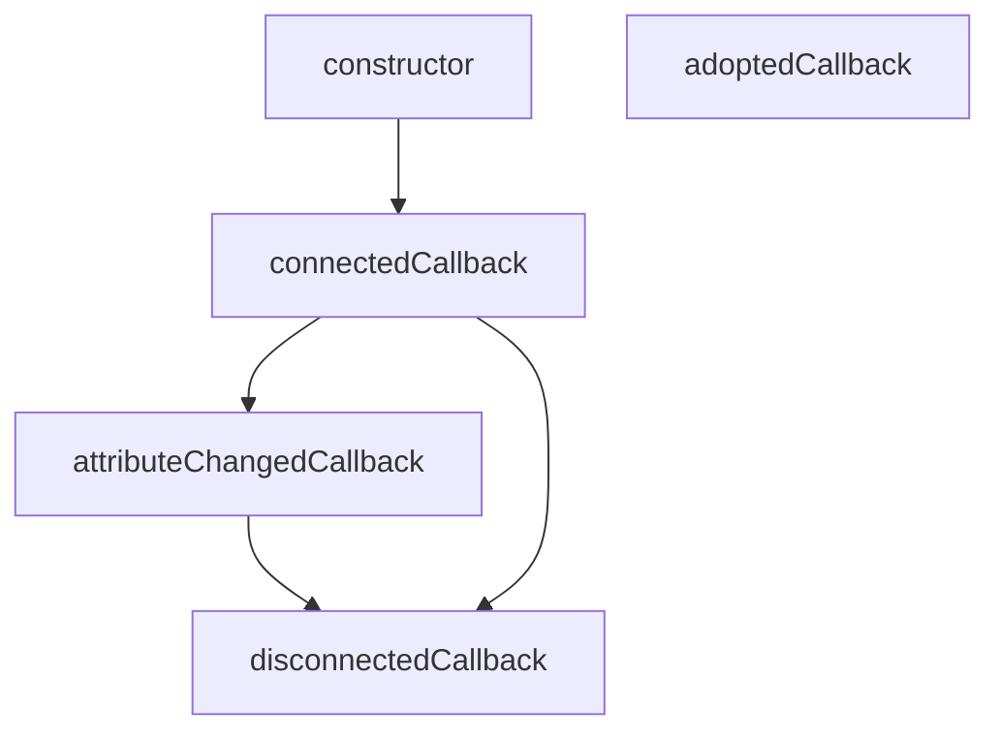

# Curso de JavaScript: Web Components

## 1. Introducción a los Web Components

Necesitas primero:

- Curso Definitivo de HTML y CSS
- Curso Básico de JavaScript
- Curso de JavaScript Engine (V8) y el Navegador
- Curso de Manipulación del DOM 🚨

## 2. ¿Qué problemas resuelven los Web Components?

Los problemas están relacionados con los distintos ecosistemas o frameworks (React, Angular, Vue), puesto que estos no pueden coexistir entre sí, por lo que los Web Components al estar fundamentados en JavaScript puro, brinda más compatibilidad.

## 3. ¿Qué son los Web Components?

Los **Web Components** son una tecnología en JavaScript que permite crear componentes reutilizables y encapsulados que funcionan de manera nativa en cualquier navegador moderno. Básicamente, los Web Components permiten desarrollar elementos personalizados que tienen su propio HTML, CSS y JavaScript, y que se pueden utilizar como si fueran etiquetas estándar de HTML.

Los **Web Components** se basan en tres tecnologías principales:

1. **Custom Elements** (Elementos personalizados): Esta API permite definir nuevas etiquetas HTML personalizadas. Por ejemplo, puedes crear una etiqueta `<mi-boton>` que encapsule un botón con estilos y comportamiento específico.

   ```js
   class MiBoton extends HTMLElement {
     constructor() {
       super();
       this.innerHTML = `<button>Haz clic aquí</button>`;
     }
   }
   
   customElements.define('mi-boton', MiBoton);
   ```
   
   La regla es que debes tener mínimo 2 palabras separadas por un guion.

2. **Shadow DOM**: El Shadow DOM permite encapsular el contenido y los estilos de un componente para que no se mezclen con los del resto de la página. Esto significa que los estilos de fuera no afectan al componente, y viceversa.

   ```js
   class MiComponente extends HTMLElement {
     constructor() {
       super();
       let shadow = this.attachShadow({ mode: 'open' });
       shadow.innerHTML = `
         <style>
           p {
             color: red;
           }
         </style>
         <p>Hola desde el Shadow DOM</p>
       `;
     }
   }
   
   customElements.define('mi-componente', MiComponente);
   ```
   
   Otro ejemplo es la etiqueta `video`.

3. **HTML Templates**: Los elementos `<template>` y `<slot>` permiten definir fragmentos de HTML que se pueden reutilizar en el componente y renderizar de forma dinámica.

   ```html
   <template id="mi-template">
     <style>
       p {
         color: blue;
       }
     </style>
     <p>Contenido del template</p>
   </template>
   ```
   
   Para usar esta etiqueta necesitas usar JavaScript, no funciona por si solo dentro de la estructura normal del HTML.
   
### Ventajas de los Web Components:

- **Reutilización**: Puedes crear un componente una vez y usarlo en cualquier parte.
- **Encapsulamiento**: Los componentes tienen su propio espacio aislado de estilos y scripts, lo que evita conflictos con otros elementos.
- **Compatibilidad**: Los Web Components son parte del estándar web y funcionan en cualquier navegador moderno sin necesidad de librerías adicionales.

En resumen, los **Web Components** te permiten crear elementos personalizados, encapsulados y reutilizables que mejoran la modularidad y mantenibilidad del código en proyectos web.

## 4. APIs de Web Components

La relación entre la etiqueta HTML `<video>` y el **Shadow DOM** radica en cómo ambos manejan la encapsulación y el aislamiento de contenido y estilos.

### Etiqueta `<video>` y su Encapsulación Interna

La etiqueta `<video>` es un elemento HTML estándar que permite reproducir videos en una página web. Aunque su uso parece sencillo, el `<video>` tiene una estructura interna compleja que incluye controles como play, pause, volumen, etc. Esta estructura interna está encapsulada y no es accesible directamente desde el DOM de la página, lo que se asemeja al concepto de **Shadow DOM**.

### Shadow DOM en Relación con `<video>`

1. **Encapsulación de Contenido**: Al igual que el Shadow DOM, el `<video>` encapsula sus controles y otros elementos internos. Los navegadores usan una especie de Shadow DOM interno para manejar estos controles, lo que significa que no puedes estilizar o acceder directamente a esos controles desde el DOM principal de la página.

2. **Aislamiento de Estilos**: Los estilos aplicados al contenido interno del `<video>`, como los controles, están aislados del resto de la página. Si intentas aplicar CSS a un `<video>`, solo podrás estilizar el contenedor del video, no los controles internos. Este aislamiento de estilos es una característica clave del Shadow DOM.

3. **Personalización Limitada**: Debido a esta encapsulación interna, si deseas personalizar completamente los controles del `<video>`, necesitarías crear tu propio conjunto de controles utilizando elementos personalizados y posiblemente el Shadow DOM para replicar el comportamiento encapsulado. Esto es similar a lo que haces al crear un componente web personalizado con Shadow DOM para encapsular su estructura y estilos.

### Ejemplo Práctico de Uso de Shadow DOM en una Interfaz de Video

Si quisieras crear un componente de video personalizado que tenga controles propios y que esos controles estén encapsulados para no interferir con otros elementos de la página, podrías usar el Shadow DOM. Aquí tienes un ejemplo básico:

```html
<video-control></video-control>

<script>
  class VideoControl extends HTMLElement {
    constructor() {
      super();
      // Creamos un Shadow DOM
      const shadow = this.attachShadow({ mode: 'open' });

      // Creamos la estructura HTML dentro del Shadow DOM
      shadow.innerHTML = `
        <style>
          button {
            background-color: #007BFF;
            color: white;
            border: none;
            padding: 10px;
            cursor: pointer;
          }
        </style>
        <video src="video.mp4" width="320" height="240" controls></video>
        <button>Pausa</button>
      `;

      const video = shadow.querySelector('video');
      const button = shadow.querySelector('button');

      button.addEventListener('click', () => {
        if (video.paused) {
          video.play();
          button.textContent = 'Pausa';
        } else {
          video.pause();
          button.textContent = 'Reproducir';
        }
      });
    }
  }

  // Definimos el elemento personalizado
  customElements.define('video-control', VideoControl);
</script>
```

En este ejemplo, el componente `video-control` encapsula un video y un botón de control dentro de un Shadow DOM, asegurando que los estilos y la funcionalidad estén aislados del resto de la página.

## 5. Beneficios de Web Components

1. Reutilización: Don't Repeat Yourself (you only have to build it once)
2. Legibilidad: Hace más fácil a los demás entender el código. Mejor semántica. `<user-profile>`
3. Mantenibilidad: Cada uno de los componentes puede ser escrito y probado de forma individual, sin comprometer la aplicación completa.
4. Interoperabilidad: Los frameworks y librerías no están hechos para coexistir entre ellos. Los Web Components sí.
5. Consistencia: Gracias a la naturaleza reutilizable e interoperable de los Web Components ya no tendrás que crear los mismos componentes en diferentes frameworks o librerías.

## 6. Ciclo de vida de un componente

El ciclo de vida de un Web Component en JavaScript incluye varias etapas clave, que permiten a los desarrolladores controlar lo que sucede en diferentes momentos de la existencia de un componente. Aquí te explico cada una de estas etapas:

### 1. **Constructor**

El constructor es la primera etapa en el ciclo de vida de un Web Component. Se llama cuando se crea una instancia del componente, ya sea de forma manual a través de JavaScript o cuando el navegador encuentra el elemento en el DOM por primera vez.

- **Función principal:** Inicializar el componente, configurar su Shadow DOM (si es necesario) y establecer propiedades y estados iniciales.
- **Ejemplo:**
  ```javascript
  class MyComponent extends HTMLElement {
    constructor() {
      super();
      this.attachShadow({ mode: 'open' });
      this.shadowRoot.innerHTML = `<p>Hello, World!</p>`;
    }
  }
  ```

Directamente desde el JavaScript Engine, el constructor nos servirá para definir y cargar todas las variables en memoria que necesitemos, **es mala práctica pintar el componente aquí**.

### 2. **connectedCallback**

El `connectedCallback` se ejecuta cuando el componente se adjunta al DOM del documento. Esto puede ocurrir cuando el componente se inserta por primera vez en la página o cuando se mueve de un lugar a otro dentro del DOM.

- **Función principal:** Ejecutar código que dependa de que el componente esté en el DOM, como iniciar eventos, actualizar la interfaz de usuario, o hacer solicitudes de red.
- **Ejemplo:**
  ```javascript
  class MyComponent extends HTMLElement {
    connectedCallback() {
      console.log('Component added to the DOM');
    }
  }
  ```

Cuando el componente ya está pintado dentro del DOM y podemos hacer uso de él.

### 3. **attributeChangedCallback**

Este método se llama cada vez que uno de los atributos observados del componente cambia. Para usarlo, debes especificar qué atributos quieres observar definiendo un getter estático llamado `observedAttributes`.

- **Función principal:** Responder a los cambios en los atributos del componente, permitiendo que el componente actualice su estado o su interfaz en función de estos cambios.
- **Ejemplo:**
  ```javascript
  class MyComponent extends HTMLElement {
    static get observedAttributes() {
      return ['data-value'];
    }

    attributeChangedCallback(name, oldValue, newValue) {
      console.log(`Attribute ${name} changed from ${oldValue} to ${newValue}`);
    }
  }
  ```

Cuando un atributo de nuestro componente cambia.

### 4. **disconnectedCallback**

El `disconnectedCallback` se ejecuta cuando el componente se elimina del DOM. Esto puede ser útil para limpiar recursos o detener tareas que no son necesarias cuando el componente ya no está en la página.

- **Función principal:** Limpiar recursos, detener timers, o desconectar listeners de eventos que se configuraron cuando el componente estaba en el DOM.
- **Ejemplo:**
  ```javascript
  class MyComponent extends HTMLElement {
    disconnectedCallback() {
      console.log('Component removed from the DOM');
    }
  }
  ```

Cuando el componente se "destruye" o se quita del DOM.

### 5. **adoptedCallback**

El `adoptedCallback` se ejecuta cuando un componente es movido a un nuevo documento, como cuando se utiliza en un documento diferente al original (por ejemplo, si se mueve entre iframes).

- **Función principal:** Adaptar el componente a su nuevo contexto, si es necesario.
- **Ejemplo:**
  ```javascript
  class MyComponent extends HTMLElement {
    adoptedCallback() {
      console.log('Component moved to a new document');
    }
  }
  ```

Cuando el componente es movido a un nuevo DOM, básicamente cuando es pintado desde un iframe por ejemplo (esto ya no se suele hacer).

### Gráfico del Ciclo de Vida



Más información sobre este lifecycle aquí (en español):
[Usando callbacks de ciclo de vida](https://developer.mozilla.org/es/docs/Web/Web_Components/Using_custom_elements#usando_callbacks_de_ciclo_de_vida) .

## 7. Custom Elements

```js
class MyElement extends HTMLElement {
  constructor() {
    super();

    this.p = document.createElement("p");
  }

  connectedCallback() {
    this.p.textContent = "Hi world";
    this.appendChild(this.p);
  }
}

customElements.define("my-element", MyElement);
```

Otra forma:

```js
const template = document.createElement("div");
template.innerHTML = `
  <style>
  .text {
    color: red;
  }

  p {
    color: blue;
  }
  </style>
  <p class="text">Hi world</p>
  <p>Hi world......</p>
`;

class MyElement extends HTMLElement {
  constructor() {
    super();

    this.p = document.createElement("p");
  }

  connectedCallback() {
    this.p.textContent = "Hi world";
    this.appendChild(this.p);
    this.append(template);
  }
}

customElements.define("my-element", MyElement);
```


```js
```


```js
```