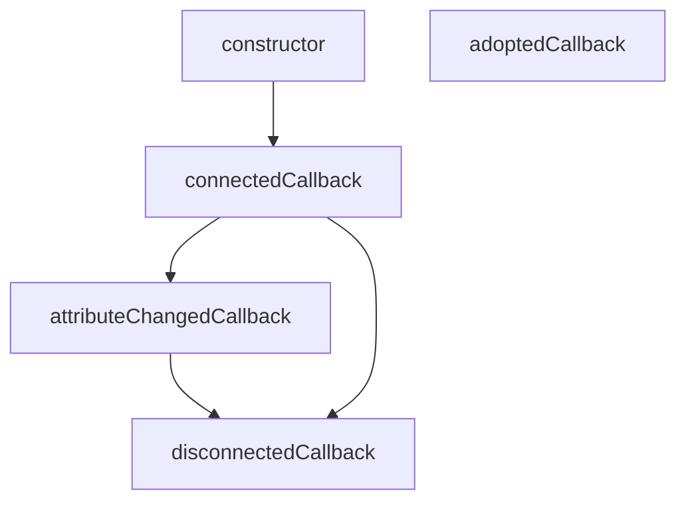

# Curso de JavaScript: Web Components

## 1. Introducción a los Web Components

Necesitas primero:

- Curso Definitivo de HTML y CSS
- Curso Básico de JavaScript
- Curso de JavaScript Engine (V8) y el Navegador
- Curso de Manipulación del DOM 🚨

## 2. ¿Qué problemas resuelven los Web Components?

Los problemas están relacionados con los distintos ecosistemas o frameworks (React, Angular, Vue), puesto que estos no pueden coexistir entre sí, por lo que los Web Components al estar fundamentados en JavaScript puro, brinda más compatibilidad.

## 3. ¿Qué son los Web Components?

Los **Web Components** son una tecnología en JavaScript que permite crear componentes reutilizables y encapsulados que funcionan de manera nativa en cualquier navegador moderno. Básicamente, los Web Components permiten desarrollar elementos personalizados que tienen su propio HTML, CSS y JavaScript, y que se pueden utilizar como si fueran etiquetas estándar de HTML.

Los **Web Components** se basan en tres tecnologías principales:

1. **Custom Elements** (Elementos personalizados): Esta API permite definir nuevas etiquetas HTML personalizadas. Por ejemplo, puedes crear una etiqueta `<mi-boton>` que encapsule un botón con estilos y comportamiento específico.

   ```js
   class MiBoton extends HTMLElement {
     constructor() {
       super();
       this.innerHTML = `<button>Haz clic aquí</button>`;
     }
   }
   
   customElements.define('mi-boton', MiBoton);
   ```
   
   La regla es que debes tener mínimo 2 palabras separadas por un guion.

2. **Shadow DOM**: El Shadow DOM permite encapsular el contenido y los estilos de un componente para que no se mezclen con los del resto de la página. Esto significa que los estilos de fuera no afectan al componente, y viceversa.

   ```js
   class MiComponente extends HTMLElement {
     constructor() {
       super();
       let shadow = this.attachShadow({ mode: 'open' });
       shadow.innerHTML = `
         <style>
           p {
             color: red;
           }
         </style>
         <p>Hola desde el Shadow DOM</p>
       `;
     }
   }
   
   customElements.define('mi-componente', MiComponente);
   ```
   
   Otro ejemplo es la etiqueta `video`.

3. **HTML Templates**: Los elementos `<template>` y `<slot>` permiten definir fragmentos de HTML que se pueden reutilizar en el componente y renderizar de forma dinámica.

   ```html
   <template id="mi-template">
     <style>
       p {
         color: blue;
       }
     </style>
     <p>Contenido del template</p>
   </template>
   ```
   
   Para usar esta etiqueta necesitas usar JavaScript, no funciona por si solo dentro de la estructura normal del HTML.
   
### Ventajas de los Web Components:

- **Reutilización**: Puedes crear un componente una vez y usarlo en cualquier parte.
- **Encapsulamiento**: Los componentes tienen su propio espacio aislado de estilos y scripts, lo que evita conflictos con otros elementos.
- **Compatibilidad**: Los Web Components son parte del estándar web y funcionan en cualquier navegador moderno sin necesidad de librerías adicionales.

En resumen, los **Web Components** te permiten crear elementos personalizados, encapsulados y reutilizables que mejoran la modularidad y mantenibilidad del código en proyectos web.

## 4. APIs de Web Components

La relación entre la etiqueta HTML `<video>` y el **Shadow DOM** radica en cómo ambos manejan la encapsulación y el aislamiento de contenido y estilos.

### Etiqueta `<video>` y su Encapsulación Interna

La etiqueta `<video>` es un elemento HTML estándar que permite reproducir videos en una página web. Aunque su uso parece sencillo, el `<video>` tiene una estructura interna compleja que incluye controles como play, pause, volumen, etc. Esta estructura interna está encapsulada y no es accesible directamente desde el DOM de la página, lo que se asemeja al concepto de **Shadow DOM**.

### Shadow DOM en Relación con `<video>`

1. **Encapsulación de Contenido**: Al igual que el Shadow DOM, el `<video>` encapsula sus controles y otros elementos internos. Los navegadores usan una especie de Shadow DOM interno para manejar estos controles, lo que significa que no puedes estilizar o acceder directamente a esos controles desde el DOM principal de la página.

2. **Aislamiento de Estilos**: Los estilos aplicados al contenido interno del `<video>`, como los controles, están aislados del resto de la página. Si intentas aplicar CSS a un `<video>`, solo podrás estilizar el contenedor del video, no los controles internos. Este aislamiento de estilos es una característica clave del Shadow DOM.

3. **Personalización Limitada**: Debido a esta encapsulación interna, si deseas personalizar completamente los controles del `<video>`, necesitarías crear tu propio conjunto de controles utilizando elementos personalizados y posiblemente el Shadow DOM para replicar el comportamiento encapsulado. Esto es similar a lo que haces al crear un componente web personalizado con Shadow DOM para encapsular su estructura y estilos.

### Ejemplo Práctico de Uso de Shadow DOM en una Interfaz de Video

Si quisieras crear un componente de video personalizado que tenga controles propios y que esos controles estén encapsulados para no interferir con otros elementos de la página, podrías usar el Shadow DOM. Aquí tienes un ejemplo básico:

```html
<video-control></video-control>

<script>
  class VideoControl extends HTMLElement {
    constructor() {
      super();
      // Creamos un Shadow DOM
      const shadow = this.attachShadow({ mode: 'open' });

      // Creamos la estructura HTML dentro del Shadow DOM
      shadow.innerHTML = `
        <style>
          button {
            background-color: #007BFF;
            color: white;
            border: none;
            padding: 10px;
            cursor: pointer;
          }
        </style>
        <video src="video.mp4" width="320" height="240" controls></video>
        <button>Pausa</button>
      `;

      const video = shadow.querySelector('video');
      const button = shadow.querySelector('button');

      button.addEventListener('click', () => {
        if (video.paused) {
          video.play();
          button.textContent = 'Pausa';
        } else {
          video.pause();
          button.textContent = 'Reproducir';
        }
      });
    }
  }

  // Definimos el elemento personalizado
  customElements.define('video-control', VideoControl);
</script>
```

En este ejemplo, el componente `video-control` encapsula un video y un botón de control dentro de un Shadow DOM, asegurando que los estilos y la funcionalidad estén aislados del resto de la página.

## 5. Beneficios de Web Components

1. Reutilización: Don't Repeat Yourself (you only have to build it once)
2. Legibilidad: Hace más fácil a los demás entender el código. Mejor semántica. `<user-profile>`
3. Mantenibilidad: Cada uno de los componentes puede ser escrito y probado de forma individual, sin comprometer la aplicación completa.
4. Interoperabilidad: Los frameworks y librerías no están hechos para coexistir entre ellos. Los Web Components sí.
5. Consistencia: Gracias a la naturaleza reutilizable e interoperable de los Web Components ya no tendrás que crear los mismos componentes en diferentes frameworks o librerías.

## 6. Ciclo de vida de un componente

El ciclo de vida de un Web Component en JavaScript incluye varias etapas clave, que permiten a los desarrolladores controlar lo que sucede en diferentes momentos de la existencia de un componente. Aquí te explico cada una de estas etapas:

### 1. **Constructor**

El constructor es la primera etapa en el ciclo de vida de un Web Component. Se llama cuando se crea una instancia del componente, ya sea de forma manual a través de JavaScript o cuando el navegador encuentra el elemento en el DOM por primera vez.

- **Función principal:** Inicializar el componente, configurar su Shadow DOM (si es necesario) y establecer propiedades y estados iniciales.
- **Ejemplo:**
  ```javascript
  class MyComponent extends HTMLElement {
    constructor() {
      super();
      this.attachShadow({ mode: 'open' });
      this.shadowRoot.innerHTML = `<p>Hello, World!</p>`;
    }
  }
  ```

Directamente desde el JavaScript Engine, el constructor nos servirá para definir y cargar todas las variables en memoria que necesitemos, **es mala práctica pintar el componente aquí**.

### 2. **connectedCallback**

El `connectedCallback` se ejecuta cuando el componente se adjunta al DOM del documento. Esto puede ocurrir cuando el componente se inserta por primera vez en la página o cuando se mueve de un lugar a otro dentro del DOM.

- **Función principal:** Ejecutar código que dependa de que el componente esté en el DOM, como iniciar eventos, actualizar la interfaz de usuario, o hacer solicitudes de red.
- **Ejemplo:**
  ```javascript
  class MyComponent extends HTMLElement {
    connectedCallback() {
      console.log('Component added to the DOM');
    }
  }
  ```

Cuando el componente ya está pintado dentro del DOM y podemos hacer uso de él.

### 3. **attributeChangedCallback**

Este método se llama cada vez que uno de los atributos observados del componente cambia. Para usarlo, debes especificar qué atributos quieres observar definiendo un getter estático llamado `observedAttributes`.

- **Función principal:** Responder a los cambios en los atributos del componente, permitiendo que el componente actualice su estado o su interfaz en función de estos cambios.
- **Ejemplo:**
  ```javascript
  class MyComponent extends HTMLElement {
    static get observedAttributes() {
      return ['data-value'];
    }

    attributeChangedCallback(name, oldValue, newValue) {
      console.log(`Attribute ${name} changed from ${oldValue} to ${newValue}`);
    }
  }
  ```

Cuando un atributo de nuestro componente cambia.

### 4. **disconnectedCallback**

El `disconnectedCallback` se ejecuta cuando el componente se elimina del DOM. Esto puede ser útil para limpiar recursos o detener tareas que no son necesarias cuando el componente ya no está en la página.

- **Función principal:** Limpiar recursos, detener timers, o desconectar listeners de eventos que se configuraron cuando el componente estaba en el DOM.
- **Ejemplo:**
  ```javascript
  class MyComponent extends HTMLElement {
    disconnectedCallback() {
      console.log('Component removed from the DOM');
    }
  }
  ```

Cuando el componente se "destruye" o se quita del DOM.

### 5. **adoptedCallback**

El `adoptedCallback` se ejecuta cuando un componente es movido a un nuevo documento, como cuando se utiliza en un documento diferente al original (por ejemplo, si se mueve entre iframes).

- **Función principal:** Adaptar el componente a su nuevo contexto, si es necesario.
- **Ejemplo:**
  ```javascript
  class MyComponent extends HTMLElement {
    adoptedCallback() {
      console.log('Component moved to a new document');
    }
  }
  ```

Cuando el componente es movido a un nuevo DOM, básicamente cuando es pintado desde un iframe por ejemplo (esto ya no se suele hacer).

### Gráfico del Ciclo de Vida



Más información sobre este lifecycle aquí (en español):
[Usando callbacks de ciclo de vida](https://developer.mozilla.org/es/docs/Web/Web_Components/Using_custom_elements#usando_callbacks_de_ciclo_de_vida) .

## 7. Custom Elements

Vamos a crear nuestro primer Web Component.

### Creando el componente

En Visual Studio Code creamos un archivo HTML y JS:

Después de crear nuestra estructura básica de HTML vamos a nuestro archivo de JavaScript y creamos una clase que será nuestro componente:

```js
class MyElement extends HTMLElement {
  constructor() {
    // Heredamos las propiedades de HTML element con "super()"
    super();
  }
}

customElements.define("my-element", MyElement);
```

Para crear un componente primero debemos crear una clase que extienda a lago llamado el `HTMLElement`, el cual nos va a permitir definir nuestro componente web.

Para convertir nuestro componente en una etiqueta HTML debemos usar el método estático de `customElements` llamado `define( )`, el cual recibe dos parámetros, el primero el nombre de como se llamará la etiqueta de nuestro componente, y el segundo la clase que utilizaremos para definir los comportamientos de nuestro componente.

En este punto ya generamos nuestra etiqueta, y podemos usarla en el HTML:

```html
<!DOCTYPE html>
<html lang="es">
  <head>
    ...
  </head>
  <body>
    <my-element></my-element> 👈👀
    <script src="./my-element.js" type="module"></script>
  </body>
</html>
```

### Lógica de nuestro componente

Ahora vamos a empezar a definir los comportamientos de nuestro componente:

```js
class MyElement extends HTMLElement {
  constructor() {
    super();
    // Creamos una etiqueta p
    this.p = document.createElement("p");
  }
  // Creamos el método de conenxión
  connectedCallback() {
    // Introducimos texto a nuestra etiqueta
    this.p.textContent = "Hola mundo";
    // Agregamos esta etiqueta como hijo de <my-element>
    this.appendChild(this.p);
  }
}

customElements.define("my-element", MyElement);
```

Si vemos nuestro archivo en el navegador podremos ver nuestro “Hola mundo”.

### Complejidad de componente

Podemos añadir muchas más cosas a nuestro componente, tales como estilos y demás, veamos un ejemplo.

```js
// Creamos un div
const template = document.createElement("div");
/* Dentro de este div podemos escribir estilos y demás cosas, recordemos que estos estilos no harán colición con otros estilos debido a que los estilos que escribamos aquí solo aplican a nuestro  componente y NO a otros elementos externos a este */
template.innerHTML = `
  <style>
    p {
      color: #9C27B0
    }
    .text {
      font-size: 1rem;
      color: #212121;
    }   
  </style>   
  <p>Hola mundo 2</p>   
  <p class="text">Texto de ejemplo</p> 
`;

class MyElement extends HTMLElement {
  constructor() {
    super();
    this.p = document.createElement("p");
  }
  connectedCallback() {
    this.p.textContent = "Hola mundo";
    this.appendChild(this.p);
    // Añadimos nuestro template a nuestro componente como hijo
    this.appendChild(template);
  }
}

customElements.define("my-element", MyElement);
```

Y si todo está correcto, veremos nuestro componente en el navegador con todo lo que definimos:

### Código de la clase

```js
class MyElement extends HTMLElement {
  constructor() {
    super();

    this.p = document.createElement("p");
  }

  connectedCallback() {
    this.p.textContent = "Hi world";
    this.appendChild(this.p);
  }
}

customElements.define("my-element", MyElement);
```

Otra forma:

```js
const template = document.createElement("div");
template.innerHTML = `
  <style>
  .text {
    color: red;
  }

  p {
    color: blue;
  }
  </style>
  <p class="text">Hi world</p>
  <p>Hi world......</p>
`;

class MyElement extends HTMLElement {
  constructor() {
    super();

    this.p = document.createElement("p");
  }

  connectedCallback() {
    this.p.textContent = "Hi world";
    this.appendChild(this.p);
    this.append(template);
  }
}

customElements.define("my-element", MyElement);
```

Ahora en nuestro HTML:

```html
<!DOCTYPE html>
<html lang="en">
  <head>
    <meta charset="UTF-8" />
    <meta
      name="viewport"
      content="width=device-width, initial-scale=1.0"
    />
    <title>Custom Elements</title>
  </head>
  <body>
    <my-element></my-element>
    <script type="module" src="./my-element.js"></script>
  </body>
</html>
```

## 8. Template

**Básicamente la API Template nos permite conectar un web component de forma más profesional y organizada**. También nos ayuda a clonar los elementos fácilmente _(Ya que como lo hicimos en la clase anterior el elemento no se clonaba, sino que se pasaba de etiqueta en etiqueta hasta la última en ser renderizada)_

**La etiqueta `<template>`**

Es una etiqueta que nos sirve como contenedor de código. Todo lo que escribamos adentro de esta etiqueta **no se va a renderizar**, sino que hay que activarlo mediante JavaScript. 

En el siguiente [enlace](https://www.w3schools.com/tags/tag_template.asp) vas a ver cómo se activa desde JS.

**Escribir y activar el código dentro de la clase**

De esta forma estamos armando toda la estructura HTML dentro de JavaScript, pero insertándola en la clase y fraccionando el HTML y CSS para más placer.

En este caso, creamos la clase, con su extensión y constructor, luego creamos un método que contendrá la estructura HTML `getTemplate`. Adentro insertamos la variable **template** que contiene la estructura.

```js
getTemplate() {
  const template = document.createElement("template");
  template.innerHTML = `
    <section>
      <h2>Hi world!!!</h2>
      <div>
        <p>I'm new text in JS...</p>
      </div>
    </section>
  `;

  return template;
}
```

En otro método `getStyles` todo lo que hacemos es retornar un literal string que contiene el código CSS (si queremos podemos contenerla en una variable, eso es a comodidad del programador)

```js
getStyles() {
  return `
    <style>
      h2 {
        color:red; 
      }
    </style>
  
  `;
}
```

Y luego al final del código de `getTemplate` la llamamos de esta forma:

```js
getTemplate() {
  const template = document.createElement("template");
  template.innerHTML = `
    <section>
      <h2>Hi world!!!</h2>
      <div>
        <p>I'm new text in JS...</p>
      </div>
    </section>
    ${this.getStyles()} 👈👀
  `;

  return template;
}
```

**Clonar Elementos**

Para clonar el código debemos indicar mediante el método `cloneNode` que se puede clonar. Para eso invocamos el contenido de `getTemplate`, y lo anidamos a la clase (que luego al ser invocada en el HTML se convierte en la etiqueta misma)

```js
render() {
  this.appendChild(
    this.getTemplate().content.cloneNode(true)
  );
}
```

**Y FINALMENTE**

Invocamos el `render`.

```js
connectedCallback() {
  this.render();
}
```

**Consideraciones sobre CSS**

Aunque el uso de `<template>` facilita la organización del contenido, el CSS dentro de la plantilla puede entrar en conflicto con otros estilos en la página. Para evitar esto, asegúrate de usar estilos encapsulados y específicos para tu componente, o considera el uso del Shadow DOM para mayor aislamiento de estilos.

### Código de la clase

```html
<!DOCTYPE html>
<html lang="en">
  <head>
    <meta charset="UTF-8" />
    <meta
      name="viewport"
      content="width=device-width, initial-scale=1.0"
    />
    <title>Custom Elements</title>
  </head>
  <body>
    <template>
      <h2>Testing...</h2>
      <div>
        <p>I'm a text...</p>
      </div>
    </template>

    <my-element></my-element>

    <script type="module" src="./my-element.js"></script>
  </body>
</html>
```

```js
class MyElement extends HTMLElement {
  constructor() {
    super();
  }

  getTemplate() {
    const template = document.createElement("template");
    template.innerHTML = `
      <section>
        <h2>Hi world!!!</h2>
        <div>
          <p>I'm new text in JS...</p>
        </div>
      </section>
      ${this.getStyles()}
    `;

    return template;
  }

  getStyles() {
    return `
      <style>
        h2 {
          color:red; 
        }
      </style>
    
    `;
  }

  render() {
    this.appendChild(
      this.getTemplate().content.cloneNode(true)
      // true es para que clone todos los elementos anidados
    );
  }

  connectedCallback() {
    this.render();
  }
}

customElements.define("my-element", MyElement);
```

## 9. Shadow DOM

El Shadow DOM nos permite resolver problemas relacionados con la sobrescritura de estilos CSS debido a la especificidad. Al usar el Shadow DOM, creamos un encapsulamiento, un DOM independiente dentro de nuestro DOM global.

Esto significa que cualquier cosa que exista dentro del Shadow DOM no afectará ni será afectada por los elementos y estilos del DOM global. En otras palabras, el Shadow DOM actúa como una burbuja aislada, protegiendo los estilos y elementos internos de interferencias externas y viceversa.

### Código de la clase

```js
class MyElement extends HTMLElement {
  constructor() {
    super();
    this.attachShadow({ mode: "open" }); 👈👀
  }

  getTemplate() {
    const template = document.createElement("template");
    template.innerHTML = `
      <section>
        <h2>Hi world!!!</h2>
        <div>
          <p>I'm new text in JS...</p>
        </div>
      </section>
      ${this.getStyles()}
    `;

    return template;
  }

  getStyles() {
    return `
      <style>
        h2 {
          color:red; 
        }
      </style>
    
    `;
  }

  render() { 👀👇
    this.shadowRoot.appendChild(
      this.getTemplate().content.cloneNode(true)
    );
  }

  connectedCallback() {
    this.render();
  }
}

customElements.define("my-element", MyElement);

// Para poder renderizar nuestros templates tenemos que cambiar el contexto 
// Del dom global cambiamos a shadow dom que es otro contexto diferente
```

Es importante activar el shadow dom para poderlo visualmente en nuestro inspector de elementos .

Settings: Preferences / Elements / Show user agent shadow DOM.


## 10. Content Slot

El `Content Slot` es una característica del Shadow DOM en Web Components que permite distribuir contenido en diferentes partes del Shadow DOM de un componente. Los `slots` actúan como marcadores de posición dentro del Shadow DOM, donde se puede insertar contenido desde el Light DOM (el contenido definido fuera del Shadow DOM en la página principal).

### Código de la clase

```html
<!DOCTYPE html>
<html lang="en">
  <head>
    ...
  </head>
  <body> 👀👇
    <my-element>Testing</my-element>

    <script type="module" src="./my-element.js"></script>
  </body>
</html>
```

```js
class MyElement extends HTMLElement {
  constructor() {
    super();
    this.attachShadow({ mode: "open" });
  }

  getTemplate() {
    const template = document.createElement("template");
    template.innerHTML = `
      <section> 👀👇
        <h2> <slot></slot> </h2>
      </section>
      ${this.getStyles()}
    `;

    return template;
  }

  getStyles() {
    return `
      <style>
        h2 {
          color:red; 
        }
      </style>
    
    `;
  }

  render() {
    this.shadowRoot.appendChild(
      this.getTemplate().content.cloneNode(true)
    );
  }

  connectedCallback() {
    this.render();
  }
}

customElements.define("my-element", MyElement);
```

## 11. Multi Content Slot

### Cómo funciona

1. **Definición de Slots**:
    
    - Dentro del Shadow DOM, se definen `slots` usando la etiqueta `<slot>`. Puedes darles un nombre para diferenciarlos.

```html
<template id="my-template">
  <div>
    <header><slot name="header"></slot></header>
    <main><slot></slot></main>
    <footer><slot name="footer"></slot></footer>
  </div>
</template>
```

2. **Uso de Slots**:

	- En el Light DOM, el contenido puede ser asignado a estos `slots` usando el atributo `slot`.

```html
<my-element>
  <div slot="header">Header Content</div>
  <p>Main Content</p>
  <div slot="footer">Footer Content</div>
</my-element>
```
### Ejemplo Completo

```html
<template id="my-template">
  <div>
    <header><slot name="header"></slot></header>
    <main><slot></slot></main>
    <footer><slot name="footer"></slot></footer>
  </div>
</template>

<script>
  class MyElement extends HTMLElement {
    constructor() {
      super();
      const template = document.getElementById('my-template').content;
      const shadowRoot = this.attachShadow({ mode: 'open' });
      shadowRoot.appendChild(template.cloneNode(true));
    }
  }
  
  customElements.define('my-element', MyElement);
</script>

<my-element>
  <div slot="header">Header Content</div>
  <p>Main Content</p>
  <div slot="footer">Footer Content</div>
</my-element>
```

### Código de la clase

```html
<!DOCTYPE html>
<html lang="en">
  <head>
    ...
  </head>
  <body>
    <my-element>
      <span slot="title">I'm a title</span>
      <span slot="text">Testing...</span>
    </my-element>

    <script type="module" src="./my-element.js"></script>
  </body>
</html>
```

```js
class MyElement extends HTMLElement {
  constructor() {
    super();
    this.attachShadow({ mode: "open" });
  }

  getTemplate() {
    const template = document.createElement("template");
    template.innerHTML = `
      <section>
        <h2> 
          <slot name="title"></slot> 
        </h2>
        <div>
          <p> 
            <slot name="text"></slot> 
          </p>
        </div>
      </section>
      ${this.getStyles()}
    `;

    return template;
  }

  getStyles() {
    return `
      <style>
        h2 {
          color:red; 
        }
      </style>
    
    `;
  }

  render() {
    this.shadowRoot.appendChild(
      this.getTemplate().content.cloneNode(true)
    );
  }

  connectedCallback() {
    this.render();
  }
}

customElements.define("my-element", MyElement);
```

En las `DevTools` se ve así:


## 12. Atributos

Puedes lograr una funcionalidad similar a la del `Content Slot` utilizando atributos personalizados en tus elementos HTML. A través de JavaScript, puedes acceder a estos atributos y manipular el DOM en consecuencia. Esto permite crear componentes más dinámicos y configurables.

### Código de la clase

```html
<!DOCTYPE html>
<html lang="en">
  <head>
    <meta charset="UTF-8" />
    <meta
      name="viewport"
      content="width=device-width, initial-scale=1.0"
    />
    <title>Custom Elements</title>
  </head>
  <body>
    <my-element 👈👀👇
      title="I'm a title"
      paragraph="Paragraph..."
      img="https://i.postimg.cc/k4MtR4Zh/bitcoin-png.png"
    ></my-element>

    <script type="module" src="./my-element.js"></script>
  </body>
</html>
```

```js
class MyElement extends HTMLElement {
  constructor() {
    super();
    this.attachShadow({ mode: "open" });

    this.title = this.getAttribute("title"); 👈👀👇
    this.paragraph = this.getAttribute("paragraph");
    this.img = this.getAttribute("img");
  }

  getTemplate() {
    const template = document.createElement("template");
    template.innerHTML = `
      <section> 👈👀👇
        <h2>${this.title}</h2>
        <div> 👈👀👇
          <p>${this.paragraph}</p>
          
        </div>
      </section>
      ${this.getStyles()}
    `;

    return template;
  }

  getStyles() {
    return `
      <style>
        h2 {
          color:red; 
        }
      </style>
    
    `;
  }

  render() {
    this.shadowRoot.appendChild(
      this.getTemplate().content.cloneNode(true)
    );
  }

  connectedCallback() {
    this.render();
  }
}

customElements.define("my-element", MyElement);
```

En las `DevTools` se ve así:


## 13. attributeChangedCallback

El método `attributeChangedCallback` es una función que pertenece a la API de Custom Elements en JavaScript. Este método se ejecuta automáticamente cada vez que se cambia el valor de uno de los atributos observados de un Custom Element.

### ¿Cómo Funciona?

1. **Definir los Atributos Observados**:
   - Primero, necesitas definir qué atributos quieres observar. Esto se hace mediante el método estático `observedAttributes`.

2. **Implementar `attributeChangedCallback`**:
   - Implementas el método `attributeChangedCallback` en tu clase de Custom Element para manejar los cambios en los atributos observados.

### Ejemplo Completo

Vamos a desglosar un ejemplo para entender cómo funciona:

```javascript
class MyElement extends HTMLElement {
  constructor() {
    super();
    const template = document.getElementById('my-template').content;
    const shadowRoot = this.attachShadow({ mode: 'open' });
    shadowRoot.appendChild(template.cloneNode(true));
  }

  static get observedAttributes() {
    return ['header-text', 'main-text', 'footer-text'];
  }

  attributeChangedCallback(name, oldValue, newValue) {
    switch (name) {
      case 'header-text':
        this.shadowRoot.getElementById('header').textContent = newValue;
        break;
      case 'main-text':
        this.shadowRoot.getElementById('main').textContent = newValue;
        break;
      case 'footer-text':
        this.shadowRoot.getElementById('footer').textContent = newValue;
        break;
    }
  }

  connectedCallback() {
    this.updateContent();
  }

  updateContent() {
    this.shadowRoot.getElementById('header').textContent = this.getAttribute('header-text');
    this.shadowRoot.getElementById('main').textContent = this.getAttribute('main-text');
    this.shadowRoot.getElementById('footer').textContent = this.getAttribute('footer-text');
  }
}

customElements.define('my-element', MyElement);
```

### Explicación Paso a Paso

1. **Constructor**:
   - El constructor inicializa el componente, creando y adjuntando un Shadow DOM.

   ```javascript
   constructor() {
     super();
     const template = document.getElementById('my-template').content;
     const shadowRoot = this.attachShadow({ mode: 'open' });
     shadowRoot.appendChild(template.cloneNode(true));
   }
   ```

2. **Atributos Observados**:
   - El método estático `observedAttributes` devuelve una matriz de nombres de atributos que el componente debe observar. Cuando uno de estos atributos cambia, se llama a `attributeChangedCallback`.

   ```javascript
   static get observedAttributes() {
     return ['header-text', 'main-text', 'footer-text'];
   }
   ```

3. **`attributeChangedCallback`**:
   - Este método se llama automáticamente cuando uno de los atributos observados cambia. Recibe tres argumentos:
     - `name`: El nombre del atributo que cambió.
     - `oldValue`: El valor antiguo del atributo.
     - `newValue`: El nuevo valor del atributo.

   - En el método, se usa un `switch` para manejar cambios en diferentes atributos y actualizar el contenido del Shadow DOM en consecuencia.

   ```javascript
   attributeChangedCallback(name, oldValue, newValue) {
     switch (name) {
       case 'header-text':
         this.shadowRoot.getElementById('header').textContent = newValue;
         break;
       case 'main-text':
         this.shadowRoot.getElementById('main').textContent = newValue;
         break;
       case 'footer-text':
         this.shadowRoot.getElementById('footer').textContent = newValue;
         break;
     }
   }
   ```

4. **`connectedCallback` y `updateContent`**:
   - `connectedCallback` se llama cuando el elemento es añadido al DOM. Aquí, se llama a `updateContent` para inicializar el contenido basado en los valores actuales de los atributos.

   ```javascript
   connectedCallback() {
     this.updateContent();
   }

   updateContent() {
     this.shadowRoot.getElementById('header').textContent = this.getAttribute('header-text');
     this.shadowRoot.getElementById('main').textContent = this.getAttribute('main-text');
     this.shadowRoot.getElementById('footer').textContent = this.getAttribute('footer-text');
   }
   ```

### Beneficios

- **Reactividad**: `attributeChangedCallback` permite que tu componente reaccione automáticamente a los cambios en sus atributos.
- **Encapsulación**: Mantiene el comportamiento y el estado del componente encapsulados dentro de él, facilitando la gestión y la reutilización.
- **Flexibilidad**: Puedes definir cualquier número de atributos observados y manejar sus cambios de manera personalizada.

Esta funcionalidad es crucial para crear componentes web dinámicos y reactivos que puedan ser configurados mediante atributos HTML.

### Código de la clase

```html
<!DOCTYPE html>
<html lang="en">
  <head>
    ...
  </head>
  <body>
    <my-element
      title="I'm a title"
      paragraph="Paragraph...."
      img="https://i.postimg.cc/k4MtR4Zh/bitcoin-png.png"
    ></my-element>

    <script type="module" src="./my-element.js"></script>
  </body>
</html>
```

```js
class MyElement extends HTMLElement {
  constructor() {
    super();
    this.attachShadow({ mode: "open" });
  }

  // Define los atributos observados por el componente
  static get observedAttributes() {
    return ["title", "paragraph", "img"];
    // Si hay otro atributo que no esté en esta lista, no es del componente
  }

  // Esto genera un loop infinito
  // attributeChangedCallback(attr, oldVal, newVal) {
  //   if (attr === "title") {
  //     this.title = newVal;
  //   }

  //   if (attr === "paragraph") {
  //     this.paragraph = newVal;
  //   }

  //   if (attr === "img") {
  //     this.img = newVal;
  //   }
  // }

  // Esto corrige el error anterior: Maneja los cambios en los atributos observados de manera dinámica
  attributeChangedCallback(attr, oldVal, newVal) {
    //Esta funcion recibe tres parametro
    // 1. valor actual
    // 2. valor viejo
    // 3. nuevo valor
    if (oldVal !== newVal) {
      this[attr] = newVal;
    }

    // Y si quieren modificar algo de ese valor pueden seguir usandolo en el if así
    if (attr === "title" && oldVal !== newVal) {
      this.title = newVal;
    }
  }

  getTemplate() {
    const template = document.createElement("template");
    template.innerHTML = `
      <section>
        <h2>${this.title}</h2>
        <div>
          <p>${this.paragraph}</p>
          
        </div>
      </section>
      ${this.getStyles()}
    `;

    return template;
  }

  getStyles() {
    return `
      <style>
        h2 {
          color:red; 
        }
      </style>
    
    `;
  }

  render() {
    this.shadowRoot.appendChild(
      this.getTemplate().content.cloneNode(true)
    );
  }

  connectedCallback() {
    this.render();
  }
}

customElements.define("my-element", MyElement);
```

## 14. disconnectedCallback

`disconnectedCallback` es uno de los métodos del ciclo de vida de un Custom Element en la API de Web Components. Este método se llama automáticamente cuando una instancia de un Custom Element es removida del DOM. Es útil para realizar tareas de limpieza, como eliminar listeners de eventos o liberar recursos que ya no se necesitan.

### Ejemplo Básico

```javascript
class MyElement extends HTMLElement {
  constructor() {
    super();
    this.attachShadow({ mode: "open" });
  }

  connectedCallback() {
    console.log("Element added to the page.");
    // Añadir listeners de eventos o iniciar tareas aquí
  }

  disconnectedCallback() {
    console.log("Element removed from the page.");
    // Limpiar listeners de eventos o liberar recursos aquí
  }
}

customElements.define('my-element', MyElement);
```

### Uso Común

- **Eliminar Event Listeners**:
  - Si agregaste listeners de eventos en `connectedCallback`, los puedes eliminar en `disconnectedCallback` para evitar fugas de memoria.
  
- **Detener Tareas**:
  - Detén cualquier tarea en curso, como intervalos, animaciones o solicitudes de red.

### Beneficios

- **Gestión de Recursos**:
  - Asegura que los recursos se gestionen adecuadamente y se liberen cuando el elemento ya no está en uso.

- **Prevención de Fugas de Memoria**:
  - Al eliminar listeners de eventos y liberar otros recursos, previenes fugas de memoria en tu aplicación.

### En Resumen

`disconnectedCallback` es esencial para limpiar y liberar recursos cuando un Custom Element es removido del DOM, ayudando a mantener una aplicación eficiente y libre de fugas de memoria.

### Código de la clase

```html
<!DOCTYPE html>
<html lang="en">
  <head>
    ...
  </head>
  <body>
    <my-custom-element></my-custom-element>
    <script type="module" src="./my-element.js"></script>
  </body>
</html>
```

```js
class MyCustomElement extends HTMLElement {
  constructor() {
    super();

    console.log("Hi...");
  }

  connectedCallback() {
    console.log("Connected");
  }

  disconnectedCallback() {
    console.log("Bye...");
  }
}

customElements.define("my-custom-element", MyCustomElement);

document.querySelector("my-custom-element").remove();
```

## 15. :host

`:host` es un pseudo-clase en CSS que se utiliza dentro del Shadow DOM para seleccionar y aplicar estilos al elemento anfitrión (el Custom Element en sí). Esto es útil porque permite aplicar estilos al componente desde dentro de su propio Shadow DOM, manteniendo el encapsulamiento de estilos y evitando conflictos con otros estilos globales.

Estos estilos pueden incluir tanto estilos visuales como estilos por defecto de las etiquetas, tales como `display`, `padding` y `margin`.

### Ejemplo Básico

Supongamos que tienes un Custom Element llamado `<my-element>`, y deseas aplicar estilos específicos a este elemento desde dentro de su Shadow DOM. Aquí es donde `:host` entra en juego.

### Implementación

1. **Definir el Custom Element**:
   Primero, definimos nuestro Custom Element y su Shadow DOM.

```javascript
class MyElement extends HTMLElement {
  constructor() {
    super();
    this.attachShadow({ mode: 'open' });
    this.shadowRoot.innerHTML = `
      <style>
        :host {
          display: block;
          border: 2px solid blue;
          padding: 10px;
          background-color: lightgrey;
        }
      </style>
      <div>
        <p>Content inside the shadow DOM.</p>
      </div>
    `;
  }
}

customElements.define('my-element', MyElement);
```

2. **Uso en HTML**:
   Luego, usas el Custom Element en tu documento HTML.

```html
<!DOCTYPE html>
<html lang="en">
<head>
  <meta charset="UTF-8">
  <meta name="viewport" content="width=device-width, initial-scale=1.0">
  <title>Custom Element Example</title>
</head>
<body>
  <my-element></my-element>
</body>
</html>
```

### Explicación

- **`:host` Pseudo-clase**:
  En el bloque de estilos dentro del Shadow DOM, `:host` se utiliza para seleccionar el elemento anfitrión (`<my-element>` en este caso) y aplicarle estilos.

  ```css
  :host {
    display: block;
    border: 2px solid blue;
    padding: 10px;
    background-color: lightgrey;
  }
  ```

  Esto significa que los estilos definidos dentro del bloque `:host` se aplicarán directamente al Custom Element (`<my-element>`) en el DOM principal.

### Ventajas

- **Encapsulamiento**:
  - Los estilos definidos con `:host` se aplican solo al elemento anfitrión del Shadow DOM, manteniendo el encapsulamiento y evitando conflictos con otros estilos globales.

- **Flexibilidad**:
  - Puedes definir estilos específicos para diferentes estados del elemento anfitrión utilizando variantes como `:host(:hover)` o `:host(.active)`.

### Ejemplo con Variantes

```css
<style>
  :host {
    display: block;
    border: 2px solid blue;
    padding: 10px;
    background-color: lightgrey;
  }

  :host(:hover) {
    border-color: green;
  }

  :host(.active) {
    background-color: yellow;
  }
</style>
```

En este ejemplo, `:host(:hover)` aplica estilos cuando el elemento anfitrión es hover, y `:host(.active)` aplica estilos cuando el elemento anfitrión tiene la clase `active`.

### Características de `:host`

1. **Aplicación de Estilos**:
   - `:host` se usa para definir los estilos del componente web, encapsulando y evitando conflictos con los estilos globales del documento.

   ```css
   :host {
     /* Estilos para el componente */
   }
   ```

2. **Definición en `getStyles`**:
   - Generalmente, estos estilos se escriben dentro del método `getStyles()` del componente.

   ```javascript
   getStyles() {
     return `
       <style>
         :host {
           display: block;
           padding: 10px;
           margin: 5px;
           background-color: lightgrey;
         }
       </style>
     `;
   }
   ```

3. **Estilos Basados en Clases**:
   - Puedes aplicar estilos específicos a instancias del componente que tengan una clase particular.

   ```css
   :host(.blue) {
     /* Estilos para el componente con la clase "blue" */
     background-color: blue;
   }
   ```

4. **Estilos Basados en Atributos**:
   - También es posible aplicar estilos a instancias del componente basados en atributos específicos.

   ```css
   :host([yellow]) {
     /* Estilos para el componente con el atributo "yellow" */
     background-color: yellow;
   }
   ```

5. **Estilos Basados en el Contexto**:
   - La pseudoclase `:host-context` se puede utilizar para aplicar estilos a un componente cuando está dentro de un contenedor con una clase o un tipo específico.

   ```css
   :host-context(article.card) {
     /* Estilos para el componente dentro de un <article> con la clase "card" */
     border: 2px solid grey;
   }
   ```

6. **Estilos para Elementos Internos**:
   - Puedes combinar `:host` con selectores para aplicar estilos a elementos internos del componente.

   ```css
   :host([yellow]) h1 {
     /* Estilos para <h1> dentro del componente con el atributo "yellow" */
     color: yellow;
   }
   ```

### Código de la clase

```html
<!DOCTYPE html>
<html lang="en">
  <head>
    ...
  </head>
  <body>
    <my-element>
      <span slot="title">Hi span one</span>
      <span slot="paragraph">Span paragraph</span>
    </my-element>
    <my-element class="blue">
      <span slot="title">Hi span two</span>
      <span slot="paragraph">Span paragraph</span>
    </my-element>
    <my-element attr>
      <span slot="title">Hi span three</span>
      <span slot="paragraph">Span paragraph</span>
    </my-element>

    <article class="card">
      <my-element attr>
        <span slot="title">Hi span three</span>
        <span slot="paragraph">Span paragraph</span>
      </my-element>
    </article>
    <script type="module" src="./my-element.js"></script>
  </body>
</html>
```

```js
class MyElement extends HTMLElement {
  constructor() {
    super();

    this.attachShadow({ mode: "open" });
  }

  getTemplate() {
    const template = document.createElement("template");
    template.innerHTML = `
      <section>
        <h1>
          <slot name="title"></slot>
        </h1>
        <p>
          <slot name="paragraph"></slot>
        </p>
        <slot></slot>
      </section>

      ${this.getStyles()}
    `;

    return template;
  }

  getStyles() {
    return `
      <style>
        :host {
          display: inline-block;
          width: 100%;
          min-width: 300px;
          max-width: 450px;
          font-size: 20px;
          background: grey;
        }

        :host(.blue) {
          background: blue;
        }

        :host([attr]) {
          background: yellow;
        }

        :host([attr]) h1, :host([attr]) p {
          color: aqua; 
        }
        /* :host([attr]) p {
          color: aqua;  
        } */

        :host-context(article.card){
          display: block;
          max-width: 100%;
        }
      </style>
    `;
  }

  render() {
    this.shadowRoot.appendChild(
      this.getTemplate().content.cloneNode(true)
    );
  }

  connectedCallback() {
    this.render();
  }
}

customElements.define("my-element", MyElement);
```

## 16. ::slotted

`::slotted` es un pseudo-elemento en CSS utilizado dentro del Shadow DOM para aplicar estilos a los elementos que se han proyectado en un `<slot>`. Esto permite que los estilos se apliquen a los elementos hijos que se han insertado desde el Light DOM (el DOM global) en los slots del Shadow DOM.

### Concepto Básico

Cuando utilizamos slots en un Web Component, los elementos que se proyectan en estos slots provienen del Light DOM. El pseudo-elemento `::slotted` nos permite seleccionar y aplicar estilos a estos elementos proyectados.

### Ejemplo Básico

1. **Definir el Web Component**:
   Creamos un Web Component con un slot.

```javascript
class MyElement extends HTMLElement {
  constructor() {
    super();
    this.attachShadow({ mode: 'open' });
    this.shadowRoot.innerHTML = `
      <style>
        ::slotted(p) {
          color: blue;
          font-size: 20px;
        }
      </style>
      <div>
        <slot></slot>
      </div>
    `;
  }
}

customElements.define('my-element', MyElement);
```

2. **Uso en HTML**:
   Utilizamos el Web Component y proyectamos contenido en el slot.

```html
<!DOCTYPE html>
<html lang="en">
<head>
  <meta charset="UTF-8">
  <meta name="viewport" content="width=device-width, initial-scale=1.0">
  <title>Slotted Example</title>
</head>
<body>
  <my-element>
    <p>This paragraph will be styled blue and larger.</p>
    <span>This span will not be styled by ::slotted.</span>
  </my-element>
</body>
</html>
```

### Explicación

- **`<slot>` Element**:
  En el componente, definimos un slot donde los elementos del Light DOM serán proyectados.

  ```html
  <div>
    <slot></slot>
  </div>
  ```

- **`::slotted` Pseudo-elemento**:
  En el bloque de estilos dentro del Shadow DOM, utilizamos `::slotted` para aplicar estilos específicos a los elementos que se proyecten en el slot.

  ```css
  ::slotted(p) {
    color: blue;
    font-size: 20px;
  }
  ```

  En este ejemplo, todos los elementos `<p>` que se proyecten en el slot del componente recibirán los estilos especificados (color azul y tamaño de fuente de 20px).

### Ventajas

- **Encapsulamiento**:
  - Permite mantener los estilos del Shadow DOM encapsulados mientras se aplican estilos específicos a los elementos proyectados desde el Light DOM.

- **Flexibilidad**:
  - Permite aplicar estilos a elementos específicos proyectados en el slot sin afectar otros elementos del Light DOM.

### Limitaciones

- **Especificidad**:
  - Solo puede seleccionar y aplicar estilos a los elementos que se proyectan directamente en el slot. No puede seleccionar elementos anidados dentro de los proyectados.

### Ejemplo Completo

```javascript
class MyElement extends HTMLElement {
  constructor() {
    super();
    this.attachShadow({ mode: 'open' });
    this.shadowRoot.innerHTML = `
      <style>
        ::slotted(p) {
          color: blue;
          font-size: 20px;
        }
      </style>
      <div>
        <slot></slot>
      </div>
    `;
  }
}

customElements.define('my-element', MyElement);
```

```html
<!DOCTYPE html>
<html lang="en">
<head>
  <meta charset="UTF-8">
  <meta name="viewport" content="width=device-width, initial-scale=1.0">
  <title>Slotted Example</title>
</head>
<body>
  <my-element>
    <p>This paragraph will be styled blue and larger.</p>
    <span>This span will not be styled by ::slotted.</span>
  </my-element>
</body>
</html>
```

### Código de la clase

```html
<!DOCTYPE html>
<html lang="en">
  <head>
    <meta charset="UTF-8" />
    <meta
      name="viewport"
      content="width=device-width, initial-scale=1.0"
    />
    <title>Custom Elements</title>
  </head>
  <body>
    <my-element>
      <span slot="title">Hi span one</span>
      <span class="text" slot="paragraph">Span paragraph</span>
    </my-element>

    <script type="module" src="./my-element.js"></script>
  </body>
</html>
```

```js
class MyElement extends HTMLElement {
  constructor() {
    super();

    this.attachShadow({ mode: "open" });
  }

  getTemplate() {
    const template = document.createElement("template");
    template.innerHTML = `
      <section>
        <h1>
          <slot name="title"></slot>
        </h1>
        <p>
          <slot name="paragraph"></slot>
        </p>
        <slot></slot>
      </section>

      ${this.getStyles()}
    `;

    return template;
  }

  getStyles() {
    return `
      <style>/* * */
        ::slotted(span) {
          font-size: 30px;
          color: red;
        }

        ::slotted(.text) {
          color: blue;
        }
      </style>
    `;
  }

  render() {
    this.shadowRoot.appendChild(
      this.getTemplate().content.cloneNode(true)
    );
  }

  connectedCallback() {
    this.render();
  }
}

customElements.define("my-element", MyElement);
```

## 17. CSS custom properties

### CSS Custom Properties en Web Components

Las CSS custom properties, también conocidas como variables CSS, permiten definir valores reutilizables que pueden ser utilizados en diferentes partes de tu CSS. En el contexto de Web Components, estas propiedades son especialmente útiles para permitir la personalización de componentes desde fuera del Shadow DOM, manteniendo al mismo tiempo el encapsulamiento de estilos.

### Ejemplo Básico

1. **Definir CSS Custom Properties**:
   Definimos una variable CSS en el elemento host del Web Component.

```javascript
class MyElement extends HTMLElement {
  constructor() {
    super();
    this.attachShadow({ mode: 'open' });
    this.shadowRoot.innerHTML = `
      <style>
        :host {
          --primary-color: blue;
        }
        div {
          color: var(--primary-color);
        }
      </style>
      <div>
        Hello, styled by a custom property!
      </div>
    `;
  }
}

customElements.define('my-element', MyElement);
```

2. **Uso en HTML**:
   Utilizamos el Web Component y podemos sobrescribir la variable CSS desde el Light DOM.

```html
<!DOCTYPE html>
<html lang="en">
<head>
  <meta charset="UTF-8">
  <meta name="viewport" content="width=device-width, initial-scale=1.0">
  <title>Custom Properties Example</title>
</head>
<body>
  <my-element></my-element>
  <my-element style="--primary-color: red;"></my-element>
</body>
</html>
```

### Explicación

- **Definición en el Host**:
  - Dentro del Shadow DOM, definimos una variable CSS `--primary-color` en el elemento host (`:host`).

  ```css
  :host {
    --primary-color: blue;
  }
  ```

- **Uso de la Variable CSS**:
  - Utilizamos la variable CSS `var(--primary-color)` para aplicar el color al texto dentro del componente.

  ```css
  div {
    color: var(--primary-color);
  }
  ```

- **Sobrescritura desde el Light DOM**:
  - En el documento HTML, podemos sobrescribir la variable CSS aplicando un estilo en línea al componente.

  ```html
  <my-element style="--primary-color: red;"></my-element>
  ```

### Comparación entre `:host` y `:root`

- **`:host`**:
  - Se utiliza dentro del Shadow DOM para seleccionar el elemento anfitrión del componente y definir variables CSS que se aplicarán dentro del Shadow DOM.
  - Permite la personalización y el encapsulamiento de estilos dentro del componente.

  ```css
  :host {
    --primary-color: blue;
  }
  ```

- **`:root`**:
  - Se utiliza en el Light DOM para seleccionar el elemento raíz del documento (generalmente `<html>`) y definir variables CSS globales.
  - Las variables definidas en `:root` están disponibles en todo el documento y pueden ser utilizadas por cualquier componente o elemento.

  ```css
  :root {
    --global-color: green;
  }
  ```

### Ejemplo con `:root` y `:host`

```css
/* Definición global en :root */
:root {
  --global-color: green;
}

class MyElement extends HTMLElement {
  constructor() {
    super();
    this.attachShadow({ mode: 'open' });
    this.shadowRoot.innerHTML = `
      <style>
        :host {
          --primary-color: blue; /* Variable específica del componente */
        }
        div {
          color: var(--primary-color, var(--global-color));
        }
      </style>
      <div>
        Hello, styled by a custom property!
      </div>
    `;
  }
}

customElements.define('my-element', MyElement);
```

En este ejemplo, `var(--primary-color, var(--global-color))` utiliza `--primary-color` si está definido, y si no, utiliza `--global-color`.

### Resumen

- **`:host`** se utiliza para definir y aplicar variables CSS específicas a un Web Component, permitiendo el encapsulamiento y la personalización.
- **`:root`** se utiliza para definir variables CSS globales disponibles en todo el documento.
- Las variables definidas en `:host` pueden ser sobrescritas desde el Light DOM, mientras que las variables en `:root` afectan a todos los componentes y elementos del documento.

### Código de la clase

```html
<!DOCTYPE html>
<html lang="en">
  <head>
    <meta charset="UTF-8" />
    <meta
      name="viewport"
      content="width=device-width, initial-scale=1.0"
    />
    <title>Custom Elements</title>

    <style>
      my-element {
        --primary-color: blue;
        --heading-primary: 40px;
      }

      .second {
        --primary-color: red;
      }

      .third {
        --secondary-color: lime;
      }
    </style>
  </head>
  <body>
    <my-element>
      <span slot="title">Hi span one</span>
      <span slot="paragraph">Span paragraph</span>
    </my-element>
    <my-element class="second">
      <span slot="title">Hi span two</span>
      <span slot="paragraph">Span paragraph</span>
    </my-element>
    <my-element class="third">
      <span slot="title">Hi span three</span>
      <span slot="paragraph">Span paragraph</span>
    </my-element>

    <script type="module" src="./my-element.js"></script>
  </body>
</html>
```

```js
class MyElement extends HTMLElement {
  constructor() {
    super();

    this.attachShadow({ mode: "open" });
  }

  getTemplate() {
    const template = document.createElement("template");
    template.innerHTML = `
      <section>
        <h1>
          <slot name="title"></slot>
        </h1>
        <div>
          <p>
            <slot name="paragraph"></slot>
          </p>
        </div>
        <slot></slot>
      </section>

      ${this.getStyles()}
    `;

    return template;
  }

  getStyles() {
    return `
      <style>
        :host {
          --primary-color: aqua;
          --secondary-color: salmon;
          --heading-primary: 30px;
          --heading-secondary: 25px;
          display: inline-block;
          width: 100%;
          min-width: 300px;
          max-width: 450px;
        }

        section {
          background: var(--primary-color);
        }

        section div {
          background: var(--secondary-color);
        }
        h1 {
          font-size: var(--heading-primary);
        }

        p {
          font-size: var(--heading-secondary);
        }
      </style>
    `;
  }

  render() {
    this.shadowRoot.appendChild(
      this.getTemplate().content.cloneNode(true)
    );
  }

  connectedCallback() {
    this.render();
  }
}

customElements.define("my-element", MyElement);
```

## 18. Presentación del proyecto


[Repo](https://github.com/degranda/curso-web-components/tree/main/Proyecto)

## 19. Estructura base de nuestro componente

Creamos una carpeta `Project` con lo siguiente:

```bash
.
├── app.js
├── components
│   └── Product-card.js
├── imgs
│   └── nike-blue.png
├── index.html
└── styles.css

2 directories, 5 files
```

### Código de la clase

`index.html`

```html
<!DOCTYPE html>
<html lang="en">
  <head>
    ...
  </head>
  <body>
    <product-card></product-card>
    <script type="module" src="./app.js"></script>
  </body>
</html>
```

`Product-card.js`

```js
class ProductCard extends HTMLElement {
  constructor() {
    super();
    this.attachShadow({ mode: "open" });
  }

  getTemplate() {
    const template = document.createElement("template");
    template.innerHTML = `
      <main>
        <section></section>
        <section>
          <div>
            <h2>Hi title</h2>
            <p></p>
            <h3></h3>
            <button></button>
          </div>
        </section>
        <section></section>
      </main>
    `;

    return template;
  }

  render() {
    this.shadowRoot.appendChild(
      this.getTemplate().content.cloneNode(true)
    );
  }

  connectedCallback() {
    this.render();
  }
}

customElements.define("product-card", ProductCard);
```

`app.js`

```js
import "./components/Product-card";
```

## 20. 

``
```js
```

`index.html`

```html
```

``
```js
```

`index.html`

```html
```

``
```js
```

`index.html`

```html
```

``
```js
```
👈👀
👀👇
👈👀👇

---