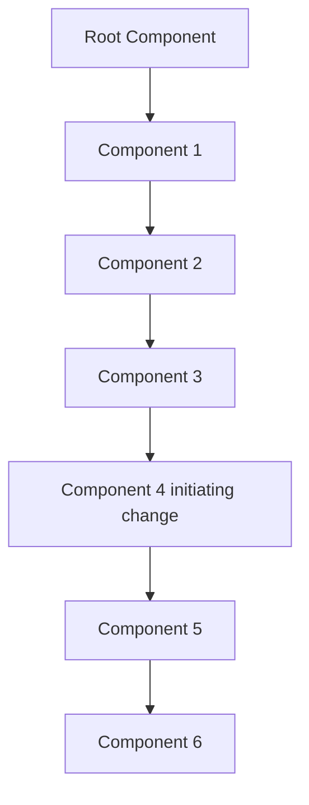
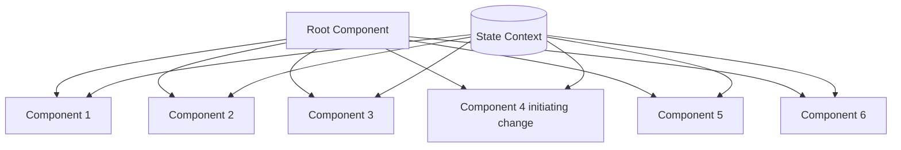

# React (Hooks y MERN)

## 1. Introducción

### 🟣 Introducción al curso

Se recomienda hacer las tareas de cada sección.

### 🟣 ¿Cómo funcionará el curso?

Trata de ver el curso en secuencia.

### 🟣 ¿Cómo hacer preguntas?

Revisa la sección de **Discusión** y crea un **Post**.

> Trata de agregar toda la información de una sola vez y de ser necesario deja tu código en un repositorio alojado en GitHub para que pueda ser revisado por los instructores y así puedan darte mucho mejor soporte.

### 🟣 Instalaciones necesarias y recomendadas

#### Instalaciones Necesarias

* [Google Chrome](https://www.google.com/chrome/)

* [React Developer Tools](https://chrome.google.com/webstore/detail/react-developer-tools/fmkadmapgofadopljbjfkapdkoienihi?hl=es&authuser=1)

* [Redux Devtools](https://chrome.google.com/webstore/detail/redux-devtools/lmhkpmbekcpmknklioeibfkpmmfibljd?hl=es)

* [Visual Studio Code](https://code.visualstudio.com/)

* [Postman](https://www.postman.com/downloads/)

* [Mongo Compass](https://www.mongodb.com/try/download/compass)

* [Git](https://git-scm.com/)

* [Node](https://nodejs.org/es/)

> Revisa la configuración básica de Git: [Apuntes](https://github.com/aleroses/Platzi/blob/master/DW/1-basico/005-git-github/git-github.md#8-crea-un-repositorio-de-git-y-haz-tu-primer-commit)

```bash
git config --list
  - Configuración por defecto de git
  - Vemos que aún no está nuestro nombre ni correo

git config --global user.name "John Lennon"
  - Cambiar usuarios globales

git config --global user.email "john.l@mail.com"
  - Cambiar email
```

#### Extensiones de VSCode

[Activitus Bar](https://marketplace.visualstudio.com/items?itemName=Gruntfuggly.activitusbar)

#### Configuración del Bracket Pair Colorizer 2

Brakcet Pair está obsoleto.
[Obsoleto - Bracket Pair Colorizer 2](https://marketplace.visualstudio.com/items?itemName=CoenraadS.bracket-pair-colorizer-2)

Solución:

- Presiona F1 para abrir búsqueda en VS Code.
- Busca Open Settings (UI)
- En Search settings copia y pega esto: 

```
"@id:editor.bracketPairColorization.enabled [@id:editor.guides.bracketPairs](https://id:editor.guides.bracketPairs/)"
```

También puedes usar el atajo `Ctrl + ,` y pegas en el buscador lo mostrado arriba.
  
Ahora asegúrate de que: 

> Editor > Bracket Pair Colorization: Enabled está marcado con un tick mark (activo)

---

> Editor > Guides. Bracket Pairs tiene la opción de "active" seleccionada.

A continuación haz de nuevo F1 y busca Open User Settings (JSON) o usa el atajo `Ctrl + ,` y busca el icono 📄 Open Settings (JSON)

Ahora en el fichero **settings.json** añade la siguiente propiedad al objeto json:

```json
"workbench.colorCustomizations": {
	"editorBracketHighlight.foreground1": "#fafafa",
	"editorBracketHighlight.foreground2": "#9F51B6",
	"editorBracketHighlight.foreground3": "#F7C244",
	"editorBracketHighlight.foreground4": "#F07850",
	"editorBracketHighlight.foreground5": "#97c26c",
	"editorBracketHighlight.foreground6": "#C497D4",
	"editorBracketHighlight.unexpectedBracket.foreground": "#fb6165"
},
```

#### Temas que estoy usando en VSCode:

* [Monokai Night](https://marketplace.visualstudio.com/items?itemName=fabiospampinato.vscode-monokai-night)

* [Tokyo Night](https://marketplace.visualstudio.com/items?itemName=enkia.tokyo-night)

* [Iconos](https://marketplace.visualstudio.com/items?itemName=PKief.material-icon-theme)

Mi tema: [Material Theme -- Free](https://marketplace.visualstudio.com/items?itemName=Equinusocio.vsc-material-theme)

#### Instalaciones recomendadas sobre React

* [ES7 React/Redux](https://marketplace.visualstudio.com/items?itemName=dsznajder.es7-react-js-snippets)

* [Simple React Snippets](https://marketplace.visualstudio.com/items?itemName=burkeholland.simple-react-snippets)

* [Auto Close Tag](https://marketplace.visualstudio.com/items?itemName=formulahendry.auto-close-tag)

[Instalaciones recomendadas](https://gist.github.com/Klerith/4a4abfd88a88b2d1f16efd95fea41362)

### 🟣 ¡Únete a Nuestra Comunidad de DevTalles en Discord!

**¿Cómo unirse?**

- Haz clic en el siguiente enlace de invitación: [Comunidad DevTalles](https://discord.gg/pBjEVYTC7t)

## 2. Introducción a React y conceptos generales

### 🟣 Introducción a la sección

### 🟣 Temas puntuales de la sección

**¿Qué aprenderemos en esta sección?**

- ¿Qué es React?
- Conceptos generales
- Babel
- JSX

Daremos nuestros primeros pasos y una pequeña aplicación que nos ayudará a perderle el miedo a React rápidamente

### 🟣 ¿Qué es React?

- Librería: Para aplicaciones sencillas, intermedias y robustas.
- Declarativa: Es fácil de seguir patrones de diseño y crear UI interactivas.
- Eficiente: Los cambios se hacen solo en el elemento que se modificó.
- Predecible:
- Componentes: Pequeñas piezas encapsuladas fáciles de mantener.
- Server-side con Node
- Aplicaciones móviles con React Native.

¿Cómo luce el código de React?

```html
<div id="root"></div>
```

```jsx
const root = document.querySelector("#root");
ReactDOM.render(<h1>Hola mundo cruel</h1>, root);
```

También:

```html
<div id="root"></div>
```

```jsx
const root = document.querySelector("#root");
const tag = <h1>Hola mundo cruel</h1> // JSX
ReactDOM.render(tag, root);
```

El código JSX se podría crear de la siguiente manera:

```jsx
const tag = document.createElement('h1', null, `Hola, soy ${nombre}`)
```

### 🟣 Primeros pasos en React

Creamos una carpeta para empezar a trabajar:

```bash
.
├── 01-intro-react 👈👀
│   └── index.html
├── 02-intro-js
└── 03-counter-app
```

Abrimos el primer archivo usando Visual Studio Code y añadimos lo siguiente:

```html
<!DOCTYPE html>
<html lang="en">
  <head>
    <meta charset="UTF-8" />
    <meta
      name="viewport"
      content="width=device-width, initial-scale=1.0"
    />

    <!-- Cargar React -->
    <script
      crossorigin
      src="https://unpkg.com/react@16/umd/react.production.min.js"
    ></script>
    <script
      crossorigin
      src="https://unpkg.com/react-dom@16/umd/react-dom.production.min.js"
    ></script>
    <script src="https://unpkg.com/babel-standalone@6/babel.min.js"></script>

    <title>React</title>
  </head>
  <body>
    <div id="root"></div>

    <script type="text/babel">
      const divRoot = document.querySelector("#root");
      const name = "Ale Roses";
      const h1Tag = <h1>Hi {name}</h1>;

      ReactDOM.render(h1Tag, divRoot);
    </script>
  </body>
</html>
```

Primero cargamos las bibliotecas de React y Babel. Añadimos algo de código para empezar a trabajar como se hace con React.

Para que el código no nos dé ningún error debemos agregar `type="text/babel"` dentro de la etiqueta `script`.

Si tienes la extensión `Live Server` solo das clic derecho **Open with live Server**.

Ahora puedes abrir los dev tools con `Ctrl + Shift + i`

[**React-index.html - Demo**](https://gist.github.com/Klerith/b0111f52ba16451d095f38d4c995605b)

### 🟣 Introducción a Babel

#### Babel

Babel es un "compilador" (o transpilador) para JavaScript. Básicamente permite transformar código escrito con las últimas y novedosas características de JavaScript y transformarlo en un código que sea entendido por navegadores más antiguos.

[Babel](https://babeljs.io/)

#### Dato sobre Babel y Vite

Vite reemplaza a Babel o a Webpack en cierto modo. Al contrario que Babel o Webpack, Vite no compila el código de JavaScript durante el desarrollo, sino que realiza la transpilación del código en tiempo real durante el proceso de desarrollo.

Esto se conoce como desarrollo en tiempo real o HMR (Hot Module Replacement). Aunque no reemplaza por completo a Babel o Webpack, Vite sigue siendo una herramienta muy poderosa y rápida para el desarrollo de aplicaciones web modernas.

[**Babeljs.io - Sitio oficial**](https://babeljs.io/)

## 3. Introducción a JavaScript moderno

### 🟣 Introducción a la sección

Sigan los videos al pie de la letra...

### 🟣 Temas puntuales de la sección

**¿Qué aprenderemos en esta sección?**

- Generar la base sobre JavaScript
- Constantes y variables Let
- Template String
- Objetos literales
- Arreglos
- Desestructruación * (sumamente importante)
- Promesas
- Fetch API
- Ternarios
- Async - Await

Mi objetivo aquí es que tengamos las bases que nos ayuden a que podamos diferenciar fácilmente qué es propio de React y qué es propio de JavaScript. Estos conceptos y ejercicios nos ayudarán a suavizar la curva de aprendizaje de React.

### 🟣 Inicio de proyecto - Bases de JavaScript

Entramos a la carpeta para empezar a trabajar, en este caso con Create React App (CRA):

```bash
.
├── 01-intro-react
│ └── index.html
├── 02-intro-js 👈👀
└── 03-counter-app
```

Para crear un proyecto de React con CRA debemos usar el siguiente comando:

```bash
npx create-react-app 02-intro-js 👈👀
cd 02-intro-js
code .
npm start
```

La estructura de CRA se ve así:

```bash
❯ tree -L 2
.
├── node_modules 👈👀 # Muchos archivos
│   ├── @aashutoshrathi
│   ├── abab
│   ├── accepts 
├── package.json
├── package-lock.json
├── public
│   ├── favicon.ico
│   ├── index.html
│   ├── logo192.png
│   ├── logo512.png
│   ├── manifest.json
│   └── robots.txt
├── README.md
└── src 👈👀
    ├── App.css
    ├── App.js
    ├── App.test.js
    ├── index.css
    ├── index.js
    ├── logo.svg
    ├── reportWebVitals.js
    └── setupTests.js

871 directories, 17 files
```

Para el ejemplo borramos todo el contenido de la carpeta `src` y dentro creamos el archivo `index.js`.

[**create-react-app - Official Website**](https://create-react-app.dev/)

### 🟣 Variables y constantes

```js
// Variables y Constantes

const name = "Ale";
const lastName = "Roses";

let value = 5;
value = 4;

console.log(name, lastName, value);

if (true) {
  let value = 10;
  console.log(value);
}

console.log(value);
```

Creamos un respaldo con la siguiente estructura.

```bash
.
├── node_modules
├── package.json
├── package-lock.json
├── public
│   ├── favicon.ico
│   ├── index.html
│   ├── logo192.png
│   ├── logo512.png
│   ├── manifest.json
│   └── robots.txt
├── README.md
└── src
    ├── bases 👈👀
    │   ├── 01-const-let.js
    │   ├── 02-backticks.js
    │   ├── 03-obj-literal.js
    │   ├── 04-array.js
    │   ├── 05-functions.js
    │   ├── 06-desest-obj.js
    │   ├── 07-desest-arr.js
    │   ├── 08-imp-exp.mjs
    │   ├── 09-promises.js
    │   ├── 10-fetch.js
    │   ├── 11-async-await.js
    │   └── 12-conditional-ternary.js
    ├── data
    │   └── heroes.js
    └── index.js
```

Al final de esta sección tendremos dentro de la carpeta `bases` todos nuestros respaldos.

Para más detalles sobre variables ver los [Apuntes js-básico](https://github.com/aleroses/Platzi/blob/master/DW/2-intermedio/001-js-basico/js-basico.md#4-variables-en-javascript)

### 🟣 Template String

```js
const name = "Ale";
const lastName = "Roses";

const fullName = `${name} ${lastName}`;

console.log(fullName);

function getGreeting(name) {
  return "He " + name;
}

console.log(`This a text: ${getGreeting("Ghost")}`);
```

> Para obtener sugerencias usar `Ctrl + Barra espaciadora`

Recomiendo usar la extensión **JavaScript Auto Backticks** que nos permite añadir Backticks rápidamente.

Si escribimos `"${}"` automáticamente los genera `${name}`

### 🟣 Objetos literales

```js
const person = {
  name: "Ale",
  lastName: "Roses",
  age: 28,
  address: {
    city: "New York",
    zip: 1234,
    lat: 14.2324,
    lng: 34.3003,
  },
};

const human = { ...person };

console.log(person);
console.table(person);
console.log(human);
console.log({ person, human });
```

**Recursividad** para hacer una copia profunda:

```js
const person = {
  name: "Ale",
  lastName: "Roses",
  age: 28,
  address: {
    city: "New York",
    zip: 1234,
    lat: 14.2324,
    lng: 34.3003,
    x: {
      city: "New York",
      zip: 1234,
      lat: 14.2324,
      lng: 34.3003,
    },
    y: [
      "city",
      "New York",
      "zip",
      1234,
      "lat",
      14.2324,
      "lng",
      34.3003,
    ],
  },
};

/* En JS todo es un objeto: {} / []  */
const deepCopy = (obj) => {
  if (typeof obj !== "object" || obj === null) {
    return obj;
  }

  const newObj = Array.isArray(obj) ? [] : {};

  for (const key in obj) {
    if (obj.hasOwnProperty(key)) {
      newObj[key] = deepCopy(obj[key]);
    }
  }

  console.log(newObj);
  return newObj;
};

deepCopy(person);
```

Si quieres probar el código sin salir de VSC puedes usar la extensión **Code Runner**.

### 🟣 Arreglos

```js
// Arreglos en JS
// const newArray = new Array();
const newArray = [1, 2, 3];

// NO recomendado (push)
// newArray.push(1);
// newArray.push(2);
// newArray.push(3);

let newArray2 = [...newArray, 4, 5];
let newArray3 = newArray2.map((n) => n * 2);

console.log(newArray, newArray2, newArray3);
```

[**Mozilla MDN: Array.map()**](https://developer.mozilla.org/es/docs/Web/JavaScript/Reference/Global_Objects/Array/map)

### 🟣 Funciones

```js
// Functions en Js

function gretting(name) {
  return `Hello, ${name}`;
}

console.log(gretting("Goku"));
```

Otros ejemplos:

```js
const gretting = (name) => {
  return `Hello, ${name}`;
};

console.log(gretting("Goku"));

const getUser = () => ({
  uid: "ABC123",
  username: "The-crazy-man",
});

const user = getUser();
console.log(user);

const getActiveUser = (name) => ({
  uid: "ABC567",
  username: name,
});

const activeUser = getActiveUser("Ale");
console.log(activeUser);
```

### 🟣 Desestructuración de Objetos

```js
// Desestructuración
// Asignación Desestructurante

const person = {
  name: "Ale",
  year: 45,
  key: "Ironman",
  rank: "Soldier",
};

const { year, key, name: nameTwo } = person;

// console.log(nameTwo, year, key);

const useContext = ({
  name,
  key,
  year,
  rank = "Captain",
}) => {
  // const { year, key, name: nameTwo } = user;
  // console.log(name, year, rank);

  return {
    name: key,
    anios: year,
    latlng: {
      lat: 14.1234,
      lng: -12.2323,
    },
  };
};

const {
  name,
  anios,
  latlng: { lat, lng },
} = useContext(person);

// const { lat, lng } = latlng;

console.log(name, anios, lat, lng);
```

[**Mozilla MDN: Asignación Desestructurante**](https://developer.mozilla.org/es/docs/Web/JavaScript/Reference/Operators/Destructuring_assignment)

### 🟣 Desestructuración de Arreglos

```js
const characters = ["Goku", "Vegeta", "Trunks"];

const [, , c3] = characters;

console.log(c3);

const showArray = () => {
  return ["ABC", 123];
};

const [one, two] = showArray();

console.log(one, two);

const useState = (value) => {
  return [
    value,
    () => {
      console.log("Hello world");
    },
  ];
};

const [name, setNumber] = useState("Goku");
// arr[1]();

console.log(name);
setNumber();
```

Para seleccionar todas las coincidencias de una palabra, solo debes posar el cursor sobre la palabra en cuestión y presionar:

`Ctrl + Shift + l` o también `Ctrl + d`

Otra opción sería presionar `F2` y darle el nuevo nombre a la variable o fracción de código que se desea modificar.

### 🟣 Import, export y funciones comunes de arreglos

```js
import { heroes } from "../data/heroes.js";

const getHeroById = (id) => {
  return heroes.find((value) => value.id === id);
};

const getHeroesByOwner = (owner) => {
  return heroes.filter((hero) => hero.owner === owner);
};

console.log(getHeroesByOwner("DC"));

export { getHeroById, getHeroesByOwner };
```

`data > heroes.js`

```js
const heroes = [
  {
    id: 1,
    name: "Batman",
    owner: "DC",
  },
  {
    id: 2,
    name: "Spiderman",
    owner: "Marvel",
  },
  {
    id: 3,
    name: "Superman",
    owner: "DC",
  },
  {
    id: 4,
    name: "Flash",
    owner: "DC",
  },
  {
    id: 5,
    name: "Wolverine",
    owner: "Marvel",
  },
];

export { heroes };
```

**[Heroes.js](https://gist.github.com/Klerith/4aeb99d31aedbc29ff4d54bbb77d2d7f)**

[**Mozilla Mdn: Find**](https://developer.mozilla.org/es/docs/Web/JavaScript/Reference/Global_Objects/Array/find)|

### 🟣 Múltiples exportaciones y exportaciones por defecto

```js
export default heroes;

// Al exportar de las siguientes maneras:
export const owner = ["DC", "Marvel"];
// O, la "importación" se hace usando {}
export { owner };

// También
export { heroes as default, owner };

// ----------------------------------------
// En lo personal no me gusta esta forma
import heroes, { owner } from "../data/heroes.js";

// Prefiero esto
import { heroes, owner } from "../data/heroes.js";
```

En el primer ejemplo, `heroes` es una exportación por defecto y la `owner` no.

### 🟣 Promesas

```js
import { getHeroById } from "./08-imp-exp.mjs";

const promise = new Promise((resolve, reject) => {
  setTimeout(() => {
    const data = getHeroById(2);

    resolve(data);
    reject("Id not found");
  }, 2000);
});

promise
  .then((response) => console.log(response))
  .catch((err) => console.warn(err));
```

Otro ejemplo:

```js
import { getHeroById } from "./08-imp-exp.mjs";

const getHeroByIdAsync = (id) => {
  const promise = new Promise((resolve, reject) => {
    setTimeout(() => {
      const data = getHeroById(id);

      data ? resolve(data) : reject("Id not found");
    }, 2000);
  });

  return promise;
};

getHeroByIdAsync(14).then(console.log).catch(console.warn);
```

📌 Si no te sale el `import` automáticamente sitúate en la parte superior y escribe el nombre, en este caso `getHeroeById` y verás como te sale para importar automáticamente. En caso escribas el nombre de la función a importar y no te la importe, puedes abrir el archivo donde está esa función, esto hará que importe y autocomplete la ubicación exacta de esa función.

[**Mozilla MDN: Promesas**](https://developer.mozilla.org/es/docs/Web/JavaScript/Reference/Global_Objects/Promise)

### 🟣 Fetch API

Crea una cuenta en Giphy API y crea un `api key` con los siguientes pasos:

- Entra en **Create an App**
- Selecciona **API Selected**
- **Next** 
- Dale un nombre a la app con su respectiva descripción.
- Por último dale a **Create App**.

Para el ejemplo usaremos [Random Endpoint](https://developers.giphy.com/docs/api/endpoint/#random) que mostrara una imagen de manera aleatoria.

```js
// Ingresa tu Api key en la url antes de pegarla en un navegador
api.giphy.com/v1/gifs/random?api_key=xdCnnfEOEkSz4TEgLmMc09dBClFt99Ou
```

Esto mostrará un objeto con mucha información.

```js
const apiKey = "xdCnnfEOEkSz4TEgLmMc09dBClFt99Ou";
const getGiphy = fetch(
  `https://api.giphy.com/v1/gifs/random?api_key=${apiKey}`
);

getGiphy
  .then((response) => response.json())
  .then(({ data }) => {
    const { url } = data.images.original;

    const img = document.createElement("img");
    img.src = url;

    document.body.append(img);
  })
  .catch(console.warn);
```

[**Giphy API**](https://developers.giphy.com/)

[**Mozilla MDN: Fetch**](https://developer.mozilla.org/es/docs/Web/API/Fetch_API)

### 🟣 Async - Await

Primera forma:

```js
const getImage = () => {
  const promise = new Promise((resolve, reject) => {
    resolve("c");
  });

  return promise;
};

getImage().then(console.log);
```

Otra forma: 

```js
const getImage = async () => {
  return "https://asdffsafs.com";
};
getImage().then(console.log);
```

Otra forma:

```js
const getImage = async () => {
  try {
    const apiKey = "xdCnnfEOEkSz4TEgLmMc09dBClFt99Ou";
    const response = await fetch(
      `https://api.giphy.com/v1/gifs/random?api_key=${apiKey}`
    );
    const { data } = await response.json();

    const img = document.createElement("img");
    // img.src = data.data.images.original.url;
    img.src = data.images.original.url;

    document.body.append(img);

    return data;
  } catch (error) {
    console.error(error);
  }
};

getImage();
```

### 🟣 Operador condicional ternario

```js
const active = true;
// let message = active ? "Active" : "Inactive"
let message = !active && "Active";

console.log(message);
```

### 🟣 Nota sobre JavaScript

#### **Terminamos la sección de reforzamiento de JavaScript**

Pero recuerden que esto es para entrar en calor y que lo temas principales de JavaScript que necesito que conozcan estén cubiertos, pero les recomiendo que cualquier duda adicional sobre el lenguaje, sobre métodos y demás, la consulten aquí

[**https://developer.mozilla.org/es/**](https://developer.mozilla.org/es/)

Como ya les había mencionado, considero esa página la mejor en cuanto a documentación sobre JavaScript.

También si sienten que necesitan más sobre JavaScript en video, mi curso de JavaScript Moderno es el indicado para eso.

En fin!, es momento de empezar con React!

Recursos de la lección:

[**Repositorio de GitHub del proyecto**](https://github.com/Klerith/react-intro-javascript)

## 4. Primeros pasos en React

### 🟣 Introducción a la sección

### 🟣 Temas puntuales de la sección

**¿Qué veremos en esta sección?**

- Nuestra primera aplicación - Hola Mundo
- Exposiciones sobre los componentes
- Creación de componentes (Functional Components)
- Propiedades - Props
- Impresiones en el HTML 
- PropTypes  
- DefaultProps 
- Introducción general a los Hooks  
- useState

Es una sección importante, especialmente para todos los que están empezando de cero en React, ya que dará las bases de cómo segmentar la lógica de nuestra aplicación en pequeñas piezas más fáciles de mantener.

### 🟣 ¿Qué son los componentes?

Pequeña pieza de código encapsulada reutilizable que puede tener estado o no.

Es buena práctica que los componentes se nombren usando `PascalCase`.

- camelCase
- snake_case
- PascalCase

```js
TwitterApp > Router > Screen/Página > Menú > MenuItem
```

El estado es como se encuentra la información del componente en un punto determinado del tiempo.

### 🟣 Primera aplicación de React

```bash
yarn create vite

# Nombrar proyecto
03-counter-app
# Seleccionar un framework
React
# Seleccionar variante
JavaScript
```

Si deseas renombrar una carpeta y estás en Linux lo puedes hacer con la CLI.

```bash
# Renombrar una carpeta:
mv nombre_actual nuevo_nombre
```

Ahora nos movemos al proyecto creado

```bash
cd 03-counter-app
yarn install
code .
yarn dev
```

La estructura del proyecto es la siguiente:

```bash
.
├── index.html
├── node_modules 👈👀 # Muchos archivos
├── package.json
├── public
│   └── vite.svg
├── README.md
├── src
│   ├── App.css
│   ├── App.jsx
│   ├── assets
│   │   └── react.svg
│   ├── index.css
│   └── main.jsx
├── vite.config.js
└── yarn.lock

522 directories, 1281 files
```

Si quieres ver como se hace con CRA puedes revisar la sección 3.

[[react-hooks-mern#3. Introducción a JavaScript moderno#🟣 Inicio de proyecto - Bases de JavaScript]]

[Inicio de proyecto - Bases de JavaScript](https://github.com/aleroses/Platzi/blob/master/DW/3-avanzado/1.react.js/devTalles/react-hooks-mern.md#-inicio-de-proyecto---bases-de-javascript)

[**Create-React-App - Documentación**](https://create-react-app.dev/)

[**Vite documentation**](https://vitejs.dev/)|

### 🟣 Estructura de directorios - CRA

En los proyectos creados con **NPM** se puede observar que tenemos el archivo `package-lock.json` que nos dice como fueron construidas las dependencias de los módulos de Node.

**[Referencia: Robots.txt](https://developers.google.com/search/docs/advanced/robots/intro?hl=es&visit_id=637909934831052162-4097033822&rd=1)**

**[Google Developers - PWA](https://web.dev/learn/pwa/)**

**[React-Scripts](https://create-react-app.dev/docs/available-scripts/)**

### 🟣 Estructura de directorios - Vite

Ver estructura en [[react-hooks-mern#4. Primeros pasos en React#🟣 Primera aplicación de React]]

Si se creó el proyecto con **Yarn** no se recomienda mezclarlo con **NPM**.

En caso desees cambiar debes borrar el archivo `package-lock.json` o `yarn.lock` y volver a hacer `npm install` o `yarn install`.

El archivo `vite.config.js` sirve para hacer configuraciones propias de vite.

### 🟣 Hola Mundo en React

Abrimos el proyecto `03-counter-app-vite`.

```bash
yarn dev
```

Borramos todos los archivos del folder `src` y creamos un archivo `main.jsx`.

```jsx
import React from "react";
import ReactDOM from "react-dom/client";

// Mala practica
const App = () => {
  return <h1>App</h1>;
};

ReactDOM.createRoot(document.getElementById("root")).render(
  <React.StrictMode>
    <App />
  </React.StrictMode>
);
```

```html
<body>
  <div id="root"></div> 👈👀
  <script type="module" src="/src/main.jsx"></script>
</body>
```

### 🟣 Nuestro primer Componente

Creamos el archivo `App.jsx` dentro del `src`.

`src > main.jsx`

```jsx
import React from "react";
import ReactDOM from "react-dom/client";
import { App } from "./App";

ReactDOM.createRoot(document.getElementById("root")).render(
  <React.StrictMode>
    <App />
  </React.StrictMode>
);
```

`src > App.jsx`

```jsx
import React from "react";

// rafc
const App = () => {
  return <h1>App</h1>;
};

export { App };
```

📌 Nota: Si haces una exportación por `defaul`, en el lugar de la **importación** puedes darle el **nombre que quieras**.

```js
export defaul App;

import TestApp👈 from "./App";
```

### 🟣 Tarea - Crear un nuevo componente

`src > main.jsx`

```jsx
import React from "react";
import ReactDOM from "react-dom/client";
import { App } from "./App";
import { FirstTest } from "./FirstTest";

ReactDOM.createRoot(document.getElementById("root")).render(
  <React.StrictMode>
    <App />
    <FirstTest />
  </React.StrictMode>
);
```

`src > FirstTest.jsx`

```jsx
const FirstTest = () => {
  return (
    <>
      <h1>Ale Roses</h1>
    </>
  );
};

export { FirstTest };
```

### 🟣 Retornar elementos en el Componente - Fragment

`src > FirstTest.jsx`

```jsx
const FirstTest = () => {
  return (
    <> 👈👀
      <h1>Ale Roses</h1>
      <p>First course with Fernando Herrera.</p>
    </>
  );
};

export { FirstTest };
```

### 🟣 Impresión de variables en el HTML

`src > FirstTest.jsx`

```jsx
const newObject = {
  name: "Ale Roses",
  nickname: "Ghost"
}

const newArray = [0, 1, 2, 3, 4];

const getResult = () => {
  return 4 + 4;
}

const FirstTest = () => {
  return (
    <>
      <h1>{newObject.name}</h1>
      <p>{newObject.nickname}</p>
      <p>{newArray}</p>
      <p>{getResult()}</p>
      <code>{JSON.stringify(newMessage)}</code>
    </>
  );
};

export { FirstTest };
```

### 🟣 Colocar estilos de CSS

Dentro del `src` creamos un archivo `styles.css` donde podremos agregar los estilos que necesitemos.

`src > styles.css`

```css
* {
  padding: 0;
  margin: 0;
  box-sizing: border-box;
}

html,
body {
  background-color: #21232a;
  color: white;
  font-family: Helvetica, Arial, sans-serif;
  font-size: 1.3rem;
  padding: 70px;
}

button {
  padding: 5px;
  font-size: 1rem;
  margin: 0.2rem;
}
```

`src > main.jsx`

```jsx
import React from "react";
import ReactDOM from "react-dom/client";
import { App } from "./App";
import { FirstTest } from "./FirstTest";

import "./styles.css"; 👈👀

ReactDOM.createRoot(document.getElementById("root")).render(
  <React.StrictMode>
    <App />
    <FirstTest />
  </React.StrictMode>
);
```

### 🟣 Comunicación entre componentes - Props

`src > FirstTest.jsx`

```jsx
const FirstTest = ({
  title,
  subTitle,
  name,
}) => {
  return (
    <>
      <h1>{title}</h1>
      <p>{subTitle}</p>
      <p>{name}</p>
    </>
  );
};

export { FirstTest };
```

`src > main.jsx`

```jsx
import React from "react";
import ReactDOM from "react-dom/client";
import { App } from "./App";
import { FirstTest } from "./FirstTest";

import "./styles.css"; 👈👀

ReactDOM.createRoot(document.getElementById("root")).render(
  <React.StrictMode>
    <App />
    <FirstTest
      title="Hi, I'm a bot"
      subTitle={"Subject subtitle"}
    />
  </React.StrictMode>
);
```

**Dev tools** ⚛️ Components: Veremos los nombres de los componentes (árbol de componentes / contexto)


### 🟣 PropTypes

En Vite no viene instalado por defecto:

```bash
yarn add prop-types 

# Para NPM
npm install prop-types
```

`src > FirstTest.jsx`

```jsx
import PropTypes from "prop-types"; 👈👀

const FirstTest = ({
  title,
  subTitle,
  name,
}) => {
  return (
    <>
      <h1 data-testid="test-title">{title}</h1>
      <p>{subTitle}</p>
      <p>{name}</p>
    </>
  );
};

FirstTest.propTypes = { 👈👀👇
  title: PropTypes.string.isRequired,
  subTitle: PropTypes.string,
};
```

`src > main.jsx`

```jsx
import React from "react";
import ReactDOM from "react-dom/client";
import { App } from "./App";
import { FirstTest } from "./FirstTest";

import "./styles.css"; 👈👀

ReactDOM.createRoot(document.getElementById("root")).render(
  <React.StrictMode>
    <App />
    <FirstTest
      title 👈👀 // True (valor booleano)
      subTitle={"Subject subtitle"}
    />
  </React.StrictMode>
);
```

### 🟣 DefaultProps

`src > FirstTest.jsx`

```jsx
import PropTypes from "prop-types";

const FirstTest = ({
  title = "No title", 👈👀
  subTitle,
  name,
}) => {
  return (
    <>
      <h1 data-testid="test-title">{title}</h1>
      <p>{subTitle}</p>
      <p>{name}</p>
    </>
  );
};

FirstTest.propTypes = {
  title: PropTypes.string.isRequired,
  subTitle: PropTypes.string,
};

FirstTest.defaultProps = {
  subTitle: "New Text", 👈👀
  name: "Ale Roses",
};

export { FirstTest };
```

📌 Nota: El soporte para `defaultProps` será removido y se deberán usar los parámetros predeterminados de JavaScript. Ahora lo aconsejable es colocar el valor por defecto al **desestructurar** directamente las **props** del componente.

### 🟣 Tarea - Componente CounterApp

1. Crear un nuevo componente dentro de la carpeta SRC llamado
    `CounterApp`

2. El `CounterApp` debe de ser un __Functional Component__

3. El contenido del __CounterApp__ debe de ser:
    ```jsx
        <h1>CounterApp</h1>
        <h2> { value } </h2>
    ```

4. Donde `"value"` es una propiedad enviada desde el padre hacia
    el componente __CounterApp__ __(Debe ser númerica validada con PropTypes)__

5. Reemplazar en el `index.js` ó `main.jsx` el componente de `<PrimeraApp />`
    por el componente `<CounterApp />`
        (no se olviden del value que debe de ser un número)

6. Asegúrense de no tener errores ni warnings
    (Cualquier warning no usado, comentar el código)

`src > main.jsx`

```jsx
import React from "react";
import ReactDOM from "react-dom/client";
import { CounterApp } from "./CounterApp";

import "./styles.css";

ReactDOM.createRoot(document.getElementById("root")).render(
  <React.StrictMode>
    <CounterApp value={1} />
  </React.StrictMode>
);
```

`src > CounterApp.jsx`

```jsx
import PropTypes from "prop-types";

const CounterApp = ({ value }) => {
  return (
    <>
      <h1>Counter App</h1>
      <h2>{value}</h2>
    </>
  );
};

CounterApp.propTypes = {
  value: PropTypes.number.isRequired,
};

export { CounterApp };
```

[**Tarea - Referencia**](https://gist.github.com/Klerith/e1a731cc595c00a9794a709062eae757)

### 🟣 Evento click (Eventos en general) + useState - Hook

`src > CounterApp.jsx`

```jsx
import React, { useState } from "react";
import PropTypes from "prop-types";

const CounterApp = ({ value }) => {
  const [counter, setCounter] = useState(value);

  const handleAdd = () => {
    // setCounter(counter + 1);
    setCounter((c) => c + 1);
  };

  const handleRest = () => {
    setCounter((c) => c - 1);
  };

  const handleReset = () => {
    setCounter(value);
  };

  return (
    <>
      <h1>Counter App</h1>

      <button onClick={handleAdd}>+1</button>
      <button onClick={handleRest}>-1</button>
      <button onClick={handleReset}>
        Reset
      </button>
      <h2>{counter}</h2>
    </>
  );
};

CounterApp.propTypes = {
  value: PropTypes.number.isRequired,
};

export { CounterApp };
```

Esta funcionalidad está disponible en Obsidian:

[[react-js-desde-cero#**12.** Hooks]] 👈👀


[**Reactjs.org - Eventos**](https://es.reactjs.org/docs/events.html)

[**Reactjs.org - Hooks**](https://es.reactjs.org/docs/hooks-intro.html)

[**Ejemplo - Tarea de desestructuración de arreglos**](https://github.com/Klerith/react-intro-javascript/blob/master/src/bases/07-deses-arr.js)

### 🟣 Código fuente de la sección

[**Github - fin-seccion-4**](https://github.com/Klerith/react-vite-counter-app/tree/fin-seccion-4)

## 5. Pruebas unitarias y de integración - Probando las secciones anteriores

### 🟣 Introducción a la sección

Probar la ruta crítica:

Probar la ruta crítica de una aplicación se refiere a realizar pruebas exhaustivas y enfocadas en las funciones o flujos de trabajo más críticos o prioritarios dentro de la aplicación. La ruta crítica representa aquellos caminos o secuencias de acciones que deben funcionar correctamente para que la aplicación cumpla con sus objetivos principales.

La idea detrás de probar la ruta crítica es asegurarse de que las funciones esenciales de la aplicación estén correctamente implementadas y sean confiables. Al enfocarse en estos aspectos clave, se puede identificar y solucionar problemas críticos antes de que afecten la experiencia del usuario o el funcionamiento general de la aplicación.

Aquí tienes algunos ejemplos de pruebas de ruta crítica para diferentes tipos de aplicaciones:

1. Aplicación de comercio electrónico:
   - Probar el proceso de inicio de sesión y registro de usuarios.
   - Verificar la funcionalidad del carrito de compras, desde la adición de productos hasta el pago y la generación de una orden.
   - Comprobar la correcta visualización y actualización del inventario de productos.

2. Aplicación bancaria en línea:
   - Realizar pruebas de inicio de sesión y autenticación de usuarios.
   - Probar las funciones de transferencia de fondos, asegurándose de que los saldos se actualicen correctamente.
   - Verificar la visualización precisa del historial de transacciones y la generación de estados de cuenta.

3. Aplicación de reserva de vuelos:
   - Probar la búsqueda y filtrado de vuelos según diferentes criterios, como origen, destino y fechas.
   - Verificar la correcta selección de asientos y opciones de personalización durante el proceso de reserva.
   - Comprobar el flujo de pago, asegurándose de que la transacción se realice correctamente.

### 🟣 Temas puntuales de la sección

**¿Qué veremos en esta sección?**

- Introducción a las pruebas
- AAA
	- Arrange: Arreglar
    - Act: Actuar
    - Assert: Afirmar
- Primeras pruebas
- Jest
- Expect
- toBe
- Enzyme
- Comandos útiles en la terminal para pruebas
- Revisar elementos renderizados en el componente
- Simular eventos

Esta sección de pruebas es sumamente importante porque nos dará la base de las pruebas que estaremos haciendo durante el curso, las pruebas irán creciendo en complejidad, por lo que les recomiendo que nos aseguremos de comprender bien todos estos conceptos para que nos sea más fácil las siguientes secciones de pruebas.

### 🟣 Introducción a las pruebas unitarias y de integración

Unitarias: Enfocadas en pequeñas funcionalidades.

Integración: Enfocadas en cómo reaccionan varias piezas en conjunto.

**Características de las pruebas:**

1. Fáciles de escribir
2. Fáciles de leer
3. Confiables
4. Rápidas
5. Principalmente unitarias

Pasos para enfocarnos en que todo trabaje bien entre sí (AAA):
1. Arrange (Arreglar): Inicialización
2. Act (Actuar): Estimulo
3. Assert (Afirmar): Observar el comportamiento

Arrange: Preparamos el estado inicial.
- Inicializamos variables
- Importaciones necesarias

Act: Aplicamos acciones o estímulos.
- Llamar métodos
- Simular clicks
- Realizar acciones sobre el paso anterior

Assert: Observar el comportamiento resultante.
- Son los resultados esperados.
- Ej: Que algo cambie, algo incremente o bien que nada suceda.

### 🟣 Inicio de la sección - Pruebas sobre lo aprendido anteriormente

Para las pruebas usaremos varios ejercicios que vimos en la parte de la introducción a JavaScript. Puedes copiar y pegar la carpeta `bases` del proyecto `02-intro-js` o descargar la carpeta comprimida desde la parte inferior del video. 

Estos archivos los pegamos dentro del `src` del proyecto `03-counter-app`, pero también pueden crear un proyecto totalmente nuevo.

[Download Bases](https://import.cdn.thinkific.com/643563/courses/1901683/basepruebas-220616-140151.zip)

### 🟣 Mi primera prueba y configuraciones iniciales

Para las pruebas usaremos **Jest** y **React Testing Library**, dos herramientas muy populares en el ecosistema de pruebas de JavaScript y React.

#### Jest

##### ¿Qué es Jest?

Jest es un framework de pruebas de JavaScript desarrollado por Facebook. Está diseñado para trabajar con proyectos que utilizan React, aunque también se puede usar para probar aplicaciones JavaScript en general.

##### Características principales de Jest:

- **Configuración mínima**: Jest requiere poca configuración para comenzar a usarlo, lo que facilita su adopción.
- **Velocidad**: Jest ejecuta las pruebas en paralelo para maximizar la velocidad de ejecución.
- **Mocks y Espías**: Proporciona herramientas integradas para crear mocks y espías de funciones.
- **Snapshots**: Permite crear instantáneas del estado de la interfaz en un momento específico para comparar en pruebas futuras.
- **Cobertura de código**: Genera informes de cobertura de código detallados.
- **Watch Mode**: Reejecuta pruebas automáticamente cuando los archivos relacionados cambian.

##### Ejemplo básico de Jest:

```jsx
import sum from './sum';

test('adds 1 + 2 to equal 3', () => {
  expect(sum(1, 2)).toBe(3);
});
```

#### Testing Library

##### ¿Qué es Testing Library?

Testing Library es un conjunto de utilidades para probar componentes de UI de manera accesible y amigable para el usuario. `@testing-library/react` es su implementación específica para React.

##### Filosofía de Testing Library:

- **Centrado en el usuario**: Testing Library fomenta las pruebas que se asemejan a cómo los usuarios interactúan con tu aplicación.
- **Accesibilidad**: Promueve prácticas que mejoran la accesibilidad, como seleccionar elementos por roles, etiquetas y texto visible.
- **Simplicidad**: Proporciona una API simple y ligera que facilita escribir y mantener pruebas.

##### Características principales de Testing Library:

- **Selección de elementos**: Métodos como `getByText`, `getByRole`, `getByLabelText` para seleccionar elementos de manera accesible.
- **Pruebas asincrónicas**: Utilidades como `waitFor` y `findBy` para manejar componentes que actualizan su estado de manera asincrónica.
- **Utilidades de eventos**: `fireEvent` para simular eventos del navegador.

##### Ejemplo básico de Testing Library con Jest:

```jsx
import React from 'react';
import { render, screen, fireEvent } from '@testing-library/react';
import '@testing-library/jest-dom/extend-expect';
import MyComponent from './MyComponent';

test('renders learn react link', () => {
  render(<MyComponent />);
  const linkElement = screen.getByText(/learn react/i);
  expect(linkElement).toBeInTheDocument();
});

test('button click updates text', () => {
  render(<MyComponent />);
  const button = screen.getByRole('button', { name: /click me/i });
  fireEvent.click(button);
  const updatedText = screen.getByText(/you clicked the button/i);
  expect(updatedText).toBeInTheDocument();
});
```

#### Configurar Jest

Para empezar a usar Jest primero debemos configurarlo, ya que en Vite no vienen configurados por defecto.

Esta configuración solo se hace una vez en cada proyecto. 

```bash
yarn add --dev jest
```

Añadimos el script de ejecución dentro del archivo `package.json`.

```json
"scripts": {
    "dev": "vite",
    "build": "vite build",
    "lint": "eslint . --ext js,jsx --report-unused-disable-directives --max-warnings 0",
    "preview": "vite preview",
    "test": "jest" 👈👀
  },
```

Dentro de la carpeta de nuestro proyecto creamos una carpeta llamada `tests`. Este será como un espejo del `src`.

Ahora podemos hacer una demostración de como funcionan los test.

`tests > demo.test.js`

```js
test("Esta prueba no debe de fallar", () => {
  if (0 === 1) {
    throw new Error("No puede dividir entre cero");
  }
});
```

Para correr las pruebas ejecutamos: 

```bash
yarn test
```

Si no queremos ingresar `yarn test` cada vez que queramos ejecutar las pruebas, solo debemos agregar lo siguiente en el archivo `package.json`.

```json
"scripts": {
    "dev": "vite",
    "build": "vite build",
    "lint": "eslint . --ext js,jsx --report-unused-disable-directives --max-warnings 0",
    "preview": "vite preview",
    "test": "jest --watchAll" 👈👀
  },
```

Ahora, al ejecutar `yarn test` se quedará escuchando cuando hagamos un cambio.

Mi estructura quedó algo así (cree un proyecto desde cero):

```bash
.
├── index.html
├── node_modules
├── package.json
├── public
│   └── vite.svg
├── README.md
├── src
│   ├── App.css
│   ├── App.jsx
│   ├── bases 👈👀
│   │   ├── 01-const-let.js
│   │   ├── 02-backticks.js
│   │   ├── 03-obj-literal.js
│   │   ├── 04-array.js
│   │   ├── 05-functions.js
│   │   ├── 06-desest-obj.js
│   │   ├── 07-desest-arr.js
│   │   ├── 08-imp-exp.mjs
│   │   ├── 09-promises.js
│   │   ├── 10-fetch.js
│   │   ├── 11-async-await.js
│   │   └── 12-conditional-ternary.js
│   ├── index.css
│   └── main.jsx
├── tests 👈👀👇
│   └── demo.test.js
├── vite.config.js
└── yarn.lock
```

[jestjs](https://jestjs.io/)

[Jestjs getting-started](https://jestjs.io/docs/getting-started)

### 🟣 Jest - Expect - toBe

#### `describe`

`describe` es una función en Jest que permite agrupar pruebas relacionadas bajo un mismo bloque. Esto facilita la organización y lectura de las pruebas, especialmente cuando tienes múltiples casos de prueba para una misma unidad funcional o componente.

```jsx
describe('Math functions', () => {
  // Tests relacionados con funciones matemáticas irán aquí
});
```

##### Ejemplo:

```jsx
describe('Math functions', () => {
  test('adds 1 + 2 to equal 3', () => {
    expect(1 + 2).toBe(3);
  });

  test('subtracts 2 - 1 to equal 1', () => {
    expect(2 - 1).toBe(1);
  });
});
```

#### `test`

`test` es una función en Jest que define un caso de prueba individual. También puedes usar `it` como un alias para `test`. Cada caso de prueba contiene una descripción y una función que ejecuta las expectativas para esa prueba.

```jsx
test('description of the test', () => {
  // código de la prueba
});
```

##### Ejemplo:

```jsx
test('adds 1 + 2 to equal 3', () => {
  expect(1 + 2).toBe(3);
});
```

#### `expect`

`expect` es una función en Jest que se utiliza para hacer afirmaciones en tus pruebas. Recibe un valor y devuelve un conjunto de métodos (matchers) que permiten comprobar diferentes condiciones sobre ese valor.

```jsx
expect(value).matcherMethod();
```

##### Ejemplo:

```jsx
expect(1 + 2).toBe(3);
```

##### Matchers comunes de `expect`

- **`.toBe(value)`**: Comprueba que el valor sea exactamente igual al valor esperado (usando `===`).
    
    ```jsx
    expect(2 + 2).toBe(4);
    ```
    
- **`.toEqual(value)`**: Comprueba que el valor sea igual al valor esperado, para objetos y arrays (usando comparación profunda).
    
    ```jsx
    const obj = { a: 1 };
    expect(obj).toEqual({ a: 1 });
    ```
    
- **`.toBeTruthy()`**: Comprueba que el valor sea verdadero en un contexto booleano.
    
    ```jsx
    expect(true).toBeTruthy();
    ```
    
- **`.toContain(item)`**: Comprueba que un array o string contenga un elemento específico.
    
    ```jsx
    const shoppingList = ['milk', 'bread', 'eggs'];
    expect(shoppingList).toContain('milk');
    ```

#### Ejemplo completo utilizando `describe`, `test` y `expect`

```jsx
describe('Array operations', () => {
  test('array contains milk', () => {
    const shoppingList = ['milk', 'bread', 'eggs'];
    expect(shoppingList).toContain('milk');
  });

  test('sum of numbers is correct', () => {
    expect(1 + 2).toBe(3);
  });

  test('object assignment', () => {
    const data = { one: 1 };
    data['two'] = 2;
    expect(data).toEqual({ one: 1, two: 2 });
  });

  test('null value is falsy', () => {
    const n = null;
    expect(n).toBeFalsy();
  });
});
```

En nuestro proyecto, añadimos ayudas o intelligent a Visual Studio Code.

```bash
yarn add -D @types/jest
```

`tests > demo.test.js`

```jsx
describe("Tests on the <DemoComponent/>", () => {
  test("This test must not fail", () => {
    // 1. Initialization
    const message1 = "Hi world";

    // 2. Stimulus
    const message2 = message1.trim();

    // 3. Observe expected behavior
    expect(message1).toBe(message2); 👈👀
  });
});
```

[Jest Expect](https://jestjs.io/docs/expect#reference)

### 🟣 Nota de Actualización - Extensión de archivos

En la siguiente clase se hace la configuración para las pruebas de nuestros distintos archivos, en caso de ver el error:

```bash
You appear to be using a native ECMAScript module configuration file, which is only supported when running Babel asynchronously.
```
  
Cambiar extensión de los archivos `jest.config.js` y `babel.config.js` a `.cjs`
  
Para ver más detalles al respecto pueden ir a [https://nodejs.org/docs/latest/api/modules.html#enabling](https://nodejs.org/docs/latest/api/modules.html#enabling "https://nodejs.org/docs/latest/api/modules.html#enabling").

### 🟣 Pruebas en el archivo `02-template-string.js`

Configuración de Babel: Esto instala las dependencias necesarias para integrar Babel con Jest y permitir que Jest transforme el código ES6+ durante las pruebas.

```bash
yarn add --dev babel-jest @babel/core @babel/preset-env
```

Al usar Babel con Jest, puedes escribir tu código de pruebas utilizando las últimas características de JavaScript, y Babel se encargará de transformar ese código a una versión que Jest pueda ejecutar. Esto es especialmente útil si estás utilizando sintaxis moderna de JavaScript que no es compatible de manera nativa con la versión de Node.js que estás usando para ejecutar tus pruebas.

Creamos el archivo `babel.config.cjs`

```js
module.exports = {
  presets: [
    ["@babel/preset-env", { targets: { node: "current" } }],
  ],
};
```

- **`module.exports`**: Esto exporta la configuración para que Babel pueda usarla.
    
- **`presets`**: Los presets son conjuntos de plugins de Babel que permiten transformar el código JavaScript de manera específica.
    
- **`["@babel/preset-env", { targets: { node: "current" } }]`**: Aquí se está utilizando el preset `@babel/preset-env` con una configuración específica. El objeto `{ targets: { node: "current" } }` le dice a Babel que transforme el código para que sea compatible con la versión actual de Node.js que se está utilizando para ejecutar las pruebas.

[Using Babel](https://jestjs.io/docs/getting-started#using-babel)

`src > bases > 02-backticks.js`

```jsx
function getGreeting(name) {
  return "Hi " + name;
}

export { getGreeting };
```

Creamos una carpeta para las pruebas:

```bash
├── tests 
│   └── bases 👈👀
│   │   ├── 01-const-let.js
│   │   ├── 02-backticks.js
│   │   ├── 03-obj-literal.js
│   │   ├── 04-array.js
│   │   ├── 05-functions.js
│   │   ├── 06-desest-obj.js
│   │   ├── 07-desest-arr.js
│   │   ├── 08-imp-exp.mjs
│   │   ├── 09-promises.js
│   │   ├── 10-fetch.js
│   │   ├── 11-async-await.js
│   │   └── 12-conditional-ternary.js
```

`test > base-pruebas > 02-template-string.test.js`

```jsx
import { getGreeting } from "../../src/bases/02-backticks";

describe("Test on 02-template-string", () => {
  test("getGreeting should return a greeting. ", () => {
    const name = "Ale Roses";
    const message = getGreeting(name);

    expect(message).toBe(`Hi ${name}`);
  });
});
```

En la terminal podremos usar `w` para mostrar más opciones y `p` para buscar el nombre del archivo a probar.

```bash
Watch Usage: Press w to show more.
```

```bash
Watch Usage
 › Press a to run all tests.
 › Press f to run only failed tests.
 › Press o to only run tests related to changed files.
 › Press p to filter by a filename regex pattern.
 › Press t to filter by a test name regex pattern.
 › Press q to quit watch mode.
 › Press Enter to trigger a test run.
```

### 🟣 toEqual

`toEqual` es un matcher en Jest que se utiliza para verificar que dos valores son equivalentes en contenido. A diferencia de `toBe`, que usa el operador de igualdad estricta (`===`) y verifica que los dos valores comparados son exactamente el mismo objeto o valor primitivo, `toEqual` realiza una comparación profunda. Esto significa que verifica que los valores dentro de **objetos** y **arrays** sean los mismos, no que los objetos o arrays sean exactamente el mismo objeto en memoria.

También sirve el `toStrictEqual`.

#### Comparación con `toBe`

- **`toBe`**: Usa el operador `===` y verifica que los valores sean exactamente los mismos en términos de identidad.
    
    ```jsx
    test('toBe with primitive values', () => {
      expect(1 + 2).toBe(3);
    });
    
    test('toBe with objects fails', () => {
      const obj = { a: 1 };
      expect(obj).toBe({ a: 1 }); // Falla porque no son el mismo objeto en memoria
    });
    ```
    
- **`toEqual`**: Realiza una comparación profunda para verificar la equivalencia de contenido.
    
    ```jsx
    test('toEqual with objects', () => {
      const obj = { a: 1 };
      expect(obj).toEqual({ a: 1 }); // Pasa porque los contenidos son iguales
    });
    ```

📌 `toEqual` es muy útil para verificar que estructuras complejas de datos, como objetos y arrays, tienen el mismo contenido, sin preocuparse por si son exactamente la misma referencia en memoria.

Ahora veamos nuestro proyecto...

`src > bases > 05-functions.js`

```js
const getUser = () => ({
  uid: "ABC123",
  username: "The-crazy-man",
});

const getActiveUser = (name) => ({
  uid: "ABC567",
  username: name,
});

export { getUser, getActiveUser };
```

`test > bases > 05-functions.test.js`

```js
import {
  getActiveUser,
  getUser,
} from "../../src/bases/05-functions";

describe("Test on 05-functions", () => {
  test("getUser should return a object", () => {
    const testUser = {
      uid: "ABC123",
      username: "The-crazy-man",
    };

    const user = getUser();

    expect(user).toEqual(testUser); 👈👀
  });

  test("getActiveUser should return an object", () => {
    const data = "Ale Roses";
    const activeUser = (name) => ({
      uid: "ABC567",
      username: name,
    });
    const testUser = getActiveUser(data);

    expect(activeUser(data)).toEqual(testUser); 👈👀
  });
});
```

### 🟣 Pruebas en el archivo `07-deses-arr.js`

`src > bases > 07-desest-arr.js`

```jsx
const showArray = () => {
  return ["ABC", 123];
};

export { showArray };
```

`test > bases > 07-desest-arr.test.js`

```jsx
import { showArray } from "../../src/bases/07-desest-arr";

describe("Test on 07-desest-arr", () => {
  test("showArray should return a string and a number", () => {
    const [letters, numbers] = showArray();

    expect(letters).toBe("ABC");
    expect(numbers).toBe(123);

    expect(typeof letters).toBe("string");
    expect(typeof numbers).toBe("number");

    expect(letters).toEqual(expect.any(String)); 👈👀
  });
});
```

**`expect.any(String)`**: Verifica que el valor es cualquier cadena de texto.

📌 La línea `expect(letters).toEqual(expect.any(String));` no está anidando los `expect`. En lugar de eso, se está utilizando el matcher `expect.any` como un argumento para `toEqual`.

Vamos a desglosarlo y luego hablaré sobre el matcher `any`.

- **`expect(letters)`**: Esto crea una expectativa sobre la variable `letters`.
- **`.toEqual(...)`**: Este matcher verifica que el valor de `letters` sea igual al valor esperado que se pasa como argumento.
- **`expect.any(String)`**: Este matcher especial se utiliza para verificar que el valor sea de cualquier tipo de `String`.

El matcher `expect.any` se pasa como argumento a `toEqual`, lo que significa que Jest verificará que `letters` sea cualquier cadena de texto, no una cadena específica. No hay anidamiento de `expect` aquí; simplemente se está usando `expect.any` dentro de `toEqual`.

#### ¿Qué es `expect.any`?

`expect.any(constructor)` es un matcher en Jest que se utiliza para verificar que un valor es de un tipo específico, sin preocuparse por el valor exacto. El `constructor` puede ser cualquier función constructora como `String`, `Number`, `Object`, `Array`, etc.

```jsx
expect.any(constructor)
```

Donde `constructor` es una función constructora para el tipo de valor que estás verificando.

#### Ejemplos de uso

##### Verificar que el valor es una cadena

```jsx
test('value is a string', () => {
  const value = 'Hello, world!';
  expect(value).toEqual(expect.any(String));
});
```

##### Verificar que el valor es un número

```jsx
test('value is a number', () => {
  const value = 123;
  expect(value).toEqual(expect.any(Number));
});
```

##### Verificar que el valor es un objeto

```jsx
test('value is an object', () => {
  const value = { key: 'value' };
  expect(value).toEqual(expect.any(Object));
});
```

##### Verificar que el valor es un array

```jsx
test('value is an array', () => {
  const value = [1, 2, 3];
  expect(value).toEqual(expect.any(Array));
});
```

#### Uso combinado con otros matchers

`expect.any` puede ser utilizado con otros matchers para crear expectativas más flexibles. Aquí hay algunos ejemplos:

##### Verificar propiedades de un objeto

```jsx
test('object has properties with specific types', () => {
  const user = {
    name: 'John Doe',
    age: 30,
  };

  expect(user).toEqual({
    name: expect.any(String),
    age: expect.any(Number),
  });
});
```

##### Verificar elementos de un array

```jsx
test('array contains elements of specific types', () => {
  const items = ['apple', 'banana', 'cherry'];

  expect(items).toEqual([
    expect.any(String),
    expect.any(String),
    expect.any(String),
  ]);
});
```

### 🟣 Pruebas en `08-imp-exp.js - Arreglos`

#### `toBeFalsy()`

`toBeFalsy()` es un matcher en Jest que se utiliza para verificar que un valor sea "falsy" en JavaScript. En JavaScript, los valores "falsy" son aquellos que se consideran falsos cuando se evalúan en un contexto booleano. Estos valores son:

- `false`
- `0`
- `""` (cadena vacía)
- `null`
- `undefined`
- `NaN`

Cualquier valor que no esté en esta lista es considerado "truthy" (es decir, se considera verdadero en un contexto booleano).

```javascript
expect(valor).toBeFalsy();
```

Esto verifica que el `valor` proporcionado sea uno de los valores "falsy" mencionados anteriormente.

##### Ejemplo con `false`

```javascript
test('false is falsy', () => {
  const value = false;
  expect(value).toBeFalsy();
});
```

##### Ejemplo con `0`

```javascript
test('0 is falsy', () => {
  const value = 0;
  expect(value).toBeFalsy();
});
```

##### Ejemplo con una cadena vacía

```javascript
test('empty string is falsy', () => {
  const value = '';
  expect(value).toBeFalsy();
});
```

##### Ejemplo con `null`

```javascript
test('null is falsy', () => {
  const value = null;
  expect(value).toBeFalsy();
});
```

##### Ejemplo con `undefined`

```javascript
test('undefined is falsy', () => {
  const value = undefined;
  expect(value).toBeFalsy();
});
```

##### Ejemplo con `NaN`

```javascript
test('NaN is falsy', () => {
  const value = NaN;
  expect(value).toBeFalsy();
});
```

##### Comparación con `toBeTruthy()`

- **`toBeFalsy()`**: Verifica que el valor sea "falsy" (uno de los valores mencionados arriba).
- **`toBeTruthy()`**: Verifica que el valor sea "truthy" (cualquier valor que no sea falsy, como objetos, arrays, números distintos de 0, cadenas no vacías, etc.).

Ejemplo con `toBeTruthy()`:

```javascript
test('truthy value', () => {
  const value = 'hello';
  expect(value).toBeTruthy(); // Pasa porque 'hello' es un valor truthy
});
```

#### `toStrictEqual()`

`toStrictEqual()` es un matcher en Jest que verifica que dos valores sean **profundamente iguales**, no solo en el contenido, sino también en su tipo y estructura exacta. A diferencia de `toEqual()`, que realiza una comparación profunda de los valores pero permite cierto tipo de flexibilidad (como permitir que dos objetos con el mismo contenido pero diferentes instancias sean considerados iguales), `toStrictEqual()` es más estricto en la comparación.

- Compara los valores de manera profunda.
- Verifica que las propiedades y los tipos de los objetos sean exactamente iguales.
- Asegura que las propiedades del objeto sean del mismo tipo (por ejemplo, `undefined` no será igual a `null`).

##### Comparación de objetos

```javascript
test('toStrictEqual compares objects', () => {
  const obj1 = { name: 'John', age: 30 };
  const obj2 = { name: 'John', age: 30 };
  expect(obj1).toStrictEqual(obj2);  // Pasa, los objetos son idénticos en contenido y tipo
});
```

##### Diferencia en tipo

```javascript
test('toStrictEqual checks type differences', () => {
  const obj1 = { value: null };
  const obj2 = { value: undefined };
  expect(obj1).not.toStrictEqual(obj2);  // Falla, porque `null` no es igual a `undefined`
});
```

##### Comparación de arrays

```javascript
test('toStrictEqual compares arrays', () => {
  const arr1 = [1, 2, 3];
  const arr2 = [1, 2, 3];
  expect(arr1).toStrictEqual(arr2);  // Pasa, los arrays son iguales
});
```

#### Comparación con `toEqual()`

- **`toEqual()`**: Realiza una comparación profunda, pero permite más flexibilidad en cuanto a la estructura interna de los objetos.
- **`toStrictEqual()`**: Más estricto, asegura que la estructura interna, los tipos y las propiedades sean exactamente iguales.

En nuestro proyecto...

`src > bases > 08-imp-exp.js`

```jsx
import { heroes } from "../data/heroes.js";

const getHeroById = (id) => {
  return heroes.find((value) => value.id === id);
};

const getHeroesByOwner = (owner) => {
  return heroes.filter((hero) => hero.owner === owner);
};

export { getHeroById, getHeroesByOwner };
```

`test > bases > 08-imp-exp.test.js`

```jsx
import {
  getHeroById,
  getHeroesByOwner,
} from "../../src/bases/08-imp-exp.js";
import { heroes } from "../../src/data/heroes.js";

describe("Test on 08-imp-exp", () => {
  test("getHeroById should return a hero by Id", () => {
    const id = 1;
    const hero = getHeroById(id);

    expect(hero).toEqual({
      id: 1,
      name: "Batman",
      owner: "DC",
    });
  });

  test("getHeroById should return undefinded if the id doesn't exist", () => {
    const id = 11;
    const hero = getHeroById(id);

    expect(hero).toBe(undefined);
    expect(hero).toBeFalsy();

    // false is considered a false value
    expect(false).toBeFalsy(); 👈👀
  });

  // Task
  test("getHeroesByOwner should return an array of DC heroes", () => {
    const owner = "DC";
    const newHeroes = getHeroesByOwner(owner);
    const dcHeroes = [
      {
        id: 1,
        name: "Batman",
        owner: "DC",
      },
      {
        id: 3,
        name: "Superman",
        owner: "DC",
      },
      {
        id: 4,
        name: "Flash",
        owner: "DC",
      },
    ];

    expect(newHeroes.length).toBe(3);
    expect(newHeroes).toStrictEqual(dcHeroes); 👈👀

    // Actual method
    expect(newHeroes).toEqual(
      heroes.filter((hero) => hero.owner === owner)
    );
  });
});
```

Creamos una carpeta data y añadimos el archivo `heroes.js`.

> En caso trabajaste con la extensión `.mjs` tener cuidado porque para las pruebas debe estar en `.js` de lo contrario fallará.

[**heroes.js - Gist**](https://gist.github.com/Klerith/4aeb99d31aedbc29ff4d54bbb77d2d7f)

### 🟣 Pruebas con tareas asíncronas

Por defecto Jest trabaja con pruebas síncronas o sea ejecuta el código en secuencia y cuando encuentra una promesa este la ejecuta, pero luego sigue ejecutando el código siguiente y al llegar al final recién arroja el error.

`src > bases > 09-promises.js`

```jsx
import { getHeroById } from "./08-imp-exp.js";

const getHeroByIdAsync = (id) => {
  const promise = new Promise((resolve, reject) => {
    setTimeout(() => {
      const data = getHeroById(id);

      data ? resolve(data) : reject("Id not found " + id);
    }, 1000);
  });

  return promise;
};

export { getHeroByIdAsync };
```

`src > bases > 09-promises.test.js`

```jsx
import { getHeroByIdAsync } from "../../src/bases/09-promises";

describe("Test on 09-promises", () => {
  test("09-promises should return a hero", (done) => {
    const id = 1;

    getHeroByIdAsync(id).then((hero) => {
      // expect(true).toBe(false);

      expect(hero).toEqual({
        id: 1,
        name: "Batman",
        owner: "DC",
      });

      done();
    });
  });

  test("09-promises should return an error if Hero doesn't exist", (done) => {
    const id = 12;

    getHeroByIdAsync(id)
      .then((hero) => {
        // expect(true).toBe(false);

        expect(hero).toBeFalsy();

        done();
      })
      .catch((error) => {
        expect(error).toBe(`Id not found ${id}`);

        done();
      });
  });
});
```

---
El uso de `done` en el contexto del ejemplo de prueba anterior se relaciona con la forma en que Jest maneja pruebas asíncronas. Vamos a desglosarlo en detalle.

#### `done` en Pruebas Asíncronas

La función de prueba visto en el ejemplo está probando un comportamiento asíncrono: una promesa que se resuelve o se rechaza. Cuando trabajas con código asíncrono en pruebas, Jest necesita saber cuándo la prueba ha terminado de ejecutarse. Por defecto, Jest no sabe cuándo debe considerar una prueba asíncrona como completada, por lo que proporciona el mecanismo `done` para manejar esto.

#### Detalle del Uso de `done`

1. **Declaración de la Prueba**: La función de prueba recibe `done` como un argumento. Esto indica a Jest que la prueba es asíncrona y que no debe finalizar la prueba hasta que se llame a `done`.
    
2. **Promesa Asíncrona**:
    
    - La función `getHeroByIdAsync(id)` devuelve una promesa.
    - **Caso de Éxito (`then`)**:
        - Si la promesa se resuelve, se llama al bloque `then` con el `hero` resultante.
        - `expect(hero).toBeFalsy()` verifica que `hero` es falsy.
        - Finalmente, `done()` se llama para indicar que la prueba ha terminado correctamente.
    - **Caso de Error (`catch`)**:
        - Si la promesa se rechaza, se llama al bloque `catch` con el `error` resultante.
        - `expect(error).toBe(\`Id not found ${id}`)` verifica que el error es el esperado.
        - Finalmente, `done()` se llama para indicar que la prueba ha terminado correctamente.
3. **Importancia de `done`**:
    
    - **Sin `done`**: Jest no sabría cuándo la prueba ha terminado. Puede que Jest termine la prueba antes de que la promesa se resuelva o se rechace, lo que llevaría a falsos negativos o pruebas incompletas.
    - **Con `done`**: Garantiza que Jest espera hasta que se llame a `done` antes de considerar la prueba como completada. Esto es crucial para asegurar que todas las verificaciones dentro de la promesa se ejecuten antes de finalizar la prueba.

#### Alternativa con `async`/`await`

En lugar de usar `done`, podrías escribir la prueba utilizando `async`/`await` para hacerla más limpia y evitar el manejo explícito de `done`. Aquí hay un ejemplo de cómo hacerlo:

```javascript
test("09-promises should return an error if Hero doesn't exist", async () => {
  const id = 12;

  try {
    const hero = await getHeroByIdAsync(id);
    expect(hero).toBeFalsy();
  } catch (error) {
    expect(error).toBe(`Id not found ${id}`);
  }
});
```

### 🟣 Pruebas con async-await

#### `whatwg-fetch`

`whatwg-fetch` es un paquete (polyfill) que implementa el estándar **Fetch API** en navegadores que no tienen soporte nativo para ello. La API `fetch` proporciona una forma más moderna y poderosa de realizar solicitudes de red, reemplazando a `XMLHttpRequest`.

Si tu proyecto necesita trabajar en navegadores antiguos que no soportan `fetch` (por ejemplo, Internet Explorer), entonces usar un polyfill como `whatwg-fetch` asegura que tu código funcione de manera consistente.

Instalamos:

```bash
yarn add -D whatwg-fetch
```

📌 **`-D`**: Es un atajo de `--dev`, que indica que la dependencia que estás agregando es para el entorno de desarrollo. Las dependencias de desarrollo son aquellas que solo se utilizan durante el proceso de desarrollo y no son necesarias en el entorno de producción. Se agregan al archivo `devDependencies` en el `package.json`.

Creamos el archivo `jest.config.cjs` y el archivo `jest.setup.js` todo en la raíz del proyecto.

`jest.config.cjs` 

```jsx
module.exports = {
  // TODO: jsdom,
  setupFiles: ["./jest.setup.js"],
};
```

📌 Para esta configuración podemos ir a [Jestjs.io](https://jestjs.io/blog/2020/05/05/jest-26) y buscar `jest.config`.

`jest.setup.js`

```js
## En caso de usar node en version menor a la 18
import "whatwg-fetch";
```

Para este ejemplo usaremos al APIKEY de GIPHY que generamos en clases pasadas.

`src > bases > 11-async-await.js`

```jsx
const getImage = async () => {
  try {
    const apiKey = "fEOnnEkSzI8fEOmMc09dfEOFt9fEO";
    const response = await fetch(
      `https://api.giphy.com/v1/gifs/random?api_key=${apiKey}`
    );
    const { data } = await response.json();
    const { url } = data.images.original;

    return url;
  } catch (error) {
    console.error(error);
    return "Image not found";
  }
};

// getImage();

export { getImage };
```

`src > bases > 11-async-await.test.js`

```jsx
import { getImage } from "../../src/bases/11-async-await";

describe("Test on 11-async-await", () => {
  test("getImage should return an image Url", async () => {
    const url = await getImage();

    expect(typeof url).toBe("string");
  });
});
```

### 🟣 Evaluar el Catch en el async-await

En nuestro ejemplo, estamos esperando que la respuesta sea una `url` que es un `string`. Para evaluar el `catch` solo podemos añadir el mensaje esperado dentro de nuestras pruebas.

`src > bases > 11-async-await.js`

```jsx
```

`src > bases > 11-async-await.test.js`

```jsx
import { getImagen } from "../../src/basic-tests/11-async-await";

describe("Test on 11-async-await", () => {
  test("getImagen should return an url", async () => {
    const url = await getImagen();
    // console.log(url);

    expect(typeof url).toBe("string");
    expect(url).toBe("Image not found"); 👈👀
  });
});
```

### 🟣 Pruebas sobre componentes de React

Usaremos **Testing Library / React Testing Library** para hacer pruebas sobre componentes propios de React, ya que es muy bueno para manejar el DOM virtual.

**Testing Library** está más enfocado en lo que sucede en la pantalla después de hacer alguna interacción, en cambio, **Jest** está más enfocado u orientado a hacer las **aserciones** de funciones que se necesitan evaluar.

📌 **Aserción:** Acción y efecto de afirmar o dar por cierto algo.

```bash
## Comando actual para React TL + DOM TL
yarn add --dev @testing-library/react @testing-library/dom

## También se encontra por separado
yarn add --dev @testing-library/dom

## Este comando es antiguo
yarn add --dev @testing-library/react
```

Para el siguiente ejemplo usaremos el componente `FirstApp.jsx`.

`src > main.jsx`

```jsx
import React from "react";
import ReactDOM from "react-dom/client";
import { FirstTest } from "./FirstTest.jsx";

import "./index.css";

ReactDOM.createRoot(document.getElementById("root")).render(
  <React.StrictMode>
    <FirstTest />
  </React.StrictMode>
);
```

- [React Testing Library](https://testing-library.com/docs/react-testing-library/intro)
- [Testing React Apps: DOM Testing](https://jestjs.io/docs/tutorial-react#dom-testing)

### 🟣 Pruebas en FirstApp - Componentes de React

Para continuar con las pruebas debemos instalar lo siguiente, **cerrar todo y volver a iniciar los Test.**

```bash
yarn add -D jest-environment-jsdom
yarn add -D @babel/preset-react
```

1. **`yarn add -D jest-environment-jsdom`**

Este comando instala el paquete `jest-environment-jsdom` como una dependencia de desarrollo (`-D` o `--dev`). Veamos qué hace:

- **`jest-environment-jsdom`**: Este paquete proporciona un entorno de ejecución simulado para pruebas en Jest basado en **jsdom**. **jsdom** es una implementación de un navegador web en JavaScript, lo que permite simular el DOM (Document Object Model) de un navegador en un entorno de Node.js.
    
    Jest, por defecto, usa **jsdom** para simular el entorno de un navegador cuando ejecutas pruebas que interactúan con el DOM. Instalar `jest-environment-jsdom` garantiza que Jest pueda ejecutar pruebas de forma adecuada en un entorno simulado, incluso si no es la configuración predeterminada.
    

Si tu proyecto usa **Jest** para pruebas y necesitas un entorno de navegador (como si estuvieras probando componentes React o manipulando el DOM), **jsdom** es útil porque simula el DOM de un navegador, permitiendo hacer pruebas de manera eficiente sin tener un navegador real.
    
Esto es especialmente útil cuando trabajas con bibliotecas o aplicaciones que interactúan con el DOM, como React.

#### Ejemplo de uso:

```javascript
// En tu archivo de configuración de Jest (por ejemplo, jest.config.js)
module.exports = {
  testEnvironment: 'jsdom',
};
```

De forma predeterminada, Jest ya usa jsdom, pero si lo necesitas explícitamente o tienes una configuración personalizada, este paquete asegura que Jest se ejecute con el entorno adecuado.

2. **`yarn add -D @babel/preset-react`**

Este comando instala el paquete **`@babel/preset-react`** como dependencia de desarrollo. Vamos a explicarlo:

- **`@babel/preset-react`**: Este es un preset de Babel que permite que Babel transpile (o convierta) el código JSX y características específicas de React a código JavaScript que los navegadores puedan entender. JSX es una sintaxis que permite escribir código que se parece a HTML dentro de JavaScript, pero los navegadores no lo entienden directamente. Por eso, Babel necesita transpilar ese código para que sea compatible con los navegadores.

¿Por qué es necesario?

Si estás utilizando React en tu proyecto, los archivos que contienen JSX necesitan ser transformados en JavaScript puro que los navegadores puedan ejecutar. Este preset de Babel se asegura de que tu código JSX se transforme correctamente durante el proceso de compilación.

En tu archivo de configuración de Babel (por ejemplo, `babel.config.cjs`), agrega el preset:
    
```javascript
// Esto es un ejemplo, mas abajo encontraras la configuración que se usó en el curso
module.exports = {
  presets: [
    "@babel/preset-env", // Para convertir ES6+ a código compatible con navegadores antiguos
    "@babel/preset-react", // Para convertir JSX y características de React
  ],
};
```

Esto configurará Babel para que pueda entender y convertir JSX a código JavaScript estándar que los navegadores puedan ejecutar.

📌 Al hacer las instalaciones aparece un **Warning** relacionado con los `defaultProps` usados en clases anteriores. Lo que hice fue comentar esa parte del código y listo.

En nuestro proyecto...

`jest.config.cjs`

```jsx
module.exports = {
  testEnvironment: "jest-environment-jsdom",
  setupFiles: ["./jest.setup.js"],
};
```

`babel.config.cjs`

```jsx
module.exports = {
  presets: [
    ["@babel/preset-env", { targets: { esmodules: true } }],
    ["@babel/preset-react", { runtime: "automatic" }],
  ],
};
```

`src > main.jsx`

```jsx
import React from "react";
import ReactDOM from "react-dom/client";
import { FirstTest } from "./FirstTest";  👈👀

import "./styles.css";

ReactDOM.createRoot(document.getElementById("root")).render(
  <React.StrictMode>
    <FirstTest title="Ale Roses" subtitle={246} />  👈👀
  </React.StrictMode>
);
```

`src > FirstTest.jsx`

```jsx
import PropTypes from "prop-types";

const FirstTest = ({
  title = "No title",
  subTitle,
  name,
}) => {
  return (
    <>
      <h1 data-testid="test-title">{title}</h1>
      <p>{subTitle}</p>
      <p>{name}</p>
      {/* <code>{JSON.stringify(newMessage)}</code> */}
    </>
  );
};

// Comment on this part, it is obsolete.
FirstTest.propTypes = {  👈👀
  title: PropTypes.string.isRequired,
  subTitle: PropTypes.string,
};

// defaultProps throws an error
FirstTest.defaultProps = { 👈👀
  // title: "No title",
  subTitle: "New Text",
  name: "Ale Roses",
};

export { FirstTest };
```

`test > FirstTest.test.jsx`

```jsx
import { render } from "@testing-library/react";
import { FirstTest } from "../src/FirstTest.jsx";

describe("FirstApp tests", () => {
  test("It should match the snapshot", () => {
    // snapshot: instantánea captura

    render(<FirstTest title="Ale Roses" subtitle={246} />);
  });
});
```

En la actualidad aparece el siguiente **Warning** al tratar de usar `defaultProps`:

```bash
Warning: FirstTest: Support for defaultProps will be removed from function components in a future major release. Use JavaScript default parameters instead.
        at title (/home/ghost/Desktop/FH/x-test/src/FirstTest.jsx:4:3)
```

Para evitar esto solo agrega los `defaultProps` de la siguiente manera:

```jsx
import PropTypes from "prop-types";

const FirstTest = ({ 👈👀👇
  title = "No title",
  subTitle = "New Text",
  name = "Ale Roses",
}) => {
  return (
    <>
      <h1 data-testid="test-title">{title}</h1>
      <p>{subTitle}</p>
      <p>{name}</p>
    </>
  );
};

FirstTest.propTypes = {
  title: PropTypes.string.isRequired,
  subTitle: PropTypes.string,
};

export { FirstTest };
```

- [DOM Manipulation JEST](https://jestjs.io/docs/next/tutorial-jquery)
- [Babel Preset React](https://babeljs.io/docs/babel-preset-react)

### 🟣 Probar FirstApp: `toMatchSnapshot`

Veamos cómo funcionan `render`, `container` y `getByText` con `@testing-library/react`, así como los métodos de aserción `toBeTruthy()`, `toBe()` y `toContain()` de Jest.

#### @testing-library/react

##### `render`
La función `render` de `@testing-library/react` se utiliza para renderizar componentes React en el DOM para que puedan ser probados. Al usar `render`, obtienes un conjunto de utilidades para interactuar con el componente renderizado.

##### `container`
El objeto `container` es una propiedad devuelta por `render`. Representa el contenedor del DOM donde el componente fue renderizado. Puedes usarlo para acceder directamente al árbol del DOM y realizar manipulaciones o inspecciones.

##### `getByText`
`getByText` es una función proporcionada por `@testing-library/react` que permite seleccionar elementos en el DOM en función de su contenido de texto. Es útil para verificar que el contenido renderizado coincide con lo esperado.

##### Ejemplo de uso

```jsx
import React from 'react';
import { render } from '@testing-library/react';
import '@testing-library/jest-dom/extend-expect'; // Para tener los matchers extendidos como toBeInTheDocument
import MyComponent from './MyComponent';

test('renders learn react link', () => {
  const { container, getByText } = render(<MyComponent />);
  
  // Usando container
  const element = container.querySelector('.some-class');
  expect(element).not.toBe(null);

  // Usando getByText
  const linkElement = getByText(/learn react/i);
  expect(linkElement).toBeInTheDocument();
});
```

En este ejemplo, `render` se usa para renderizar `MyComponent`. Luego, se utilizan `container` y `getByText` para seleccionar elementos en el DOM y hacer aserciones sobre ellos.

#### Métodos de aserción

##### `toBeTruthy()`
`toBeTruthy()` verifica que el valor que se está probando es "verdadero" en el contexto booleano. Es decir, cualquier valor que no sea `null`, `undefined`, `false`, `0`, `NaN`, o una cadena vacía se considera "truthy".

```jsx
test('value is truthy', () => {
  const value = 'hello';
  expect(value).toBeTruthy(); // Pasa porque 'hello' es truthy
});
```

##### `toBe()`
`toBe()` verifica que el valor que se está probando es exactamente igual (usando `Object.is`) al valor esperado. Es útil para comparar valores primitivos y objetos inmutables.

```jsx
test('value is exactly equal to 4', () => {
  const value = 4;
  expect(value).toBe(4); // Pasa porque 4 es igual a 4
});
```

##### `toContain()`
`toContain()` verifica que una matriz o cadena contiene un elemento específico.

Para matrices:

```jsx
test('array contains the value', () => {
  const array = [1, 2, 3];
  expect(array).toContain(2); // Pasa porque 2 está en la matriz
});
```

Para cadenas:

```jsx
test('string contains the substring', () => {
  const string = 'hello world';
  expect(string).toContain('world'); // Pasa porque 'world' está en la cadena
});
```

#### Entonces…

- **`render`**: Renderiza un componente React y devuelve utilidades para interactuar con él.
- **`container`**: Es el contenedor del DOM donde el componente fue renderizado.
- **`getByText`**: Selecciona elementos del DOM en función de su contenido de texto.
- **`toBeTruthy()`**: Verifica que el valor es "verdadero" en contexto booleano.
- **`toBe()`**: Verifica que el valor es exactamente igual al esperado.
- **`toContain()`**: Verifica que una matriz o cadena contiene un elemento específico.

#### `toMatchSnapshot()`

`toMatchSnapshot()` es una función de Jest que se utiliza para realizar pruebas de instantáneas (snapshots). Las pruebas de instantáneas son una forma de guardar el estado de una salida específica (por ejemplo, el resultado renderizado de un componente React) en un archivo de instantánea y luego compararlo con futuras ejecuciones de pruebas para detectar cambios inesperados.

1. **Captura Inicial**: La primera vez que ejecutas una prueba con `toMatchSnapshot()`, Jest guarda la salida de la prueba en un archivo de instantánea. Este archivo se guarda en una carpeta `__snapshots__` dentro de tu estructura de pruebas.
    
2. **Comparación**: En ejecuciones posteriores de la prueba, Jest compara la salida actual con la instantánea guardada. Si hay diferencias, la prueba falla, indicando que algo ha cambiado.
    
3. **Actualización**: Si el cambio en la salida es intencional (por ejemplo, después de actualizar un componente), puedes actualizar la instantánea para reflejar el nuevo estado esperado.

##### Ejemplo de uso

Supongamos que tienes un componente React que deseas probar.

```jsx
import React from 'react';
import renderer from 'react-test-renderer';
import MyComponent from './MyComponent';

test('MyComponent matches snapshot', () => {
  const tree = renderer.create(<MyComponent />).toJSON();
  expect(tree).toMatchSnapshot();
});
```

En este ejemplo:

1. **Renderizado**: El componente `MyComponent` se renderiza utilizando `react-test-renderer`.
2. **Conversión a JSON**: La salida renderizada se convierte a una estructura de datos JSON.
3. **Verificación de la instantánea**: `expect(tree).toMatchSnapshot()` compara la estructura renderizada con la instantánea guardada.

##### Ventajas de las pruebas de instantáneas

- **Detección de cambios no intencionados**: Las pruebas de instantáneas son útiles para detectar cambios accidentales en la salida de tus componentes. Si un cambio en el código provoca una diferencia en la salida, la prueba fallará.
    
- **Documentación visual**: Las instantáneas actúan como una forma de documentación visual, mostrando cómo se espera que luzca la salida en un momento dado.
    
- **Fácil de actualizar**: Si haces cambios intencionales en tu componente y la instantánea necesita ser actualizada, puedes actualizar fácilmente las instantáneas usando el comando de Jest `--updateSnapshot` o `-u`.

##### Cómo actualizar instantáneas

Si has cambiado intencionalmente la salida de un componente y necesitas actualizar la instantánea, puedes ejecutar:

```bash
jest --updateSnapshot
```

Esto actualizará las instantáneas para que reflejen el nuevo estado esperado.

📌 Al usar `toMatchSnapshot` se crea una carpeta llamada `__snapshots__` con las instantáneas o capturas del componente asociado.

Esto permite verificar que el código está tal cual como lo creamos y que no se eliminaron líneas. Si eliminas algunas, verás que esto se refleja en la consola.

En caso el cambio hecho en el código sea intencional, puedes presionar `u` en la consola para actualizar los cambios en el `__snapshots__`.

La estructura es la siguiente:

```bash
├── src
│   ├── App.jsx
│   ├── basic-tests
│   │   ├── 02-template-string.js
│   │   ├── 05-funciones.js
│   │   ├── 06-deses-obj.js
│   │   ├── 07-deses-arr.js
│   │   ├── 08-imp-exp.js
│   │   ├── 09-promesas.js
│   │   └── 11-async-await.js
│   ├── CounterApp.jsx
│   ├── data
│   │   └── heroes.js
│   ├── FirstApp.jsx 🔥
│   ├── main.jsx
│   └── styles.css
├── tests
│   ├── basic-tests
│   │   ├── 02-template-string.test.js
│   │   ├── 05-functions.test.js
│   │   ├── 07-deses-arr.test.js
│   │   ├── 08-imp-exp.test.js
│   │   ├── 09-promises.test.js
│   │   └── 11-async-await.test.js
│   ├── demo.test.js
│   ├── FirstApp.test.jsx 🔥
│   └── __snapshots__ 👈👀👇
│       └── FirstApp.test.jsx.snap 🔥
├── vite.config.js
└── yarn.lock
```

`test > FirstTest.test.jsx`

```jsx
import { render } from "@testing-library/react";
import { FirstTest } from "../src/FirstTest.jsx";

describe("FirstApp tests", () => {
  test("It should match the snapshot", () => {
    // snapshot: instantánea, captura

    const message = "Hi i'm Ale Roses";
    const { container } = render(
      <FirstTest title={message} />
    );

    expect(container).toMatchSnapshot(); 👈👀
  });

  test("It should display the title in an h1.", () => {
    const message = "Hi i'm Ale Roses";
    const { container, getByText } = render(
      <FirstTest title={message} />
    );

    expect(getByText(message)).toBeTruthy();

    const h1 = container.querySelector("h1");

    expect(h1.innerHTML).toBe(message);
    
    // Work with spaces at the beginning and at the end.
    expect(h1.innerHTML).toContain(message); 👈👀
  });
});
```

### 🟣 getByTestId y otras props

#### `data-testid`

`data-testid` es un atributo HTML que se utiliza para identificar elementos del DOM en las pruebas. Es una convención comúnmente utilizada para marcar elementos de manera que sean fáciles de seleccionar durante las pruebas sin afectar el comportamiento o el estilo del componente.

Supongamos que tienes un componente React:

```jsx
const MyComponent = () => (
  <div>
    <button data-testid="submit-button">Submit</button>
  </div>
);

export default MyComponent;
```

En este ejemplo, el botón tiene un atributo `data-testid` con el valor `"submit-button"`, lo que lo hace fácilmente seleccionable en las pruebas.

#### `getByTestId`

`getByTestId` es una función proporcionada por Testing Library que permite seleccionar un elemento del DOM utilizando su atributo `data-testid`. Es útil cuando quieres seleccionar un elemento específico que has marcado con `data-testid`.

```javascript
import { render, screen } from '@testing-library/react';
import MyComponent from './MyComponent';

test('renders submit button', () => {
  render(<MyComponent />);
  const button = screen.getByTestId('submit-button');
  expect(button).toBeInTheDocument();
});
```

En este ejemplo, `screen.getByTestId('submit-button')` selecciona el botón que hemos marcado con `data-testid="submit-button"` y luego verificamos que el botón está presente en el documento con `expect(button).toBeInTheDocument()`.

#### `getByText` y `getAllByText`

- **`getByText`**: Selecciona el primer elemento que contiene el texto especificado.
- **`getAllByText`**: Selecciona todos los elementos que contienen el texto especificado y devuelve un array de nodos.

Estas funciones son útiles para seleccionar elementos basados en el texto visible en la pantalla, lo cual es una forma natural de interactuar con los elementos del DOM durante las pruebas.

##### Ejemplo de uso de `getByText`

```javascript
import { render, screen } from '@testing-library/react';
import MyComponent from './MyComponent';

test('renders submit button', () => {
  render(<MyComponent />);
  const button = screen.getByText('Submit');
  expect(button).toBeInTheDocument();
});
```

En este ejemplo, `screen.getByText('Submit')` selecciona el botón que contiene el texto "Submit".

##### Ejemplo de uso de `getAllByText`

Supongamos que tienes varios elementos con el mismo texto:

```jsx
const MyComponent = () => (
  <div>
    <p>Item 1</p>
    <p>Item 1</p>
    <p>Item 2</p>
  </div>
);

export default MyComponent;
```

En este caso, puedes seleccionar todos los elementos con el texto "Item 1":

```javascript
import { render, screen } from '@testing-library/react';
import MyComponent from './MyComponent';

test('renders multiple items with the same text', () => {
  render(<MyComponent />);
  const items = screen.getAllByText('Item 1');
  expect(items.length).toBe(2);
});
```

En este ejemplo, `screen.getAllByText('Item 1')` selecciona todos los elementos `<p>` que contienen el texto "Item 1" y luego verificamos que hay dos elementos con ese texto.

En nuestro proyecto...

📌 Si están en desarrollo se recomienda no hacer pruebas de `snapshot`.

`src > FirstTest.jsx`

```jsx
import PropTypes from "prop-types";

const FirstTest = ({
  title = "No title",
  subTitle = "New Text",
  name = "Ale Roses",
}) => {
  return (
    <>
      <h1 🔥data-testid="test-title" 👈👀 >{title}</h1>
      <p>{subTitle}</p> 👈👀
      <p>{subTitle}</p> 👈👀
      <p>{name}</p>
    </>
  );
};

FirstTest.propTypes = {
  title: PropTypes.string.isRequired,
  subTitle: PropTypes.string,
};

export { FirstTest };
```

`test > FirstTest.test.jsx`

```jsx
import { render } from "@testing-library/react";
import { FirstTest } from "../src/FirstTest.jsx";

describe("FirstTest tests", () => {
  test("It should display the title in an h1.", () => {
    const message = "Hi i'm Ale Roses";

    const { container, getByText, getByTestId 👈👀 } = render(
      <FirstTest title={message} />
    );

    expect(getByText(message)).toBeTruthy();

    // toBeTruthy: Verifica que exista
    expect(getByTestId("test-title")).toBeTruthy();
    expect(getByTestId("test-title").innerHTML).toBe(
      message
    );

    expect(getByTestId("test-title").innerHTML).toContain(
      message
    );
  });

  test("should show the subtitle send by props", () => {
    const message = "Hi i'm Ale Roses";
    const subTitle = "I'm a subtitle";

    const { getByText, getAllByText 👈👀 } = render(
      <FirstTest title={message} subTitle={subTitle} />
    );

    // expect(getByText(subTitle)).toBeTruthy();

    // En caso de haber mas de un elemento a evaluar usar getAllByText() que devuelve un array
    expect(getAllByText(subTitle)).toBeTruthy();
    expect(getAllByText(subTitle).length).toBe(2);
  });
});
```

### 🟣 Screen - Testing Library

La función `screen` es una parte esencial de `@testing-library/react` y facilita la selección de elementos del DOM cuando se realizan pruebas. Veamos cómo funciona y cómo se utiliza en los tests.

`screen` es una utilidad global que permite acceder a los métodos de consulta de manera más sencilla y sin necesidad de desestructurar la respuesta de la función `render`.

En lugar de desestructurar por ejemplo `getByText` desde el resultado de `render`, puedes usar `screen` directamente para acceder a este método.

#### Sin `screen`:

```jsx
import { render } from "@testing-library/react";
import MyComponent from "./MyComponent";

test("renders learn react link", () => {
  const { getByText } = render(<MyComponent />);
  const linkElement = getByText(/learn react/i);
  
  expect(linkElement).toBeInTheDocument();
});
```

#### Con `screen`:

```jsx
import { render, screen } from "@testing-library/react";
import MyComponent from "./MyComponent";

test("renders learn react link", () => {
  render(<MyComponent />);
  const linkElement = screen.getByText(/learn react/i);
  expect(linkElement).toBeInTheDocument();
});
```

#### Métodos comunes de `screen`

`screen` proporciona varios métodos de consulta que puedes usar para seleccionar elementos en el DOM renderizado. Algunos de los más comunes son:

- **`screen.getByText(text)`**: Busca un elemento por su contenido de texto.
- **`screen.getByRole(role)`**: Busca un elemento por su rol (como `button`, `heading`, etc.).
- **`screen.getByLabelText(label)`**: Busca un elemento asociado a una etiqueta específica.
- **`screen.getByPlaceholderText(placeholder)`**: Busca un elemento por su texto de marcador de posición.
- **`screen.getByAltText(alt)`**: Busca un elemento por su texto alternativo.
- **`screen.debug()`**: Imprime el contenido del DOM en el momento en que se llama. Esto es útil para entender mejor la estructura del componente que estás probando.

#### Ejemplo avanzado

Supongamos que tienes un componente de formulario y quieres probar varios aspectos del mismo.

```jsx
import React from "react";
import { render, screen } from "@testing-library/react";
import "@testing-library/jest-dom/extend-expect"; // para los matchers extendidos
import FormComponent from "./FormComponent";

test("renders form elements correctly", () => {
  render(<FormComponent />);

  // Verifica que el título del formulario esté presente
  const heading = screen.getByRole("heading", {
    name: /form title/i,
  });
  expect(heading).toBeInTheDocument();

  // Verifica que el input con el placeholder 'Username' esté presente
  const usernameInput =
    screen.getByPlaceholderText("Username");
  expect(usernameInput).toBeInTheDocument();

  // Verifica que el botón 'Submit' esté presente
  const submitButton = screen.getByRole("button", {
    name: /submit/i,
  });
  expect(submitButton).toBeInTheDocument();

  // Verifica que el label del input 'Password' esté presente
  const passwordLabel = screen.getByLabelText("Password");
  expect(passwordLabel).toBeInTheDocument();
});
```

Ahora en nuestro proyecto.

`test > FirstTest2.test.jsx`

```jsx
import { render, screen } from "@testing-library/react";
import { FirstTest } from "../src/FirstTest.jsx";

describe("FirstApp tests", () => {
  const message = "Hi i'm Ale Roses";
  const subTitle = "I'm a subtitle";

  test("It should match the snapshot", () => {
    // snapshot: instantánea, captura

    const { container } = render(
      <FirstTest title={message} />
    );

    expect(container).toMatchSnapshot();
  });

  test("It should display the message 'Hi, i'm Ale Roses'", () => {
    // Imprime el estado inicial del DOM
    // screen.debug()
    render(<FirstTest title={message} />);

    // Que no exista: not
    // expect(screen.getByText(title)).not.toBeTruthy();
    expect(screen.getByText(message)).toBeTruthy();
    // Imprime el estado del DOM después de la acción
    // screen.debug();
  });

  test("It should display the title in an h1", () => {
    render(<FirstTest title={message} />);
    expect(
      screen.getByRole("heading", { level: 1 }).innerHTML
    ).toContain(message);
  });

  test("It should display the subtitle sent by a prop", () => {
    render(
      <FirstTest title={message} subTitle={subTitle} />
    );

    // En caso de haber mas de un elemento a evaluar usar getAllByText() que devuelve un array
    expect(screen.getAllByText(subTitle).length).toBe(2);
  });
});
```

### 🟣 Pruebas básicas del CounterApp

`src > main.jsx`

```jsx
import React from "react";
import ReactDOM from "react-dom/client";
import { CounterApp } from "./CounterApp.jsx";

import "./styles.css";

ReactDOM.createRoot(document.getElementById("root")).render(
  <React.StrictMode>
    <CounterApp value={0} />
  </React.StrictMode>
);
```

`src > CounterApp.jsx`

```jsx
import React, { useState } from "react";
import PropTypes from "prop-types";

const CounterApp = ({ value }) => {
  const [counter, setCounter] = useState(value);

  const handleAdd = () => {
    // setCounter(counter + 1);
    setCounter((c) => c + 1);
  };

  const handleRest = () => {
    setCounter((c) => c - 1);
  };

  const handleReset = () => {
    setCounter(value);
  };

  return (
    <>
      <h1>Counter App</h1>

      <button onClick={handleAdd}>+1</button>
      <button onClick={handleRest}>-1</button>
      <button aria-label="btn-reset" onClick={handleReset}>
        Reset
      </button>
      <h2>{counter}</h2>
    </>
  );
};

CounterApp.propTypes = {
  value: PropTypes.number.isRequired,
};

export { CounterApp };
```

`tests > CounterApp.test.jsx`

```jsx
import { render, screen } from "@testing-library/react";
import { CounterApp } from "../src/CounterApp";

describe("CounterApp Testing", () => {
  const value = 0;

  test("It should match the snapshot", () => {
    const { container } = render(
      <CounterApp value={value} />
    );
    expect(CounterApp).toMatchSnapshot();
  });

  test("It should display an initial value of 0", () => {
    render(<CounterApp value={value} />);

    expect(screen.getByText(value)).toBeTruthy();
    expect(
      screen.getByRole("heading", { level: 2 }).innerHTML
    ).toContain("0");
  });
});
```

### 🟣 Simular eventos - Click

`fireEvent` se usa para disparar eventos del DOM, como clics, cambios de entrada, envíos de formularios, entre otros. Simula la interacción del usuario con el componente, permitiéndote probar cómo responde tu aplicación a estas interacciones.

Para utilizar `fireEvent`, seleccionas un elemento del DOM usando `screen` o cualquier método de consulta proporcionado por `@testing-library/react`, y luego disparas un evento sobre ese elemento.

#### Ejemplo básico

Supongamos que tienes un botón que, al ser clicado, cambia el estado de un mensaje:

```jsx
import React, { useState } from 'react';

function ToggleButton() {
  const [visible, setVisible] = useState(false);

  return (
    <div>
      <button onClick={() => setVisible(!visible)}>Toggle</button>
      {visible && <p>The message is now visible</p>}
    </div>
  );
}

export default ToggleButton;
```

Puedes escribir una prueba para este componente utilizando `fireEvent` de la siguiente manera:

```jsx
import { render, screen, fireEvent } from '@testing-library/react';
import ToggleButton from './ToggleButton';

test('toggles message visibility on button click', () => {
  render(<ToggleButton />);
  
  const button = screen.getByRole('button', { name: /toggle/i });
  fireEvent.click(button);
  
  expect(screen.getByText(/the message is now visible/i)).toBeInTheDocument();
  
  fireEvent.click(button);
  
  expect(screen.queryByText(/the message is now visible/i)).not.toBeInTheDocument();
});
```

#### Tipos de eventos comunes

##### `fireEvent.click(element)`

Simula un clic en el elemento especificado.

```jsx
fireEvent.click(button);
```

##### `fireEvent.change(element, { target: { value: 'new value' } })`

Simula un cambio de valor en un elemento de entrada.

```jsx
const input = screen.getByLabelText(/username/i);
fireEvent.change(input, { target: { value: 'new username' } });
expect(input.value).toBe('new username');
```

##### `fireEvent.submit(form)`

Simula el envío de un formulario.

```jsx
const form = screen.getByRole('form');
fireEvent.submit(form);
```

#### Otros eventos disponibles

- `fireEvent.focus(element)`
- `fireEvent.blur(element)`
- `fireEvent.mouseOver(element)`
- `fireEvent.keyDown(element, { key: 'Enter', code: 'Enter' })`

#### Ejemplo avanzado con varios eventos

Supongamos que tienes un formulario con un campo de texto y un botón de envío. Quieres probar que al escribir en el campo y hacer clic en el botón, se muestra un mensaje de éxito:

```jsx
import React, { useState } from 'react';

function Form() {
  const [value, setValue] = useState('');
  const [submitted, setSubmitted] = useState(false);

  const handleSubmit = (event) => {
    event.preventDefault();
    setSubmitted(true);
  };

  return (
    <div>
      <form onSubmit={handleSubmit}>
        <label htmlFor="input">Enter text:</label>
        <input
          id="input"
          type="text"
          value={value}
          onChange={(e) => setValue(e.target.value)}
        />
        <button type="submit">Submit</button>
      </form>
      {submitted && <p>Form submitted successfully</p>}
    </div>
  );
}

export default Form;
```

La prueba para este formulario podría verse así:

```jsx
import { render, screen, fireEvent } from '@testing-library/react';
import Form from './Form';

test('submits form and shows success message', () => {
  render(<Form />);
  
  const input = screen.getByLabelText(/enter text/i);
  const button = screen.getByRole('button', { name: /submit/i });
  
  fireEvent.change(input, { target: { value: 'Hello World' } });
  expect(input.value).toBe('Hello World');
  
  fireEvent.click(button);
  
  expect(screen.getByText(/form submitted successfully/i)).toBeInTheDocument();
});
```

Ahora veamos como se usa en nuestro proyecto:

`tests > CounterApp.test.jsx`

```jsx
import {
  fireEvent, 👈👀
  render,
  screen,
} from "@testing-library/react";
import { CounterApp } from "../src/CounterApp";

describe("Test in the CounterApp", () => {
  const value = 0;

  test("Should match the snapshott", () => {
    const { container } = render(
      <CounterApp value={value} />
    );
    expect(CounterApp).toMatchSnapshot();
  });

  test("should show the inicial value of 0", () => {
    render(<CounterApp value={value} />);

    expect(screen.getByText(value)).toBeTruthy();
    expect(
      screen.getByRole("heading", { level: 2 }).innerHTML
    ).toContain("0");
  });

  test("Should increase with the +1 button", () => {
    render(<CounterApp value={value} />);
    fireEvent.click(screen.getByText("+1")); 👈👀

    expect(screen.getByText("1")).toBeTruthy();
  });

  // test("Should decrease with the -1 button", () => {
  //   render(<CounterApp value={value} />);
  //   fireEvent.click(screen.getByText("-1"));

  //   // screen.debug();
  //   expect(screen.getByText("-1")).toBeTruthy();
  // });

  test("The reset button should work", () => {
    render(<CounterApp value={value} />);
    fireEvent.click(screen.getByText("+1"));
    fireEvent.click(screen.getByText("+1"));
    fireEvent.click(screen.getByText("+1"));

    // Returns the value to 0
    // fireEvent.click(screen.getByText("Reset"));
    fireEvent.click(
      screen.getByRole("button", { name: "btn-reset" })
    );

    // screen.debug();
    expect(screen.getByText(value)).toBeTruthy();
  });
});
```

### 🟣 Código fuente de la sección

Aquí les dejo el código fuente de la sección por si lo llegan a necesitar y comparar contra el suyo:

- [**Github - Fin sección 5**](https://github.com/Klerith/react-vite-counter-app/tree/fin-seccion-5)
- [Apuntes](https://github.com/aleroses/Platzi/blob/master/DW/3-avanzado/1.react.js/devTalles/react-hooks-mern.md)

## 6. GifExpertApp - Aplicación

### 🟣 Introducción a la sección

### 🟣 Temas puntuales de la sección

**¿Qué veremos en esta sección?**

- Custom Hooks
- Fetch hacia un API
- Comunicación entre componentes
- Clases de CSS
- Animaciones
- Enviar métodos como argumentos
- Crear listados
- keys
- Giphy

Esta es una aplicación pequeña pero muy ilustrativa que explica cómo utilizar React + customHooks para poder resolver necesidades en específico que podremos re-utilizar después.

### 🟣 Resultado al final de la sección


### 🟣 Inicio de proyecto - GifExpertApp

```bash
yarn create vite
	04-gif-expert-app
	react
	JavaScript
cd 04-gif-expert-app

# Instalar Módulos de Node:
yarn install
# También puedes usar:
yarn

code-insiders .

# Corremos la app
yarn dev
```

Limpiamos el contenido de la carpeta `src`, solo dejamos el archivo `main.jsx`.

En esta clase dejamos la siguiente estructura:

```bash
.
├── index.html
├── node_modules
├── package.json
├── public
│   └── vite.svg
├── README.md
├── src 👈👀👇
│   ├── GifExpertApp.jsx
│   └── main.jsx
├── vite.config.js
└── yarn.lock

3 directories, 5 files
```

También debemos tener ya creada una API KEY en [GiphY Devs](https://developers.giphy.com/)

📌 Al iniciar el proyecto, el archivo `main.jsx` ya no importa el `ReactDOM from "react-dom/client"`, directamente importa el `createRoot`

### 🟣 GifExpertApp - Component

`src > main.jsx`

```jsx
import React from "react";
import ReactDOM from "react-dom/client";
import { GifExpertApp } from "./GifExpertApp";

import "./styles.css"; 👈👀

ReactDOM.createRoot(document.getElementById("root")).render(
  <React.StrictMode>
    <GifExpertApp />
  </React.StrictMode>
);
```

`src > GifExpertApp.jsx`

```jsx
export const GifExpertApp = () => {
  return (
    <>
      <h1>GifExpertApp</h1>
    </>
  );
};
```

Los estilos puedes agregarlos según tu criterio o también puedes usar los que se usaron para crear esta aplicación. Solo asegúrate de crearlos dentro de la carpeta `src`.

#### Estructura de Archivos

##### Agrupación por funcionalidades o rutas

Una forma común de estructurar proyectos es ubicar CSS, JS y tests juntos dentro de carpetas agrupadas por funcionalidad o ruta.

```bash
.
├── common
│   ├── Avatar.js
│   ├── Avatar.css
│   ├── APIUtils.js
│   └── APIUtils.test.js
├── feed
│   ├── index.js
│   ├── Feed.js
│   ├── Feed.css
│   ├── FeedStory.js
│   ├── FeedStory.test.js
│   └── FeedAPI.js
└── profile
    ├── index.js
    ├── Profile.js
    ├── ProfileHeader.js
    ├── ProfileHeader.css
    └── ProfileAPI.js
```

La definición de una “funcionalidad” no es universal, y depende de ti elegir la granularidad. Si no puedes pensar en una lista de carpetas de nivel superior, puede preguntarle a los usuarios de tu producto cuáles son las partes principales y usar su modelo mental como estructura.

##### Agrupando por tipo de archivo

Otra forma popular de estructurar proyectos es agrupar archivos similares, por ejemplo:

```bash
.
├── api
│   ├── APIUtils.js
│   ├── APIUtils.test.js
│   ├── ProfileAPI.js
│   └── UserAPI.js
├── components
│   ├── Avatar.js
│   ├── Avatar.css
│   ├── Feed.js
│   ├── Feed.css
│   ├── FeedStory.js
│   ├── FeedStory.test.js
│   ├── Profile.js
│   ├── ProfileHeader.js
│   └── ProfileHeader.css
```

Algunas personas también prefieren ir más lejos y separar los componentes en diferentes carpetas dependiendo de su función en la aplicación. Por ejemplo, [Atomic Design](http://bradfrost.com/blog/post/atomic-web-design/) es una metodología de diseño basada en este principio. Recuerda que a menudo es más productivo tratar estas metodologías como ejemplos útiles en lugar de reglas estrictas a seguir.

##### Evita el exceso de anidación

Hay muchos puntos débiles asociados con el anidamiento profundo de directorios en proyectos JavaScript. Se vuelve más difícil escribir importaciones relativas entre ellas o actualizar esas importaciones cuando se mueven los archivos. A menos que tengas una razón muy convincente para usar una estructura de carpetas profunda, considera limitarte a **un máximo de tres o cuatro carpetas anidadas** dentro de un solo proyecto. Por supuesto, esto es solo una recomendación y puede que no sea relevante para tu proyecto.

##### No lo pienses demasiado

Si estás comenzando un proyecto, [no gastes más de cinco minutos](https://es.wikipedia.org/wiki/Par%C3%A1lisis_del_an%C3%A1lisis) en elegir una estructura de archivos. ¡Elige cualquiera de los enfoques anteriores (o crea uno propio) y comienza a escribir código! Probablemente querrás volver a pensarlo de todos modos después de haber escrito código real.

Si te sientes completamente atascado, comienza por mantener todos los archivos en una sola carpeta. Eventualmente crecerá lo suficiente como para que quieras separar algunos archivos del resto. Para ese momento, tendrás suficiente conocimientos para saber qué archivos editas juntos con mayor frecuencia. En general, es una buena idea mantener los archivos que a menudo cambian juntos cerca unos de otros. Este principio se llama “colocación”.

A medida que los proyectos crecen, frecuentemente utilizan una combinación de los dos enfoques anteriores en la práctica. Así que elegir el “correcto” al principio no es muy importante.

#### 🔥 Estructurando proyectos y nombrando componentes en React

React es una biblioteca que no impone reglas sobre cómo organizar y estructurar tus proyectos, lo que permite libertad para probar diferentes enfoques y adaptarlos según convenga. Sin embargo, esto puede causar confusión para desarrolladores que empiezan con React.

##### Estructura de Carpetas

Cuando se utiliza `create-react-app`, se genera una estructura básica con archivos y carpetas en la raíz como `.gitignore`, `package.json`, `README.md`, y `yarn.lock`. También se crean las carpetas `public` y `src`, donde `src` contiene el código fuente.

```bash
.
├── public
├── src
│   ├── App.css
│   ├── App.js
│   ├── App.test.js
│   ├── index.css
│   ├── index.js
│   ├── logo.svg
│   └── registerServiceWorker.js
├── .gitignore
├── package.json
├── README.md
└── yarn.lock
```

##### Contenedores y Componentes

A menudo se separan los componentes en `containers` y `components` dentro de `src`, pero este enfoque tiene problemas:

```
src
├─ components  
└─ containers
```

- Reglas subjetivas: No siempre está claro qué es un "Container" y qué es un "Presentational Component".
- No considera el dinamismo: Los componentes pueden cambiar de tipo a lo largo del proyecto, causando movimientos constantes entre carpetas.
- Duplicidad de nombres: Puede haber componentes con el mismo nombre en diferentes carpetas.
- Pérdida de productividad: Navegación constante entre carpetas distantes.

Para resolver esto, se recomienda no separar componentes por "presentational" vs "container" sino agruparlos por módulos o características dentro de la carpeta `components`.

[Presentational and Container Components](https://medium.com/@dan_abramov/smart-and-dumb-components-7ca2f9a7c7d0).

##### Separación y Agrupación del Código

Dentro de `components`, se agrupan los archivos por módulo o característica. Por ejemplo, un módulo `User` tendría una estructura como:

```
src
└─ components
   └─ User
      ├─ Form.jsx
      └─ List.jsx
```

Si un componente tiene múltiples archivos, se agrupan en una carpeta con el mismo nombre del componente. 

```
src
└─ components
   └─ User
     ├─ Form
     │  ├─ Form.jsx
     │  └─ Form.css
     └─ List.jsx
```

Los archivos de prueba se colocan junto al archivo que están probando y se nombran como `Form.spec.jsx`.

##### Componentes de UI

Los componentes genéricos se colocan en una carpeta `UI` dentro de `components`. Estos son componentes reutilizables sin lógica de negocio específica, como botones, inputs, etc.

##### Nombrando Componentes

Los nombres de los componentes deben ser claros y únicos en la aplicación. Se sigue un patrón de nomenclatura basado en la ruta relativa del componente. Por ejemplo, un componente en `components/User/List.jsx` se llamaría `UserList`.

> El nombre de un componente es muy útil cuando necesitamos depurar usando herramientas como React Dev Tools, y cuando ocurren errores de ejecución en la aplicación. El error siempre viene con el nombre del componente donde ocurrió.

Cuando el archivo está dentro de una carpeta con el mismo nombre, no necesitamos repetir el nombre. Dicho esto, `components/User/Form/Form.jsx`, se nombraría como `UserForm` y no como `UserFormForm`.

##### Pantallas

Las pantallas son las vistas de la aplicación y se mantienen en una carpeta separada en la raíz de `src`, agrupadas según la definición de rutas. Por ejemplo:

```
src
├── components
└── screens
    └── User
        ├── Form.jsx
        └── List.jsx
```

El archivo `Root.jsx` en `screens` define todas las rutas de la aplicación y se ve algo así:

```jsx
import React, { Component } from "react";
import { Router } from "react-router";
import { Redirect, Route, Switch } from "react-router-dom";
import ScreensUserForm from "./User/Form";
import ScreensUserList from "./User/List";

const ScreensRoot = () => (
  <Router>
    <Switch>
      <Route
        path="/user/list"
        component={ScreensUserList}
      />
      <Route
        path="/user/create"
        component={ScreensUserForm}
      />
    </Switch>
  </Router>
);

export default ScreensRoot;
```

Observa que ponemos todas las pantallas dentro de una carpeta con el mismo nombre de la ruta, usuario/ -> Usuario/. Intenta mantener una carpeta para cada ruta padre, y agrupa las sub-rutas en ella. En este caso, creamos la carpeta Usuario y guardamos en ella las pantallas Lista y Pantalla Formulario. Este patrón te ayudará a encontrar fácilmente qué pantalla está renderizando cada ruta, simplemente echando un vistazo a la url.

Una misma pantalla puede ser utilizada para renderizar dos rutas diferentes, como hicimos anteriormente con las rutas para crear y editar un usuario.

Puede notar que todos los componentes contienen Screen como prefijo en su nombre. Cuando el componente se encuentra fuera de la carpeta `components`, debemos nombrarlo de acuerdo a su ruta relativa a la carpeta `src`. Un componente ubicado en `src/screens/User/List.jsx` debería llamarse `ScreensUserList`.

Con el `Root.jsx` creado, nuestra estructura sería la siguiente:

```
src
├── components
└── screens
    ├── User
    │   ├── Form.jsx
    │   └── List.jsx
    └── Root.jsx 
```

No olvides importar `Root.jsx` dentro de `index.js` para que sea el componente raíz de la aplicación.

Finalmente, nuestra aplicación se estructuraría así:

```
src
├── components
│   ├── UI
│   └── User
│        ├── Form
│        │   ├── Form.css
│        │   └── Form.jsx
|        └── List.jsx
└── screens
    ├── User
    │   ├── Form.jsx
    │   └── List.jsx
    └── Root.jsx
```

##### Conclusiones

- Los componentes de presentación y contenedores se mantienen en `src/components`.
- Los componentes se agrupan por módulo/característica.
- Los componentes genéricos se colocan en `src/components/UI`.
- Las pantallas se mantienen simples, con mínima estructura y código.
- Las pantallas se agrupan según la definición de rutas.
- Los componentes se nombran según su ruta relativa a `components` o `src`.

Estas recomendaciones buscan mejorar la organización y estructura del proyecto en React, facilitando la búsqueda de archivos y evitando confusiones.

- [**Reactjs.org - Estructura de directorios**](https://es.reactjs.org/docs/faq-structure.html)
- [Structuring projects and naming components in React](https://hackernoon.com/structuring-projects-and-naming-components-in-react-1261b6e18d76)
- [**Estructura, nombres de folders y componentes en React - Hackernoon.com**](https://hackernoon.com/structuring-projects-and-naming-components-in-react-1261b6e18d76)
- [**Estilos GifExpertApp**](https://gist.github.com/Klerith/e4fca6ac127ccb9abd1e8ad77fcd52f1)

### 🟣 Creando una lista de categorías

`src > GifExpertApp.jsx`

```jsx
import { useState } from "react";

export const GifExpertApp = () => {
  const [categories, setCategories] = useState([
    "One Punch",
    "Dragon Ball",
  ]);

  return (
    <>
      <h1>GifExpertApp</h1>

      <ol>
        {categories.map((item, id) => {
          return <li key={id}>{item}</li>;
        })}
      </ol>
    </>
  );
};
```

Puedo tener todos los `useState` que necesite.

### 🟣 Agregar una nueva categoría

`src > GifExpertApp.jsx`

```jsx
import { useState } from "react";

export const GifExpertApp = () => {
  const [categories, setCategories] = useState([
    "One Punch",
    "Dragon Ball",
  ]);

  const onAddCategory = () => {
    // setCategories((item) => [...item, "New Item!!!"]);
    setCategories([...categories, "New Item!!!"]);
  };

  return (
    <>
      <h1>GifExpertApp</h1>

      <button onClick={onAddCategory}>Add</button>
      <ol>
        {categories.map((item, id) => {
          return <li key={id}>{item}</li>;
        })}
      </ol>
    </>
  );
};
```

### 🟣 Componente AddCategory

Para esta clase usaremos el `event onChange`. Este `event` se puede desestructurar como `{target}` para obtener `target.value` de manera más corta.

`src > AddCategory.jsx`

```jsx
import { useState } from "react";

const AddCategory = () => {
  const [inputValue, setInputValue] = useState("One Punch");

  const onInputChange = (event 👈👀) => {
    setInputValue(event.target.value);
  };

  const onSubmit = (event) => {
    event.preventDefault(); 👈👀

    console.log(inputValue);
  };

  return (
    <form action="" onSubmit={onSubmit}>
      <input
        type="text"
        placeholder="Search gifts"
        value={inputValue}
        onChange={onInputChange}
      />
    </form>
  );
};

export { AddCategory };
```

📌 Tip de **VSC**: Al escribir `useState` e importarlo, me subraya las partes que necesito editar para escribir el nombre deseado. Aquí escribo el nombre y presiono tabulador para que ponga en mayúscula la parte del `setI...👈👀`

```bash
// Si presiono tabulador 👇 new se vuelve New...
const [newName|👈👀, setnewName|👈👀] = useState(second)
```

### 🟣 Comunicación entre componentes

`src > GifExpertApp.jsx`

```jsx
import { useState } from "react";
import { AddCategory } from "./components/AddCategory";

export const GifExpertApp = () => {
  const [categories, setCategories] = useState([
    "One Punch",
    "Dragon Ball",
  ]);

  // const onAddCategory = () => {
  //   // setCategories((item) => [...item, "New Item!!!"]);
  //   setCategories([...categories, "New Item!!!"]);
  // };

  return (
    <>
      <h1>GifExpertApp</h1>

      <AddCategory setCategories={setCategories} /> 👈👀

      <ol>
        {categories.map((item, id) => {
          return <li key={id}>{item}</li>;
        })}
      </ol>
    </>
  );
};
```

`src > AddCategory.jsx`

```jsx
import { useState } from "react";

const AddCategory = ({ setCategories }) => {
  const [inputValue, setInputValue] = useState("One Punch");

  const onInputChange = (event) => {
    setInputValue(event.target.value);
  };

  const onSubmit = (event) => {
    event.preventDefault();

    if (inputValue.trim().length <= 1) return;

    setCategories((categories) => [
      inputValue,
      ...categories,
    ]);
    setInputValue("");
  };

  return (
    <form action="" onSubmit={onSubmit}>
      <input
        type="text"
        placeholder="Search gifts"
        value={inputValue}
        onChange={onInputChange}
      />
    </form>
  );
};

export { AddCategory };
```

### 🟣 Emitir un evento al padre

`src > GifExpertApp.jsx`

```jsx
import { useState } from "react";
import { AddCategory } from "./components/AddCategory";

const GifExpertApp = () => {
  const [categories, setCategories] = useState([
    "One Punch",
    "Dragon Ball",
  ]);

  const onAddCategory = (newCategory) => { 👈👀
    setCategories([newCategory, ...categories]);
  };

  return (
    <>
      <h1>GifExpertApp</h1>

      <AddCategory 👈👀👇
        onNewCategory={onAddCategory}
      />

      <ol>
        {categories.map((item, id) => {
          return <li key={id}>{item}</li>;
        })}
      </ol>
    </>
  );
};

export { GifExpertApp };
```

`src > components > AddCategory.jsx`

```jsx
import React, { useState } from "react";

const AddCategory = ({ onNewCategory }) => { 👈👀
  const [inputValue, setInputValue] = useState("Something");

  const onInputChange = ({ target }) => {
    setInputValue(target.value);
  };

  const onSubmit = (event) => {
    event.preventDefault();

    if (inputValue.trim().length <= 1) return;

    onNewCategory(inputValue.trim()); 👈👀

    setInputValue("");
  };

  return (
    <form onSubmit={onSubmit}>
      <input
        type="text"
        placeholder="Search gifts"
        value={inputValue}
        onChange={onInputChange}
      />
    </form>
  );
};

export { AddCategory };
```

### 🟣 Validar que los nombres sean únicos

¿Por qué es mala idea usar el `index` que brinda `map` para darle una `key` a una lista que se está renderizando?

En React, cuando se renderiza una lista de elementos, es importante asignar una clave única a cada elemento mediante la prop `key`. Esto ayuda a React a mantener el estado de la lista y a optimizar las actualizaciones.

Sin embargo, usar el índice proporcionado por el método `map` como clave no es recomendable por varias razones:

#### 1. Problemas con la reordenación

Cuando se reordena la lista, los índices cambian. Si se utiliza el índice como clave, React tendrá que volver a renderizar toda la lista, lo que puede provocar un rendimiento deficiente.

#### 2. Problemas con la eliminación de elementos

Si se elimina un elemento de la lista, los índices de los elementos restantes cambian. Al utilizar el índice como clave, React puede perder el estado de los elementos restantes.

#### 3. Problemas con la adición de elementos

Si se agrega un nuevo elemento a la lista, el índice de los elementos existentes cambia. Al utilizar el índice como clave, React puede volver a renderizar los elementos existentes.

#### Solución

En lugar de utilizar el índice proporcionado por `map`, es recomendable utilizar una clave única y estable para cada elemento. Algunas opciones son:

- Un ID único generado en el servidor o en el cliente.
- Un campo único en el objeto de datos, como un nombre o una descripción.
- Una combinación de campos que garantice la unicidad.

Por ejemplo:

```jsx
const lista = [
  { id: 1, nombre: 'Elemento 1' },
  { id: 2, nombre: 'Elemento 2' },
  { id: 3, nombre: 'Elemento 3' },
];

return (
  <ul>
    {lista.map((elemento) => (
      <li key={elemento.id}>{elemento.nombre}</li>
    ))}
  </ul>
);
```

En este ejemplo, se utiliza el campo `id` como clave única para cada elemento de la lista. Esto garantiza que cada elemento tenga una clave estable y única, lo que ayuda a React a mantener el estado de la lista y a optimizar las actualizaciones.

Por el momento para nuestro proyecto usaremos el `index`, pero validaremos si existe el nuevo dato en nuestra lista existente:

`src > GifExpertApp.jsx`

```jsx
import { useState } from "react";
import { AddCategory } from "./components/AddCategory";

const GifExpertApp = () => {
  const [categories, setCategories] = useState([
    "One Punch",
    "Dragon Ball",
  ]);

  const onAddCategory = (newCategory) => {
    if (categories.includes(newCategory)) return; 👈👀

    setCategories([newCategory, ...categories]);
  };

  return (
    <>
      <h1>GifExpertApp</h1>

      <AddCategory onNewCategory={onAddCategory} />

      <ol>
        {categories.map((item, id) => {
          return <li key={id}>{item}</li>;
        })}
      </ol>
    </>
  );
};

export { GifExpertApp };
```

Revisamos si en nuestra lista existe el nuevo elemento enviado usando `.include()`, de existir detenemos su anexión con `return`.

### 🟣 GifGrid - Nuevo componente

Recuerda que siempre se asigna la `key` al objeto padre.

`src > GifExpertApp.jsx`

```jsx
import { useState } from "react";
import { AddCategory } from "./components/AddCategory";
import { GifGrid } from "./components/GifGrid";

const GifExpertApp = () => {
  const [categories, setCategories] = useState([
    "One Punch",
    "Dragon Ball",
  ]);

  const onAddCategory = (newCategory) => {
    if (categories.includes(newCategory)) return;

    setCategories([newCategory, ...categories]);
  };

  return (
    <>
      <h1>GifExpertApp</h1>

      <AddCategory onNewCategory={onAddCategory} />

      {categories.map((item) => ( 👈👀👇
        <GifGrid key={item} category={item} />
      ))}
    </>
  );
};

export { GifExpertApp };
```

`src > components > GifGrid.jsx`

```jsx
const GifGrid = ({ category }) => {
  const gifs = [0, 1, 2, 3, 4];

  return (
    <>
      <h3>{category}</h3>
      {gifs.map((gif) => (
        <p>{gif}</p>
      ))}
    </>
  );
};

export { GifGrid };
```

### 🟣 Fetch API - Obtener las imágenes deseadas

```bash
# Instalar en Linux
snap install postman
```

Si estás en Linux y Postman no corre adecuadamente, puedes usar la versión de [Postman en la web](https://web.postman.co/home). Te creas una cuenta y entras en `My Workspace`, estando en `Collections` le das al icono `+` y listo, añades la URL con la que vas a trabajar.


`src > components > GifGrid.jsx`

```jsx
import { getGifs } from "../helpers/getGifs";

const GifGrid = ({ category }) => {
  getGifs(category); // 👈👀 Mala práctica

  return (
    <>
      <h3>{category}</h3>
    </>
  );
};

export { GifGrid };
```

`src > helpers > getGifs.js`

```js
const getGifs = async (category) => {
  const url = `https://api.giphy.com/v1/gifs/search?api_key=NhCnnfEOEkSzI8EgLmMc09dBClFt99Ou&q=${category}&limit=20`;
  const response = await fetch(url);
  const { data } = await response.json();

  const gifs = data.map((img) => {
    return {
      id: img.id,
      title: img.title,
      url: img.images.downsized_medium.url,
    };
  });

  console.log(gifs);
  return gifs;
};

export { getGifs };
```

- [**Giphy Developers - Search Endpoint**](https://developers.giphy.com/branch/master/docs/api/endpoint/#search)
- [Intalar Postman](https://learning.postman.com/docs/getting-started/installation/installation-and-updates/)
- [Postman en la web](https://web.postman.co/home)

### 🟣 useEffect

`src > components > GifGrid.jsx`

```jsx
import { useEffect, useState } from "react";
import { getGifs } from "../helpers/getGifs";

const GifGrid = ({ category }) => {
  const [counter, setCounter] = useState(10);

  useEffect(() => { 👈👀
  // Lógica para cargar los datos desde una API
    getGifs(category);
  }, []); // [counter] si cambia dispara nuevamente la func.

  return (
    <>
      <h3>{category}</h3>
      <h5>{counter}</h5>
      <button onClick={() => setCounter(counter + 1)}>
        +1
      </button>
    </>
  );
};

export { GifGrid };
```

[Hook useEffect()](https://github.com/aleroses/Platzi/blob/master/DW/3-avanzado/1.react.js/Platzi/reactjs.md#18-qu%C3%A9-son-los-efectos-en-react-useeffect)

### 🟣 Demostración de producción rápido

```bash
yarn build
```

`yarn build` crea una carpeta llamada `dist` que contendrá nuestra aplicación de producción optimizada.

```bash
.
├── dist 👈👀
│   ├── assets
│   └── index.html
├── index.html
├── node_modules
├── package.json
├── README.md
├── src
├── vite.config.js
└── yarn.lock
```

Luego de hacer `build` podemos usar también en script `preview` para servir localmente nuestra aplicación en un entorno de producción.  Este comando utiliza los archivos generados durante el proceso de producción para ejecutar la aplicación.

```bash
yarn preview
```

`src > components > GifGrid.jsx`

```jsx
import { useEffect } from "react";
import { getGifs } from "../helpers/getGifs";

const GifGrid = ({ category }) => {
  useEffect(() => {
    getGifs(category);
  }, []);

  return (
    <>
      <h3>{category}</h3>
    </>
  );
};

export { GifGrid };
```

`src > helpers > getGifs.js`

```jsx
const getGifs = async (category) => {
  const url = `https://api.giphy.com/v1/gifs/search?api_key=NhCnnfEOEkSzI8EgLmMc09dBClFt99Ou&q=${category}&limit=10`;
  const response = await fetch(url);
  const { data } = await response.json();

  const gifs = data.map((img) => {
    return {
      id: img.id,
      title: img.title,
      url: img.images.downsized_medium.url,
    };
  });

  return gifs;
};

export { getGifs };
```

#### http-server

http-server es un software que permite crear un servidor web básico para servir archivos estáticos a través del protocolo HTTP. Es una herramienta de línea de comandos que facilita la creación rápida de un servidor web local para el desarrollo y la visualización de sitios web estáticos.

Al utilizar http-server, puedes especificar una carpeta en tu sistema de archivos y el software creará un servidor web en tu máquina local que servirá los archivos estáticos contenidos en esa carpeta. Esto es útil cuando estás trabajando en el desarrollo de un sitio web y deseas ver cómo se ve y se comporta en un entorno de servidor web.

```bash
# Esto es opcional
npm install --global http-server
cd dist
http-server -o
```

[http-server](https://www.npmjs.com/package/http-server)

### 🟣 Mostrar los títulos de las imágenes

`src > components > GifGrid.jsx`

```jsx
import { useEffect, useState } from "react";
import { getGifs } from "../helpers/getGifs";

const GifGrid = ({ category }) => {
  const [images, setImages] = useState([]);

  const getImages = async () => { 👈👀
    const newImages = await getGifs(category);

    setImages(newImages);
  };

  useEffect(() => {
    // getGifs(category).then((newImages) =>
    //   setImages(newImages)
    // );
    getImages(); 👈👀
  }, []);

  return (
    <>
      <h3>{category}</h3>
      <ol>
        {images.map(({ id, title, url 👈👀}) => (
          <li key={id}>{title}</li>
        ))}
      </ol>
    </>
  );
};

export { GifGrid };
```

### 🟣 className - Clases de css

Ya conocemos la forma tradicional de pasar `props`, pero en esta clase veremos como pasar `props` usando el Operador de Propagación o Spread Operator `...imgs`

#### Spread Operator

El spread operator se usa para expandir elementos de un iterable (como un array o un objeto) en lugares donde se esperan múltiples elementos.

##### Ejemplos:

1. **En Arrays:**
    
    ```javascript
    const array1 = [1, 2, 3];
    const array2 = [...array1, 4, 5, 6];
    console.log(array2); // Output: [1, 2, 3, 4, 5, 6]
    ```
    
2. **En Objetos:**
    
    ```javascript
    const obj1 = { a: 1, b: 2 };
    const obj2 = { ...obj1, c: 3 };
    console.log(obj2); // Output: { a: 1, b: 2, c: 3 }
    ```
    
3. **En Funciones:**
    
    ```javascript
    function sum(x, y, z) {
      return x + y + z;
    }
    const numbers = [1, 2, 3];
    console.log(sum(...numbers)); // Output: 6
    ```

#### Rest Operator

El rest operator se usa para agrupar el resto de los elementos en un array o un objeto. Se utiliza principalmente en la desestructuración.

##### Ejemplos:

1. **En Arrays:**
    
    ```javascript
    const [first, ...rest] = [1, 2, 3, 4, 5];
    console.log(first); // Output: 1
    console.log(rest);  // Output: [2, 3, 4, 5]
    ```
    
2. **En Objetos:**
    
    ```javascript
    const { a, b, ...rest } = { a: 1, b: 2, c: 3, d: 4 };
    console.log(a);    // Output: 1
    console.log(b);    // Output: 2
    console.log(rest); // Output: { c: 3, d: 4 }
    ```
    
3. **En Parámetros de Funciones:**
    
    ```javascript
    function sum(...args) {
      return args.reduce((acc, val) => acc + val, 0);
    }
    console.log(sum(1, 2, 3, 4)); // Output: 10
    ```

En resumen, el operador `...` en JavaScript se conoce como spread operator cuando expande elementos, y rest operator cuando agrupa el resto de los elementos.

Ahora en nuestro proyecto:

`src > components > GifGrid.jsx`

```jsx
import { useEffect, useState } from "react";
import { getGifs } from "../helpers/getGifs";
import { GifItem } from "./GifItem";

const GifGrid = ({ category }) => {
  const [images, setImages] = useState([]);

  const getImages = async () => {
    const newImages = await getGifs(category);

    setImages(newImages);
  };

  useEffect(() => {
    getImages();
  }, []);

  return (
    <>
      <h3>{category}</h3>
      <div className="card-grid"> 👈👀
        {images.map((img) => (
          <GifItem key={img.id} {...img} 👈👀 />
        ))}
      </div>
    </>
  );
};

export { GifGrid };
```

`src > components > GifItem.jsx`

```jsx
const GifItem = ({ title, url, id 👈👀 }) => {
  return (
    <div className="card">
      
      <p>{title}</p>
    </div>
  );
};

export { GifItem };
```

Envía `{ ...img }` y recibe `{ title, url, id }`

### 🟣 Custom Hook - useFetchGifs

`src > components > GifGrid.jsx`

```jsx
import { GifItem } from "./GifItem";
import { useFetchGifs } from "../hooks/useFetchGifs";

const GifGrid = ({ category }) => {👈👀👇
  const { images, isLoading } = useFetchGifs(category);

  return (
    <>
      <h3>{category}</h3>
      <div className="card-grid">
        {images.map((img) => (
          <GifItem key={img.id} {...img} />
        ))}
      </div>
    </>
  );
};

export { GifGrid };
```

`src > hooks > useFetchGifs.js`

```js
import { useEffect, useState } from "react";
import { getGifs } from "../helpers/getGifs";

const useFetchGifs = (category) => {
  const [images, setImages] = useState([]);
  const [isLoading, setIsLoading] = useState(true);

  const getImages = async () => {
    const newImages = await getGifs(category);

    setImages(newImages);
  };

  useEffect(() => {
    getImages();
    setIsLoading(false);
  }, []);

  return {
    images,
    isLoading,
  };
};

export { useFetchGifs };
```

- [Apuntes Custom Hooks](https://github.com/aleroses/Platzi/blob/master/DW/3-avanzado/1.react.js/Platzi/reactjs.md#14-custom-hooks)
- [[reactjs#14. Custom Hooks]]
- [Pesticide for Chrome](https://chromewebstore.google.com/detail/pesticide-for-chrome-mv3/jeebpgmphhagpecfiophljpkhncoajcg?hl=es-419)
- [CSS Debugger](https://chromewebstore.google.com/detail/css-debugger/bjpidjfkmlbmlfeogdpemieacmdicdno)

### 🟣 Mostrar mensaje de carga

`src > components > GifGrid.jsx`

```jsx
import { GifItem } from "./GifItem";
import { useFetchGifs } from "../hooks/useFetchGifs";

const GifGrid = ({ category }) => {
  const { images, isLoading } = useFetchGifs(category);

  console.log({ images, isLoading });

  return (
    <>
      <h3>{category}</h3>👈👀👇
      {isLoading && <h2>Loading...</h2>}

      <div className="card-grid">
        {images.map((img) => (
          <GifItem key={img.id} {...img} />
        ))}
      </div>
    </>
  );
};

export { GifGrid };
```

### 🟣 Archivos de barril

En el contexto de JavaScript y React, los "Archivos de barril" (también conocidos como "Archivos de índice" o "Archivos de barril de exportación") son archivos utilizados para exportar múltiples módulos desde una carpeta o directorio en un solo punto de acceso. En lugar de tener que importar cada módulo individualmente desde su ubicación específica, puedes importarlos todos a través del archivo de barril.

La idea detrás de los archivos de barril es simplificar y centralizar la importación de módulos dentro de una carpeta o directorio. Imagina una situación en la que tienes una carpeta llamada "componentes" que contiene varios componentes de React. En lugar de importar cada componente individualmente al utilizarlos en otros archivos, puedes crear un archivo de barril en la carpeta "componentes" que exporte todos los componentes desde un solo lugar.

Aquí hay un ejemplo de cómo se podría estructurar un archivo de barril en una carpeta de componentes:

```javascript
// components/index.js

export { default as Componente1 } from './Componente1';
export { default as Componente2 } from './Componente2';
export { default as Componente3 } from './Componente3';
// ... y así sucesivamente
```

En este caso, el archivo de barril `index.js` exporta los componentes `Componente1`, `Componente2` y `Componente3` desde sus respectivos archivos. Luego, en otros archivos de tu proyecto, puedes importar todos los componentes utilizando una sola línea de código:

```javascript
import { Componente1, Componente2, Componente3 } from './components';
```

Esto simplifica la estructura de importación y hace que tu código sea más legible y mantenible, especialmente cuando tienes una gran cantidad de módulos en una carpeta.

Los archivos de barril no son exclusivos de React, sino que se pueden utilizar en cualquier proyecto de JavaScript para exportar varios módulos desde una ubicación centralizada. Ayudan a organizar y simplificar la importación de código en proyectos más grandes, evitando la necesidad de especificar rutas de archivo largas y repetitivas en cada importación.

En nuestro proyecto:

`src > components > index.js`

```jsx
export * from "./AddCategory";
export * from "./GifGrid";
export * from "./GifItem";
```

`src > hooks > GifExpertApp.jsx`

```jsx
import { useState } from "react"; 👈👀👇
import { AddCategory, GifGrid } from "./components";

const GifExpertApp = () => {
  const [categories, setCategories] = useState([
    "One Punch",
  ]);

  const onAddCategory = (newCategory) => {
    if (categories.includes(newCategory)) return;

    setCategories([newCategory, ...categories]);
  };

  return (
    <>
      <h1>GifExpertApp</h1>

      <AddCategory onNewCategory={onAddCategory} />

      {categories.map((item) => (
        <GifGrid key={item} category={item} />
      ))}
    </>
  );
};

export { GifExpertApp };
```

La estructura del proyecto queda así:

```bash
.
├── dist
├── index.html
├── node_modules
├── package.json
├── README.md
├── src 👈👀👇
│   ├── components
│   │   ├── AddCategory.jsx
│   │   ├── GifGrid.jsx
│   │   ├── GifItem.jsx
│   │   └── index.js 👈👀
│   ├── GifExpertApp.jsx 👈👀
│   ├── helpers
│   │   └── getGifs.js
│   ├── hooks
│   │   └── useFetchGifs.js
│   ├── main.jsx
│   └── styles.css
├── vite.config.js
└── yarn.lock
```

[Limas de barril y por qué deberías DEJAR de usarlas ahora](https://dev.to/tassiofront/barrel-files-and-why-you-should-stop-using-them-now-bc4)

### 🟣 Código fuente de la sección

Aquí les dejo el código fuente de la sección, tal cual lo dejé en el último video para que puedan compararlo contra el suyo si fuera necesario.

[**GitHub - Fin Sección 6**](https://github.com/Klerith/react-vite-gif-expert/tree/fin-seccion-6) 

## 7. Generando el build de producción y despliegues

### 🟣 Introducción a la sección

El despliegue se hará en GitHub.

### 🟣 Temas puntuales de la sección

**¿Qué veremos en esta sección?**

- Aprender cómo realizar backups a repositorios de Git
- Subir nuestro repositorio a GitHub
- Uso de GitHub Pages
- Desplegar nuestra aplicación de React
- Generar build de producción de nuestra aplicación

Aunque es una sección pequeña, les puede servir para desplegar infinidad de proyectos de React de forma gratuita, sin contar que tendrán respaldos de sus proyectos por si llegan a perder su trabajo que tenían localmente en su computadora.

### 🟣 Desplegar en Netlify

`src > components > GifGrid.jsx`

```bash
# Instalar dependencias: package.json
yarn

# Ejecutar el proyecto
yarn dev

# Abrir el proyecto en VSC
code-insiders .

# Crear carpeta dist
yarn build
```

[Crear cuenta en Netlify](https://app.netlify.com/teams/alevroses/overview)

Una vez dentro de Netlify nos vamos a **Sites** donde aparece un mensaje dentro de un recuadro igual al siguiente:

```bash
Want to deploy a new site without connecting to Git?
Drag and drop your site output folder here

Or, browse to upload.
```

Arrastra la carpeta **dist** dentro de ese recuadro y espera a que termine de cargar.

Si el nombre del proyecto no te gusta puedes cambiarlo yendo a **Site Configuration** y busca **Change site name**.

De `luxury-buttercream-ed1988` lo cambié a `search-tests`.

[Web desplegada](https://search-tests-two.netlify.app/)

#### Actualizar proyecto

Para volver a desplegar o actualizar nuestro proyecto nos vamos a la página principal y buscamos `Sites`, damos clic a nuestro proyecto y luego en `Deploys`, tendremos que ver algo así:

> Need to update your site?
> Drag and drop your site output folder here.
> Or, browse to upload.

Arrastras nuevamente la carpeta `dist` y listo.

### 🟣 Preparación del proyecto - GitHub Pages

Asegúrate de tener un `.gitignore` con todos los archivos y carpetas a ignorar en el repositorio de GitHub.

```bash
git init
git add .
git commit -am "First commit"
```

En caso de borrar archivos importantes del proyecto puedes reconstruirlos con: 

```bash
git checkout -- .
```

- [[gh-pages]] 👈👀
- [Apuntes GitHub Pages](https://github.com/aleroses/Platzi/blob/master/DW/1-basico/005-git-github/gh-pages.md)

### 🟣 Subir a GitHub

Crea un repositorio en GitHub y enlazalo con tu repositorio local.

Actualmente he visto que siempre pide una `key` cuando es la primera vez que usamos Git y GitHub o cuando es una Sistema Operativo o Computador nuevo.

Dejo los apuntes donde se toca ese tema:

[⚠☢ Posible error ☣](https://github.com/aleroses/Platzi/blob/master/DW/1-basico/005-git-github/git-github.md#-posible-error-)

### 🟣 Desplegando aplicación en Github Pages

Puedes renombrar `dist` por `docs`.

```bash
git add . && git commit -am "Update" && git push origin master
```

En el repositorio en GitHub te vas a Settings/Pages y en el apartado de Branch selecciona la rama, luego `/docs` y dale a `Save`.

Personalmente el método que uso para subir y desplegar mis pequeños proyectos es el que se detalla en los enlaces abajo.

[[gh-pages]] 👈👀

[Apuntes GitHub Pages](https://github.com/aleroses/Platzi/blob/master/DW/1-basico/005-git-github/gh-pages.md)

### 🟣 Actualizar GitHub pages

En caso de un error como el mostrado en clase debes ir a `docs/index.html` y dejar los links de la siguiente manera:

```html
href="./assets/index.df2abcea.css"
```

En caso de persistir el error también modifica el link en la raíz principal en el `index.html` en la parte del `main`.

El link del **favicon** no hace falta cambiarlo.

Ahora envía los cambios a GitHub, espera y listo.

[Vite React App Deploy on GitHub](https://www.youtube.com/watch?v=XhoWXhyuW_I)

## 8. Testing - Probando la aplicación de GifExpert

### 🟣 Introducción a la sección

### 🟣 Temas puntuales de la sección

**¿Qué veremos en esta sección?**

- Seguir el camino de las pruebas
- Pruebas en componentes específicos
- Pruebas en componentes de forma individual
- Pruebas con customHooks 
- Esperar cambios en un customHook
- Simular eventos en inputs y formularios
- Simular llamadas a funciones
- Evaluar si existen elementos en el componente

En esta sección seguiremos expandiendo todo lo que habíamos visto anteriormente en otras secciones de pruebas, pero ahora veremos más a detalle los temas y adicionalmente introduciremos nuevos conceptos y nuevos tipos de pruebas.

### 🟣 Configurar el ambiente de pruebas

Instalación y configuración de Jest + React Testing Library

#### En proyectos de React + Vite

1. Instalaciones:
```bash
# Explicación de cada comando en la parte de abajo.
yarn add --dev 
  jest 
  babel-jest 
  @babel/preset-env 
  @babel/preset-react 

yarn add --dev 
  @testing-library/react 
  @types/jest 
  jest-environment-jsdom
```

Puedes ejecutar el comando de arriba o instalar todo por separado e ir viendo que cosas estás instalando, ver lista inferior.

- Instalar Jest: `yarn add --dev jest`
- Integrar Babel con Jest:
	- `yarn add --dev babel-jest @babel/core @babel/preset-env`
	- `yarn add -D @babel/preset-react` transpilar.
- Instalar React Testing Library: Actual 👈👀👇
	- `yarn add --dev @testing-library/react @testing-library/dom`
- Añadir ayudas o intelligent a Visual Studio Code:
	- `yarn add -D @types/jest`
- Implementa navegador web en JavaScript, lo que permite simular el DOM.
	- `yarn add -D jest-environment-jsdom`

2. Opcional: Si usamos Fetch API en el proyecto:
```bash
yarn add --dev whatwg-fetch
```

3. Actualizar los scripts del `package.json`
```js
"scripts: {
  ...
  "test": "jest --watchAll"
```

4. Crear la configuración de babel `babel.config.cjs`
```js
module.exports = {
  presets: [
    ["@babel/preset-env", { targets: { esmodules: true } }],
    ["@babel/preset-react", { runtime: "automatic" }],
  ],
};
```

5. Opcional, pero eventualmente necesario, crear Jest config y setup:

`jest.config.cjs`
```jsx
module.exports = {
  testEnvironment: "jest-environment-jsdom",
  setupFiles: ["./jest.setup.js"],
};
```

`jest.setup.js`
```js
// En caso de necesitar la implementación del FetchAPI
import 'whatwg-fetch'; // <-- yarn add whatwg-fetch
```

Ahora podemos hacer una demostración de como funcionan los test.

`tests > demo.test.js`

```js
test("Esta prueba no debe de fallar", () => {
  if (0 === 1) {
    throw new Error("No puede dividir entre cero");
  }
});
```

[vite-testing-config](https://gist.github.com/Klerith/ca7e57fae3c9ab92ad08baadc6c26177)

### 🟣 Implementando PropTypes

Trazar la ruta critica:

En Vite los `PropTypes` no vienen instalados por defecto y para React 19 esto quedó obsoleto:

```bash
yarn add prop-types 

# Para NPM
npm install prop-types
```

`src > components > GifGrid.jsx`

```jsx
import PropTypes from "prop-types";

export const GifItem = ({ title, url, id }) => {
  return (
    <div className="card">
      <h3>{title}</h3>
      
    </div>
  );
};

GifItem.propTypes = { 👈👀
  title: PropTypes.string.isRequired,
  url: PropTypes.string.isRequired,
};
```

`test > components > GifItem.test.jsx`

```jsx
import { render } from "@testing-library/react";
import { GifItem } from "../../src/components/GifItem";

describe("GifItem test", () => {
  const data = {
    title: "Testing",
    url: "https://redflag",
    id: "2",
  };

  test("Should match the snapshot", () => {
    const { container } = render(
      <GifItem title={data.title} url={data.url} />
    );
    expect(container).toMatchSnapshot();
  });
});
```

### 🟣 Resolución de la tarea

Lo mismo que el punto anterior.

### 🟣 Pruebas del componente - GifGridItem

`test > components > GifItem.test.jsx`

```jsx
import { render, screen } from "@testing-library/react";
import { GifItem } from "../../src/components/GifItem";

describe("GifItm test", () => {
  const data = {
    title: "Testing",
    url: "https://red.png/",
    id: "2",
  };

  test("Should match the snapshot", () => {
    const { container } = render(
      <GifItem title={data.title} url={data.url} />
    );
    expect(container).toMatchSnapshot();
  });

  test("should display the image with the url", () => {
    render(<GifItem title={data.title} url={data.url} />);

    // screen.debug();
    // console.log(screen.getByRole("img").src);

    // One way
    expect(screen.getByRole("img").src).toBe(data.url);
    expect(screen.getByRole("img").alt).toBe(data.title);

    // Another way
    const { src, alt } = screen.getByRole("img");
    expect(src).toBe(data.url);
    expect(alt).toBe(data.title);
    // screen.debug();
  });

  test("should display the title in the component", () => {
    render(<GifItem title={data.title} url={data.url} />);
    expect(screen.getByText(data.title)).toBeTruthy();
  });
});
```

### 🟣 Pruebas en el helper getGifs

#### toBeGreaterThan()

`toBeGreaterThan()` es un matcher que se utiliza para verificar que un valor numérico es mayor que otro. Jest proporciona una serie de matchers para realizar diferentes tipos de aserciones (assertions) en tus pruebas, y `toBeGreaterThan()` es uno de ellos.

Aquí tienes un ejemplo sencillo de cómo usar `toBeGreaterThan()` en una prueba con Jest:

```javascript
test('el valor es mayor que 10', () => {
  const valor = 15;
  expect(valor).toBeGreaterThan(10);
});
```

En este ejemplo, la prueba verificará que la variable `valor` (que es 15) es mayor que 10. Si `valor` fuera menor o igual a 10, la prueba fallaría.

##### Uso en el contexto de React Testing Library

Supongamos que tienes un componente de React que muestra el número de elementos en una lista y quieres asegurarte de que siempre hay más de 5 elementos:

```javascript
import React from 'react';
import { render, screen } from '@testing-library/react';
import '@testing-library/jest-dom/extend-expect';
import MiComponente from './MiComponente';

test('la lista tiene más de 5 elementos', () => {
  render(<MiComponente />);
  const elementos = screen.getAllByRole('listitem');
  expect(elementos.length).toBeGreaterThan(5);
});
```

En este ejemplo, `screen.getAllByRole('listitem')` obtiene todos los elementos de la lista del componente `MiComponente`, y `expect(elementos.length).toBeGreaterThan(5)` verifica que la cantidad de elementos en la lista es mayor que 5.

Ahora en nuestro proyecto:

`test > helpers > getGif.test.js`

```jsx
import { getGif } from "../../src/helpers/getGif";

describe("getGif testing", () => {
  test("should display an gifs array", async () => {
    // It worked without passing the “flag” parameter.
    const gifs = await getGif("flag");

    // console.log(gifs);

    // Array.isArray(gifs) returns true
    expect(Array.isArray(gifs)).toBeTruthy();
    expect(gifs.length).toBeGreaterThan(0);

    // Check an object
    expect(gifs[0]).toEqual({
      id: expect.any(String),
      title: expect.any(String),
      url: expect.any(String),
    });

    // Check all objects
    gifs.forEach((obj) => {
      expect(obj).toEqual({
        id: expect.any(String),
        title: expect.any(String),
        url: expect.any(String),
      });
    });
  });
});
```

### 🟣 Pruebas del componente - AddCategory

`test > components > AddCategories.test.jsx`

```jsx
import {
  fireEvent,
  render,
  screen,
} from "@testing-library/react";
import { AddCategories } from "../../src/components/AddCategories";

describe("Testing in AddCategories", () => {
  test("should change the value of the text box", () => {
    render(<AddCategories onValueUpdate={() => {}} />);

    const input👈👀 = screen.getByRole("textbox");

    // console.log(input);

    // screen.debug();

    fireEvent.input(input, {👈👀👇
      target: { value: "Gogueta" },
    });

    expect(input.value).toBe("Gogueta");

    screen.debug();
  });
});
```

### 🟣 Simular un submit del formulario

En React (o en JSX en general), el atributo `aria-label` es utilizado para mejorar la accesibilidad de los elementos en una aplicación web. El propósito de `aria-label` es proporcionar una etiqueta de texto que describe el elemento para los lectores de pantalla y otras tecnologías de asistencia. Esto es particularmente útil para elementos que no tienen un texto visible o cuyo propósito no es obvio para los usuarios con discapacidades visuales.

Considera el siguiente botón que contiene un ícono, pero no tiene texto visible:

```jsx
<button>
  <i className="fas fa-play"></i>
</button>
```

Para los usuarios que dependen de los lectores de pantalla, este botón podría ser confuso porque el ícono por sí solo no proporciona suficiente contexto. Al agregar un `aria-label`, podemos describir la función del botón:

```jsx
import React from 'react';

const PlayButton = () => {
  return (
    <button aria-label="Play">
      <i className="fas fa-play"></i>
    </button>
  );
};

export default PlayButton;
```

En este caso, el lector de pantalla leerá "Play" cuando enfoque este botón, proporcionando una mejor experiencia de usuario para aquellos con discapacidades visuales.

#### ¿Cuándo Usar `aria-label`?

1. **Elementos con Íconos o Imágenes:** Si el elemento contiene solo un ícono o una imagen sin texto visible.
2. **Elementos Interactivos sin Texto:** Para elementos interactivos (como botones, enlaces, etc.) que no tienen texto visible pero necesitan ser descriptivos.
3. **Mejorar la Descripción:** Si el texto visible no describe adecuadamente el propósito del elemento.

#### Consideraciones

- **Consistencia:** Asegúrate de que las descripciones sean consistentes y claras en toda la aplicación.
- **Brevedad:** Mantén las etiquetas breves pero descriptivas.
- **No Redundancia:** No uses `aria-label` si ya hay un texto visible que describe adecuadamente el elemento.

Al usar `aria-label` adecuadamente, puedes asegurarte de que tu aplicación sea más accesible y usable para todos los usuarios.

En nuestro proyecto:

`src > components > AddCategories.jsx`

```jsx
import PropTypes from "prop-types";
import { useState } from "react";

export const AddCategories = ({ onValueUpdate }) => {
  const [inputValue, setInputValue] = useState("");

  const handleInput = (event) => {
    const newValue = event.target.value;

    setInputValue(newValue);
  };

  const handleSubmit = (event) => {
    console.log("Hi world from the hanleSubmit"); 👈👀

    event.preventDefault();

    if (inputValue.trim().length <= 1) return;

    onValueUpdate(inputValue.trim());

    setInputValue("");
  };

  return (
    // Does not work with id or className
    <form aria-label="form"👈👀 onSubmit={handleSubmit}>
      <input
        type="text"
        placeholder="Search something"
        value={inputValue}
        onChange={handleInput}
      />
    </form>
  );
};

AddCategories.propTypes = {
  onValueUpdate: PropTypes.func.isRequired,
};
```

`test > components > AddCategories.test.jsx`

```jsx
import {
  fireEvent,
  render,
  screen,
} from "@testing-library/react";
import { AddCategories } from "../../src/components/AddCategories";

describe("AddCategories testing", () => {
  test("should change the value of the text box", () => {
    render(<AddCategories onValueUpdate={() => {}} />);

    const input = screen.getByRole("textbox");

    // console.log(input);

    // screen.debug();

    fireEvent.input(input, {
      target: { value: "Gogueta" },
    });

    expect(input.value).toBe("Gogueta");

    // screen.debug();
  });

  test("should call onValueUpdate if the input has a value", () => {
    const inputValue = "Gogueta";

    // TODO: ???

    render(<AddCategories onValueUpdate={() => {}} />);

    const input = screen.getByRole("textbox");
    const form = screen.getByRole("form");👈👀

    fireEvent.input(input, {👈👀👇
      targer: { value: inputValue },
    });

    // Triggering the submit: aria-label="form"
    fireEvent.submit(form);👈👀

    // screen.debug();

    expect(input.value).toBe("");
  });
});
```

En esta prueba primero renderizamos el componente, simulamos un `input` y luego un `submit`, con esto se espera que el `value` quede vacío. Para que el `submit(form)` funcione primero debes añadir un `arial-label` en la etiqueta JSX `form` del componente.

[Attributes aria-label](https://developer.mozilla.org/es/docs/Web/Accessibility/ARIA/Attributes/aria-label)

### 🟣 Jest Functions

En Jest, un "mock" es una técnica utilizada para reemplazar partes de tu código o dependencias durante las pruebas con objetos simulados que imitan el comportamiento de los objetos reales. Esto es útil para aislar el código que estás probando y eliminar dependencias externas que podrían afectar los resultados de las pruebas.

#### Tipos de Mocks en Jest

1. **Mock Functions (Funciones Mock):** Estas son funciones que te permiten espiar las llamadas a la función, sus argumentos, y controlar su comportamiento. Son útiles para probar la lógica que depende de las funciones que pasan como argumentos.
    
    ```javascript
    const myMock = jest.fn();
    
    // Llamar a la función mock
    myMock('arg1', 'arg2');
    
    // Verificar que la función fue llamada
    expect(myMock).toHaveBeenCalled();
    expect(myMock).toHaveBeenCalledWith('arg1', 'arg2');
    ```
    
2. **Manual Mocks:** Puedes crear manualmente archivos mock para módulos específicos en tu proyecto. Estos archivos suelen colocarse en un directorio llamado `__mocks__`.
    
    Estructura de directorios:
    
    ```
    /my-module.js
    /__mocks__/my-module.js
    ```
    
    ```javascript
    // __mocks__/my-module.js
    module.exports = {
      myFunction: jest.fn().mockReturnValue('mocked value'),
    };
    ```
    
3. **Auto Mocks:** Jest puede generar mocks automáticamente para módulos completos usando la función `jest.mock`.
    
    ```javascript
    jest.mock('./my-module');
    
    const myModule = require('./my-module');
    
    // La función dentro del módulo está ahora mockeada
    myModule.myFunction.mockReturnValue('mocked value');
    ```
    
4. **Mocking Timers:** Jest también puede mockear funciones de temporizadores, como `setTimeout`, `setInterval`, y `Date`.
    
    ```javascript
    jest.useFakeTimers();
    
    setTimeout(() => {
      console.log('Hello');
    }, 1000);
    
    jest.runAllTimers();
    
    // El mensaje 'Hello' se registra inmediatamente
    ```
    

#### ¿Por qué usar Mocks?

- **Aislar el Código:** Permite probar una unidad de código sin depender de otros módulos o servicios externos.
- **Simular Comportamientos:** Puedes simular comportamientos de funciones y módulos que son difíciles de reproducir en un entorno de prueba (como respuestas de API).
- **Mejorar la Velocidad de las Pruebas:** Eliminar dependencias externas puede hacer que las pruebas sean más rápidas y menos propensas a fallar debido a problemas externos.

#### Ejemplo Completo

Supongamos que tienes una función que depende de una API externa:

```javascript
// api.js
export const fetchData = () => {
  return fetch('https://api.example.com/data')
    .then(response => response.json());
};

// user.js
import { fetchData } from './api';

export const getUserData = () => {
  return fetchData().then(data => data.user);
};
```

Puedes mockear la función `fetchData` en tu prueba para controlar su comportamiento:

```javascript
// __tests__/user.test.js
import { getUserData } from '../user';
import { fetchData } from '../api';

jest.mock('../api');

test('getUserData returns user data', async () => {
  fetchData.mockResolvedValue({ user: 'John Doe' });

  const user = await getUserData();

  expect(user).toBe('John Doe');
  expect(fetchData).toHaveBeenCalled();
});
```

En este ejemplo, `fetchData` está mockeado para devolver un valor específico, permitiendo que la prueba de `getUserData` sea predecible y controlada.

Los mocks son una herramienta poderosa en Jest que te permiten crear pruebas más robustas y confiables al simular el comportamiento de las dependencias de tu código.

Ahora en nuestro proyecto:

`src > components > AddCategories.jsx`

```jsx
import PropTypes from "prop-types";
import { useState } from "react";

export const AddCategories = ({ onValueUpdate }) => {
  const [inputValue, setInputValue] = useState("");

  const handleInput = (event) => {
    const newValue = event.target.value;

    setInputValue(newValue);
  };

  const handleSubmit = (event) => {
    // console.log("Hi world from the hanleSubmit");

    event.preventDefault();

    if (inputValue.trim().length <= 1) return;

    // Calling two or more times
    onValueUpdate(inputValue.trim());

    setInputValue("");
  };

  return (
    <form aria-label="form" onSubmit={handleSubmit}>
      <input
        type="text"
        placeholder="Search something"
        value={inputValue}
        onChange={handleInput}
      />
    </form>
  );
};

AddCategories.propTypes = {
  onValueUpdate: PropTypes.func.isRequired,
};
```

`test > components > AddCategories.test.jsx`

```jsx
import {
  fireEvent,
  render,
  screen,
} from "@testing-library/react";
import { AddCategories } from "../../src/components/AddCategories";

describe("AddCategories testing", () => {
  test("should change the value of the text box", () => {
    render(<AddCategories onValueUpdate={() => {}} />);

    const input = screen.getByRole("textbox");

    // console.log(input);

    // screen.debug();

    fireEvent.input(input, {
      target: { value: "Gogueta" },
    });

    expect(input.value).toBe("Gogueta");

    // screen.debug();
  });

  test("should call onValueUpdate if the input has a value", () => {
    const inputValue = "Gogueta";
    // Mock simulación
    const onValueUpdate = jest.fn();

    // TODO: ???

    render(<AddCategories onValueUpdate={onValueUpdate} />);

    const input = screen.getByRole("textbox");
    const form = screen.getByRole("form");

    fireEvent.input(input, {
      target: { value: inputValue },
    });

    // Triggering the submit
    fireEvent.submit(form);

    // screen.debug();

    expect(input.value).toBe("");
    expect(onValueUpdate).toHaveBeenCalled();
    expect(onValueUpdate).toHaveBeenCalledTimes(1);
    expect(onValueUpdate).toHaveBeenCalledWith(inputValue);

    // console.log(onValueUpdate);
  });

  test("shouldn't call the onValueUpdate if the input is empty.", () => {
    const onValueUpdate = jest.fn();
    render(<AddCategories onValueUpdate={onValueUpdate} />);

    const form = screen.getByRole("form");
    fireEvent.submit(form);

    expect(onValueUpdate).toHaveBeenCalledTimes(0);
    expect(onValueUpdate).not.toHaveBeenCalled();
  });
});
```

### 🟣 Pruebas del componente GifGrid - Mock customHook

Recuerda que los `PropTypes` quedaron obsoletos en **abril de 2017 (v15.5.0)**.

En React 19, se eliminaron las `propType` comprobaciones del paquete React y su uso se ignorará de forma silenciosa. Si estás usando `propTypes`, se recomienda migrar a TypeScript u otra solución de verificación de tipos.

También estamos eliminando `defaultProps` los componentes de función que reemplazan los parámetros predeterminados de ES6.

[Documentación](https://es.react.dev/blog/2024/04/25/react-19-upgrade-guide#removed-proptypes-and-defaultprops)

`test > components > GifGrid.test.jsx`

```jsx
import { render, screen } from "@testing-library/react";
import { GifGrid } from "../../src/components/GifGrid";

describe("GifGrid testing", () => {
  const category = "One Punch";

  test("should show the initial load", () => {
    render(<GifGrid data={category} />);

    // screen.debug();
    expect(screen.getByText("Loading..."));
    expect(screen.getByText(category));
  });

  test("should display items when loading images from useFetchGif", () => {
    //second;
  });
});
```

### 🟣 Hacer un mock completo de un Custom Hook

#### ¿Qué es una función simulada?

Una función simulada (mock function) en Jest es una función que reemplaza una implementación original o real con implementaciones controladas que retornan valores predecibles. Esto es útil para aislar la lógica de la unidad de código que estás probando. Facilitando la creación de pruebas consistentes y repetibles.

#### `.mockReturnValue()`

El método `.mockReturnValue(value)` de Jest se usa para especificar el valor que una función simulada debe retornar cada vez que es llamada. Esto significa que, independientemente de los argumentos con los que se llame a la función simulada, siempre retornará el valor que se ha especificado con `.mockReturnValue(value)`.

#### Ejemplo de uso

Vamos a ver un ejemplo paso a paso de cómo usar `.mockReturnValue()` en una prueba con Jest y Testing Library.

##### Paso 1: Crear una función y un componente

Supongamos que tenemos una función `getData` que queremos simular en nuestras pruebas, y un componente `DataComponent` que usa esta función.

```javascript
// getData.js
export const getData = () => {
  return [
    { id: 1, name: 'Item 1' },
    { id: 2, name: 'Item 2' },
  ];
};

// DataComponent.jsx
import React, { useEffect, useState } from 'react';
import { getData } from './getData';

const DataComponent = () => {
  const [data, setData] = useState([]);

  useEffect(() => {
    const fetchData = async () => {
      const result = await getData();
      setData(result);
    };
    fetchData();
  }, []);

  return (
    <ul>
      {data.map((item) => (
        <li key={item.id}>{item.name}</li>
      ))}
    </ul>
  );
};

export default DataComponent;
```

##### Paso 2: Crear la prueba

Ahora, vamos a escribir una prueba para `DataComponent` usando Jest y Testing Library, y simularemos la función `getData` usando `.mockReturnValue()`.

```javascript
// DataComponent.test.jsx
import React from 'react';
import { render, screen } from '@testing-library/react';
import DataComponent from './DataComponent';
import { getData } from './getData';

jest.mock('./getData'); // Simula el módulo getData

test('should render a list of items', async () => {
  // Usar .mockReturnValue() para especificar el valor de retorno de la función simulada
  const mockData = [
    { id: 1, name: 'Mock Item 1' },
    { id: 2, name: 'Mock Item 2' },
  ];
  getData.mockReturnValue(mockData);

  render(<DataComponent />);

  // Verificar que los elementos simulados están en el documento
  expect(await screen.findByText('Mock Item 1')).toBeInTheDocument();
  expect(await screen.findByText('Mock Item 2')).toBeInTheDocument();
});
```

##### Explicación del Ejemplo

1. **Simulación del Módulo**: Usamos `jest.mock('./getData')` para simular el módulo `getData`. Esto reemplaza la implementación real de `getData` con una simulada.
2. **Configuración del Valor de Retorno**: Usamos `getData.mockReturnValue(mockData)` para especificar que cada vez que `getData` sea llamada en el contexto de esta prueba, retornará `mockData`.
3. **Renderizar el Componente**: Renderizamos el componente `DataComponent` usando Testing Library.
4. **Verificación de la Salida**: Usamos `screen.findByText` para verificar que los elementos del array `mockData` están presentes en el documento. `findByText` es una función asíncrona que espera a que el elemento aparezca en el DOM.

Al usar `.mockReturnValue()`, podemos controlar exactamente lo que retorna `getData` durante la prueba, permitiéndonos verificar que `DataComponent` maneja correctamente estos datos simulados sin depender de la implementación real de `getData`.

Ahora en nuestro proyecto:

Simular que el `useFetchGifs` va a regresar el valor que quiera:

`test > components > GifGrid.test.jsx`

```jsx
import { render, screen } from "@testing-library/react";
import { GifGrid } from "../../src/components/GifGrid";
import { useFetchGifs } from "../../src/hooks/useFetchGifs";

jest.mock("../../src/hooks/useFetchGifs");

describe("GifGrid testing", () => {
  const category = "One Punch";

  test("should show the initial load", () => {
    useFetchGifs.mockReturnValue({
      images: [],
      isLoading: true,
    });

    render(<GifGrid data={category} />);

    // screen.debug();
    expect(screen.getByText("Loading..."));
    expect(screen.getByText(category));
  });

  test("should display items when loading images from useFetchGif", () => {
    const gifs = [
      {
        id: "ABC",
        title: "Gogeta",
        url: "https://localhost/gogeta.jpg/",
      },
      {
        id: "123",
        title: "Vegetto",
        url: "https://localhost/gogeta.jpg/",
      },
    ];

    useFetchGifs.mockReturnValue({
      images: gifs,
      isLoading: true,
    });

    render(<GifGrid data={category} />);

    // screen.debug();
    expect(screen.getAllByRole("img").length).toBe(2);
  });
});
```

### 🟣 Pruebas sobre customHooks

#### `renderHook`

- **Definición**: Es una función proporcionada por `@testing-library/react-hooks` para probar hooks de React de manera aislada.
- **Uso**: Permite renderizar un hook y obtener su estado actual para realizar aserciones sobre su comportamiento.
- **Ejemplo**:
    
    ```javascript
    import { renderHook } from '@testing-library/react-hooks';
    import useCustomHook from './useCustomHook';
    
    const { result } = renderHook(() => useCustomHook());
    ```
    

#### `result.current`

- **Definición**: Es una propiedad del objeto retornado por `renderHook` que contiene el valor actual retornado por el hook.
- **Uso**: Se usa para acceder al estado y funciones del hook en el momento actual.
- **Ejemplo**:
    
    ```javascript
    const { result } = renderHook(() => useCustomHook());
    expect(result.current.someValue).toBe(expectedValue);
    ```
    

#### `waitFor`

- **Definición**: Es una función de `@testing-library/react` que espera hasta que una condición especificada sea verdadera.
- **Uso**: Se usa para manejar operaciones asíncronas y asegurar que el código bajo prueba ha alcanzado el estado deseado antes de realizar aserciones.
- **Ejemplo**:
    
    ```javascript
    import { renderHook, act } from '@testing-library/react-hooks';
    import { waitFor } from '@testing-library/react';
    import useAsyncHook from './useAsyncHook';
    
    const { result } = renderHook(() => useAsyncHook());
    
    act(() => {
      result.current.someAsyncFunction();
    });
    
    await waitFor(() => {
      expect(result.current.someValue).toBe(expectedValue);
    });
    ```

#### Resumen

- **`renderHook`**: Renderiza un hook para pruebas.
- **`result.current`**: Accede al valor actual del hook.
- **`waitFor`**: Espera hasta que una condición se cumpla en pruebas asíncronas.

En nuestro proyecto:

`test > components > useFetchGifs.test.jsx`

```jsx
import {
  renderHook,
  waitFor,
} from "@testing-library/react";
import { useFetchGifs } from "../../src/hooks/useFetchGifs";

describe("Testing useFetchGifs", () => {
  test("should return the initial state", () => {
    const { result } = renderHook(() =>
      useFetchGifs("One Punch")
    );

    // console.log(result);
    const { images, isLoading } = result.current;

    expect(images.length).toBe(0);
    expect(isLoading).toBeTruthy();
  });

  test("should return an array of images and isLoading should be set to false.", async () => {
    const { result } = renderHook(() =>
      useFetchGifs("One punch")
    );

    await waitFor(
      () =>
        expect(
          result.current.images.length
        ).toBeGreaterThan(0)
      //, {
      //   timeout: 2000,
      // }
    );

    const { images, isLoading } = result.current;
    expect(images.length).toBeGreaterThan(0);
    expect(isLoading).toBeFalsy();
  });
});
```

### 🟣 Pruebas de tarea

Hacer algunas pruebas sobre `GifExpertApp.jsx`

`src > components > GifExpertApp.test.jsx`

```jsx
import {
  fireEvent,
  render,
  renderHook,
  screen,
} from "@testing-library/react";
import { GifExpertApp } from "../src/GifExpertApp";
import { AddCategories } from "../src/components";
import { useState } from "react";

// jest.mock("../src/GifExpertApp");

describe("GifExpertApp testing", () => {
  test("Should display a title", () => {
    render(<GifExpertApp />);

    // screen.debug();

    const heading = screen.getByRole("heading", {
      level: 1,
    });
    const form = screen.getByRole("form");

    // console.log(heading.innerHTML);

    expect(heading.innerHTML).toBe("GifExpertApp");
    expect(form).toContain();

    // screen.debug();
  });

  test("Should add a new category", () => {
    render(<GifExpertApp />);

    const input = screen.getByRole("textbox");
    const form = screen.getByRole("form");

    fireEvent.input(input, { target: { value: "gogeta" } });

    fireEvent.submit(form);

    const value = screen.getByText("gogeta");

    // screen.debug()
    expect(value).toBeTruthy();
  });

  test("Should not add a new category if it already exists", () => {
    const testValue = "Gogeta";

    render(<GifExpertApp />);

    const input = screen.getByRole("textbox");
    const form = screen.getByRole("form");

    fireEvent.input(input, {
      target: { value: testValue },
    });
    fireEvent.submit(form);

    fireEvent.input(input, {
      target: { value: testValue },
    });
    fireEvent.submit(form);

    expect(screen.getAllByText("Gogeta").length).toBe(1);
  });
});
```

### 🟣 Código fuente de la sección

Aquí les dejo el código fuente de la secció por si la llegan a necesitar o comparar contra la mía

[**Github - Fin sección 8**](https://github.com/Klerith/react-gif-expert/tree/fin-seccion-8)


## 9. Profundizando Hooks - Generales

### 9.1 Introducción a la sección

### 9.2 Temas puntuales de la sección

**¿Qué veremos en esta sección?**

- Profundizar en el tema de los Hooks
- Crear otros customHooks
- useState
- useCounter - Personalizado
- useEffect y sus precauciones
- useRef
- useFetch - Personalizado + optimizaciones
- useLayoutEffect
- Memo
- useMemo
- useCallback

Estos son los Hooks relativamente simples, aún hay mas que explicaremos más adelante, pero en esta sección nos enfocaremos en estos trabajos y para qué nos pueden servir.

Adicionalmente estaremos dejando las bases para lo que será una sección de pruebas sumamente interesante después.

### 9.3 Inicio de proyecto - HooksApp

```bash
❯ yarn create vite
  ✔ Project name: … 05-hook-app
  ✔ Select a framework: › React 👈👀👇
  ✔ Select a variant: › React Router v7 ↗
    git   Initialize a new git repository? (recommended)
         ○ Yes  ● No 
    deps   Install dependencies with yarn? (recommended)
         ● Yes  ○ No 🔥🤔
    done   That's it!

❯ cd 05-hook-app
❯ yarn 👈👀 Parece que ya no es necesario
❯ code-insiders .
```

La estructura de archivos con los pasos anteriores cambia un poco, así que en lugar de elegir `React Router v7 ↗` como variante, elegiré `JavaScript + SWC` y veré si las configuraciones son similares o iguales a como se ha venido trabajando el curso. 

```bash
? Select a variant: › - Use arrow-keys. Return to submit.
    TypeScript
    TypeScript + SWC
    JavaScript
❯   JavaScript + SWC
    React Router v7 ↗

❯ cd 05-hook-app
❯ yarn
```

Borramos todo menos el `main`, dejamos la siguiente estructura:

```bash
.
├── eslint.config.js
├── index.html
├── node_modules
├── package.json
├── README.md
├── src
│   ├── HooksApp.jsx
│   ├── index.css
│   └── main.jsx
├── vite.config.js
└── yarn.lock
```

`src > main.jsx`

```jsx
import { StrictMode } from "react";
import { createRoot } from "react-dom/client";

import "./index.css";
import { HooksApp } from "./HooksApp";

createRoot(document.getElementById("root")).render(
  <StrictMode>{<HooksApp />}</StrictMode>
);
```

`src > HooksApp.jsx`

```jsx
export const HooksApp = () => {
  return <h1>HooksApp</h1>;
};
```

`src > index.css`

```css
body {
  padding: 20px;
}

button {
  margin-right: 10px;
}
```

`src > HooksApp.jsx`

```jsx
export const HooksApp = () => {
  return <h1>HooksApp</h1>;
};
```

`src > index.html`

```jsx
<!DOCTYPE html>
<html lang="en">
  <head>
    <meta charset="UTF-8" />

    <meta
      name="viewport"
      content="width=device-width, initial-scale=1.0"
    />
    <!-- CSS 👈👀👇 -->
    <link
      href="https://cdn.jsdelivr.net/npm/bootstrap@5.3.3/dist/css/bootstrap.min.css"
      rel="stylesheet"
      integrity="sha384-QWTKZyjpPEjISv5WaRU9OFeRpok6YctnYmDr5pNlyT2bRjXh0JMhjY6hW+ALEwIH"
      crossorigin="anonymous"
    />
    <title>HookApp</title>
  </head>
  <body>
    <div id="root"></div>
    <script type="module" src="/src/main.jsx"></script>
  </body>
</html>
```

[CSS Getbootstrap](https://getbootstrap.com/)

### 9.4 useState

`src > main.jsx`

```jsx
import { StrictMode } from "react";
import { createRoot } from "react-dom/client";

import { HooksApp } from "./HooksApp";
import { CounterApp } from "./01-useState/CounterApp";

import "./index.css";

createRoot(document.getElementById("root")).render(
  <StrictMode>
    <HooksApp />
    <CounterApp
      data={{
        value1: 10,
        value2: 20,
        value3: 30,
      }}
    />
  </StrictMode>
);
```

`src > 01-useState > CounterApp.jsx`

```jsx
import React from "react";
import { useState } from "react";

export const CounterApp = ({ data }) => {
  const [counter, setCounter] = useState(data);
  const { value1, value2, value3 } = counter;

  const handleValue1 = () => {
    // Remember that "n" is the complete object
    setCounter((n) => {
      return {
        ...n,
        // To update a value it must go at the end.
        value1: n.value1 + 1,
      };
    });

    // When destructuring, new values (value0: 0,) are added to the object, but existing values that are being updated (value1: ...) are replaced...
    console.log({
      ...counter, 👀👇 // Updated value
      value1: counter.value1 + 1, 
      value0: 0, 👈👀 // New value
    });
  };

  return (
    <>
      <h1>CounterApp: {value1}</h1>
      <h1>CounterApp: {value2}</h1>
      <h1>CounterApp: {value3}</h1>

      <hr />

      <button onClick={handleValue1}>+1</button>
    </>
  );
};
```

### 9.5 useCounter - CustomHook

`src > main.jsx`

```jsx
import { StrictMode } from "react";
import { createRoot } from "react-dom/client";

import { CounterCustomHook } from "./01-useState/CounterCustomHook";

import "./index.css";

createRoot(document.getElementById("root")).render(
  <StrictMode>
    <CounterCustomHook />
  </StrictMode>
);
```

`src > hooks > useCounter.js`

```jsx
import { useState } from "react";

export const useCounter = (initialValue = 10) => {
  const [counter, setCounter] = useState(initialValue);

  return {
    counter,
  };
};
```

`src > 01-useState > CounterCustomHook.jsx`

```jsx
import { useCounter } from "../hooks/useCounter";

export const CounterCustomHook = () => {
  const { counter } = useCounter();

  return (
    <>
      <h1>Counter with Hook: {counter}</h1>
      <hr />

      <button>+1</button>
      <button>Reset</button>
      <button>-1</button>
    </>
  );
};
```

### 9.6 Exponer métodos del Hook

Dato importante sobre objetos:

```js
// Representation of an object in string
const obj = {};
// undefined
obj.toString();
// '[object Object]'
```

`src > 01-useState > CounterCustomHook.jsx`

```jsx
import { useCounter } from "../hooks/useCounter";

export const CounterCustomHook = () => {
  const { counter, increase, decrease, reset } =
    useCounter();

  return (
    <>
      <h1>Counter with Hook: {counter}</h1>
      <hr />

      {/* We use () => {} not to pass the "event" to it */}
      <button onClick={() => increase(5)}>+1</button>
      <button onClick={reset}>Reset</button>
      <button onClick={() => decrease(5)}>-1</button>
    </>
  );
};
```

`src > hooks > useCounter.js`

```js
import { useState } from "react";

export const useCounter = (initialValue = 10) => {
  const [counter, setCounter] = useState(initialValue);

  const increase = (value = 1) => {
    // To use value with the data we need we must call this function using () => {}. The () must be empty.
    setCounter((v) => v + value);
  };

  const decrease = (value = 1) => {
    if (counter === 0) return;

    setCounter((v) => v - value);
  };

  const reset = () => {
    setCounter(10);
  };
  return {
    counter,
    increase,
    decrease,
    reset,
  };
};
```

### 9.7 useEffect - SimpleForm

En JavaScript, la sintaxis `[name]: value` es una forma de asignar propiedades dinámicas a un objeto. Este enfoque te permite usar una expresión, como una variable, para definir el nombre de una propiedad en lugar de escribir un nombre de propiedad literal.

1. Clave dinámica en un objeto:

En los objetos de JavaScript, normalmente asignamos propiedades con un nombre fijo:

```js
const obj = {
  fixedName: "valor fijo"
};
```

Pero con la sintaxis de corchetes `[name]`, puedes usar el valor de una expresión o variable como nombre de propiedad:

```js
const dynamicKey = "claveDinamica";
const obj = {
  [dynamicKey]: "valor dinámico"
};

console.log(obj); 
// { claveDinamica: 'valor dinámico' }
```

2. Cómo se usa:

Con variables: Puedes asignar propiedades cuyo nombre provenga de una variable.

```js
const key1 = "nombre";
const key2 = "edad";
const persona = {
  [key1]: "Juan",
  [key2]: 25
};

console.log(persona); // { nombre: 'Juan', edad: 25 }
```

En funciones o cálculos: Incluso puedes calcular dinámicamente el nombre de la propiedad.

```js
const prefix = "usuario";
const obj = {
  [${prefix}_ID]: 1234
};

console.log(obj); // { usuario_ID: 1234 }
```

3. Casos de uso comunes:

Renombrar propiedades de manera dinámica: Por ejemplo, al trabajar con datos donde los nombres de las claves cambian:

```js
const data = { oldKey: "valor" };
const newKey = "newKey";
const transformed = {
  [newKey]: data.oldKey
};

console.log(transformed); // { newKey: 'valor' }
```

Crear propiedades basadas en iteraciones:

```js
const keys = ["clave1", "clave2", "clave3"];
const obj = {};
keys.forEach((key, index) => {
  obj[`propiedad_${index}`] = key;
});

console.log(obj);
// { propiedad_0: 'clave1', propiedad_1: 'clave2', propiedad_2: 'clave3' }
```

Usar claves únicas (por ejemplo, valores de UUID o identificadores).

#### Relación con otras funcionalidades

- **Symbol como clave:** Puedes usar un `Symbol` como clave dinámica con esta sintaxis.

```js
const uniqueKey = Symbol("claveUnica");
const obj = {
  [uniqueKey]: "valor único"
};

console.log(obj); // { [Symbol(claveUnica)]: 'valor único' }
```

- **Métodos en clases:** En una clase, también puedes definir métodos dinámicos.

```js
class MyClass {
  [methodName]() {
    console.log("Método dinámico");
  }
}

const obj = new MyClass();
const methodName = "miMetodo";
obj[methodName](); // Método dinámico
```

Esta flexibilidad hace que los objetos en JavaScript sean muy versátiles y útiles en casos donde los nombres de propiedades no son conocidos de antemano o dependen de cálculos o entradas del usuario.

Ahora en nuestro proyecto:

`src > main.jsx`

```jsx
import { StrictMode } from "react";
import { createRoot } from "react-dom/client";

import { SimpleForm } from "./02-useEffect/SimpleForm";
import "./index.css";

createRoot(document.getElementById("root")).render(
  <StrictMode>
    <SimpleForm />
  </StrictMode>
);
```

`src > 02-useEffect > SimpleForm.jsx`

```jsx
import { useEffect, useState } from "react";

export const SimpleForm = () => {
  const [formState, setFormState] = useState({
    username: "Ghost",
    email: "ghost@gmail.com",
  });

  const { username, email } = formState;

  const handleInputChange = ({ target }) => {
    const { value, name } = target;
    console.log(value, name);

    setFormState({
      ...formState,
      [name]: value,
    });
  };

  useEffect(() => {
    console.log("useEffect called");
  });

  return (
    <>
      <h1>SimpleForm</h1>
      <hr />
      <input
        type="text"
        placeholder="Search something"
        value={username}
        name="username"
        onChange={handleInputChange}
      />

      <input
        type="email"
        placeholder="test@gmail.com"
        value={email}
        name="email"
        onChange={handleInputChange}
      />
    </>
  );
};
```

### 9.8 Dependencias del useEffect

`src > 02-useEffect > SimpleForm.jsx`

```jsx
import { useEffect, useState } from "react";

export const SimpleForm = () => {
  const [formState, setFormState] = useState({
    username: "Ghost",
    email: "ghost@gmail.com",
  });

  const { username, email } = formState;

  const handleInputChange = ({ target }) => {
    const { value, name } = target;

    setFormState({
      ...formState,
      [name]: value,
    });
  };

  useEffect(() => {
    console.log("useEffect called");
    // The [] is called only once
  }, []); 👈👀

  useEffect(() => {
    console.log("formState called");
    // Runs every time the formState changes
  }, [formState]); 👈👀

  useEffect(() => {
    console.log("email modified");
  }, [email]); 👈👀

  return (
    <>
      <h1>SimpleForm</h1>
      <hr />
      <input
        type="text"
        placeholder="Search something"
        value={username}
        name="username"
        onChange={handleInputChange}
      />

      <input
        type="email"
        placeholder="test@gmail.com"
        value={email}
        name="email"
        onChange={handleInputChange}
      />
    </>
  );
};
```

### 9.9 useEffect unmount - Cleanup

En React, el hook `useEffect` permite realizar efectos secundarios en componentes funcionales. Estos efectos secundarios pueden incluir la manipulación del DOM, la realización de peticiones HTTP, la configuración de suscripciones, entre otras acciones. Entender cómo montar y desmontar un `useEffect` es crucial para gestionar estos efectos secundarios de manera eficiente.

#### Montaje de `useEffect`

El `useEffect` se ejecuta después de que el componente se monta y después de cada actualización. La estructura básica de `useEffect` es la siguiente:

```jsx
import React, { useEffect } from 'react';

const MiComponente = () => {
  useEffect(() => {
    // Código que se ejecuta al montar el componente

    return () => {
      // Código que se ejecuta al desmontar el componente (opcional)
    };
  }, []); // La lista de dependencias vacía asegura que esto solo se ejecute al montar y desmontar
}
```

- **Montaje**: La función que se pasa a `useEffect` se ejecuta después de que el componente se monta. Esto es útil para inicializar datos, configurar suscripciones, iniciar temporizadores, etc.

#### Desmontaje de `useEffect`

Para limpiar efectos secundarios y evitar posibles fugas de memoria, `useEffect` puede devolver una función de limpieza. Esta función se ejecutará cuando el componente se desmonte o cuando cambien las dependencias del efecto (si las hay).

```jsx
import React, { useEffect } from 'react';

const MiComponente = () => {
  useEffect(() => {
    // Código que se ejecuta al montar el componente
    console.log('Componente montado');

    return () => {
      // Código que se ejecuta al desmontar el componente
      console.log('Componente desmontado');
    };
  }, []); // La lista de dependencias vacía asegura que esto solo se ejecute al montar y desmontar
}
```

En este ejemplo, la función de limpieza dentro del `return` se ejecuta cuando el componente se desmonta.

#### Dependencias en `useEffect`

Puedes especificar dependencias para el `useEffect` en el segundo argumento, que es un array. El efecto se volverá a ejecutar solo cuando alguna de estas dependencias cambie.

```jsx
import React, { useEffect, useState } from 'react';

const MiComponente = () => {
  const [contador, setContador] = useState(0);

  useEffect(() => {
    console.log('El contador ha cambiado:', contador);

    return () => {
      console.log('Limpiando efecto del contador:', contador);
    };
  }, [contador]); // El efecto se ejecutará cuando 'contador' cambie
}
```

#### Ejemplo Completo

```jsx
import React, { useEffect, useState } from 'react';

const Temporizador = () => {
  const [segundos, setSegundos] = useState(0);

  useEffect(() => {
    const intervalo = setInterval(() => {
      setSegundos(prevSegundos => prevSegundos + 1);
    }, 1000);

    return () => {
      clearInterval(intervalo);
    };
  }, []);

  return (
    <div>
      Segundos: {segundos}
    </div>
  );
}

export default Temporizador;
```

En este ejemplo:

1. El `useEffect` configura un intervalo que incrementa el estado `segundos` cada segundo.
2. La función de limpieza devuelve `clearInterval` para detener el intervalo cuando el componente se desmonte.

Este patrón asegura que los efectos secundarios se gestionen correctamente, evitando problemas como fugas de memoria.

Espero que esto te ayude a entender cómo montar y desmontar un `useEffect` en React. Si tienes alguna pregunta adicional o necesitas más detalles, no dudes en preguntar.

Ahora en nuestro proyecto:

`src > 02-useEffect > SimpleForm.jsx`

```jsx
import { useEffect, useState } from "react";
import { Message } from "./Message";

export const SimpleForm = () => {
  const [formState, setFormState] = useState({
    username: "Ghost",
    email: "ghost@gmail.com",
  });

  const { username, email } = formState;

  const handleInputChange = ({ target }) => {
    const { value, name } = target;
    // console.log(value, name);

    setFormState({
      ...formState,
      [name]: value,
    });
  };

  useEffect(() => {
    // console.log("useEffect called");
    // The [] is called only once
  }, []);

  useEffect(() => {
    // console.log("formState called");
    // Runs every time the formState changes
  }, [formState]);

  useEffect(() => {
    // console.log("email modified");
  }, [email]);

  return (
    <>
      <h1>SimpleForm</h1>
      <hr />
      <input
        type="text"
        placeholder="Search something"
        value={username}
        name="username"
        onChange={handleInputChange}
      />

      <input
        type="email"
        placeholder="test@gmail.com"
        value={email}
        name="email"
        onChange={handleInputChange}
      />

      {/* When it matches, the
      component is mounted, but when it no longer it
      disappears (disassembles) */}
      {username === "Ghost" && <Message /> 👈👀}
    </>
  );
};
```

`src > 02-useEffect > Message.jsx`

```jsx
import { useEffect } from "react";

export const Message = () => {
  useEffect(() => {
    console.log("Message Mounted");

    return () => {
      console.log("Message Unmounted");
    };
  }, []);

  return (
    <>
      <h3>The user already exists</h3>
    </>
  );
};
```

Si estás usando el `<StrictMode>`, notarás que el componente se monta y desmonta de primeras, es su comportamiento normal. Luego cuando ingresas el `username` que coincide se monta el componente `Message` y cuando no coincide se desmonta.

[StrictMode](https://react.dev/reference/react/StrictMode)

### 9.10 useEffect - Precauciones

En el ejemplo que veremos, el `useEffect` se utiliza para registrar un evento de movimiento del ratón (`mousemove`) y actualizar las coordenadas (`coords`) en el estado del componente. 

A continuación, se mencionan algunas precauciones importantes que debes tener en cuenta:

#### 1. Limpieza del Efecto

Es crucial que el `useEffect` limpie el evento registrado cuando el componente se desmonte para evitar fugas de memoria.

```jsx
return () => {
  window.removeEventListener("mousemove", onMouseMove);
};
```

#### 2. Dependencias del `useEffect`

En este caso, el array de dependencias es vacío (`[]`), lo que significa que el efecto solo se ejecutará una vez cuando el componente se monte y la limpieza se ejecutará cuando el componente se desmonte. Esto es apropiado para este escenario, ya que no necesitas volver a ejecutar el efecto en respuesta a cambios de estado o props.

#### 3. Funcionamiento Correcto del Manejador de Eventos

Asegúrate de que el manejador de eventos `onMouseMove` esté correctamente definido y funcione como se espera. En este ejemplo de código, se está utilizando la desestructuración de objetos para obtener las coordenadas `x` y `y` del evento del ratón:

```jsx
const onMouseMove = ({ x, y }) => {
  setCoords({ x, y });
};
```

Asegura que las coordenadas se actualicen adecuadamente.

#### 4. Renderizado y Optimización

Cada vez que el estado `coords` se actualiza, el componente `Message` se volverá a renderizar. Esto es deseable en este caso, ya que se desea mostrar las coordenadas actualizadas en tiempo real. Sin embargo, es importante ser consciente de que actualizaciones frecuentes del estado pueden afectar el rendimiento en componentes más complejos.

#### 5. Uso del Estado

En tu componente, `coords` se utiliza para almacenar y mostrar las coordenadas del ratón en tiempo real:

```jsx
return (
  <>
    <h3>The user already exists</h3>
    {JSON.stringify(coords)}
  </>
);
```

Permite ver las coordenadas del ratón en el renderizado del componente.

#### 6. Manejo de Posibles Errores

Considera manejar posibles errores o situaciones inesperadas, como la ausencia de `x` e `y` en el evento del ratón. Aunque es raro, puede ser útil tener una verificación adicional:

```jsx
const onMouseMove = (event) => {
  const { x, y } = event;
  if (typeof x === 'number' && typeof y === 'number') {
    setCoords({ x, y });
  }
};
```

Ahora en nuestro código:

`src > 02-useEffect > Message.jsx`

```jsx
import { useEffect, useState } from "react";

export const Message = () => {
  const [coords, setCoords] = useState({ x: 0, y: 0 });

  useEffect(() => {
    const onMouseMove = ({ x, y } 👈👀/*event*/) => {
      // const coords = { x, y };
      setCoords({ x, y });
    };

    window.addEventListener("mousemove", onMouseMove);
    // console.log("Message Mounted");

    return () => { 👈👀👇
      window.removeEventListener("mousemove", onMouseMove);
      // console.log("Message Unmounted");
    };
  }, []);

  return (
    <>
      <h3>The user already exists</h3>
      {JSON.stringify(coords)} 👈👀
    </>
  );
};
```

### 9.11 Formulario con custom Hook

`src > 02-useEffect > FormCustomHook.jsx`

```jsx
import { useForm } from "../hooks/useForm";

export const FormCustomHook = () => {
  const { username, email, password, handleInputChange } =
    useForm({
      username: "",
      email: "",
      password: "",
    });

  return (
    <>
      <h1>Form with Custom Hooks</h1>
      <hr />
      <input
        type="text"
        placeholder="Search something"
        value={username}
        name="username"
        onChange={handleInputChange}
      />
      <input
        type="email"
        placeholder="test@gmail.com"
        value={email}
        name="email"
        onChange={handleInputChange}
      />

      <input
        type="password"
        placeholder="Password"
        value={password}
        name="password"
        onChange={handleInputChange}
      />
    </>
  );
};
```

`src > hooks > useForm.jsx`

```jsx
import { useState } from "react";

export const useForm = (initialForm = {}) => {
  const [formState, setFormState] = useState(initialForm);

  const handleInputChange = ({ target }) => {
    const { value, name } = target;

    setFormState({
      ...formState,
      [name]: value,
    });
  };

  return {
    ...formState,
    formState,
    handleInputChange,
  };
};
```

### 9.12 Tarea - Implementar funcionalidad de Reset

`src > 02-useEffect > FormCustomHook.jsx`

```jsx
import { useForm } from "../hooks/useForm";

export const FormCustomHook = () => {
  const {
    username,
    email,
    password,
    handleInputChange,
    handleResetForm,
  } = useForm({
    username: "",
    email: "",
    password: "",
  });

  return (
    <>
      <h1>Form with Custom Hooks</h1>
      <hr />
      <input
        type="text"
        placeholder="Search something"
        value={username}
        name="username"
        onChange={handleInputChange}
      />
      <input
        type="email"
        placeholder="test@gmail.com"
        value={email}
        name="email"
        onChange={handleInputChange}
      />

      <input
        type="password"
        placeholder="Password"
        value={password}
        name="password"
        onChange={handleInputChange}
      />

      <button onClick={handleResetForm}👈👀>Delete</button>
    </>
  );
};
```

`src > hooks > useForm.jsx`

```jsx
import { useState } from "react";

export const useForm = (initialForm = {}) => {
  const [formState, setFormState] = useState(initialForm);

  const handleInputChange = ({ target }) => {
    const { value, name } = target;

    setFormState({
      ...formState,
      [name]: value,
    });
  };

  const handleResetForm = () => {
    setFormState(initialForm); 👈👀
  };

  return {
    ...formState,
    formState,
    handleInputChange,
    handleResetForm, 👈👀
  };
};
```

[React hook form](https://react-hook-form.com/)

### 9.13 useFetch - CustomHook


`src > 03-examples > MultipleCustomHook.jsx`

```jsx
import React from "react";
import { useFetch } from "../hooks";👈👀 // Barril

export const MultipleCustomHook = () => {
  useFetch();

  return <div>MultipleCustomHook</div>;
};
```

`src > hooks > useFetch.js`

```js
import { useEffect, useState } from "react";

export const useFetch = () => {
  const [state, setState] = useState({
    data: null,
    isLoading: true,
    hasError: false,
    error: null,
  });

  useEffect(() => {
    getFetch();
  }, []);

  const getFetch = async () => {
    const response = await fetch(
      "https://pokeapi.co/api/v2/pokemon/1" 👈👀
    );
    const data = await response.json();

    console.log(data);
  };

  return {
    data: state.data,
    isLoading: state.isLoading,
    hasError: state.hasError,
  };
};
```

Archivo Barril:
`src/hooks/index.js`

```js
export * from "./useFetch";
```

[Poke API](https://pokeapi.co/)

### 9.14 Parametrizar y consumir nuestro custom Hook

`src > 03-examples > MultipleCustomHook.jsx`

```jsx
import React from "react";
import { useFetch } from "../hooks";

export const MultipleCustomHook = () => {
  const { data, hasError, isLoading } = useFetch(
    "https://pokeapi.co/api/v2/pokemon/1"
  );

  return (
    <>
      <h1>Pokemon information</h1>
      <hr />

      {isLoading && <p>Loading...</p>}

      {/* <pre>{JSON.stringify(data, null, 2)}</pre> */}

      {/* If we have data "?"" shows the name */}
      <h2>{data?.name}</h2> 👈👀
    </>
  );
};
```

`src > hooks > useFetch.js`

```js
import { useEffect, useState } from "react";

export const useFetch = (url) => {
  const [state, setState] = useState({
    data: null,
    isLoading: true,
    hasError: false,
    error: null,
  });

  useEffect(() => {
    getFetch();
  }, [url]);

  const setLoadingState = () => {
    setState({ 👈👀👇
      data: null,
      isLoading: true,
      hasError: false,
      error: null,
    });
  };

  const getFetch = async () => {
    // Every time you change the url the state must be without data
    setLoadingState();

    const response = await fetch(url);
    // Sleep
    await new Promise((resolve) =>
      setTimeout(resolve, 1500)
    );

    if (!response.ok) {
      setState({
        data: null,
        isLoading: false,
        hasError: true,
        error: {
          code: response.status,
          message: response.statusText,
        },
      });

      return;
    }

    const data = await response.json();

    setState({
      data: data,
      isLoading: false,
      hasError: false,
      hasError: false,
      error: null,
    });

    // Cache management

  };

  return {
    data: state.data,
    isLoading: state.isLoading,
    hasError: state.hasError,
  };
};
```

### 9.15 useFetch + useCounter

`src > 03-examples > MultipleCustomHook.jsx`

```jsx
import React from "react";
import { useFetch } from "../hooks";
import { useCounter } from "../hooks/useCounter";
import { LoadingMessage } from "./LoadingMessage";
import { PokemonCard } from "./PokemonCard";

export const MultipleCustomHook = () => {
  const { counter, increase, decrease, reset } =
    useCounter(1);
  const { data, hasError, isLoading } = useFetch(
    `https://pokeapi.co/api/v2/pokemon/${counter}`
  );

  return (
    <>
      <h1>Pokemon information</h1>
      <hr />

      {isLoading ? (
        <LoadingMessage />
      ) : (
        <PokemonCard
          id={data.id}
          name={data.name}
          sprites={[data.sprites]}
        />
      )}

      <button
        onClick={() => (counter > 1 ? decrease() : null)}
      >
        Previous
      </button>
      <button onClick={() => increase()}>Next</button>
    </>
  );
};
```

`src > 03-examples > LoadingMessage.jsx`

```jsx
export const LoadingMessage = () => {
  return (
    <section>
      <h1>Loading component...</h1>
    </section>
  );
};
```

`src > 03-examples > PokemonCard.jsx`

```jsx
export const PokemonCard = ({ id, name, sprites = [] }) => {
  return (
    <section>
      <h2>
        #{id} - {name}
      </h2>

      {sprites.map((img) => {
        return (
          <div key={id}>
            
            
            
            
          </div>
        );
      })}
    </section>
  );
};
```

### 9.16 Incorporar caché

`localStorage` es una característica de JavaScript que permite almacenar datos de forma persistente en el navegador del usuario. Los datos almacenados en `localStorage` no tienen fecha de caducidad y permanecen disponibles incluso después de cerrar el navegador. Aquí te explico cómo usarlo con ejemplos breves:

#### Guardar Datos

Para guardar datos en `localStorage`, usas el método `setItem`:

```javascript
localStorage.setItem('clave', 'valor');
```

**Ejemplo:**

```javascript
localStorage.setItem('name', 'ghost');
```

#### Obtener Datos

Para obtener datos de `localStorage`, usas el método `getItem`:

```javascript
var valor = localStorage.getItem('clave');
```

**Ejemplo:**

```javascript
var nombre = localStorage.getItem('name'); // 'ghost'
console.log(name);
```

#### Eliminar Datos

Para eliminar un ítem específico de `localStorage`, usas el método `removeItem`:

```javascript
localStorage.removeItem('clave');
```

**Ejemplo:**

```javascript
localStorage.removeItem('name');
```

#### Limpiar Todo

Para limpiar todos los datos almacenados en `localStorage`, usas el método `clear`:

```javascript
localStorage.clear();
```

**Ejemplo:**

```javascript
localStorage.clear();
```

#### Almacenar y Recuperar Objetos

`localStorage` solo almacena cadenas de texto. Para almacenar objetos, debes convertirlos a JSON con `JSON.stringify` y luego convertirlos de nuevo con `JSON.parse` al recuperarlos.

**Guardar un objeto:**

```javascript
var usuario = { nombre: 'Ale', edad: 20 };
localStorage.setItem('usuario', JSON.stringify(usuario));
```

**Obtener un objeto:**

```javascript
var usuario = JSON.parse(localStorage.getItem('usuario'));
console.log(usuario.nombre); // 'Ale'
console.log(usuario.edad);  // 20
```

Estos son los conceptos básicos para usar `localStorage` en JavaScript.

Ahora en nuestro proyecto:

📌 En el navegador nos dirigimos a los `DevTools` y entramos en `Network` y nos fijamos que en `Filter` no haya nada, limpiamos dando clic en el icono 🚫, ahora presionamos el icono 🔘 de la izquierda y por último seleccionamos `All`. Ahora puedes dar clic en `Next` para visualizar el nuevo Pokémon.

`src > hooks > useFetch.js`

```js
import { useEffect, useState } from "react";

const localCache = {}; 👈👀

export const useFetch = (url) => {
  const [state, setState] = useState({
    data: null,
    isLoading: true,
    hasError: false,
    error: null,
  });

  useEffect(() => {
    getFetch();
  }, [url]);

  const setLoadingState = () => {
    setState({
      data: null,
      isLoading: true,
      hasError: false,
      error: null,
    });
  };

  const getFetch = async () => {
    if (localCache[url]) { 👈👀
      console.log("Using cache");

      setState({
        data: localCache[url],
        isLoading: false,
        hasError: false,
        error: null,
      });

      return;
    }

    // Every time you change the url the state must be without data
    setLoadingState();

    const response = await fetch(url);
    // Sleep
    await new Promise((resolve) =>
      setTimeout(resolve, 1500)
    );

    if (!response.ok) {
      setState({
        data: null,
        isLoading: false,
        hasError: true,
        error: {
          code: response.status,
          message: response.statusText,
        },
      });

      return;
    }

    const data = await response.json();

    setState({
      data: data,
      isLoading: false,
      hasError: false,
      hasError: false,
      error: null,
    });

    // Cache management 👈👀
    localCache[url] = data;
  };

  return {
    data: state.data,
    isLoading: state.isLoading,
    hasError: state.hasError,
  };
};
```

 En este ejemplo básicamente la variable `localCache` es un objeto que se utiliza para almacenar los datos de las respuestas de las solicitudes.
 
 Cuando se hace una solicitud a una URL, primero se verifica si los datos de esa URL ya están en el `localCache` y si están, se utilizan esos datos y no se hace la solicitud `fetch`, si no están, entonces simplemente se hace la solicitud, se guardan los datos en `localCache` y luego se utilizan.

📌 Cuando usas corchetes con un objeto, lo que está entre corchetes es la llave del objeto.

```js
const localCache = {};
// undefined

localCache["One"] = 1
localCache["Two"] = 2

console.log(localCache)
// {One: 1, Two: 2}
```

- [Tanstack](https://tanstack.com/query/latest)
- [Curso gratuito: React Query](https://fernando-herrera.com/course/react-query/)

### 9.17 useRef - Primer uso

`src > main`

```jsx
import { StrictMode } from "react";
import { createRoot } from "react-dom/client";

import "./index.css";
import { FocusScreen } from "./04-useRef/FocusScreen";

createRoot(document.getElementById("root")).render(
  <StrictMode>
    <FocusScreen />
  </StrictMode>
);
```

`src > 04-useRef > FocusScreen.jsx`

```jsx
import { useRef } from "react";

export const FocusScreen = () => {
  const focusRef = useRef(); 👈👀

  const handleFocus = () => {
    // document.querySelector("input").focus();
    focusRef.current.select(); 👈👀
  };

  return (
    <>
      <h1>FocusScreen</h1>
      <hr />
      <input
        ref={focusRef} 👈👀
        type="text"
        placeholder="Enter your name"
      />

      <button onClick={handleFocus}👈👀>Set focus</button>
    </>
  );
};
```

- [useRef](https://react.dev/reference/react/useRef)
- [Apuntes useRef](https://github.com/aleroses/Platzi/blob/master/DW/3-avanzado/1.react.js/YouTube/react-js-desde-cero.md#24-useref)
- [[react-js-desde-cero#**24.** useRef()]]

### 9.18 useLayoutEffect

`useLayoutEffect` es un hook en React que se utiliza para ejecutar efectos de manera sincrónica después de que todas las mutaciones del DOM hayan sido realizadas, pero antes de que el navegador haya tenido la oportunidad de pintar (renderizar) la pantalla. Esto lo hace útil para realizar tareas que necesiten medir el DOM y aplicar cambios antes de que el navegador lo pinte, asegurando que los cambios sean visibles en el mismo ciclo de renderizado.

```javascript
useLayoutEffect(() => {
  // Código del efecto
  return () => {
    // Código de limpieza (opcional)
  };
}, [dependencias]);
```

#### Parámetros

- **`efecto`:** Una función que contiene el código del efecto a ejecutar. Esta función puede opcionalmente devolver una función de limpieza que se ejecutará cuando el componente se desmonte o antes de ejecutar el efecto siguiente vez que las dependencias cambien.
- **`dependencias`:** Una lista de dependencias que, cuando cambian, hacen que el efecto se vuelva a ejecutar. Si se omite, el efecto se ejecutará en cada renderizado.

#### Ejemplo Práctico

Supongamos que tenemos un componente que necesita calcular el tamaño de un elemento del DOM después de que se haya renderizado y ajustar su tamaño en consecuencia.

```javascript
import React, { useLayoutEffect, useRef, useState } from 'react';

function ComponenteEjemplo() {
  const ref = useRef(null);
  const [ancho, setAncho] = useState(0);

  useLayoutEffect(() => {
    // Medir el ancho del elemento
    const elemento = ref.current;
    if (elemento) {
      setAncho(elemento.offsetWidth);
    }
  }, []); // Solo se ejecuta una vez, después del primer renderizado

  return (
    <div>
      <div ref={ref} style={{ width: '50%' }}>
        Este es el elemento a medir
      </div>
      <p>El ancho del elemento es: {ancho}px</p>
    </div>
  );
}

export default ComponenteEjemplo;
```

#### Cuándo Usar `useLayoutEffect`

- **Medición del DOM:** Cuando necesitas medir el DOM después de que React haya realizado todas las actualizaciones, pero antes de que el navegador pinte la pantalla.
- **Sincronización del DOM:** Cuando necesitas sincronizar el DOM con algunos cálculos o ajustes que deben ser visibles inmediatamente después del renderizado.
- **Efectos que bloquean el pintado:** Ten en cuenta que `useLayoutEffect` puede bloquear el pintado del navegador, lo que puede causar problemas de rendimiento si se usa en exceso.

#### Diferencia con `useEffect`

La principal diferencia entre `useLayoutEffect` y `useEffect` es el momento en que se ejecutan. `useEffect` se ejecuta después de que el navegador haya pintado la pantalla, mientras que `useLayoutEffect` se ejecuta antes de que el navegador pinte la pantalla. Por lo tanto, `useLayoutEffect` es útil para realizar tareas que necesitan ocurrir antes del pintado del navegador.

En resumen, `useLayoutEffect` se debe usar para efectos que afectan el diseño del DOM y necesitan ser aplicados antes de que el navegador lo pinte, mientras que `useEffect` es adecuado para la mayoría de los efectos secundarios que no requieren esta sincronización precisa.

#### `getBoundingClientRect`

`getBoundingClientRect` es un método que se utiliza en JavaScript y React para obtener el tamaño y la posición de un elemento en la página web. Este método devuelve un objeto `DOMRect` que proporciona información sobre las dimensiones del elemento y su posición relativa al viewport (la parte visible de la página web en el navegador).

##### Uso en JavaScript

En JavaScript, puedes usar `getBoundingClientRect` directamente en un elemento del DOM. Aquí hay un ejemplo:

```javascript
// Selecciona el elemento
const element = document.querySelector('#miElemento');

// Obtiene el rectángulo que describe el tamaño y la posición del elemento
const rect = element.getBoundingClientRect();

console.log(rect);
```

El objeto `rect` tiene las siguientes propiedades:

- `x` y `y`: Las coordenadas X e Y del borde superior izquierdo del elemento en relación con el viewport.
- `width` y `height`: El ancho y la altura del elemento.
- `top`, `right`, `bottom` y `left`: Las posiciones del borde del elemento en relación con el viewport.

##### Uso en React

En React, necesitas primero obtener una referencia al elemento del DOM usando el hook `useRef` o la API de referencias de React. Aquí hay un ejemplo usando un componente funcional con hooks:

```jsx
import React, { useRef, useEffect } from 'react';

const MiComponente = () => {
  const miElementoRef = useRef(null);

  useEffect(() => {
    const rect = miElementoRef.current.getBoundingClientRect();
    console.log(rect);
  }, []);

  return (
    <div ref={miElementoRef} id="miElemento">
      Contenido del elemento
    </div>
  );
};

export default MiComponente;
```

En este ejemplo:

1. Se crea una referencia usando `useRef`.
2. Se asigna la referencia al elemento `div` con la propiedad `ref`.
3. En el hook `useEffect`, que se ejecuta después de que el componente se ha montado, se llama a `getBoundingClientRect` en el elemento referenciado y se registra el resultado en la consola.

##### Ejemplo Práctico

Supongamos que deseas mover un elemento a una posición específica en la página basada en su posición actual. Puedes hacerlo utilizando `getBoundingClientRect`:

```jsx
import React, { useRef, useEffect } from 'react';

const MoverElemento = () => {
  const elementoRef = useRef(null);

  useEffect(() => {
    const rect = elementoRef.current.getBoundingClientRect();
    // Mueve el elemento 50 píxeles hacia abajo
    elementoRef.current.style.transform = `translateY(${rect.top + 50}px)`;
  }, []);

  return (
    <div ref={elementoRef} style={{ position: 'absolute' }}>
      ¡Muéveme!
    </div>
  );
};

export default MoverElemento;
```

En este ejemplo, el elemento se mueve 50 píxeles hacia abajo desde su posición actual utilizando las coordenadas obtenidas con `getBoundingClientRect`.

##### Conclusión

El método `getBoundingClientRect` es una herramienta poderosa para trabajar con la posición y el tamaño de los elementos del DOM, tanto en JavaScript como en React. Permite obtener información precisa sobre la ubicación de un elemento en la página, lo cual es esencial para muchas tareas, como la creación de interfaces de usuario dinámicas y responsivas.

Ahora en nuestro proyecto:

`src > main.jsx`

```jsx
import { StrictMode } from "react";
import { createRoot } from "react-dom/client";

import "./index.css";
import { Layout } from "./05-useLayoutEffect/Layout";

createRoot(document.getElementById("root")).render(
  <StrictMode>
    <Layout />
  </StrictMode>
);
```

`src > 05-useLayoutEffect > Layout.jsx`

```jsx
import React from "react";
import { useFetch } from "../hooks";
import { useCounter } from "../hooks/useCounter";
import { PokemonCard } from "../03-examples/PokemonCard";
import { LoadingMessage } from "../03-examples/LoadingMessage";

export const Layout = () => {
  const { counter, increase, decrease, reset } =
    useCounter(1);
  const { data, hasError, isLoading } = useFetch(
    `https://pokeapi.co/api/v2/pokemon/${counter}`
  );

  return (
    <>
      <h1>Pokemon information</h1>
      <hr />

      {isLoading ? (
        <LoadingMessage />
      ) : (
        <PokemonCard
          id={data.id}
          name={data.name}
          sprites={[data.sprites]}
        />
      )}

      <button
        onClick={() => (counter > 1 ? decrease() : null)}
      >
        Previous
      </button>
      <button onClick={() => increase()}>Next</button>
    </>
  );
};
```

`src > 03-examples > PokemonCard.jsx`

```jsx
import { useLayoutEffect, useRef, useState } from "react";

export const PokemonCard = ({ id, name, sprites = [] }) => {
  const h2Ref = useRef();
  const [boxSize, setBoxSize] = useState({
    width: 0,
    height: 0,
  });

  useLayoutEffect(() => {
    const { height, width } =
      h2Ref.current.getBoundingClientRect();

    setBoxSize({ height, width });
  }, [name]);

  return (
    <section>
      <h2 ref={h2Ref}>
        #{id} - {name}
      </h2>

      {sprites.map((img) => {
        return (
          <div key={id}>
            
            
            
            
          </div>
        );
      })}

      <pre>{JSON.stringify(boxSize)}</pre>
    </section>
  );
};
```

[useLayoutEffect](https://react.dev/reference/react/useLayoutEffect)

### 9.19 Memo - Método de React

`memo` es una función en React que se utiliza para optimizar el rendimiento de los componentes funcionales. Esta función memoriza el resultado de la renderización de un componente y lo vuelve a usar en las renderizaciones subsiguientes, siempre y cuando las props del componente no hayan cambiado. Esto evita renderizaciones innecesarias y puede mejorar el rendimiento de la aplicación.

```javascript
import React, { memo } from 'react';

const MiComponente = memo((props) => {
  // Renderizar el componente utilizando las props
  return <div>{props.valor}</div>;
});
```

#### Parámetros

- **`Componente`:** El componente funcional que deseas memorizar.
- **`areEqual` (opcional):** Una función de comparación personalizada que se usa para verificar si las props han cambiado. Si no se proporciona, `memo` usará una comparación superficial (shallow comparison).

#### Ejemplo Práctico

Supongamos que tenemos un componente que muestra un valor y queremos evitar que se vuelva a renderizar a menos que cambie el valor de la prop `valor`.

```javascript
import React, { memo, useState } from 'react';

const ComponenteValor = memo(({ valor }) => {
  console.log('Renderizando ComponenteValor');
  return <div>Valor: {valor}</div>;
});

function App() {
  const [valor, setValor] = useState(0);
  const [otroValor, setOtroValor] = useState(0);

  return (
    <div>
      <button onClick={() => setValor(valor + 1)}>Incrementar Valor</button>
      <button onClick={() => setOtroValor(otroValor + 1)}>Incrementar Otro Valor</button>
      <ComponenteValor valor={valor} />
      <div>Otro Valor: {otroValor}</div>
    </div>
  );
}

export default App;
```

En este ejemplo, `ComponenteValor` se renderiza solo cuando cambia la prop `valor`. Cuando el botón "Incrementar Otro Valor" se hace clic, `ComponenteValor` no se vuelve a renderizar, lo que mejora el rendimiento de la aplicación.

#### Uso de `memo` con Función de Comparación Personalizada

A veces, las props pueden ser objetos o arrays, y una comparación superficial podría no ser suficiente. En esos casos, puedes proporcionar una función de comparación personalizada.

```javascript
const ComponenteValor = memo(
  ({ objeto }) => {
    console.log('Renderizando ComponenteValor');
    return <div>Propiedad: {objeto.propiedad}</div>;
  },
  (prevProps, nextProps) => {
    // Comparación profunda de las props
    return prevProps.objeto.propiedad === nextProps.objeto.propiedad;
  }
);
```

#### Cuándo Usar `memo`

- **Componentes Puros:** `memo` es útil para componentes que son puros, es decir, su renderización depende exclusivamente de sus props.
- **Renderización Costosa:** Si tienes un componente que realiza cálculos intensivos o tiene un proceso de renderización costoso, `memo` puede ayudar a reducir el número de renderizaciones.
- **Evitación de Renderización Innecesaria:** En general, si notas que un componente se está renderizando más veces de las necesarias, `memo` puede ser una solución.

#### Limitaciones de `memo`

- **Comparación Superficial:** La comparación por defecto de `memo` es superficial, lo que significa que solo compara los valores primitivos de las props. Si las props son objetos complejos, puede que necesites una comparación más profunda.
- **Overhead Adicional:** En algunos casos, el overhead de la comparación de props puede ser mayor que el costo de volver a renderizar el componente. Es importante medir el rendimiento y asegurarse de que `memo` realmente mejora la eficiencia.

En resumen, `memo` es una herramienta poderosa para optimizar la renderización de componentes funcionales en React, especialmente en casos donde las props no cambian frecuentemente y la renderización es costosa.

En nuestro proyecto:

`src > main.jsx`

```jsx
import { StrictMode } from "react";
import { createRoot } from "react-dom/client";

import "./index.css";
import { Memorize } from "./06-memos/Memorize";

createRoot(document.getElementById("root")).render(
  <StrictMode>
    <Memorize />
  </StrictMode>
);
```

`src > 06-memos > Small.jsx`

```jsx
import { memo } from "react";

export const Small = 🔥memo(({ value }) => {
  console.log("I went back to drawing :/");

  return <small>{value}</small>;
})👈👀;

// CRA usa import React from ...
// const Small = React.memo(() => {})
```

`src > 06-memos > Memorize.jsx`

```jsx
import { useState } from "react";
import { useCounter } from "../hooks/useCounter";
import { Small } from "./Small";

export const Memorize = () => {
  const { counter, increase } = useCounter(0);
  const [show, setShow] = useState(true);

  return (
    <div>
      <h1>
        Counter: <Small value={counter} />
      </h1>
      <hr />
      <button onClick={() => increase()}>+1</button>

      <button onClick={() => setShow(!show)}>
        Show/Hide {JSON.stringify(show)}
      </button>
    </div>
  );
};
```

### 9.20 useMemo

`src > main.jsx`

```jsx
import { StrictMode } from "react";
import { createRoot } from "react-dom/client";

import "./index.css";
import { MemorizeHook } from "./06-memos/MemorizeHook";

createRoot(document.getElementById("root")).render(
  <StrictMode>
    <MemorizeHook />
  </StrictMode>
);
```

`src > 06-memos > MemorizeHook.jsx`

```jsx
import { useMemo, useState } from "react";
import { useCounter } from "../hooks/useCounter";

const heavyStuff = (iterationNumber = 100) => {
  for (let i = 0; i < iterationNumber; i++) {
    console.log(`Ahí vamos...`);
  }

  return `${iterationNumber} iteraciones realizadas!!`;
};

export const MemorizeHook = () => {
  const { counter, increase } = useCounter(0);
  const [show, setShow] = useState(true);

  const memorizedValue = useMemo(
    () => heavyStuff(counter),
    [counter]
  );

  return (
    <div>
      <h1>
        Counter: <small>{counter}</small>
      </h1>
      <hr />
      <h4>{memorizedValue}</h4>

      <button onClick={() => increase()}>+1</button>

      <button onClick={() => setShow(!show)}>
        Show/Hide {JSON.stringify(show)}
      </button>
    </div>
  );
};
```

- [useMemo](https://github.com/aleroses/Platzi/blob/master/DW/3-avanzado/1.react.js/YouTube/react-js-desde-cero.md#25-usememo)
- [[react-js-desde-cero#**25.** useMemo()]]

### 9.21 useCallback

`src > main.jsx`

```jsx
import { StrictMode } from "react";
import { createRoot } from "react-dom/client";

import "./index.css";
import { CallbackHook } from "./06-memos/CallbackHook";

createRoot(document.getElementById("root")).render(
  <StrictMode>
    <CallbackHook />
  </StrictMode>
);
```

`src > 06-memos > ShowIncrement.jsx`

```jsx
import { memo } from "react";

export const ShowIncrement = memo(({ increase }) => {
  console.log("I generated myself again.");

  return (
    <button
      onClick={() => {
        increase();
      }}
    >
      Increase
    </button>
  );
});
```

`src > 06-memos > CallbackHook.jsx`

```jsx
import { useCallback, useState } from "react";
import { ShowIncrement } from "./ShowIncrement";

export const CallbackHook = () => {
  const [counter, setCounter] = useState(10);

  const handleIncrease = useCallback(() => {
    setCounter((c) => c + 1);
  }, []);

  return (
    <>
      <h1>useCallback Hook: {counter}</h1>
      <hr />

      <ShowIncrement increase={handleIncrease} />
    </>
  );
};
```

[Apuntes: useCallback](https://github.com/aleroses/Platzi/blob/master/DW/3-avanzado/1.react.js/YouTube/react-js-desde-cero.md#26-usecallback)

### 9.22 useCallback con argumentos

`src > 06-memos > ShowIncrement.jsx`

```jsx
import { memo } from "react";

export const ShowIncrement = memo(({ increase }) => {
  console.log("I generated myself again.");

  return (
    <button
      onClick={() => {
        increase(5); 👈👀
      }}
    >
      Increase
    </button>
  );
});
```

`src > 06-memos > CallbackHook.jsx`

```jsx
import { useCallback, useState } from "react";
import { ShowIncrement } from "./ShowIncrement";

export const CallbackHook = () => {
  const [counter, setCounter] = useState(10);

  const handleIncrease = useCallback((value👈👀) => {
    setCounter((c) => c + value);👈👀
  }, []);

  return (
    <>
      <h1>useCallback Hook: {counter}</h1>
      <hr />

      <ShowIncrement increase={handleIncrease} />
    </>
  );
};
```

### 9.23 Tarea Memorize

`src > main.jsx`

```jsx
import { StrictMode } from "react";
import { createRoot } from "react-dom/client";

import "./index.css";
import { Padre } from "./07-tarea-memo/Padre";

createRoot(document.getElementById("root")).render(
  <StrictMode>
    <Padre />
  </StrictMode>
);
```

`src > 07-tarea-memo > Hijo.jsx`

```jsx
import React, { memo } from "react";

export const Hijo = memo(({ numero, incrementar }) => {
  console.log("Me volví a generar :(");

  return (
    <button
      className="btn btn-primary mr-3"
      onClick={() => incrementar(numero)}
    >
      {numero}
    </button>
  );
});
```

`src > 07-tarea-memo > Padre.jsx`

```jsx
import { Hijo } from "./Hijo";
import { useCallback, useState } from "react";

export const Padre = () => {
  const numeros = [2, 4, 6, 8, 10];
  const [valor, setValor] = useState(0);

  const incrementar = useCallback((num) => {
    setValor((v) => v + num);
  }, []);

  return (
    <div>
      <h1>Padre</h1>
      <p> Total: {valor} </p>

      <hr />

      {numeros.map((n) => (
        <Hijo
          key={n}
          numero={n}
          incrementar={incrementar}
        />
      ))}
    </div>
  );
};
```

[Download task](https://import.cdn.thinkific.com/643563/courses/1901683/07tareamemo-220620-120357.zip)

### 9.24 Código fuente de la sección

Aquí les dejo el código fuente de la sección, lo pueden descargar del material adjunto o bien ir al repositorio de GitHub para tenerlo a la mano o clonarlo si lo quieren tener en su cuenta de GitHub

[**Fin sección 9 - Hooks en detalle**](https://github.com/Klerith/react-hooks/tree/fin-seccion-9)

[Fin sección 9 - Nuevo useFetch](https://github.com/Klerith/react-hooks/tree/fin-seccion-9.2)  

**Nota:**

Espero que esta sección les gustara, especialmente para entrar en calor de todo lo que podemos hacer con los Hooks de React, tanto los creados por ellos como los personalizados que podemos hacer nosotros, aún faltan más Hooks que ver...

Si el curso les está gustando, por favor, ¡no se olviden de calificar el curso y ponerme 5 estrellas! Eso me ayudaría mucho, nuevamente gracias por todo su apoyo que me permite seguir creando cursos como estos.

**atte:**

**Fernando Herrera**

## 10. Profundizando Hooks - useReducer

### 1. Introducción a la sección


### 2. Temas puntuales de la sección

**¿Qué veremos en esta sección?**

- useReducer
- Reducers
- Teoría de un reducer
- Aplicación de TODOs
- CRUD local

Esta es una sección dedicada a comprender el concepto de un Reducer, el cual es sumamente importante para poder entrar a Redux o bien usar el contextAPI fácilmente.

### 3. Introducción al concepto de un reducer

En React, un `reducer` es una función que determina cómo cambiará el estado de una aplicación en respuesta a una acción. Los `reducers` son una parte central del patrón de arquitectura Redux, pero también pueden ser utilizados con el hook `useReducer` que React proporciona para manejar el estado local del componente de una manera similar.

Un `reducer` es una función pura que toma dos argumentos:

1. **El estado actual** (o el estado anterior).
2. **Una acción**: un objeto que describe lo que sucedió y que típicamente tiene una propiedad `type` y, a veces, una `payload` que contiene los datos adicionales necesarios para realizar la actualización del estado.

La función `reducer` devuelve el nuevo estado basado en la acción que recibió.

Aquí hay un ejemplo básico de un `reducer` en React:

```javascript
const initialState = { count: 0 };

function reducer(state, action) {
  switch (action.type) {
    case 'increment':
      return { count: state.count + 1 };
    case 'decrement':
      return { count: state.count - 1 };
    case 'reset':
      return { count: 0 };
    default:
      throw new Error('Acción no soportada');
  }
}
```

En este ejemplo, el `reducer` maneja tres tipos de acciones: `increment`, `decrement` y `reset`, que respectivamente incrementan, decrementan y resetean el contador.

Para usar este `reducer` en un componente con el hook `useReducer`, harías algo como esto:

```javascript
import React, { useReducer } from 'react';

function Counter() {
  const [state, dispatch] = useReducer(reducer, initialState);

  return (
    <div>
      <p>Count: {state.count}</p>
      <button onClick={() => dispatch({ type: 'increment' })}>Increment</button>
      <button onClick={() => dispatch({ type: 'decrement' })}>Decrement</button>
      <button onClick={() => dispatch({ type: 'reset' })}>Reset</button>
    </div>
  );
}

export default Counter;
```

Aquí, `useReducer` inicializa el estado con `initialState` y retorna el estado actual y la función `dispatch`. La función `dispatch` se usa para enviar acciones al `reducer`, que actualiza el estado en consecuencia.

En resumen:

1. Es una función común y corriente.
2. Debe ser una función pura.
	1. No debe tener efectos secundarios.
	2. No debe realizar tareas asíncronas.
	3. Debe retornar siempre un nuevo estado
	4. No debe llamar al `localStorage` o `sessionStorage`.
	5. No debe requerir más que una acción que puede tener un argumento.
3. Debe de retornar un nuevo estado.
4. Usualmente, solo recibe dos argumentos.
	1. El valor inicial (initialState).
	2. La acción a ejecutar.

- [Apuntes: useReducer()](https://github.com/aleroses/Platzi/blob/master/DW/3-avanzado/1.react.js/YouTube/react-js-desde-cero.md#28-usereducer)
- [[react-js-desde-cero#**28.** useReducer()]]

### 4. Continuación del Proyecto - HookApp

`src > main.jsx`

```jsx
import "./08-useReducer/intro-reducer";
```

`src > 08-useReducer > intro-reducer.js`

```js
console.log("Hi world");
```

### 5. Idea general de un reducer - Vía código

`src > 08-useReducer > intro-reducer.js`

```js
const initialState = [
  {
    id: 1,
    todo: "Collecting the Soul Stone",
    done: false,
  },
];

const todoReducer = (state = initialState, action = {}) => {
  if (action.type === "[TODO] add todo") {
    return [...state, action.payload];
  }
  return state;
};

let todos = todoReducer();

const newTodo = {
  id: 2,
  todo: "Collecting the power stone",
  done: false,
};

const addTodoAction = {
  type: "[TODO] add todo",
  payload: newTodo,
};

todos = todoReducer(todos, addTodoAction);

console.log({ state: todos });

// Modifying in this way is bad practice
// todos.push({
//   id: 2,
//   todo: "Collecting the power stone",
//   done: false,
// });
```

### 6. useReducer - Todo List

`src > main.jsx`

```jsx
import { StrictMode } from "react";
import { createRoot } from "react-dom/client";

import "./index.css";

import { TodoApp } from "./08-useReducer/TodoApp";

createRoot(document.getElementById("root")).render(
  <StrictMode>
    <TodoApp />
  </StrictMode>
);
```

`src > 08-useReducer > todoReducer.js`

```jsx
export const todoReducer = (initialState = [], action) => {
  switch (action.type) {
   🔥 case "ABC": 👈👀👇
      throw new Error(
        "Action.type = ABC isn't implemented"
      );

    default:
      return initialState;
  }
};
```

`src > 08-useReducer > TodoApp.jsx`

```jsx
import { useReducer } from "react";
import { todoReducer } from "./todoReducer";

const initialState = [
  {
    id: new Date().getTime(),
    description: "Collecting the Soul Stone",
    done: false,
  },
  {
    id: new Date().getTime() * 3,
    description: "Collecting the Soul Stone",
    done: false,
  },
];

export const TodoApp = () => {
  const [todos, dispatch] = useReducer(
    todoReducer, // List of "cases" to choose
    initialState // New incoming data
  );

  return (
    <>
      <h1>TodoApp</h1>
      <hr />
      <ul>
        <li>Item 1</li>
        <li>Item 2</li>
        <li>Item 3</li>
      </ul>
    </>
  );
};
```

[useReducer](https://es.react.dev/reference/react/useReducer)

### 7. Creando el cascarón de la lista de TODOs

`src > 08-useReducer > TodoApp.jsx`

```jsx
import { useReducer } from "react";
import { todoReducer } from "./todoReducer";

const initialState = [
  {
    id: new Date().getTime(),
    description: "Collecting the Soul Stone",
    done: false,
  },
  {
    id: new Date().getTime() * 3,
    description: "Collecting the Soul Stone",
    done: false,
  },
];

export const TodoApp = () => {
  const [todos, dispatch] = useReducer(
    todoReducer, // List of "cases" to choose
    initialState // New incoming data
  );

  return (
    <>
      <h1>
        TodoApp: 10, <small>Pending: 2</small>
      </h1>
      <hr />

      <div>
        <div>
          <ul>
            {todos.map((todo) => (
              <li key={todo.id}>
                <span>Item 1</span>
                <button>Delete</button>
              </li>
            ))}
          </ul>
        </div>

        <div>
          <h4>Add TODO</h4>
          <hr />
          <form action="">
            <input
              type="text"
              placeholder="what is to be done?"
            />
            <button type="submit">Add</button>
          </form>
        </div>
      </div>
    </>
  );
};
```

### 8. Tarea: Crear componentes y emitir eventos

### 9. Resolución de la tarea - TodoApp
`src > 08-useReducer > TodoApp.jsx`

```jsx
import { useReducer } from "react";
import { todoReducer } from "./todoReducer";
import { TodoList } from "./TodoList";
import { TodoAdd } from "./TodoAdd";

const initialState = [
  {
    id: new Date().getTime(),
    description: "Collecting the Soul Stone",
    done: false,
  },
  {
    id: new Date().getTime() * 3,
    description: "Collecting the Soul Stone",
    done: false,
  },
];

export const TodoApp = () => {
  const [todos, dispatch] = useReducer(
    todoReducer, // List of "cases" to choose
    initialState // New incoming data
  );

  const handleNewTodo = (todo) => {
    const newList = { ...todos, todo };

    return newList;
  };

  return (
    <>
      <h1>
        TodoApp: 10, <small>Pending: 2</small>
      </h1>
      <hr />

      <div>
        <div>
          <TodoList todos={todos} />
        </div>

        <div>
          <h4>Add TODO</h4>
          <hr />
          <TodoAdd updateTodos={handleNewTodo} />
        </div>
      </div>
    </>
  );
};
```

`src > 08-useReducer > TodoList.jsx`

```jsx
import React from "react";
import { TodoItem } from "./TodoItem";

export const TodoList = ({ todos }) => {
  return (
    <ul>
      {todos.map((todo) => (
        <TodoItem
          key={todo.id}
          id={todo.id}
          task={todo.description}
        />
      ))}
    </ul>
  );
};
```

`src > 08-useReducer > TodoItem.jsx`

```jsx
export const TodoItem = ({
  id = "01",
  task = "Task 01",
}) => {
  return (
    <>
      <li>
        <span>{task}</span>
        <br />
        <button>Delete</button>
      </li>
    </>
  );
};
```

`src > 08-useReducer > TodoAdd.jsx`

```jsx
import { useState } from "react";
import { useForm } from "../hooks/useForm";

export const TodoAdd = ({ updateTodos }) => {
  const {
    description, // formState Unstructured
    formState,
    handleInputChange,
    handleResetForm,
  } = useForm({
    id: new Date().getTime() * 3,
    description: "",
    done: false,
  });

  const handleSubmit = (event) => {
    event.preventDefault();

    if (description.length <= 1) return;

    updateTodos(formState);

    handleResetForm();
  };

  return (
    <form action="" onSubmit={handleSubmit}>
      <input
        type="text"
        placeholder="Enter a task"
        name="description" // [name] of useForm
        value={description}
        onChange={handleInputChange}
      />
      <button type="submit">Add</button>
    </form>
  );
};
```

Para esta clase se usó el `useForm()` de clases anteriores. Tener en cuenta que el `formState` se está enviando desestructurado, por eso podemos usar `description` directamente.

### 10. Agregar un nuevo TODO

`src > 08-useReducer > todoReducer.js`

```jsx
export const todoReducer = (initialState = [], action) => {
  switch (action.type) { 👈👀👇
    case "[TODO] Add Todo":
      return [...initialState, action.payload];

    default:
      return initialState;
  }
};
```

`src > 08-useReducer > TodoApp.jsx`

```jsx
import { useReducer } from "react";
import { todoReducer } from "./todoReducer";
import { TodoList } from "./TodoList";
import { TodoAdd } from "./TodoAdd";

const initialState = [
  {
    id: new Date().getTime(),
    description: "Collecting the Soul Stone",
    done: false,
  },
  {
    id: new Date().getTime() * 3,
    description: "Collecting the Soul Stone",
    done: false,
  },
];

export const TodoApp = () => {
  const [todos, dispatch] = useReducer(
    todoReducer, // List of "cases" to choose
    initialState // New incoming data
  );

  const handleNewTodo = (todo) => {
    const action = { 👈👀👇
      type: "[TODO] Add Todo",
      payload: todo,
    };

    dispatch(action); 👈👀
  };

  return (
    <>
      <h1>
        TodoApp: 10, <small>Pending: 2</small>
      </h1>
      <hr />

      <div>
        <div>
          <TodoList todos={todos} />
        </div>

        <div>
          <h4>Add TODO</h4>
          <hr />
          <TodoAdd updateTodos={handleNewTodo} />
        </div>
      </div>
    </>
  );
};
```

### 11. Guardar y Leer TODOs en LocalStorage

En React, el hook `useReducer` acepta un tercer parámetro opcional llamado `init`. Este es útil para inicializar el estado de manera más compleja o diferida.

#### Sintaxis de `useReducer`:

```jsx
const [state, dispatch] = useReducer(reducer, initialState, init);
```

#### ¿Cómo funciona cada parámetro?

1. **`reducer`**: Una función pura que toma el estado actual y una acción, y devuelve un nuevo estado.
2. **`initialState`**: Valor inicial del estado.
3. **`init`** (opcional): Una función de inicialización que transforma el `initialState` antes de usarlo.

El `init` se utiliza cuando necesitas inicializar el estado de forma más compleja o cuando `initialState` es solo un valor básico que necesita ser transformado o calculado. Esto es útil en casos como:

- Cargar un estado inicial desde `localStorage`.
- Realizar cálculos previos antes de establecer el estado.
- Prevenir la creación de objetos complejos innecesarios en cada render.

#### Ejemplo sin `init`:

```jsx
const initialState = { count: 0 };

function reducer(state, action) {
  switch (action.type) {
    case "increment":
      return { count: state.count + 1 };
    case "decrement":
      return { count: state.count - 1 };
    default:
      return state;
  }
}

function Counter() {
  const [state, dispatch] = useReducer(
    reducer,
    initialState
  );

  return (
    <div>
      <p>Count: {state.count}</p>
      <button
        onClick={() => dispatch({ type: "increment" })}
      >
        +
      </button>
      <button
        onClick={() => dispatch({ type: "decrement" })}
      >
        -
      </button>
    </div>
  );
}
```

#### Ejemplo con `init`:

```jsx
const initialState = 0;

function reducer(state, action) {
  switch (action.type) {
    case "increment":
      return state + 1;
    case "decrement":
      return state - 1;
    default:
      return state;
  }
}

// Función de inicialización
function init(initialValue) {
  return { count: initialValue };
}

function Counter() {
  const [state, dispatch] = useReducer(
    reducer,
    initialState,
    init
  );

  return (
    <div>
      <p>Count: {state.count}</p>
      <button
        onClick={() => dispatch({ type: "increment" })}
      >
        +
      </button>
      <button
        onClick={() => dispatch({ type: "decrement" })}
      >
        -
      </button>
    </div>
  );
}
```

¿Qué hace `init` aquí?

1. **`initialState`** es `0`.
2. La función `init` transforma ese valor inicial a un objeto `{ count: 0 }`.
3. Esto es útil si necesitas una transformación previa o cálculo antes de usar el estado.

#### ✅ Ventajas de usar `init`:

- **Optimización de rendimiento**: Evita cálculos innecesarios en cada render.
- **Estado complejo**: Facilita inicializar estructuras de datos más elaboradas.
- **Flexibilidad**: Puedes calcular el estado inicial desde una fuente externa (como `localStorage`).

#### DevTools

Para visualizar los datos almacenados en el `localStorage` nos vamos a los DevTools y buscamos:

`application / Local Storage / http...`

Aparecerá una tabla `Key | Value` ahora seleccionamos `todos` y veremos los datos en la parte inferior.

Ahora en nuestro proyecto:

`src > 08-useReducer > TodoApp.jsx`

```jsx
import { useEffect, useReducer } from "react";
import { todoReducer } from "./todoReducer";
import { TodoList } from "./TodoList";
import { TodoAdd } from "./TodoAdd";

const initialState = [
  // {
  //   id: new Date().getTime(),
  //   description: "Collecting the Soul Stone",
  //   done: false,
  // },
];

const init = () => { 👈👀👇
  return JSON.parse(localStorage.getItem("todos") || []);
};

export const TodoApp = () => {
  const [todos, dispatch] = useReducer(
    todoReducer, // List of "cases" to choose
    initialState, // New incoming data
    init
  );

  useEffect(() => {
    // Only strings 👈👀👇
    localStorage.setItem("todos", JSON.stringify(todos));
  }, [todos]); // Runs only when “todos” changes

  const handleNewTodo = (todo) => {
    const action = {
      type: "[TODO] Add Todo",
      payload: todo,
    };

    dispatch(action);
  };

  return (
    <>
      <h1>
        TodoApp: 10, <small>Pending: 2</small>
      </h1>
      <hr />

      <div>
        <div>
          <TodoList todos={todos} />
        </div>

        <div>
          <h4>Add TODO</h4>
          <hr />
          <TodoAdd updateTodos={handleNewTodo} />
        </div>
      </div>
    </>
  );
};
```

- [[react-hooks-mern#9.16 Incorporar caché]]
- [# Uso del local storage en JavaScript](https://www.youtube.com/watch?v=hb8O0qRqiSk)

### 12. Borrar un TODO

`src > 08-useReducer > todoReducer.js`

```js
export const todoReducer = (initialState = [], action) => {
  switch (action.type) {
    case "[TODO] Add Todo":
      return [...initialState, action.payload];

    case "[TODO] Remove Todo": 👈👀👇
      return initialState.filter(
        (todo) => todo.id !== action.payload
      );
    default:
      return initialState;
  }
};
```

`src > 08-useReducer > TodoApp.jsx`

```jsx
import { useEffect, useReducer } from "react";
import { todoReducer } from "./todoReducer";
import { TodoList } from "./TodoList";
import { TodoAdd } from "./TodoAdd";

const initialState = [
  // {
  //   id: new Date().getTime(),
  //   description: "Collecting the Soul Stone",
  //   done: false,
  // },
];

const init = () => {
  return JSON.parse(localStorage.getItem("todos") || []);
};

export const TodoApp = () => {
  const [todos, dispatch] = useReducer(
    todoReducer, // List of "cases" to choose
    initialState, // New incoming data
    init
  );

  useEffect(() => {
    localStorage.setItem("todos", JSON.stringify(todos));
  }, [todos]);

  const handleNewTodo = (todo) => {
    const action = {
      type: "[TODO] Add Todo",
      payload: todo,
    };

    dispatch(action);
  };

  const handleDeleteTodo = (id) => {
    dispatch({ 👈👀👇
      type: "[TODO] Remove Todo",
      payload: id,
    });
  };

  return (
    <>
      <h1>
        TodoApp: 10, <small>Pending: 2</small>
      </h1>
      <hr />

      <div>
        <div>
          <TodoList
            todos={todos}
            onDeleteTodo={handleDeleteTodo} 👈👀
          />
        </div>

        <div>
          <h4>Add TODO</h4>
          <hr />
          <TodoAdd updateTodos={handleNewTodo} />
        </div>
      </div>
    </>
  );
};
```

`src > 08-useReducer > TodoList.jsx`

```jsx
import React from "react";
import { TodoItem } from "./TodoItem";

export const TodoList = ({ todos = [], onDeleteTodo👈👀 }) => {
  return (
    <ul>
      {todos.map((todo) => (
        <TodoItem
          key={todo.id}
          id={todo.id}
          task={todo.description}
          onDeleteTodo={onDeleteTodo} 👈👀
        />
      ))}
    </ul>
  );
};
```

`src > 08-useReducer > TodoItem.jsx`

```jsx
export const TodoItem = ({
  id = "01",
  task = "Task 01",
  onDeleteTodo, 👈👀
}) => {
  return (
    <>
      <li>
        <span>{task}</span>
        <br />
        <button onClick={() => onDeleteTodo(id)}>
          Delete 👈👀👆
        </button>
      </li>
    </>
  );
};
```

Pasamos la función `handleDeleteTodo(id)` desde el padre hasta el último hijo del hijo, esto para llegar hasta donde está el `button` y poder hacer `onClick` pasando la función con su `id`.

### 13. Toggle Todo - Marcar como completado o pendiente un TODO

`src > 08-useReducer > todoReducer.js`

```jsx
export const todoReducer = (initialState = [], action) => {
  switch (action.type) {
    case "[TODO] Add Todo":
      return [...initialState, action.payload];

    case "[TODO] Remove Todo":
      return initialState.filter(
        (todo) => todo.id !== action.payload
      );

    case "[TODO] Toggle Todo": 👈👀👇
      return initialState.map((todo) => {
        if (todo.id === action.payload) {
          return {
            ...todo,
            done: !todo.done,
          };
        }

        // .map creates a new array with the modifications of each element that passed through it.
        return todo; // [{}, {}, {}]
      });

    default:
      return initialState;
  }
};
```

`src > 08-useReducer > TodoApp.jsx`

```jsx
import { useEffect, useReducer } from "react";
import { todoReducer } from "./todoReducer";
import { TodoList } from "./TodoList";
import { TodoAdd } from "./TodoAdd";

const initialState = [
  // {
  //   id: new Date().getTime(),
  //   description: "Collecting the Soul Stone",
  //   done: false,
  // },
];

const init = () => {
  return JSON.parse(localStorage.getItem("todos") || []);
};

export const TodoApp = () => {
  const [todos, dispatch] = useReducer(
    todoReducer, // List of "cases" to choose
    initialState, // New incoming data
    init
  );

  useEffect(() => {
    localStorage.setItem("todos", JSON.stringify(todos));
  }, [todos]);

  const handleNewTodo = (todo) => {
    const action = {
      type: "[TODO] Add Todo",
      payload: todo,
    };

    dispatch(action);
  };

  const handleDeleteTodo = (id) => {
    dispatch({
      type: "[TODO] Remove Todo",
      payload: id,
    });
  };

  const handleToggleTodo = (id) => {
    dispatch({ 👈👀👇
      type: "[TODO] Toggle Todo",
      payload: id,
    });
  };

  return (
    <>
      <h1>
        TodoApp: 10, <small>Pending: 2</small>
      </h1>
      <hr />

      <div>
        <div>
          <TodoList
            todos={todos}
            onDeleteTodo={handleDeleteTodo}
            onToggleTodo={handleToggleTodo}👈👀
          />
        </div>

        <div>
          <h4>Add TODO</h4>
          <hr />
          <TodoAdd updateTodos={handleNewTodo} />
        </div>
      </div>
    </>
  );
};
```

`src > 08-useReducer > TodoList.jsx`

```jsx
import React from "react";
import { TodoItem } from "./TodoItem";

export const TodoList = ({
  todos = [],
  onDeleteTodo,
  onToggleTodo, 👈👀
}) => {
  return (
    <ul>
      {todos.map((todo) => (
        <TodoItem
          key={todo.id}
          id={todo.id}
          task={todo.description}
          done={todo.done}
          onDeleteTodo={onDeleteTodo}
          onToggleTodo={onToggleTodo} 👈👀
        />
      ))}
    </ul>
  );
};
```

`src > 08-useReducer > TodoItem.jsx`

```jsx
export const TodoItem = ({
  id = "01",
  task = "Task 01",
  done,
  onDeleteTodo,
  onToggleTodo,
}) => {
  return (
    <>
      <li>
        <span
          className={`${👈👀👇
            done ? "text-decoration-line-through" : ""
          }`}
          onClick={() => onToggleTodo(id)}👈👀
        >
          {task}
        </span>
        <br />
        <button onClick={() => onDeleteTodo(id)}>
          Delete
        </button>
      </li>
    </>
  );
};
```

[Doc .map](https://developer.mozilla.org/es/docs/Web/JavaScript/Reference/Global_Objects/Array/map)

### 14. Tarea - useTodo

`src > 08-useReducer > TodoApp.jsx`

```jsx
import { useEffect, useReducer } from "react";
import { todoReducer } from "./todoReducer";
import { TodoList } from "./TodoList";
import { TodoAdd } from "./TodoAdd";
import { useTodo } from "../hooks/useTodo";

export const TodoApp = () => {
  const {
    todos,
    todosCount,
    pendingTodos,
    handleNewTodo,
    handleDeleteTodo,
    handleToggleTodo,
  } = useTodo();

  console.log(todosCount, pendingTodos);

  return (
    <>
      <h1>
        TodoApp: {todosCount},
        <small>Pending: {pendingTodos}</small>
      </h1>
      <hr />

      <div>
        <div>
          <TodoList
            todos={todos}
            onDeleteTodo={handleDeleteTodo}
            onToggleTodo={handleToggleTodo}
          />
        </div>

        <div>
          <h4>Add TODO</h4>
          <hr />
          <TodoAdd updateTodos={handleNewTodo} />
        </div>
      </div>
    </>
  );
};
```

`src > hooks > useTodo.js`

```jsx
import { useEffect, useReducer } from "react";
import { todoReducer } from "../08-useReducer/todoReducer";

const initialState = [];
const init = () => {
  // const obj = localStorage.getItem("todos");

  return JSON.parse(localStorage.getItem("todos") || []);
};

export const useTodo = () => {
  const [todos, dispatch] = useReducer(
    todoReducer,
    initialState,
    init
  );

  useEffect(() => {
    localStorage.setItem("todos", JSON.stringify(todos));
  }, [todos]);

  const todosCount = todos.length;

  const pendingTodos = todos.filter((item) => {
    // !item.done
    return item.done === false;
  }).length;

  // console.log(todosCount, pendingTodos);

  const handleNewTodo = (todo) => {
    const action = {
      type: "[TODO] Add Todo",
      payload: todo,
    };

    dispatch(action);
  };

  const handleDeleteTodo = (id) => {
    const action = {
      type: "[TODO] Remove Todo",
      payload: id,
    };

    dispatch(action);
  };

  const handleToggleTodo = (id) => {
    const action = {
      type: "[TODO] Toggle Todo",
      payload: id,
    };

    dispatch(action);
  };

  return {
    todos,
    todosCount,
    pendingTodos,
    handleNewTodo,
    handleDeleteTodo,
    handleToggleTodo,
  };
};
```

### 15. Resolución de la tarea - useTodos

### 16. Código fuente de la sección

Aquí les dejo el código fuente de la sección tal cual lo dejé al final de la última clase, espero que estemos aprendiendo mucho y sobre todo que cada vez comprendamos cómo funcionan los Hooks.

[**GitHub - Fin sección 10**](https://github.com/Klerith/react-hooks/tree/fin-seccion-10)

## 🟣 11. Profundizando Hooks - useContext

### 01. Introducción a la sección

### 02. Temas puntuales de la sección

**¿Qué veremos en esta sección?**

- Context
- Provider
- useContext
- React Router
- Links y NavLinks
- CreateContext
- SPA ( Single Page Application )

El objetivo de la sección es principalmente aprender sobre el Context, el Router es un valor agregado que explotaremos mucho más en próximas secciones, pero al usar un Router, podemos explicar claramente el problema y necesidad del context.

### 03. Introducción al Context 

En React, el **Context** es una herramienta que permite compartir datos globales entre componentes sin necesidad de pasar props manualmente en cada nivel del árbol de componentes. Es especialmente útil para temas como:

- **Temas (dark mode, light mode)**
- **Autenticación de usuarios**
- **Configuraciones de idioma**
- **Datos compartidos (carrito de compras, estado global)**

El Context sirve para evitar lo que se llama _prop drilling_, que ocurre cuando pasas datos de un componente padre a uno muy profundo a través de múltiples niveles intermedios.

#### ¿Cómo se usa?

1. **Crear el Contexto:** Se crea un contexto usando `React.createContext`.
2. **Proveer el Contexto:** Un componente `Provider` envuelve a los componentes que necesitan acceder al contexto.
3. **Consumir el Contexto:** Los componentes acceden al contexto usando `useContext`.

#### Ejemplo básico:

```jsx
import React, { createContext, useContext, useState } from 'react';

// 1. Crear el contexto
const UserContext = createContext();

// 2. Proveedor del contexto
const UserProvider = ({ children }) => {
  const [user, setUser] = useState('Ghost');
  return (
    <UserContext.Provider value={{ user, setUser }}>
      {children}
    </UserContext.Provider>
  );
};

// 3. Consumir el contexto en un componente hijo
const UserProfile = () => {
  const { user } = useContext(UserContext);
  return <p>Usuario: {user}</p>;
};

// 4. Usar el proveedor en la aplicación
const App = () => {
  return (
    <UserProvider>
      <UserProfile />
    </UserProvider>
  );
};

export default App;
```


#### Diagrama **sin Context** (prop drilling)



- Los datos fluyen de un componente a otro, pasando `props` manualmente.
- El componente `E` inicia el cambio, pero las props deben propagarse a través de varios niveles.

#### Diagrama **con Context**



- El **State Context** proporciona los datos directamente a todos los componentes, eliminando la necesidad de prop drilling.
- El componente `E` inicia el cambio, pero todos los componentes tienen acceso al estado global.

### 4. Preparación de nuestra aplicación con rutas

```bash
# Instalar React Router
yarn add react-router-dom
yarn add react-router-dom@7.1.1
```

`src > main.jsx`

```jsx
import { StrictMode } from "react";
import { createRoot } from "react-dom/client";
// I will see which of the two imports works 👈👀👇
// import { BrowserRouter } from "react-router-dom";
import { BrowserRouter } from "react-router";

import "./index.css";

import { MainApp } from "./09-useContext/MainApp";

createRoot(document.getElementById("root")).render(
  <StrictMode>
    <BrowserRouter>
      <MainApp />
    </BrowserRouter>
  </StrictMode>
);
```

`src > 09-useContext > MainApp.jsx`

```jsx
export const MainApp = () => {
  return (
    <>
      <h1>MainApp</h1>
      <hr />
    </>
  );
};
```

`src > 09-useContext > AboutPage.jsx`

```jsx
export const AboutPage = () => {
  return <div>AboutPage</div>;
};
```

`src > 09-useContext > HomePage.jsx`

```jsx
export const HomePage = () => {
  return <div>HomePage</div>;
};
```

`src > 09-useContext > Loginpage.jsx`

```jsx
export const LoginPage = () => {
  return <div>LoginPage</div>;
};
```

📌 `Higher-Order Component (HOC):` Componente de orden superior que recibe otros componentes dentro del él. Permite que los hijos tengan acceso a la info que provee el padre,

```js
<div>
  <h1></h1>
  <hr />
</div>
```

- [React Router v7](https://reactrouter.com/)
- [React Router v5](https://v5.reactrouter.com/)
- [Instalación v7.1.1](https://classic.yarnpkg.com/en/package/react-router-dom)
- [Uso](https://reactrouter.com/start/library/installation)

### 5. Configurar Router en React

`src > 09-useContext > MainApp.jsx`

```jsx
import { Navigate, Route, Routes } from "react-router";
import { HomePage } from "./HomePage";
import { AboutPage } from "./AboutPage";
import { LoginPage } from "./LoginPage";

export const MainApp = () => {
  return (
    <>
      <h1>MainApp</h1>
      <hr />

      <Routes>
        <Route path="/" element={<HomePage />} />
        <Route path="login" element={<LoginPage />} />
        <Route path="about" element={<AboutPage />} />
        {/* <Route path="/*" element={<LoginPage />} /> */}
        <Route
          path="/*"
          element={<Navigate to={<HomePage />} />}
        />
      </Routes>
    </>
  );
};
```

[React Router: routing](https://reactrouter.com/start/library/routing)

### 06. Link

La diferencia principal entre la etiqueta `<a>` en HTML y el componente `<Link>` de React Router es su comportamiento en el contexto de las aplicaciones de una sola página (SPA):

1. **`<a>` en HTML:**
    
    - Navega a una nueva página completa y recarga la página en el navegador.
    - Utiliza el atributo `href` para especificar la URL.
2. **`<Link>` en React Router:**
    
    - Navega dentro de la misma aplicación SPA sin recargar la página.
    - Utiliza el atributo `to` para especificar la ruta dentro de la aplicación, manteniendo la experiencia de navegación fluida.

**En resumen:**

`<a>` recarga la página, mientras que `<Link>` evita la recarga y permite la navegación de página en página dentro de una aplicación React.

📌 Para estilizar `Link` se sigue usando `a` en el CSS.

`src > 09-useContext > MainApp.jsx`

```jsx
import {
  Navigate,
  Route,
  Routes,
} from "react-router";
import { HomePage } from "./HomePage";
import { AboutPage } from "./AboutPage";
import { LoginPage } from "./LoginPage";
import { Navbar } from "./Navbar";

export const MainApp = () => {
  return (
    <>
      <h1>MainApp</h1>
      <Navbar /> 👈👀
      <hr />

      <Routes>
        <Route path="/" element={<HomePage />} />
        <Route path="login" element={<LoginPage />} />
        <Route path="about" element={<AboutPage />} />
        {/* <Route path="/*" element={<LoginPage />} /> */}
        <Route
          path="/*"
          element={<Navigate to={<HomePage />} />}
        />
      </Routes>
    </>
  );
};
```

`src > 09-useContext > Navbar.jsx`

```jsx
import { Link } from "react-router-dom";

export const Navbar = () => {
  return (
    <>
      <Link to="/">Home</Link> 👈👀
      <Link to="/about">About</Link>
      <Link to="/login">Login</Link>
    </>
  );
};
```

`src > index.css`

```css
body {
  padding: 20px;
}

button {
  margin-right: 10px;
}

a {
  margin-right: 5px;
}
```

### 07. NavLink

**`NavLink`** es un componente de **React Router** que se utiliza para crear enlaces de navegación con estilo activado cuando la ruta correspondiente está activa. A diferencia de `<Link>`, `NavLink` agrega una clase CSS especial cuando la ruta está activa, lo que permite resaltar el enlace.

```jsx
import { NavLink } from 'react-router-dom';

<NavLink to="/home" activeClassName="active-link">
  Home
</NavLink>
```

#### Explicación:

- **`to`**: Define la ruta a la que el enlace llevará.
- **`activeClassName`**: Asigna una clase CSS cuando el enlace está activo (cuando la ruta coincide).
- **`isActive` (opcional)**: Permite personalizar cómo se determina si el enlace está activo, como usar un método para compararlo con la URL actual.

#### Estilo:

```css
.active-link {
  color: red;
  font-weight: bold;
}
```

**En resumen:** `NavLink` es útil para agregar estilos activos a los enlaces en tu aplicación React, destacando el enlace cuando la ruta está activa.

En nuestro proyecto:

`src > 09-useContext > mainApp.jsx`

```jsx
import { Navigate, Route, Routes } from "react-router";
import { HomePage } from "./HomePage";
import { AboutPage } from "./AboutPage";
import { LoginPage } from "./LoginPage";
import { Navbar } from "./Navbar";

export const MainApp = () => {
  return (
    <>
      <Navbar />
      <hr />

      <Routes>
        <Route path="/" element={<HomePage />} />
        <Route path="login" element={<LoginPage />} />
        <Route path="about" element={<AboutPage />} />
        <Route
          path="/*"
          element={<Navigate to={<HomePage />} />}
        />
      </Routes>
    </>
  );
};
```

`src > 09-useContext > Navbar.jsx`

```jsx
import { Link, NavLink } from "react-router-dom";

export const Navbar = () => {
  return (
    <nav>
      <div>
        <Link to="/">useContext</Link>
        <div>
          <ul>
            <NavLink to="/">Home</NavLink>

            <NavLink to="about">About</NavLink>

            <NavLink to="login">Login</NavLink>
          </ul>
        </div>
      </div>
    </nav>
  );
};

// Antes también...
{
  /* 
<NavLink
  className={({ isActive }) =>
    `nav-link ${isActive ? "active" : ""}`
  }
  to="/"
>
  Home
</NavLink> 
*/
}
```

`src > index.css`

```css
body {
  padding: 20px;
}

button {
  margin-right: 10px;
}

a {
  margin-right: 5px;
}

.active {
  color: palevioletred;
  font-weight: bold;
}
```

[NavLink](https://api.reactrouter.com/v7/functions/react_router.NavLink)

### 08. CreateContext y ContextProvider

En **React**, `createContext` y `Context.Provider` se utilizan juntos para crear y gestionar un **Contexto** que permite compartir datos globales entre componentes sin necesidad de prop drilling (pasar props manualmente a través de múltiples niveles).

#### 🎯 `createContext`

- **`createContext`** crea un objeto de contexto que puede ser utilizado para almacenar y compartir datos.
- Devuelve un objeto con dos propiedades principales:
    - `Context.Provider`: Proporciona los datos.
    - `Context.Consumer`: Consume los datos (aunque se suele usar `useContext` en su lugar).

```jsx
import React, { createContext } from 'react';

// Crear el contexto
export const UserContext = createContext(null);
```

#### 🎯 `Context.Provider`

- **`Context.Provider`** se utiliza para envolver los componentes y proporcionarles un valor que estará disponible para todos los descendientes.
- Se coloca en un componente de nivel superior.

```jsx
import React from 'react';
import { UserContext } from './UserContext';

const App = () => {
  const user = { name: "Ghost", role: "Admin" };

  return (
    <UserContext.Provider value={user}>
      <UserProfile />
    </UserContext.Provider>
  );
};

const UserProfile = () => {
  return (
    <UserContext.Consumer>
      {(user) => <h1>Usuario: {user.name}</h1>}
    </UserContext.Consumer>
  );
};

export default App;
```

#### Mejor práctica con `useContext`

En lugar de usar `.Consumer`, es más común usar el **hook `useContext`**:

```jsx
import React, { useContext } from 'react';
import { UserContext } from './UserContext';

const UserProfile = () => {
  const user = useContext(UserContext);
  return <h1>Usuario: {user.name}</h1>;
};

export default UserProfile;
```

Resumen:

- **`createContext`**: Crea un contexto para compartir datos.
- **`Context.Provider`**: Proporciona los datos a los componentes hijos.
- **`useContext`** (recomendado): Extrae datos de un contexto de forma sencilla.

✅ Ideal para **temas, usuarios, autenticación o configuración global**.

Ahora en nuestro proyecto:

`src > 09-useContext > MainApp.jsx`

```jsx
import { Navigate, Route, Routes } from "react-router";
import { HomePage } from "./HomePage";
import { AboutPage } from "./AboutPage";
import { LoginPage } from "./LoginPage";
import { Navbar } from "./Navbar";
import { UserProvider } from "./context/UserProvider";

export const MainApp = () => {
  return (
    <UserProvider>
      <Navbar />
      <hr />

      <Routes>
        <Route path="/" element={<HomePage />} />
        <Route path="login" element={<LoginPage />} />
        <Route path="about" element={<AboutPage />} />
        <Route
          path="/*"
          element={<Navigate to={<HomePage />} />}
        />
      </Routes>
    </UserProvider>
  );
};
```

`src > 09-useContext > context > UserContext.jsx`

```jsx
import { createContext } from "react";

export const UserContext = createContext();
```

`src > 09-useContext > context > UserProvider.jsx`

```jsx
import { UserContext } from "./UserContext";

const user = {
  id: 123,
  name: "Ale Roses",
  email: "ghost",
};

export const UserProvider = ({ children }) => {
  return (
    <UserContext.Provider value={{ hi: "World" }}>
      {children}
    </UserContext.Provider>
  );
};
```


### 09. useContext

**`useContext`** es un **hook** de React que permite acceder a valores de un **Contexto** de manera sencilla, evitando la necesidad de usar `Context.Consumer`. Se utiliza principalmente para compartir datos globales entre componentes sin necesidad de **prop drilling** (pasar props manualmente a través de múltiples niveles).

- Es un **hook** integrado en React.
- Permite acceder al valor de un **Contexto** directamente desde cualquier componente hijo.
- Solo funciona con **React Functional Components**.

#### ¿Cómo se usa?

1. **Crear el Contexto:**

```jsx
import React, { createContext } from 'react';

// Crear el contexto
export const UserContext = createContext(null);
```

2. **Proveer el Contexto con `Context.Provider`:**

```jsx
import React from 'react';
import { UserContext } from './UserContext';

const App = () => {
  const user = { name: "Ghost", role: "Admin" };

  return (
    <UserContext.Provider value={user}>
      <UserProfile />
    </UserContext.Provider>
  );
};

export default App;
```

3. **Consumir el Contexto con `useContext`:**

```jsx
import React, { useContext } from 'react';
import { UserContext } from './UserContext';

const UserProfile = () => {
  const user = useContext(UserContext);
  return <h1>Bienvenido, {user.name} - Rol: {user.role}</h1>;
};

export default UserProfile;
```

🎯 Explicación:

1. **`createContext`** crea un contexto.
2. **`UserContext.Provider`** proporciona un valor (`user`) a los componentes hijos.
3. **`useContext(UserContext)`** permite acceder al valor del contexto sin necesidad de pasar props manualmente.

#### Ventajas:

- Evita el **prop drilling**.
- Código más limpio y fácil de mantener.
- Ideal para **temas, autenticación y datos globales**.

**En resumen:** `useContext` simplifica el acceso a datos globales en React, haciendo que tu código sea más limpio y mantenible. 🚀

Ahora en nuestro proyecto:

`src > 09-useContext > context > UserProvider.jsx`

```jsx
import { useState } from "react";
import { UserContext } from "./UserContext";

// const user = {
//   id: 123,
//   name: "Ale Roses",
//   email: "ghost",
// };

export const UserProvider = ({ children }) => {
  const [user, setUser] = useState();

  return (
    // <UserContext.Provider value={{ hi: "World", user }}>
    <UserContext.Provider value={{ user, setUser }}>
      {children}
    </UserContext.Provider>
  );
};
```

`src > 09-useContext > HomePage.jsx`

```jsx
import { useContext } from "react";
import { UserContext } from "./context/UserContext";

export const HomePage = () => {
  const { user } = useContext(UserContext);
  return (
    <>
      <h1>
        HomePage <small>{user?.name}</small>
      </h1>
      <hr />

      <pre>{JSON.stringify(user, null, 3)}</pre>
    </>
  );
};
```

`src > 09-useContext > LoginPage.jsx`

```jsx
import { useContext } from "react";
import { UserContext } from "./context/UserContext";

export const LoginPage = () => {
  // Matches the closest context
  const { user, setUser } = useContext(UserContext);

  return (
    <>
      <h1>LoginPage</h1>
      <hr />

      <pre>{JSON.stringify(user, null, 3)}</pre>

      <button
        onClick={() =>
          setUser({
            id: 123,
            name: "Ghost",
            email: "ghost@gmail.com",
          })
        }
      >
        Set User
      </button>
    </>
  );
};
```

### 10. Código fuente de la sección

Vista general:


Aquí les dejo el código fuente de la sección por si lo llegan a necesitar.

[**Github- Fin sección 11**](https://github.com/Klerith/react-hooks/tree/fin-seccion-11)

## 🟣 12. Pruebas unitarias y de integración - Hooks

### 12.1 Introducción a la sección

### 12.2 Temas puntuales de la sección

**¿Qué veremos en esta sección?**

- Pruebas sobre Hooks y CustomHooks

Ese es el tema principal, demostrar cómo podemos evaluar cada unos de los hooks aplicados anteriormente con sus casos reales de uso.

Hay varios extras, como la prueba de un Reducer, que realmente no es nada complicado, también quiero aclarar qué nos toca evaluar a nosotros y qué no es responsabilidad nuestra.

### 12.3 Inicio de proyecto - Pruebas sobre Hooks

- [[react-hooks-mern#8. Testing - Probando la aplicación de GifExpert#🟣 Configurar el ambiente de pruebas]]
- [Configurar el ambiente de pruebas](https://github.com/aleroses/Platzi/blob/master/DW/3-avanzado/1.react.js/devTalles/react-hooks-mern.md#-configurar-el-ambiente-de-pruebas)

### 12.4 Pruebas sobre useCounter - CustomHook

Pruebas en componentes:

```bash
yarn test
# p: useCounter.js
```

`test/hooks/useCounter.test.js`

```jsx
import { renderHook } from "@testing-library/react";
import { useCounter } from "../../src/hooks/useCounter";

describe("Tests in the useCounter", () => {
  const value = 100;

  test("should return default values", () => {
    const { result } = renderHook(() => useCounter());
    const { counter, decrease, increase, reset } =
      result.current;

    expect(counter).toBe(10);
    expect(decrease).toEqual(expect.any(Function));
    expect(increase).toEqual(expect.any(Function));
    expect(reset).toEqual(expect.any(Function));
  });

  test("should generate the counter with the value of 100", () => {
    const { result } = renderHook(() => useCounter(value));

    // console.log(result);
    const { counter } = result.current;

    expect(counter).toBe(100);
  });
});
```

### 12.5 Ejecutar funciones del customHook dentro de las pruebas

`src/hooks/useCounter.js`

```js
import { useState } from "react";

export const useCounter = (initialValue = 10) => {
  const [counter, setCounter] = useState(initialValue);

  const increase = (value = 1) => {
    setCounter((v) => v + value);
  };

  const decrease = (value = 1) => {
    if (counter === 0) return;

    setCounter((v) => v - value);
  };

  const reset = () => {
    setCounter(10);
  };
  return {
    counter,
    increase,
    decrease,
    reset,
  };
};

// Representación de un objeto en string
const obj = {};
// undefined
obj.toString();
// '[object Object]'
```

`test/hooks/useCounter.test.js`

```jsx
import { renderHook } from "@testing-library/react";
import { useCounter } from "../../src/hooks/useCounter";
import { act } from "react";

describe("Tests in the useCounter", () => {
  const value = 100;

  test("should return default values", () => {
    const { result } = renderHook(() => useCounter());
    const { counter, decrease, increase, reset } =
      result.current;

    expect(counter).toBe(10);
    expect(decrease).toEqual(expect.any(Function));
    expect(increase).toEqual(expect.any(Function));
    expect(reset).toEqual(expect.any(Function));
  });

  test("should generate the counter with the value of 100", () => {
    const { result } = renderHook(() => useCounter(value));

    // console.log(result);
    const { counter } = result.current;

    expect(counter).toBe(100);
  });

  test("should increase the counter", () => {
    const { result } = renderHook(() => useCounter());
    const { increase } = result.current;

    act(() => {
      increase();
      increase(2);
    });

    expect(result.current.counter).toBe(13);
  });

  test("should decrease the counter", () => {
    const { result } = renderHook(() => useCounter());
    const { decrease } = result.current;

    act(() => {
      decrease();
      decrease(2);
    });

    expect(result.current.counter).toBe(7);
  });

  test("should reset the counter", () => {
    const { result } = renderHook(() => useCounter());
    const { reset } = result.current;

    act(() => {
      reset();
    });

    expect(result.current.counter).toBe(10);
  });
});
```

### 12.6 Pruebas sobre useForm - CustomHook

`test/hooks/useForm.test.js`

```jsx
import { renderHook } from "@testing-library/react";
import { useForm } from "../../src/hooks/useForm";
import { act } from "react";

describe("Tests in the useForm", () => {
  const initialForm = {
    name: "Ghost",
    email: "ghost@mail.com",
  };

  test("should return the default values", () => {
    const { result } = renderHook(() =>
      useForm(initialForm)
    );

    expect(result.current).toEqual({
      name: "Ghost",
      email: "ghost@mail.com",
      formState: initialForm,
      handleInputChange: expect.any(Function),
      handleResetForm: expect.any(Function),
    });
  });

  test("should change the form name", () => {
    const newValue = "Phantom";
    const { result } = renderHook(() =>
      useForm(initialForm)
    );

    const { name, handleInputChange } = result.current;

    act(() => {
      handleInputChange({
        target: { name: "name", value: newValue },
      });
    });

    expect(result.current.name).toBe(newValue);
    expect(result.current.formState.name).toBe(newValue);
  });

  test("It should reset the form.", () => {
    const newValue = "Phantom";
    const { result } = renderHook(() =>
      useForm(initialForm)
    );

    const { handleInputChange, handleResetForm } =
      result.current;

    act(() => {
      handleInputChange({
        target: { name: "name", value: newValue },
      });
      handleResetForm();
    });

    expect(result.current.name).toBe(initialForm.name);
    expect(result.current.formState.name).toBe(
      initialForm.name
    );
  });
});
```

### 12.7 Pruebas con múltiples hooks simultáneos

`test/hooks/03-examples/MultipleCustomHook.test.jsx`

```jsx
import { render, screen } from "@testing-library/react";
import { MultipleCustomHook } from "../../src/03-examples/MultipleCustomHook";

describe("Tests in the MultipleCustomHook", () => {
  test("should display the default component", () => {
    render(<MultipleCustomHook />);

    // screen.debug();
    expect(screen.getByText("Loading component..."));
    expect(screen.getByText("Pokemon information"));

    // Si usas cualquier nombre en name: puedes ver los nombres que realmente fueron usados, luego podras colocar un nombre real
    const nextButton = screen.getByRole("button", {
      name: "Next", 👈👀
    });

    console.log(nextButton.disabled);
    expect(nextButton.disabled).toBeFalsy();
  });
});
```

### 12.8 Evaluar respuesta del useFetch

`src/main.jsx`

```jsx
import { StrictMode } from "react";
import { createRoot } from "react-dom/client";
import { BrowserRouter } from "react-router";

import "./index.css";

import { MultipleCustomHook } from "./03-examples/MultipleCustomHook";

createRoot(document.getElementById("root")).render(
  <StrictMode>
    <BrowserRouter>
      <MultipleCustomHook />
    </BrowserRouter>
  </StrictMode>
);
```

`test/hooks/03-examples/MultipleCustomHook.test.jsx`

```jsx
import {
  fireEvent,
  render,
  screen,
} from "@testing-library/react";
import { MultipleCustomHook } from "../../src/03-examples/MultipleCustomHook";
import { useFetch } from "../../src/hooks";
import { useCounter } from "../../src/hooks/useCounter";

// Point directly to the source file
jest.mock("../../src/hooks/useFetch");
jest.mock("../../src/hooks/useCounter");

describe("Tests in the MultipleCustomHook", () => {
  const mockIncrease = jest.fn();

  // All tests will have this info
  useCounter.mockReturnValue({
    counter: 1,
    increase: mockIncrease,
  });

  // Make sure that they are reset to their original state
  beforeEach(() => {
    jest.clearAllMocks();
  });

  test("should display the default component", () => {
    useFetch.mockReturnValue({
      data: null,
      isLoading: true,
      hasError: null,
    });

    render(<MultipleCustomHook />);

    // screen.debug();
    expect(screen.getByText("Loading component..."));
    expect(screen.getByText("Pokemon information"));

    const nextButton = screen.getByRole("button", {
      name: "Next",
    });

    // console.log(nextButton.disabled);
    expect(nextButton.disabled).toBeFalsy();
  });

  test("should display a pokemon", () => {
    useFetch.mockReturnValue({
      data: {
        id: 1,
        name: "bulbasaur",
        sprites: {
          img: {
            front_shiny: "https://shiny/1.png",
            front_default: "https://shiny/1.png",
            back_shiny: "https://shiny/1.png",
            back_default: "https://shiny/1.png",
          },
        },
      },

      isLoading: false,
      hasError: null,
      error: null,
    });

    render(<MultipleCustomHook />);
    // screen.debug();

    expect(
      screen.getByText("Pokemon information")
    ).toBeTruthy();

    const nextButton = screen.getByRole("button", {
      name: "Next",
    });

    expect(nextButton.disabled).toBeFalsy();
  });

  test("should call the increase function", () => {
    useFetch.mockReturnValue({
      data: {
        id: 1,
        name: "bulbasaur",
        sprites: {
          img: {
            front_shiny: "https://shiny/1.png",
            front_default: "https://shiny/1.png",
            back_shiny: "https://shiny/1.png",
            back_default: "https://shiny/1.png",
          },
        },
      },

      isLoading: false,
      hasError: null,
      error: null,
    });

    render(<MultipleCustomHook />);
    // screen.debug();

    const nextButton = screen.getByRole("button", {
      name: "Next",
    });
    fireEvent.click(nextButton);

    // screen.debug();
    expect(mockIncrease).toHaveBeenCalled();
  });
});
```

### 12.9 Pruebas sobre el Reducer

`test/08-useReducer/todoReducer.test.js`

```jsx
import { todoReducer } from "../../src/08-useReducer/todoReducer";

describe("Testing in todoReducer", () => {
  const initialState = [
    {
      id: 1,
      description: "Demo todo",
      done: false,
    },
  ];

  test("should return the initial state", () => {
    const newState = todoReducer(initialState, {});

    expect(newState).toBe(initialState);
  });

  test("should add a TODO", () => {
    const action = {
      type: "[TODO] Add Todo",
      payload: {
        id: 2,
        description: "New Todo #2",
        done: false,
      },
    };

    const newState = todoReducer(initialState, action);
    // console.log(newState);

    expect(newState.length).toBe(2);
    expect(newState).toContain(action.payload);
  });

  test("should delete a TODO", () => {
    const action = {
      type: "[TODO] Remove Todo",
      payload: 1,
    };

    const newState = todoReducer(initialState, action);

    // console.log(newState);
    expect(newState.length).toBe(0);
  });

  test("should do the TODO Toggle", () => {
    const action = {
      type: "[TODO] Toggle Todo",
      payload: 1,
    };

    const newState = todoReducer(initialState, action);

    // console.log(newState[0].done);

    expect(newState[0].done).toBeTruthy();
  });
});
```

### 12.10 Resolución de la tarea

`test/08-useReducer/todoReducer.test.js`

```jsx
import { todoReducer } from "../../src/08-useReducer/todoReducer";

describe("Testing in todoReducer", () => {
  const initialState = [
    {
      id: 1,
      description: "Demo todo",
      done: false,
    },
  ];

  test("should return the initial state", () => {
    const newState = todoReducer(initialState, {});

    expect(newState).toBe(initialState);
  });

  test("should add a TODO", () => {
    const action = {
      type: "[TODO] Add Todo",
      payload: {
        id: 2,
        description: "New Todo #2",
        done: false,
      },
    };

    const newState = todoReducer(initialState, action);
    // console.log(newState);

    expect(newState.length).toBe(2);
    expect(newState).toContain(action.payload);
  });

  test("should delete a TODO", () => {
    const action = {
      type: "[TODO] Remove Todo",
      payload: 1,
    };

    const newState = todoReducer(initialState, action);

    // console.log(newState);
    expect(newState.length).toBe(0);
  });

  test("should do the TODO Toggle", () => {
    const action = {
      type: "[TODO] Toggle Todo",
      payload: 1,
    };

    const newState = todoReducer(initialState, action);
    // console.log(newState[0].done);
    expect(newState[0].done).toBeTruthy();

    const newStateTwo = todoReducer(newState, action);
    expect(newStateTwo[0].done).toBeFalsy();
  });
});
```

### 12.11 Pruebas en el componente TodoItem

`src/08-useReducer/TodoItem.jsx`

```js
export const TodoItem = ({
  id = "01",
  task = "Task 01",
  done,
  onDeleteTodo,
  onToggleTodo,
}) => {
  return (
    <>
      <li className="test">
        <span
          className={`${
            done ? "text-decoration-line-through" : ""
          }`}
          onClick={() => onToggleTodo(id)}
          aria-label="spantodo" 👈👀
        >
          {task}
        </span>
        <br />
        <button onClick={() => onDeleteTodo(id)}>
          Delete
        </button>
      </li>
    </>
  );
};
```

`test/08-useReducer/TodoItem.test.jsx`

```jsx
import { render, screen } from "@testing-library/react";
import { TodoItem } from "../../src/08-useReducer/TodoItem";

describe("Testing in TodoItem", () => {
  const todo = {
    id: 1,
    description: "Soul Stone",
    done: false,
  };

  const onDeleteTodoMock = jest.fn();
  const onToggleTodoMock = jest.fn();

  beforeEach(() => jest.clearAllMocks);

  test("must show the TODO pending completion", () => {
    render(
      <TodoItem
        todo={todo}
        onToggleTodo={onToggleTodoMock}
        onDeleteTodo={onDeleteTodoMock}
      />
    );

    const liElement = screen.getByRole("listitem");
    const spanElement = screen.getByLabelText("spantodo");

    // screen.debug();

    expect(liElement.className).toBe("test");
    expect(spanElement.className).toBe("");
    expect(spanElement.className).toContain("");
  });
});
```

### 12.12 Pruebas en los eventos del TodoItem

`test/08-useReducer/TodoItem.test.jsx`

```jsx
import {
  fireEvent,
  render,
  screen,
} from "@testing-library/react";
import { TodoItem } from "../../src/08-useReducer/TodoItem";

describe("Testing in TodoItem", () => {
  const todo = {
    id: "01",
    description: "Soul Stone",
    done: false,
  };

  const onDeleteTodoMock = jest.fn();
  const onToggleTodoMock = jest.fn();

  beforeEach(() => jest.clearAllMocks);

  test("must show the TODO pending completion", () => {
    render(
      <TodoItem
        todo={todo}
        onToggleTodo={onToggleTodoMock}
        onDeleteTodo={onDeleteTodoMock}
      />
    );

    const liElement = screen.getByRole("listitem");
    const spanElement = screen.getByLabelText("spantodo");

    // screen.debug();

    expect(liElement.className).toBe("test");
    expect(spanElement.className).toBe("");
    expect(spanElement.className).toContain("");
  });

  test("should display the completed TODO", () => {
    todo.done = true;

    render(
      <TodoItem
        todo={todo}
        onToggleTodo={onToggleTodoMock}
        onDeleteTodo={onDeleteTodoMock}
      />
    );

    const spanElement = screen.getByLabelText("spantodo");

    // console.log({ spanElement });
    // console.log(todo.done);

    // Did not work
    // expect(spanElement.className).toContain(
    //   "text-decoration-line-through"
    // );
  });

  test("span should call the ToggleAll when clicked.", () => {
    render(
      <TodoItem
        todo={todo}
        onToggleTodo={onToggleTodoMock}
        onDeleteTodo={onDeleteTodoMock}
      />
    );

    const spanElement = screen.getByLabelText("spantodo");

    fireEvent.click(spanElement);

    expect(onToggleTodoMock).toHaveBeenCalled();
    expect(onToggleTodoMock).toHaveBeenCalledWith(todo.id);
  });

  test("the button should call the deleteTodo", () => {
    render(
      <TodoItem
        todo={todo}
        onToggleTodo={onToggleTodoMock}
        onDeleteTodo={onDeleteTodoMock}
      />
    );

    const buttonElement = screen.getByText("Delete");
    const deleteButton = screen.getByRole("button");

    fireEvent.click(buttonElement);

    expect(onDeleteTodoMock).toHaveBeenCalled();
    expect(onDeleteTodoMock).toHaveBeenCalledWith(todo.id);
  });
});
```

### 12.13 Pruebas en el TodoApp

`test/08-useReducer/TodoApp.test.jsx`

```jsx
import { render, screen } from "@testing-library/react";
import { TodoApp } from "../../src/08-useReducer/TodoApp";
import { useTodo } from "../../src/hooks/useTodo";

jest.mock("../../src/hooks/useTodo");

describe("Testing in TodoApp", () => {
  useTodo.mockReturnValue({
    todos: [
      { id: 1, description: "Todo #test", done: false },
      { id: 2, description: "Todo #react", done: false },
    ],
    todosCount: 2,
    pendingTodos: 1,
    handleNewTodo: jest.fn(),
    handleDeleteTodo: jest.fn(),
    handleToggleTodo: jest.fn(),
  });

  test("It should show the correct component", () => {
    render(<TodoApp />);

    // screen.debug();
    expect(screen.getByText("Todo #test")).toBeTruthy();
    expect(screen.getByText("Todo #react")).toBeTruthy();
    expect(screen.getByRole("textbox")).toBeTruthy();

    // console.log(screen.getByRole("textbox").className);
  });
});
```

### 12.14 Pruebas con useContext

`src/09-useContext/HomePage.jsx`

```jsx
import { useContext } from "react";
import { UserContext } from "./context/UserContext";

export const HomePage = () => {
  const { user } = useContext(UserContext);
  return (
    <>
      <h1>
        HomePage <small>{user?.name}</small>
      </h1>
      <hr />

      <pre aria-label="pre">
        {JSON.stringify(user, null, 3)}
      </pre>
    </>
  );
};
```

`src/hooks/09-useContext/HomePage.test.jsx`

```jsx
import { render, screen } from "@testing-library/react";
import { HomePage } from "../../09-useContext/HomePage";
import { UserContext } from "../../09-useContext/context/UserContext";

describe("Testing in HomePage", () => {
  const user = {
    id: 1,
    name: "Ghost",
  };

  test("should display the component without the user", () => {
    render(
      <UserContext.Provider value={{ user: null }}>
        <HomePage />
      </UserContext.Provider>
    );

    // area-label
    const preTag = screen.getByLabelText("pre");

    expect(preTag.innerHTML).toBe("null");

    // screen.debug();
  });

  test("should display the component with the user", () => {
    render(
      <UserContext.Provider value={{ user }}>
        <HomePage />
      </UserContext.Provider>
    );

    const preTag = screen.getByLabelText("pre");

    expect(preTag.innerHTML).toContain(user.name);
    expect(preTag.innerHTML).toContain(user.id.toString());
    expect(preTag.innerHTML).toContain(`${user.id}`);
    // screen.debug();
  });
});
```

### 12.15 Pruebas de funciones del context

`src/09-useContext/LoginPage.test.jsx`

```jsx
import { useContext } from "react";
import { UserContext } from "./context/UserContext";

export const LoginPage = () => {
  // Matches the closest context
  const { user, setUser } = useContext(UserContext);

  return (
    <>
      <h1>LoginPage</h1>
      <hr />

      <pre aria-label="pre">
        {JSON.stringify(user, null, 3)}
      </pre>

      <button
        aria-label="button"
        onClick={() =>
          setUser({
            id: 123,
            name: "Ghost",
            email: "ghost@gmail.com",
          })
        }
      >
        Set User
      </button>
    </>
  );
};
```

`test/09-useContext/LoginPage.test.jsx`

```jsx
import {
  fireEvent,
  render,
  screen,
} from "@testing-library/react";
import { UserContext } from "../../src/09-useContext/context/UserContext";
import { LoginPage } from "../../src/09-useContext/LoginPage";

describe("Testing in LoginPage", () => {
  const user = {
    id: 1,
    name: "Ghost",
  };

  test("must display the component without the user", () => {
    render(
      <UserContext.Provider value={{ user: null }}>
        <LoginPage />
      </UserContext.Provider>
    );

    // screen.debug();

    const pre = screen.getByLabelText("pre");
    expect(pre.innerHTML).toBe("null");
  });

  test("should call the setUser when the button is clicked", () => {
    const setUserMock = jest.fn();

    render(
      <UserContext.Provider
        value={{ user: null, setUser: setUserMock }}
      >
        <LoginPage />
      </UserContext.Provider>
    );

    const pre = screen.getByLabelText("pre");
    // const button = screen.getByLabelText("button");
    const button = screen.getByRole("button");

    fireEvent.click(button);
    expect(setUserMock).toHaveBeenCalledWith({
      id: 1,
      email: "ghost@gmail.com",
      id: 123,
      name: "Ghost",
    });

    // screen.debug();
  });
});
```

### 12.16 Pruebas generales en nuestro AppRouter

`test/09-useContext/MainApp.test.jsx`

```jsx
import { render, screen } from "@testing-library/react";
import { MainApp } from "../../src/09-useContext/MainApp";
import { MemoryRouter } from "react-router";

describe("Testing in MainApp", () => {
  test("should display the HomePage", () => {
    render(
      <MemoryRouter>
        <MainApp />
      </MemoryRouter>
    );

    expect(screen.getByText("Home")).toBeTruthy();
    // screen.debug();
  });

  test("should display the HomePage", () => {
    render(
      <MemoryRouter initialEntries={["/login"]}>
        <MainApp />
      </MemoryRouter>
    );

    expect(screen.getByText("LoginPage")).toBeTruthy();
    // screen.debug();
  });
});
```

### 12. 17 Código fuente de la sección

Aquí les dejo el código tal cual lo deje en la siguiente clase, espero les sirva y lo usen para comparar contra el suyo:

[**GitHub: Fin sección 12**](https://github.com/Klerith/react-hooks/tree/fin-seccion-12)

#### screen.getByRole('span')

Nota: En varios capítulos Fernando ha comentado que no sabe por qué no funciona la búsqueda por `role` para `span` y que piensa que debería funcionar, y le añade un `aria-label` al elemento `span` para buscarlo por ese texto.

El elemento `<span>` no tiene significado semántico y por eso no tiene ningún role, al igual que un `<div>` o un `<p>`. Son únicamente contenedores de texto.

Al no tener significado semántico, tampoco tiene sentido ponerles un atributo `aria-label`.

Para el resto de elementos que sí tienen un role, como puede ser un enlace o un botón, tampoco se debería usar el `aria-label` para buscar por ese texto en un test, porque estaríamos introduciendo  errores de accesibilidad.

Si modificamos el `aria-label` de un elemento podemos romper la experiencia de un usuario que use un lector de pantalla, o que un asistente de voz no encuentre ese elemento.

Es siempre mejor alternativa usar el `screen.getByTestId()`.

## 🟣 13.  Bonus: Repositorio de Custom Hooks

### 13.1 Introducción a la sección

### 13.2 Temas puntuales de la sección

**¿Qué veremos en esta sección?**

- Subir código a nuestro repositorio
- Tener un listado de `customHooks` y código que podemos reutilizar
- Una idea para mantener tu repositorio ordenado con ejemplos

No es una sección obligatoria, pero puede ayudarles a tener su código ordenado y fácil de utilizar en proyectos futuros.

### 13.3 Repositorio con customHooks

Creamos una nueva carpeta para alojar los hooks con los que hemos venido trabajando:

```bash
.
├── 01-intro-react
├── 02-intro-js
├── 03-counter-app-vite
├── 04-gif-expert-app
├── 05-hook-app
└── 06-custom-hooks 👈👀👇
    ├── useCounter.js
    ├── useFetch.js
    ├── useForm.js
    └── useTodo.js
```

Podemos usar el siguiente comando para hacer:

```bash
~/FH/06-custom-hooks
❯ cp ../05-hook-app/src/hooks/*.js .
```

### 13.4

### 13.5

### 13.

### 13.

`test/hooks/useForm.test.js`

```jsx

```

☝️👆
👈👀
❯
👈👀👇
👈👀☝️
👈👀📌
🔥
🚫
🔘

```bash
npm install react@latest react-dom@latest
# o
yarn add react@latest react-dom@latest
```


`test/hooks/useForm.test.js`

```jsx

```

`test/hooks/useForm.test.js`

```jsx

```

`test/hooks/useForm.test.js`

```jsx

```

`test/hooks/useForm.test.js`

```jsx

```

☝️👆
👈👀
❯
👈👀👇
👈👀☝️
👈👀📌
🔥
🚫
🔘

```bash
npm install react@latest react-dom@latest
# o
yarn add react@latest react-dom@latest
```

```bash
npm install react@latest react-dom@latest
# o
yarn add react@latest react-dom@latest
```