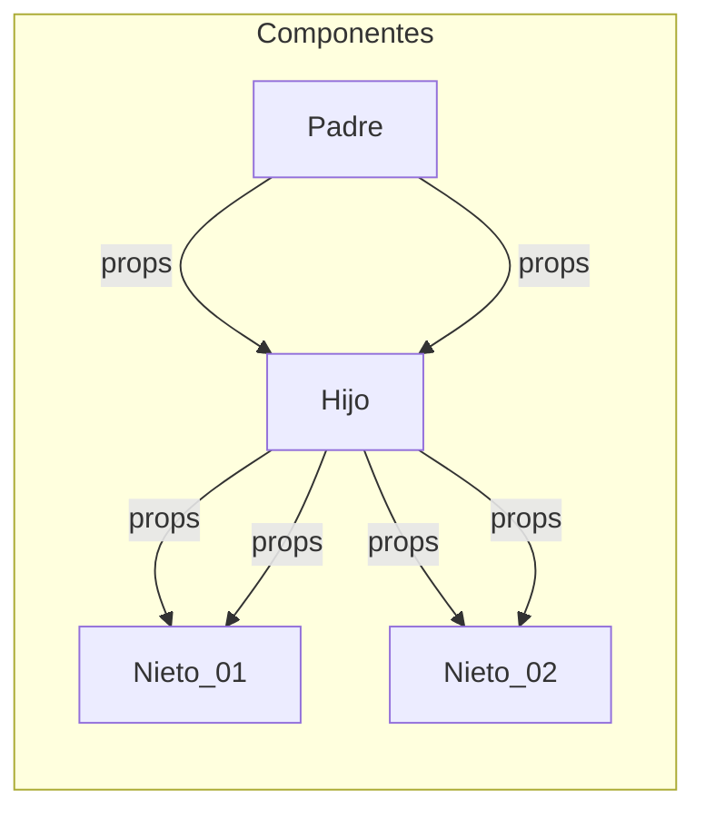

# React Desde Cero - Curso de React Con Proyectos

> Estefania Cassingena Navone  
> Inicio: `17-09-2023`  
> Final: ``


## 1. Conceptos básicos de React
### React 

**Biblioteca** de JavaScript de código abierto (open source) diseñada para crear interfaces de usuario. 

Biblioteca 
Conjunto de implementaciones o subprogramas que podemos usar en nuestro código. 

Ventajas  
- Fácil de aprender y usar.
- Componentes reutilizables.
- Crear aplicaciones dinámicas.
- Buen desempeño. 

#### Componente 

Parte de la interfaz de usuario que es independiente y reusable. 

- Funcionales: Conciso de leer e implementar   
	Función de JavaScript/ES6 que retorna un elemento de React (JSX)

```js  👀👇
function Saludo(props) { 👀👇
  return <h1>¡Hola, {props.nombre}!</h1>;
}
```  
	Caracteristicas: 
	- Debe retornar un elemento de React (JSX).
	- Debe comenzar con una letra mayúscula. 
	- Puede recibir valores si es necesario (props). 

#### Props:   

Argumentos que puede recibir un componente de React. Se usa la notación de `.` para poder acceder a las propiedades que le pasemos al componente `Saludo` esto debido a que se comporta como un objeto.

	📌 Los props solo pueden ser enviados de padre a hijo (cascada).



- De clase: Se usaba y se usa en la actualidad  
	Clase de ES6 (JavaScript moderno) que retorna un elemento JSX. 

```js         👀👇      👀👇
class Saludo extends React.Component {
  render() { 👀👈       👀👇
    return <h1>¡Hola, {this.props.nombre}!</h1>;
  }
}
```
	Caracteristicas: 
	- Debe extender React.Component.
	- Debe tener un método render() para retornar un elemento de JSX.
	- Puede recibir valores si es necesario (props). 

#### Estado (State): 

Representación en JavaScript del conjunto de propiedades de un componente y sus valores actuales. Propiedades no se refiere a los props, sino a información que se representa sobre el componente. 

¿Por qué Componentes de Clase?   
Anteriormente, usábamos componentes de clase para poder trabajar con "estados" de nuestro componente. 

En versiones anteriores de React (anteriores a 16.8), no podíamos hacerlo en componentes funcionales. 

Luego llegaron los `Hooks`...

Ahora sí podemos asignar y actualizar el estado de un componente funcional en React con los hooks. 

#### Hooks

Función especial que te permite trabajar con estados en componentes funcionales y otros aspectos de React. 

Esto sin escribir un componente de clase. Esto nos permite escribir código mucho más conciso y fácil de entender. 

#### Event Listener 

Función en JavaScript que es ejecutada cuando ocurre un evento específico. También podemos referirnos a esta función como "Event Handler" 


## 2. Descargar e instalar Node.js
## 3. JavaScript XML (JSX)
## 4. Estructura básica de una aplicación de React


## Proyecto 01: Clon de testimonios de freeCodeCamp

## Proyecto 02: Contador de clics 

## Proyecto 03: Calculadora 

## Proyecto 04: Aplicación de tareas 

## Componentes de clase 

## Adaptar los primeros dos proyectos con componentes de clase

### Clon de testimonios 

### Contador de clics 