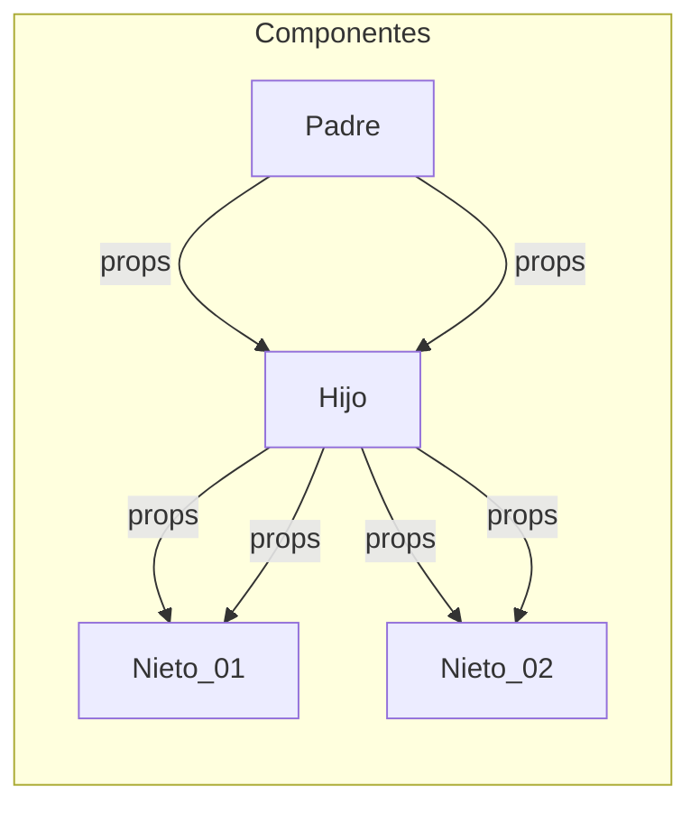
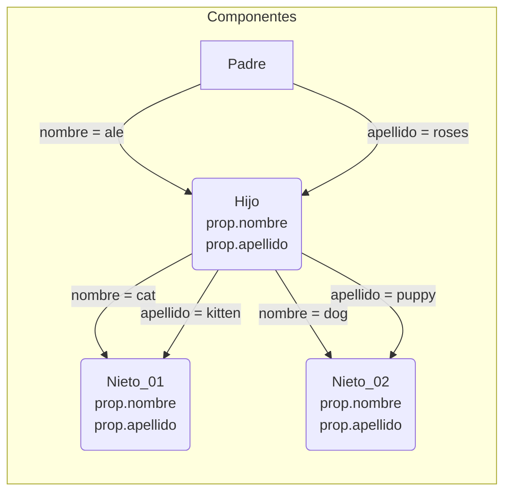
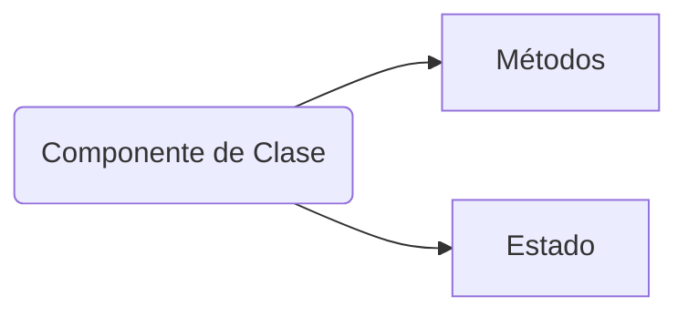

# React Desde Cero - Curso de React Con Proyectos

> Estefania Cassingena Navone  
> Inicio: `17-09-2023`  
> Final: `22-09-2023`

💻 Código en GitHub:  
- [Proyecto 1: ](https://github.com/estefaniacn/testimonios-freecodecamp) 
- [Proyecto 2:](https://github.com/estefaniacn/contador-de-clics-freecodecamp) 
- [Proyecto 3:](https://github.com/estefaniacn/calculadora-react-freecodecamp) 
- [Proyecto 4:](https://github.com/estefaniacn/aplicacion-tareas-react) 
- [Proyecto 1 Componentes de Clase :](https://github.com/estefaniacn/testimonios-freecodecamp-clase) 
- [Proyecto 2 Componentes de Clase:](https://github.com/estefaniacn/contador-de-clics-clase)

## 1. Conceptos básicos de React
### React 

**Biblioteca** de JavaScript de código abierto (open source) diseñada para crear interfaces de usuario. 

Biblioteca 
Conjunto de implementaciones o subprogramas que podemos usar en nuestro código. 

Ventajas  
- Fácil de aprender y usar.
- Componentes reutilizables.
- Crear aplicaciones dinámicas.
- Buen desempeño. 

### Componente 

Parte de la interfaz de usuario que es independiente y reusable. 

- Funcionales: Conciso de leer e implementar   
	Función de JavaScript/ES6 que retorna un elemento de React (JSX)

```js  👀👇
function Saludo(props) { 👀👇
  return <h1>¡Hola, {props.nombre}!</h1>;
}
```  
	Caracteristicas: 
	- Debe retornar un elemento de React (JSX).
	- Debe comenzar con una letra mayúscula. 
	- Puede recibir valores si es necesario (props). 

- De clase: Se usaba y se usa en la actualidad  
	Clase de ES6 (JavaScript moderno) que retorna un elemento JSX. 

```js         👀👇      👀👇
class Saludo extends React.Component {
  render() { 👈👀👆       👆👀👇
    return <h1>¡Hola, {this.props.nombre}!</h1>;
  }
}
```
	Caracteristicas: 
	- Debe extender React.Component.
	- Debe tener un método render() para retornar un elemento de JSX.
	- Puede recibir valores si es necesario (props). 

### Props:   

Argumentos que puede recibir un componente de React. Se usa la notación de `.` para poder acceder a las propiedades que le pasemos al componente `Saludo` esto debido a que se comporta como un objeto.

	📌 Los props solo pueden ser enviados de padre a hijo (cascada).





En React, cuando utilizas la sintaxis `prop.apellido` estás accediendo a una propiedad (prop) llamada "apellido" que ha sido pasada a ese componente como un dato desde su componente padre.

### Estado (State): 

Representación en JavaScript del conjunto de propiedades de un componente y sus **valores actuales**. Propiedades no se refiere a los props, sino a información que se representa sobre el componente. 

¿Por qué Componentes de Clase?   
Anteriormente, usábamos componentes de clase para poder trabajar con "estados" de nuestro componente. 

En versiones anteriores de React (anteriores a 16.8), no podíamos hacerlo en componentes funcionales. 

Luego llegaron los `Hooks`...

Ahora sí podemos asignar y actualizar el estado de un componente funcional en React con los hooks. 

### Hooks

Función especial que te permite trabajar con estados en componentes funcionales y otros aspectos de React. 

Esto sin escribir un componente de clase. Esto nos permite escribir código mucho más conciso y fácil de entender. 

### Event Listener 

Función en JavaScript que es ejecutada cuando ocurre un evento específico. También podemos referirnos a esta función como "Event Handler" 

## 2. Descargar e instalar Node.js

[Node.js](https://nodejs.org/es/download) es un entorno de ejecución para JavaScript construido con V8, motor de JavaScript de Chrome. 

Luego de hacer la instalación verifica la versión instalada: 

```bash
node -v
```

[Documentación de React](https://react.dev/)

## 3. JavaScript XML (JSX)

Extensión de React para la sintaxis de JavaScript.   
Nos permite describir en JavaScript cómo  se verán los componentes usando una estructura similar a HTML. 

Ventajas:  
- Estructura más fácil de visualizar.
- Errores y advertencias más útiles. 

📌 JSX en opcional. 

```jsx
const element = <h1>¡Hola, Mundo!</h1>;
```

```jsx
import React from 'react';
import '../hojas-estilo/Contador.css';

function Contador({ numClics }) {
  return (
    <div className="contador"> ✨😲
      {numClics}
    </div>
  );
}

export default Contador;
```

### Elemento

Unidades más pequeñas en React. Definen lo que se ve en la pantalla. 

	Elementos vs. Componentes   
	Los componentes en React están hechos de elementos JSX (div, h1, image). 

```jsx
// root es manejado por React DOM
<div id="root">¡Hola, Mundo!</div>;
```

	React DOM  
	Paquete que facilita la interacción y actualización del DOM en aplicaciones React. 

	DOM (Document Object Model)  
	Es una representación en el navegador de todos los elementos que conforman una página o aplicación web. 


	Con JSX, puedes crear y usar cualquier elemento HTML.   
	- <div>
	- 
	- <a>
	- <header>
	- <nav>
	- <p>
	- <h1>
	- <button>
	- <h2>

¿Cómo reconocerlos?  
En JSX, los elementos HTML se representan con etiquetas en letras **minúsculas**. 

En cambio, los componentes definidos por el usuario comienzan con una letra **mayúscula**. 

```jsx
<div className="contenedor">
  <Pantalla input={input}/>;
  <div className="fila">
    <Boton manejarClic={agregarInput}>1</Boton>;
    <Boton manejarClic={agregarInput}>2</Boton>;
    <Boton manejarClic={agregarInput}>3</Boton>;
  </div>
</div>;
```

	Atributos  
	Puedes agregar atributos a tus elementos en JSX para especificar ciertas características. Pero... algunos atributos se escriben de forma distinta si los comparamos con HTML. 

```html
  👀👇 HTML
<h1 class="titulo-azul"></h1>;
```

```jsx
   👀👇 JSX (camelCase)
<h1 className="titulo-azul"></h1>;
```

`class` es una palabra reservada en JavaScript que podemos usar para crear una clase. Por eso necesitamos escribir este atributo de forma distinta en JSX. 

```html
  👀👇 HTML
<label for="css">CSS</label>;
```

```jsx
   👀👇 JSX (camelCase)
<label htmlFor="css">CSS</label>;
```

El atributo `style` acepta un objeto JavaScript con propiedades CSS escritas en `camelCase`. 

```html
👀👇 CSS
background-image
background-color
font-family
```

```jsx
👀👇 JSX
backgroundImage
backgroundColor
fontFamily
```

Dando Styles directamente en JS

```jsx
// Objeto JavaScript {}
const estiloDiv = {
  color: 'yellow',
  backgroundColor: 'black'
}
```

```jsx
   👀👇
<div style={estiloDiv}>¡Hola, Mundo!</div>;
```

Otra alternativa... 

```jsx
   👀👇                  👀👇
<div style={{color: 'yellow'}}>¡Hola, Mundo!</div>;
```

📌 El primer par de llaves nos permite insertar JavaScript como en el caso anterior que insertamos una variable. El segundo par de llaves interno permite definir un objeto de JavaScript (CSS). 

### Atributos del DOM reconocidos por React

React reconoce y utiliza varios atributos del DOM para trabajar con componentes y gestionar su estado. Algunos de los atributos más comunes reconocidos por React son:

- `className` (equivalente a `class` en HTML): Se utiliza para asignar una clase CSS al elemento.
- `style`: Permite aplicar estilos en línea al elemento utilizando un objeto de estilos en JavaScript.
- `id`: Asigna un identificador único al elemento.
- `onClick`: Define una función que se ejecuta cuando el elemento es clicado.
- `onChange`: Define una función que se ejecuta cuando el valor del elemento cambia, como en los elementos de formulario.
- `disabled`: Deshabilita el elemento para evitar interacciones.
- `value`: Establece el valor del elemento, como en los campos de entrada (`input`) y áreas de texto (`textarea`).
- `placeholder`: Muestra un texto temporal en un campo de entrada o un área de texto hasta que se introduce un valor.
- `src`: Define la ruta o URL de la fuente de una imagen, video, audio, etc.
- `alt`: Proporciona texto alternativo para ser mostrado si el elemento no se puede visualizar.

A continuación, te presento una tabla clasificando los atributos del DOM reconocidos y utilizados por React:

|Clasificación|Atributos del DOM|
|---|---|
|Control de Formulario|accept, autoComplete, autoFocus, capture, checked, disabled, form, formAction, formEncType, formMethod, formNoValidate, formTarget, inputMode, max, maxLength, min, minLength, multiple, name, noValidate, pattern, placeholder, readOnly, required, size, step, value|
|Eventos|onClick, onChange, onDoubleClick, onFocus, onBlur, onKeyDown, onKeyUp, onKeyPress, onMouseEnter, onMouseLeave, onScroll|
|Presentación|className, style, hidden, id, tabIndex|
|Multimedia|alt, controls, crossOrigin, loop, muted, poster, preload, src|
|Enlaces|href, hrefLang, rel, target|
|Tablas|colSpan, headers, rowSpan, scope|
|Formato de Contenido|content, dir, lang, media, mediaGroup, spellCheck, title|
|Otros|accessKey, allowFullScreen, allowTransparency, async, cellPadding, cellSpacing, challenge, charSet, cite, contextMenu, coords, data, dateTime, defer, download, draggable, encType, frameBorder, height, high, httpEquiv, icon, inputMode, integrity, is, keyParams, keyType, kind, label, list, low, manifest, marginHeight, marginWidth, minLength, optimum, playsInline, profile, radioGroup, reversed, role, rows, sandbox, seamless, selected, shape, sizes, srcDoc, srcLang, srcSet, start, summary, type, useMap, width, wmode, wrap|

Esta tabla clasifica los atributos del DOM reconocidos por React en diferentes categorías según su funcionalidad. Cada atributo se encuentra asociado a la clasificación correspondiente.

## 4. Estructura básica de una aplicación de React

Al igual que en HTML, los elementos pueden ser anidados en JSX para formar estructuras más complejas. 

```jsx
<div className="contenedor">
  <Pantalla input={input}/>;
  <div className="fila">
    <Boton manejarClic={agregarInput}>1</Boton>;
    <Boton manejarClic={agregarInput}>2</Boton>;
    <Boton manejarClic={agregarInput}>3</Boton>;
  </div>
</div>;
```

### Renderizar componentes 

```jsx
// root es manejado por React DOM
<div id="root"></div>;
```

En la estructura inicial tendremos un archivo HTML que va a tener un `div` este elemento tendrá un `id="root"` que va a actuar como la raíz de nuestra aplicación, será el contenedor principal de todos los componentes y elementos que creemos. 

Para agregar elementos al `div` anterior lo podemos hacer de la siguiente manera: 

```jsx
Variable 👀👇 para referirnos al Paquete
import ReactDOM from 'react-dom'; 👈👀
// Elemento a mostrar
const element = <h1>¡Hola, Mundo!</h1>;

👀👇
ReactDOM.render(
  element,
  document.getElementById('root')
);
```

### Self-Closing Tags 

Elemento que solo posee una etiqueta de apertura, ya que no contiene texto u otros elementos. 

```jsx
;
```

### JavaScript en JSX

Cuando veamos las llaves `{JS}` inmediatamente debemos pensar que dentro tenemos código JavaScript. 

```jsx
let adjetivo = "Interesante";
<p>React es {adjetivo}</p>;
```

Puedes escribir cualquier expresión válida de JavaScript entre las llaves y su valor será reemplazado. 

```jsx
<p>El resultado es: {5 * 6}</p>;
```

Usando métodos:  
```jsx
let nombre = "Ale";
<p>Su nombre es: {nombre.toUpperCase()}</p>;
```

## Proyecto 01: Clon de testimonios de freeCodeCamp

`Arrastra` la carpeta en donde vas a trabajar los proyectos y `suéltala` dentro de una ventana de Visual Studio Code totalmente limpia. También puedes ubicar la carpeta en la que vas a trabajar y darle clic derecho `Abrir con Code`. 

Abrimos la terminal `Ctrl + ñ` de Visual Studio Code y ejecutamos:    

```bash
// Crea una nueva carpeta para el proyecto
npx create-react-app mi-app

// Crea el proyecto en la misma carpeta
npx create-react-app .
```

Al finalizar te debe salir el siguiente mensaje: 

```bash
Success! Created my-app at C:\react\freeCodeCamp\my-app
Inside that directory, you can run several commands:

  npm start 👈👀✨
    Starts the development server.

  npm run build
    Bundles the app into static files for production.

  npm test
    Starts the test runner.      

  npm run eject
    Removes this tool and copies 
build dependencies, configuration files
    and scripts into the app directory. If you do this, you can’t go back!

We suggest that you begin by typing:

  cd my-app 👈👀✨
  npm start 👈👀✨

Happy hacking!
```

Ahora desde la terminal nos movemos a la carpeta creada, la cual tiene nuestro proyecto inicial y lo abrimos con Visual Studio Code. 

```bash
cd my-app/
code ./ -r
```

Ahora, debes ver la siguiente estructura de carpetas y archivos: 

```bash
├── node_modules
├── package-lock.json
├── package.json
├── public
│   ├── favicon.ico
│   ├── index.html 👈👀✨
│   ├── logo192.png
│   ├── logo512.png
│   ├── manifest.json
│   └── robots.txt
└── src
    ├── App.css
    ├── App.js
    ├── App.test.js
    ├── index.css
    ├── index.js
    ├── logo.svg
    ├── reportWebVitals.js
    └── setupTests.js
```

Veamos que tiene nuestro proyecto:  
```bash
npm start
```

Esto abrirá nuestro proyecto en el navegador usando `localhost:3000` esto quiere decir que nuestra PC está actuando como un servidor local para poder acceder a los archivos de la aplicación y mostrar sus resultados. 

Puedes ver más sobre el contenido de los archivos de nuestro proyecto en estos apuntes hechos anteriormente: 

[Carpetas y Archivos de la clase](https://github.com/aleroses/Platzi/blob/master/DW/3-avanzado/1.react.js/react.js.md#carpetas-y-archivos-de-la-clase)

### Empezar proyecto de testimonios 

Tengo la siguiente estructura y dentro de la carpeta `freeCodeCamp` crearé un nuevo proyecto y al final se verá algo así. 

```bash
.
├── freeCodeCamp
│   └── my-app
│   └── testimony 👈👀✨
```

Creamos el proyecto: 
```bash
npx create-react-app testimony 👈👀
cd testimony/
code ./ -r
```

### Identificar los Componentes

Creamos algunos archivos como `src > components > Testimony.js` y `src > imagenes` a la que le agregamos las imágenes a usar, estas las podemos descargar aquí [repo: testimonios-freecodecamp](https://github.com/estefaniacn/testimonios-freecodecamp/tree/master/src/imagenes).

Debemos tener los siguientes archivos:  
```bash
.
├── node_modules
├── package-lock.json
├── package.json
├── public
│   ├── index.html
│   ├── manifest.json
│   └── robots.txt
└── src
    ├── App.css
    ├── App.js
    ├── components 👈👀👇
    │   └── Testimony.js
    ├── imagenes 👈👀👇
    │   ├── testimonio-emma.png
    │   ├── testimonio-sarah.png
    │   └── testimonio-shawn.png
    ├── index.css
    ├── index.js
    └── stylesheets 👈👀👇
        └── Testimonio.css
```

Ejecutamos el proyecto:  
```bash
npm start
```

#### ✨ Configurar Indentación o Espaciado:    

Presiona `F1` busca la opción `Indent Using Spaces` y elige `2`. También puedes acceder desde la parte inferior del editor, aparece `Space: 4` le das clic y cambias a `2`, ya que es un estándar. 

Adicional puedes buscar `Convert Indentation to Spaces` para que cada indentación hecha con el tabulador se transforme a espacios, en este caso a 2 espacios. Esto nos ayuda a que no se distorsione el código cuando lo subamos a GitHub. 

#### Extensión React Developer Tools

Utiliza las Herramientas de Desarrollo de React (React Developer Tools) **para inspeccionar componentes de React, editar props y estado, e identificar problemas de rendimiento**.

[Extensión React Developer Tools](https://chrome.google.com/webstore/detail/react-developer-tools/fmkadmapgofadopljbjfkapdkoienihi?hl=es)


📌 La extensión en los archivos `jsx` es igual a `js`, no hay diferencia.


### Código del proyecto Testimonios 

`public > index.html`   
```html
<body>
  <noscript>You need to enable JavaScript to run this app.</noscript>
  <div id="root"></div> 👈👀
</body>
```

`src > index.js`
```jsx
import React from "react";
import ReactDOM from "react-dom/client";
import "./index.css";
import App from "./App";

const root = ReactDOM.createRoot(document.getElementById("root"));
root.render(
  <React.StrictMode>
    <App /> 👈👀 // Componente
  </React.StrictMode>
);
```

`src > App.js`
```jsx
import "./App.css";
// Puedes agregar u omitir la extensión.js 👈👀👇
import { Testimonio } from "./components/Testimony";

function App() { 👈👀 // Componente usado en el index.js
  return (
    <div className="App">
      <h1>Esto es lo que dicen nuestros alumnos sobre FreeCodeCamp:</h1>
      <div className="contenedor-principal">
        <Testimonio
          nombre="Shawn Wang"
          pais="Singapur"
          imagen="shawn"
          cargo="Ingeniero de Software"
          empresa="Amazon"
          testimonio="Da miedo cambiar de carrera. Solo gané la confianza de que podía programar trabajando a través de los cientos de horas de lecciones gratuitas en freeCodeCamp. Dentro de un año tuve un trabajo de seis cifras como ingeniero de software. freeCodeCamp cambió mi vida."
        />
        <Testimonio
          nombre="Sarah Chima"
          pais="Nigeria"
          imagen="sarah"
          cargo="Ingeniera de Software"
          empresa="ChatDesk"
          testimonio="FreeCodeCamp fue la puerta de entrada a mi carrera como desarrollador de software. El plan de estudios bien estructurado llevó mis conocimientos de programación de un nivel de principiante total a un nivel muy seguro. Era todo lo que necesitaba para conseguir mi primer trabajo de desarrollador en una empresa increíble."
        />
        <Testimonio
          nombre="Emma Bostian"
          pais="Suecia"
          imagen="emma"
          cargo="Ingeniero de Software"
          empresa="Spotify"
          testimonio="Siempre he tenido problemas para aprender JavaScript. He tomado muchos cursos, pero el curso de freeCodeCamp fue el que se quedó. Estudiar JavaScript, así como estructuras de datos y algoritmos en freeCodeCamp me dio las habilidades y la confianza que necesitaba para conseguir el trabajo de mis sueños como ingeniero de software en Spotify."
        />
      </div>
    </div>
  );
}

export default App;
```

`src > components > Testimony.js`
```jsx
import React from "react";
import "../stylesheets/Testimonio.css";

// export function Testimonio(){} 👈👀 también se puede
function Testimonio(props) {
  return (
    <div className="contenedor-testimonio">
      
      <div className="contenedor-texto-testimonio">
        <p className="nombre-testimonio">
          <strong>{props.nombre}</strong> en {props.pais}
        </p>
        <p className="cargo-testimonio">
          {props.cargo} en <strong>{props.empresa}</strong>
        </p>
        <p className="texto-testimonio">"{props.testimonio}"</p>
      </div>
    </div>
  );
}

// Exportación por defecto
// export default Testimonio; 👈👀

// Exportación nombrada
export { Testimonio }; 👈👀

```

☘ Reto: Separar los datos o testimonios, quizá en un objeto `{ }` o array `[ ]` en su propio archivo y por último actualizar el `alt` de cada imagen según corresponda. 

## Proyecto 02: Contador de clics 

```bash
pwd
  /c/react/freeCodeCamp 👈👀
npx create-react-app click-contador
cd click-contador
code ./ -r
ctrl + ñ 👈👀✨
npm start
```

📌 Para matar un proceso en la CLI, usar `Ctrl + c`.

Ahora debemos importar la imagen a usar, pero primero la descargamos de [repo: contador-de-clicks](https://github.com/estefaniacn/contador-de-clics-freecodecamp/blob/master/src/imagenes/freecodecamp-logo.png)

### Código 

Para este proyecto necesitamos la siguiente estructura: 

```bash
.
├── node_modules
├── package-lock.json
├── package.json
├── public
│   ├── index.html
│   ├── manifest.json
│   └── robots.txt
└── src
    ├── App.css
    ├── App.js
    ├── components 👈👀👇
    │   ├── Button.js
    │   └── Contador.js
    ├── images 👈👀👇
    │   └── freecodecamp-logo.png
    ├── index.css
    ├── index.js
    └── stylesheets 👈👀👇
        ├── Contador.css
        └── Button.css
```

`public > index.html`  

```html
<body>
  <noscript>You need to enable JavaScript to run this app.</noscript>
  <div id="root"></div> 👈👀✨
</body>
```

`src > index.js > `
```jsx
import React from "react";
import ReactDOM from "react-dom/client";
import "./index.css";
import App from "./App";

const root = ReactDOM.createRoot(document.getElementById("root")); 👈👀
root.render(
  <React.StrictMode>
    <App /> 👈👀
  </React.StrictMode>
);
```

`src > App.js`  
```jsx
import "./App.css";
import { Button } from "./components/Button";
import { Contador } from "./components/Contador";
import freeCodeCampLogo from "./images/freecodecamp-logo.png";
import { useState } from "react";

function App() {
  const [numClics, setNumClics] = useState(0);

  const manejarClic = () => {
    setNumClics(numClics + 1);
  };

  const reiniciarContador = () => {
    setNumClics(0)
  };

  return (
    <div className="App">
      <div className="freecodecamp-logo-contenedor">
        
      </div>
      <div className="contenedor-principal">
        <Contador numClics={numClics} />
        <Button texto="Clic" esBotonDeClic={true} manejarClic={manejarClic} />
        <Button
          texto="Reiniciar"
          esBotonDeClic={false}
          manejarClic={reiniciarContador}
        />
      </div>
    </div>
  );
}

export default App;
```

`src > components > Contador.js`
```jsx
import React from "react";
import "../stylesheets/Contador.css";

function Contador({ numClics }) {
  return <div className="contador">{numClics}</div>;
}

export { Contador };
```

`src > components > Button.js`
```jsx
import React from "react";
import '../stylesheets/Button.css'

function Button({ texto, esBotonDeClic, manejarClic }) {
  return (
    <button
      className={esBotonDeClic ? "boton-clic" : "boton-reiniciar"}
      onClick={manejarClic}
    >
      {texto}
    </button>
  );
}

export { Button };
```

### Nombrar eventos y funciones 

En React, hay algunas convenciones comunes para nombrar eventos y las funciones que manejan esos eventos. Aquí tienes algunas convenciones populares:

1. Eventos: Los nombres de los eventos se escriben en minúsculas y siguen la convención camelCase. Por ejemplo, "onClick", "onChange", "onSubmit", etc.

2. Funciones manejadoras de eventos: Las funciones que manejan los eventos generalmente se nombran utilizando el prefijo "handle" seguido del nombre del evento en camelCase. Por ejemplo, "handleClick", "handleChange", "handleSubmit", etc.

3. Eventos en componentes: Cuando agregas un controlador de eventos a un elemento en un componente, generalmente se utiliza la forma abreviada de la sintaxis de arrow function o se enlaza el contexto en el constructor o mediante la función `bind`. Por ejemplo:

```jsx
class MyComponent extends React.Component {
  handleClick = () => {
    // Lógica del evento
  }

  render() {
    return (
      <button onClick={this.handleClick}>Click aquí</button>
    );
  }
}
```

Estas convenciones no son obligatorias, pero son ampliamente utilizadas y ayudan a mantener un código más legible y consistente en proyectos de React. Recuerda que lo más importante es mantener una convención que se ajuste a tu equipo y ser coherente en su aplicación a lo largo del código.

### Prettier (extensión)

Para agregar automáticamente los puntos y comas al guardar usando `Ctrl + s` puedes usar **Prettier**. Además, permite personalizar algunas otras cosas, te dejo mis [Apuntes Prettier](https://github.com/aleroses/Platzi/blob/master/DW/1-basico/3-prework/entorno-windows/vsc/prettier.md)

### `import React from "react";`

En versiones actuales de React ya no es necesario el `import React from "react";` solo debemos importar los hooks que vayamos a usar. 

## Proyecto 03: Calculadora 

```bash
cd ..
npx create-react-app calculator
cd calculator/
code ./ -r
npm start
```

### `isNaN` 

En JavaScript, la función `isNaN` se utiliza para comprobar si un valor es NaN (Not-a-Number) o no. NaN es un valor especial en JavaScript que representa la falta de un valor numérico válido.

La sintaxis de `isNaN` es la siguiente:

```javascript
isNaN(valor)
```

Donde `valor` es el valor que se desea comprobar si es NaN o no.

La función `isNaN` devuelve `true` si el valor pasado como argumento es NaN, y devuelve `false` si el valor es un número válido o cualquier otro tipo de dato.

Aquí tienes algunos ejemplos de cómo se puede utilizar `isNaN`:

```javascript
console.log(isNaN(123));        // false, 123 es un número válido
console.log(isNaN('456'));      // false, '456' se puede convertir a un número
console.log(isNaN('abc'));      // true, 'abc' no se puede convertir a un número
console.log(isNaN(true));       // false, true se convierte a 1, que es un número válido
console.log(isNaN(undefined));  // true, undefined no se puede convertir a un número
console.log(isNaN(null));       // false, null se convierte a 0, que es un número válido
```

Es importante tener en cuenta que `isNaN` intentará convertir el valor a un número antes de realizar la comprobación. Si el valor no se puede convertir a un número, se considerará como NaN.

### Propiedad `flex`

La propiedad `flex` admite diferentes combinaciones de valores. La forma completa de la propiedad `flex` es la siguiente:

```css
flex: <flex-grow> <flex-shrink> <flex-basis>;
```

Aquí tienes una descripción de cada valor:

- `<flex-grow>`: Define cómo se distribuye el espacio adicional entre los elementos flex. Es un número que indica la proporción en la que el elemento debe crecer en relación con los demás elementos flex. Por ejemplo, si un elemento tiene `flex-grow: 2` y otro tiene `flex-grow: 1`, el primero crecerá el doble que el segundo cuando haya espacio disponible.

- `<flex-shrink>`: Indica cómo se reduce el tamaño de los elementos flex cuando el espacio disponible es insuficiente. Es un número que determina la proporción en la que el elemento debe encogerse en relación con los demás elementos flex. Por ejemplo, si un elemento tiene `flex-shrink: 2` y otro tiene `flex-shrink: 1`, el primero se reducirá el doble que el segundo cuando no haya suficiente espacio.

- `<flex-basis>`: Establece el tamaño inicial del elemento antes de que se distribuya el espacio adicional o se reduzca su tamaño. Puede ser un valor en píxeles (`px`), porcentaje (`%`), `auto` u otros valores válidos para dimensiones CSS. Por defecto, es `auto`, lo que significa que el tamaño se determina según el contenido del elemento.

Por lo tanto, `flex: 1 1` es una forma abreviada de establecer tanto `flex-grow` como `flex-shrink` en 1, mientras que `flex-basis` se deja en su valor predeterminado (`auto`). Esto es útil cuando se desea que los elementos flex se expandan y se contraigan de manera equitativa.

Sin embargo, también puedes especificar valores diferentes para `flex-grow`, `flex-shrink` y `flex-basis` según tus necesidades. Por ejemplo:

```css
.container {
  display: flex;
}

.item {
  flex: 2 0 100px;
}
```

En este caso, el elemento tendrá un `flex-grow` de 2, un `flex-shrink` de 0 y un `flex-basis` de 100 píxeles.

Recuerda que `flex: 1 1` es simplemente una opción común y conveniente para establecer valores iguales para `flex-grow` y `flex-shrink` sin especificar `flex-basis`. Sin embargo, puedes personalizar los valores según tus requisitos específicos.

### Método `trimEnd()` 

El método `trimEnd()` es una función incorporada en JavaScript que se utiliza para eliminar los espacios en blanco al final de una cadena de texto. Devuelve una nueva cadena de texto con los espacios en blanco finales eliminados.

Aquí tienes un ejemplo de cómo funciona `trimEnd()`:

```javascript
const texto = 'Hola Mundo    ';
const textoSinEspacios = texto.trimEnd();

console.log(textoSinEspacios); // Resultado: 'Hola Mundo'
```

En este ejemplo, tenemos una cadena de texto llamada `texto` que contiene espacios en blanco al final. Al llamar a `trimEnd()` en la cadena de texto, se crea una nueva cadena de texto llamada `textoSinEspacios` en la que se eliminan los espacios en blanco finales.

Es importante destacar que `trimEnd()` no modifica la cadena de texto original, sino que devuelve una nueva cadena de texto con los espacios en blanco eliminados. Si deseas modificar la cadena original, debes asignar el resultado de `trimEnd()` a una variable o reasignarla.

Es importante tener en cuenta que `trimEnd()` está disponible a partir de ECMAScript 2019 (ES10) y no es compatible con versiones anteriores de JavaScript. Sin embargo, existe una alternativa para versiones anteriores llamada `trimRight()`, que realiza la misma función de eliminar espacios en blanco finales.

```javascript
const texto = 'Hola Mundo    ';
const textoSinEspacios = texto.trimRight();

console.log(textoSinEspacios); // Resultado: 'Hola Mundo'
```

En resumen, `trimEnd()` es un método en JavaScript que elimina los espacios en blanco al final de una cadena de texto y devuelve una nueva cadena sin esos espacios.

### `onClick(() => {})`

En React, el evento `onClick` **espera recibir una función** como valor para poder ser ejecutado correctamente. Este se utiliza para asignar un controlador de eventos al elemento, como un botón, y especificar qué acción debe realizarse cuando se produce el evento de clic.

Aquí tienes un ejemplo de cómo se utiliza `onClick` con una función:

```jsx
function ButtonComponent() {
  const handleClick = () => {
    console.log('Se hizo clic en el botón');
  };

  return (
    <button onClick={handleClick}>
      Haz clic aquí
    </button>
  );
}
```

En este caso, `handleClick` es una función que se ejecutará cuando se haga clic en el botón. Al pasar `handleClick` como valor del evento `onClick`, se establece el controlador de eventos adecuado para ese elemento.

Si se pasa cualquier cosa que no sea una función como valor del prop `onClick`, no se generará un error en tiempo de compilación, pero el evento de clic no realizará ninguna acción. Por ejemplo:

```jsx
function ButtonComponent() {
  const handleClick = () => {
    console.log('Se hizo clic en el botón');
  };

  return (
    <button onClick={'no es una función'}>
      Haz clic aquí
    </button>
  );
}
```

En este caso, al pasar `'no es una función'` como valor de `onClick`, no se producirá ningún error, pero al hacer clic en el botón no se ejecutará ninguna acción.

En resumen, para que `onClick` funcione correctamente, se debe pasar una función como valor para que pueda ser ejecutada cuando ocurra el evento de clic.

### Propiedad `user-select `

La propiedad CSS `user-select` se utiliza para controlar si los usuarios pueden seleccionar texto en elementos HTML y cómo se puede realizar la selección. Esta propiedad es útil cuando deseas restringir o permitir la selección de texto en ciertas partes de tu página web.

La sintaxis básica del `user-select` es la siguiente:

```css
elemento {
  user-select: valor;
}
```

Donde `elemento` es el selector del elemento HTML al que deseas aplicar la propiedad `user-select`, y `valor` es uno de los siguientes:

- `none`: No se permite la selección de texto dentro del elemento ni sus descendientes. El texto no se puede resaltar ni copiar.

- `auto`: La selección de texto está permitida dentro del elemento y sus descendientes. Es el valor predeterminado del navegador.

- `text`: Se permite la selección de texto dentro del elemento y sus descendientes. El texto se puede resaltar y copiar.

- `all`: Se permite la selección de texto dentro del elemento y sus descendientes. Además, el texto se resalta de manera visualmente distintiva para indicar que se puede seleccionar.

Aquí tienes un ejemplo de cómo se puede utilizar `user-select` en CSS:

```css
p {
  user-select: none;
}

div.highlightable {
  user-select: text;
}

span.select-all {
  user-select: all;
}
```

En este ejemplo, los elementos `p` tienen la selección de texto desactivada (`user-select: none`). Los elementos `div` con la clase `.highlightable` permiten la selección de texto (`user-select: text`). Y los elementos `span` con la clase `.select-all` no solo permiten la selección de texto, sino que también resaltan visualmente el texto seleccionable (`user-select: all`).

Es importante destacar que la propiedad `user-select` no brinda una protección de seguridad real contra la copia de contenido. Es posible que los usuarios avanzados o aquellos que deshabiliten los estilos CSS puedan seleccionar el texto independientemente de la configuración de `user-select`.

### Biblioteca Math.js

Math.js es una biblioteca matemática de JavaScript de código abierto que proporciona una amplia gama de funciones y utilidades para realizar operaciones matemáticas y manipular estructuras de datos matemáticas complejas. Permite realizar cálculos matemáticos avanzados en JavaScript de manera sencilla y eficiente.

Para usar Math.js en tu proyecto, debes seguir estos pasos:

1. Instalación: Puedes instalar Math.js a través de npm (Node Package Manager) ejecutando el siguiente comando en tu terminal:

   ```bash
   npm install mathjs
   ```

	Esto instalará la biblioteca Math.js y sus dependencias en tu proyecto. Para verificar la instalación, revisa el archivo `package.json > "dependencies" {"mathjs": "^11.11.1"}` 

2. Importación: Después de instalar Math.js, debes importarlo en tu archivo JavaScript para poder utilizarlo (En React se importa distinto). Puedes hacerlo de la siguiente manera:

   ```javascript
   const math = require('mathjs');
   ```

	Si estás utilizando un entorno de desarrollo moderno que admite módulos ES6, puedes utilizar la importación de ES6:

   ```javascript
   import math from 'mathjs';
   ```

3. Uso de funciones y expresiones: Una vez que hayas importado Math.js, puedes utilizar sus funciones y expresiones matemáticas en tu código. Por ejemplo:

   ```javascript
   const resultado = math.sqrt(16);
   console.log(resultado); // Resultado: 4
   ```

    En este ejemplo, se utiliza la función `sqrt()` de Math.js para calcular la raíz cuadrada de `16` y se almacena el resultado en la variable `resultado`. Luego, se muestra el resultado en la consola.

4. Personalización y configuración: Math.js permite personalizar su comportamiento y configuración según tus necesidades. Puedes ajustar la precisión, el redondeo, el número de decimales, entre otras configuraciones. 

[Documentación](https://mathjs.org/ )

### Función `evaluate`en Math.js

En la biblioteca Math.js, la función `evaluate` se utiliza para evaluar expresiones matemáticas en forma de cadenas de texto. Toma una cadena de texto que contiene una expresión matemática y devuelve el resultado de evaluar dicha expresión.

Aquí tienes algunos ejemplos de cómo se utiliza `evaluate` en Math.js:

```javascript
const math = require('mathjs');

// Ejemplo 1: Evaluación básica
const resultado1 = math.evaluate('2 + 3 * 4'); 
console.log(resultado1); // Resultado: 14

// Ejemplo 2: Uso de funciones y constantes
const resultado2 = math.evaluate('sin(45 deg) * pi');
console.log(resultado2); // Resultado: 3.141592653589793

// Ejemplo 3: Evaluación con variables
const x = 5;
const y = 2;
const resultado3 = math.evaluate('x^2 + y', { x, y });
console.log(resultado3); // Resultado: 27

// Ejemplo 4: Evaluación de una expresión con asignación y reutilización de variables
const expresion = 'a = 3; b = 4; a * b';
const resultado4 = math.evaluate(expresion);
console.log(resultado4); // Resultado: 12
```

En el primer ejemplo, se evalúa la expresión matemática `'2 + 3 * 4'`, que devuelve el resultado `14`. En el segundo ejemplo, se utiliza la función `sin` que devuelve el seno de un número y la constante `pi` para evaluar la expresión `'sin(45 deg) * pi'`, que devuelve el resultado `3.141592653589793`.

En el tercer ejemplo, se muestra cómo se pueden utilizar variables en la expresión. Se define `x` y `y` y se evalúa la expresión `'x^2 + y'`, que devuelve el resultado `27`.

En el cuarto ejemplo, se muestra cómo se puede utilizar `evaluate` para ejecutar una secuencia de instrucciones. La cadena de texto `'a = 3; b = 4; a * b'` asigna valores a las variables `a` y `b` y luego devuelve el resultado de la multiplicación `a * b`, que es `12`.


### Código 

Estructura del proyecto:  
```bash
.
├── node_modules
├── package-lock.json
├── package.json
├── public
│   ├── index.html
│   ├── manifest.json
│   └── robots.txt
└── src
    ├── App.css
    ├── App.js
    ├── components 👈👀👇
    │   ├── Button.js
    │   ├── ClearButton.js
    │   └── Screen.js
    ├── images 👈👀👇
    │   └── freecodecamp-logo.png
    ├── index.css
    ├── index.js
    └── stylesheets 👈👀👇
        ├── Button.css
        ├── ClearButton.css
        └── Screen.css
```

`public > index.html`
```html
<body>
  <noscript>You need to enable JavaScript to run this app.</noscript>
  <div id="root"></div>
</body>
```

`src > index.js`
```jsx
import React from "react";
import ReactDOM from "react-dom/client";
import "./index.css";
import App from "./App";

const root = ReactDOM.createRoot(document.getElementById("root"));
root.render(
  <React.StrictMode>
    <App />
  </React.StrictMode>
);
```

`src > App.js`
```jsx
import "./App.css";
import { Button } from "./components/Button";
import { Pantalla } from "./components/Screen";
import freeCodeCampLogo from "./images/freecodecamp-logo.png";
import { BotonClear } from "./components/ClearButton";
import { useState } from "react";
import { evaluate } from "mathjs"; //👈👀

function App() {
  const [input, setInput] = useState("");

  const agregarInput = (val) => {
    setInput(input + val);
  };

  const calcularResultado = () => {
    if (input) {
      setInput(evaluate(input));
    } else {
      alert('Ingrese valores para hacer el cálculo!!')
    }
  };

  return (
    <div className="App">
      <div className="freecodecamp-logo-contenedor">
        
      </div>
      <div className="contenedor-calculadora">
        <Pantalla input={input} />
        <div className="fila">
          <Button manejarClic={agregarInput}>1</Button>
          <Button manejarClic={agregarInput}>2</Button>
          <Button manejarClic={agregarInput}>3</Button>
          <Button manejarClic={agregarInput}>+</Button>
        </div>
        <div className="fila">
          <Button manejarClic={agregarInput}>4</Button>
          <Button manejarClic={agregarInput}>5</Button>
          <Button manejarClic={agregarInput}>6</Button>
          <Button manejarClic={agregarInput}>-</Button>
        </div>
        <div className="fila">
          <Button manejarClic={agregarInput}>7</Button>
          <Button manejarClic={agregarInput}>8</Button>
          <Button manejarClic={agregarInput}>9</Button>
          <Button manejarClic={agregarInput}>*</Button>
        </div>
        <div className="fila">
          <Button manejarClic={calcularResultado}>=</Button>
          <Button manejarClic={agregarInput}>0</Button>
          <Button manejarClic={agregarInput}>.</Button>
          <Button manejarClic={agregarInput}>/</Button>
        </div>
        <div className="fila">
          <BotonClear manejarClear={() => setInput("")}>
            Clear
          </BotonClear>
        </div>
      </div>
    </div>
  );
}

export default App;
```

`src > components > Screen.js`
```jsx
import React from "react";
import "../stylesheets/Screen.css";

const Pantalla = ({ input }) => (
  <div className="input">{input}</div>
);

export { Pantalla };
```

`src > components > Button.js`
```jsx
import React from "react";
import "../stylesheets/Button.css";

function Button(props) {
  const esOperador = (valor) => {
    // 2 = false; + = true;
    return isNaN(valor) && valor !== "." && valor !== "=";
  };

  return (
    <button
      className={`boton-contenedor ${
        esOperador(props.children) ? "operador" : ""
      }`.trimEnd()}
      onClick={() => props.manejarClic(props.children)}
    >
      {props.children}
    </button>
  );
}

export { Button };
```

`src > components > ClearButton.js`
```jsx
import React from "react";
import "../stylesheets/ClearButton.css";

const BotonClear = (props) => (
  <div className="boton-clear" onClick={props.manejarClear}>
    {props.children}
  </div>
);

export { BotonClear };
```

## Proyecto 04: Aplicación de tareas 

```bash
cd ..
pwd
  /c/react/freeCodeCamp 👈👀
npx create-react-app tasks
cd tasks
code ./ -r
ctrl + ñ
npm start
```

### React Icons

React Icons es una biblioteca de iconos diseñada específicamente para su uso con React. Proporciona una amplia gama de iconos populares y reconocibles que se pueden utilizar en tus aplicaciones React sin necesidad de importar imágenes o utilizar fuentes externas.

La ventaja principal de React Icons es que los iconos se representan como componentes React reutilizables, lo que significa que puedes utilizarlos fácilmente en tu código JSX. Esto facilita su integración y personalización, ya que puedes ajustar su tamaño, color y otros estilos aplicando las propiedades de React.

Para empezar a usar React Icons, debes seguir estos pasos:

1. Instalar React Icons: En tu proyecto React, abre una terminal y ejecuta el siguiente comando para instalar React Icons utilizando npm (Node Package Manager):
```bash
// No agrega una entrada específica en el archivo `package.json`.
npm install react-icons

// Agrega una entrada en el archivo `package.json` con la versión específica
npm install react-icons --save
```
O si estás utilizando Yarn, puedes ejecutar:
```bash
yarn add react-icons
```

Revisa el archivo `package.json` `"dependencies": {"react-icons": "^4.11.0"}`

2. Importar los iconos necesarios: En el archivo donde deseas utilizar los iconos, importa los iconos específicos que necesitas. Por ejemplo, si deseas utilizar el icono de corazón, puedes importarlo de la siguiente manera:
```jsx
import { FaHeart } from 'react-icons/fa';
```

3. Utilizar los iconos en tu componente: Después de importar el icono, puedes utilizarlo en tu componente JSX como cualquier otro componente de React. Por ejemplo:
```jsx
import { FaHeart } from 'react-icons/fa';

function MiComponente() {
  return (
    <div>
      <h1>¡Me gusta este icono!</h1>
      <FaHeart />
    </div>
  );
}
```
En este caso, el icono de corazón se muestra dentro del componente `MiComponente`.

4. Personalizar los iconos (opcional): Si deseas personalizar los iconos, puedes hacerlo ajustando las propiedades de los componentes de icono. Por ejemplo, puedes cambiar el tamaño o el color del icono utilizando las propiedades de estilo de React.

En resumen, React Icons es una biblioteca útil para agregar iconos a tus aplicaciones React de manera sencilla. Solo necesitas importar los iconos necesarios y utilizarlos como componentes en tu código JSX. Recuerda consultar la documentación de React Icons para conocer todos los iconos disponibles y las opciones de personalización.

[Documentación](https://react-icons.github.io/react-icons/)


### Propiedad `outline`

La propiedad CSS `outline` se utiliza para agregar un contorno alrededor de un elemento, como un borde visible pero que no ocupa espacio adicional en el diseño. A diferencia de la propiedad `border`, el `outline` no afecta el tamaño o la posición de un elemento.

La sintaxis básica de la propiedad `outline` es la siguiente:

```css
outline: [ancho] [estilo] [color];
```

- `[ancho]` define el grosor del contorno. Puede ser un valor en píxeles (`px`), porcentaje (`%`), `thin`, `medium` o `thick`. Si omites este valor, se utilizará el valor predeterminado del navegador.
- `[estilo]` define el estilo del contorno. Puede ser `dotted` (punteado), `dashed` (guionado), `solid` (sólido), `double` (doble), `groove` (ranurado), `ridge` (en relieve), `inset` (hundido), `outset` (sobresalido) o `none` (ninguno). El valor predeterminado es `none`. 👈👀
- `[color]` define el color del contorno. Puede ser cualquier valor de color válido (nombre del color, código hexadecimal, `rgb()`, `rgba()`, etc.). Si omites este valor, se utilizará el color predeterminado del navegador.

Ejemplo de uso de `outline`:

```css
div {
  outline: 2px dotted red;
}
```

En este ejemplo, se aplicará un contorno de 2 píxeles de grosor, estilo punteado y color rojo alrededor de todos los elementos `<div>`.

Es importante tener en cuenta que la propiedad `outline` no es parte del modelo de caja de CSS y, por lo tanto, no afecta el flujo o el diseño de los elementos. Además, el `outline` no es compatible con todas las propiedades de `border`, como `border-radius` o `border-image`.

### Propiedad `text-transform`

La propiedad CSS `text-transform` se utiliza para controlar la transformación del texto en un elemento. Permite cambiar la capitalización y el aspecto del texto sin modificar el contenido real.

La sintaxis básica de la propiedad `text-transform` es la siguiente:

```css
text-transform: valor;
```

Los valores comunes para `text-transform` son:

- `none`: No se aplica ninguna transformación al texto. El valor predeterminado.
- `capitalize`: Transforma la primera letra de cada palabra en mayúscula y las demás letras en minúscula. 👈👀
- `uppercase`: Transforma todo el texto en letras mayúsculas.
- `lowercase`: Transforma todo el texto en letras minúsculas.
- `full-width`: Transforma el texto en caracteres de ancho completo, como los utilizados en los caracteres chinos o japoneses.

Ejemplo de uso de `text-transform`:

```css
h1 {
  text-transform: uppercase;
}
```

En este ejemplo, todos los elementos `<h1>` tendrán su texto transformado en letras mayúsculas.

Es importante tener en cuenta que la propiedad `text-transform` solo afecta la presentación visual del texto y no altera el contenido real ni su accesibilidad. Por lo tanto, si se selecciona o copia el texto transformado, se conservará su forma original (mayúsculas o minúsculas). Además, algunas transformaciones pueden depender del idioma y la configuración regional, por lo que es posible que no se apliquen correctamente a todos los caracteres o alfabetos.

### Formularios 

En HTML, existen diferentes tipos de formularios que se pueden utilizar para recopilar datos de los usuarios. Cada tipo de formulario puede tener varios atributos que permiten personalizar su comportamiento y apariencia. A continuación, se presentan algunos de los tipos de formularios más comunes y sus atributos asociados:

1. **Formulario básico (`<form>`)**:
   - Atributos principales: `action`, `method`.
   - Otros atributos comunes: `id`, `class`, `name`, `autocomplete`, `target`.

2. **Campo de texto (`<input type="text">`)**:
   - Atributos principales: `name`, `value`, `placeholder`, `required`.
   - Otros atributos comunes: `id`, `class`, `size`, `maxlength`, `readonly`, `disabled`.

3. **Contraseña (`<input type="password">`)**:
   - Atributos principales: `name`, `value`, `placeholder`, `required`.
   - Otros atributos comunes: `id`, `class`, `size`, `maxlength`, `readonly`, `disabled`.

4. **Área de texto (`<textarea>`)**:
   - Atributos principales: `name`, `placeholder`, `required`.
   - Otros atributos comunes: `id`, `class`, `rows`, `cols`, `readonly`, `disabled`.

5. **Casilla de verificación (`<input type="checkbox">`)**:
   - Atributos principales: `name`, `value`, `checked`.
   - Otros atributos comunes: `id`, `class`, `disabled`.

6. **Botón de opción (`<input type="radio">`)**:
   - Atributos principales: `name`, `value`, `checked`.
   - Otros atributos comunes: `id`, `class`, `disabled`.

7. **Menú desplegable (`<select>`)**:
   - Atributos principales: `name`, `required`.
   - Otros atributos comunes: `id`, `class`, `size`, `multiple`, `disabled`.

8. **Botón (`<button>`)**:
   - Atributos principales: `type`.
   - Otros atributos comunes: `id`, `class`, `name`, `value`, `disabled`.

Estos son solo algunos ejemplos de tipos de formularios y sus atributos asociados más comunes. Cabe destacar que hay otros tipos de formularios y atributos disponibles en HTML para cubrir diferentes necesidades y casos de uso. Es recomendable consultar la documentación oficial de HTML para obtener más información y detalles sobre los tipos de formularios y atributos disponibles.


### Evento `onSubmit` 

El evento `onsubmit` se utiliza en el elemento `<form>` en HTML para manejar la acción de envío (submit) del formulario. Es un evento nativo de HTML y se dispara cuando el usuario envía el formulario mediante un botón de envío (`<input type="submit">` o `<button type="submit">`) o al presionar la tecla "Enter" dentro de un campo de texto.

El uso del evento `onSubmit` en HTML puede ser en combinación con JavaScript o React para realizar acciones adicionales, como la validación de los datos ingresados en el formulario antes de enviarlo al servidor.

Aquí hay un ejemplo de cómo se puede utilizar el evento `onsubmit` en un formulario HTML:

```html
<form onsubmit="myFunction()">
  <!-- Campos del formulario -->
  <input type="text" name="name" required>
  <input type="email" name="email" required>
  
  <!-- Botón de envío -->
  <input type="submit" value="Enviar">
</form>

<script>
function myFunction() {
  // Lógica adicional al enviar el formulario
  alert("¡Formulario enviado!");
}
</script>
```

En este caso, cuando el usuario envía el formulario, se ejecutará la función `myFunction()` que muestra un mensaje de alerta. Puedes realizar otras acciones, como validar los campos del formulario antes de enviarlo o realizar una solicitud HTTP al servidor.

#### Aclaración 

En HTML, el evento de envío de formulario se maneja utilizando el atributo `onsubmit` en el elemento `<form>`. Por ejemplo:

```html
<form onsubmit="myFunction()">
  <!-- Campos del formulario -->
  <input type="text" name="name" required>
  <input type="email" name="email" required>
  
  <!-- Botón de envío -->
  <input type="submit" value="Enviar">
</form>
```

En React, sin embargo, se utiliza la convención de nomenclatura camelCase para los nombres de eventos. Por lo tanto, en lugar de `onsubmit`, se utiliza `onSubmit` (con la "S" en mayúscula) al asignar un controlador de eventos a través de JSX. Por ejemplo:

```jsx
function MyForm() {
  const handleSubmit = (event) => {
    event.preventDefault();
    // Lógica adicional al enviar el formulario
    alert("¡Formulario enviado!");
  };

  return ( 👀👇
    <form onSubmit={handleSubmit}>
      {/* Campos del formulario */}
      <input type="text" name="name" required />
      <input type="email" name="email" required />
      
      {/* Botón de envío */}
      <input type="submit" value="Enviar" />
    </form>
  );
}
```

En este ejemplo de React, el evento `onSubmit` se asigna al controlador de eventos `handleSubmit`. La función `handleSubmit` se ejecutará cuando se envíe el formulario y se puede realizar cualquier lógica adicional, como la validación de campos o el envío de datos al servidor.

### Método `preventDefault()`

La función `preventDefault()` es un método de JavaScript que se utiliza para prevenir el comportamiento predeterminado de un evento. Cuando se llama a `preventDefault()`, evita que la acción por defecto asociada a un evento ocurra.

En el contexto de un formulario HTML, se utiliza típicamente en combinación con el evento `onsubmit` para evitar que el formulario se envíe y la página se recargue automáticamente al hacer clic en el botón de envío.

Cuando se llama a `preventDefault()` dentro del controlador de eventos, se detiene la acción predeterminada del evento. En el caso del evento `submit` de un formulario, esto significa que no se realizará la solicitud de envío al servidor y la página no se recargará.

Aquí tienes un ejemplo de cómo se utiliza `preventDefault()` en un controlador de eventos de envío de formulario en React:

```jsx
function MyForm() {
  const handleSubmit = (event) => {
    event.preventDefault(); // Evitar el envío del formulario y la recarga de la página
    // Lógica adicional al enviar el formulario
    alert("¡Formulario enviado!");
  };

  return (
    <form onSubmit={handleSubmit}>
      {/* Campos del formulario */}
      <input type="text" name="name" required />
      <input type="email" name="email" required />
      
      {/* Botón de envío */}
      <input type="submit" value="Enviar" />
    </form>
  );
}
```

En este ejemplo, al llamar a `event.preventDefault()` dentro del controlador de eventos `handleSubmit`, se evita que el formulario se envíe y se recargue la página. En su lugar, se ejecutará la lógica adicional que se haya definido, en este caso, se muestra una alerta.

La función `preventDefault()` se utiliza en diversas situaciones donde se desea evitar el comportamiento estándar de un evento, como enlaces (`<a>`), botones (`<button>`), envío de formularios, entre otros. Al prevenir el comportamiento predeterminado, se brinda la posibilidad de controlar y personalizar la acción que se llevará a cabo en respuesta al evento.

### Método `trim()` 

La función `trim()` en JavaScript es un método que se utiliza en cadenas de texto para eliminar los espacios en blanco al inicio y al final de la cadena. Es decir, `trim()` elimina los espacios en blanco, los saltos de línea y los caracteres de tabulación que se encuentren al principio y al final de la cadena, pero no afecta los espacios en blanco que se encuentren dentro de la cadena.

La función `trim()` es útil cuando se trabaja con datos de entrada del usuario, como formularios, ya que permite eliminar los espacios adicionales que los usuarios pueden haber introducido accidentalmente al ingresar datos.

Aquí tienes un ejemplo de cómo se utiliza la función `trim()`:

```javascript
const textoConEspacios = "   Hola, soy un texto con espacios   ";
const textoSinEspacios = textoConEspacios.trim();

console.log(textoSinEspacios); // "Hola, soy un texto con espacios"
```

En este ejemplo, la cadena `textoConEspacios` contiene espacios en blanco al principio y al final. Al llamar a `trim()` en esa cadena, se elimina cualquier espacio en blanco adicional, y el resultado se guarda en la variable `textoSinEspacios`. Al imprimir `textoSinEspacios`, se muestra la cadena sin los espacios en blanco al inicio y al final.

Es importante destacar que la función `trim()` no modifica la cadena original, sino que devuelve una nueva cadena con los espacios en blanco eliminados. Por lo tanto, es necesario asignar el resultado a una variable si se desea conservar la versión sin espacios de la cadena.

### Operador de propagación

El operador de propagación en JavaScript, representado por tres puntos (`...`), permite expandir elementos de una estructura iterable, como un arreglo o un objeto, en lugares donde se esperan múltiples elementos. 

En el caso de arreglos, el operador de propagación puede ser utilizado para fusionar varios arreglos en uno solo, o para copiar un arreglo existente mientras se agregan nuevos elementos.

Aquí tienes un ejemplo de cómo se utiliza el operador de propagación para fusionar arreglos:

```javascript
const arr1 = [1, 2, 3];
const arr2 = [4, 5, 6];
const mergedArray = [...arr1, ...arr2];

console.log(mergedArray); // [1, 2, 3, 4, 5, 6]
```

En este ejemplo, el operador de propagación `...` se utiliza para expandir los elementos de `arr1` y `arr2`, y luego se fusionan en un nuevo arreglo `mergedArray`.

Además de los arreglos, el operador de propagación también se puede utilizar con objetos. Al expandir un objeto con el operador de propagación, se creará una copia superficial del objeto original, y se pueden agregar o reemplazar propiedades.

Aquí tienes un ejemplo de cómo se utiliza el operador de propagación con objetos:

```javascript
const obj1 = { a: 1, b: 2 };
const obj2 = { c: 3, d: 4 };
const mergedObject = { ...obj1, ...obj2 };

console.log(mergedObject); // { a: 1, b: 2, c: 3, d: 4 }
```

En este ejemplo, el operador de propagación `...` se utiliza para expandir los objetos `obj1` y `obj2`, y luego se fusionan en un nuevo objeto `mergedObject`.

En resumen, el operador de propagación (`...`) es una característica poderosa de JavaScript que permite expandir elementos de arreglos u objetos en lugares donde se esperan múltiples elementos. Esto facilita la fusión de arreglos, copiar arreglos, agregando nuevos elementos y fusionar objetos, ahorrando tiempo y simplificando el código.

- [[reactjs#10. Completando y eliminando TODOs#Operador de propagación]]
- [Notas Operador de Propagación](https://github.com/aleroses/Platzi/blob/master/DW/3-avanzado/1.react.js/reactjs.md#10-completando-y-eliminando-todos)

### Fragmentos

En React, el uso de `<>` o `</>` se conoce como fragmentos (fragments) o sintaxis de fragmento. Los fragmentos son una característica de JSX que permiten agrupar múltiples elementos sin necesidad de envolverlos en un elemento contenedor, como un `<div>`. Esto es útil cuando se necesita retornar múltiples elementos adyacentes en un componente de React sin crear un nodo DOM adicional.

Aquí tienes un ejemplo de cómo se utilizan los fragmentos en React:

```jsx
function MyComponent() {
  return (
    <>
      <h1>Título</h1>
      <p>Párrafo 1</p>
      <p>Párrafo 2</p>
    </>
  );
}
```

En este ejemplo, los elementos `<h1>` y `<p>` están envueltos por los fragmentos `<>` y `</>`. Estos fragmentos permiten retornar varios elementos adyacentes sin necesidad de un elemento contenedor adicional.

Es importante destacar que los fragmentos no generan un nodo DOM adicional en el árbol de elementos. En su lugar, se consideran una forma de agrupar elementos sin afectar la estructura del DOM resultante.

Además de utilizar los fragmentos `<>` y `</>`, también se puede utilizar la sintaxis `<React.Fragment>` y `</React.Fragment>` para lograr el mismo resultado. Por ejemplo:

```jsx
function MyComponent() {
  return (
    <React.Fragment>
      <h1>Título</h1>
      <p>Párrafo 1</p>
      <p>Párrafo 2</p>
    </React.Fragment>
  );
}
```

Ambas formas de sintaxis son equivalentes y se pueden utilizar indistintamente en React. Los fragmentos son una herramienta útil para evitar la necesidad de agregar un elemento contenedor innecesario cuando se desea renderizar múltiples elementos adyacentes en un componente de React.

### Pseudo-clase `:nth-child()`

La pseudo-clase `:nth-child()` en CSS selecciona elementos específicos basados en su posición en relación con sus elementos hermanos dentro de un contenedor.

📌 **nth**: "número" o "enésimo" / Décimo: Tenth

La sintaxis básica de `:nth-child()` es la siguiente:

```css
selector:nth-child(n)
```

Donde `selector` es el selector CSS que identifica el tipo de elemento a seleccionar, y `n` es una fórmula que determina la posición del elemento a seleccionar.

Aquí tienes algunos ejemplos para comprender mejor cómo funciona:

1. Seleccionar el primer elemento hijo:
```css
ul li:nth-child(1) {
  /* Reglas de estilo */
}
```
Este selector seleccionará el primer elemento `<li>` que sea hijo de un elemento `<ul>`. 

2. Seleccionar elementos pares:
```css
ul li:nth-child(even) {
  /* Reglas de estilo */
}
```
Este selector seleccionará todos los elementos `<li>` que sean hijos de un elemento `<ul>` y tengan una posición par.

3. Seleccionar elementos impares:
```css
ul li:nth-child(odd) {
  /* Reglas de estilo */
}
```
Este selector seleccionará todos los elementos `<li>` que sean hijos de un elemento `<ul>` y tengan una posición impar.

4. Seleccionar elementos en una posición específica:
```css
ul li:nth-child(3n+2) {
  /* Reglas de estilo */
}
```
Este selector seleccionará los elementos `<li>` que sean hijos de un elemento `<ul>` y tengan una posición que cumpla con la fórmula `3n+2`. En este caso, seleccionaría el segundo, quinto, octavo, y así sucesivamente.

La pseudo-clase `:nth-child()` es una herramienta poderosa para seleccionar elementos específicos basados en su posición en relación con otros elementos hermanos. Puede ser útil para aplicar estilos diferentes a elementos específicos dentro de una lista o para implementar diseños de cuadrículas u otras estructuras repetitivas.


### Biblioteca `uuid` 

El paquete `uuid` es una biblioteca de generación de identificadores únicos universalmente (UUID, por sus siglas en inglés) para Node.js y navegadores. Se utiliza comúnmente en aplicaciones de React para generar identificadores únicos que se pueden asignar a elementos, componentes o datos.

Un UUID es un identificador único que se compone de 32 caracteres alfanuméricos, normalmente se representa en formato de cadena separada por guiones, como "f47ac10b-58cc-4372-a567-0e02b2c3d479". Los UUID son útiles cuando se necesita un identificador único para elementos en una aplicación, como elementos de lista, claves de bases de datos, o cualquier otro caso en el que se requiera una identificación única.

El paquete `uuid` en React proporciona una forma sencilla de generar UUIDs en el código. Puedes instalarlo utilizando npm o yarn, y luego importarlo en tu archivo de código:

```bash
npm install uuid
```

```jsx
import { v4 as uuidv4 } from 'uuid';

function MyComponent() {
  const uniqueId = uuidv4();

  return (
    <div>
      <p>El identificador único es: {uniqueId}</p>
    </div>
  );
}
```

En este ejemplo, se importa la función `v4` del paquete `uuid` con el alias `uuidv4`. Luego, se llama a `uuidv4()` para generar un UUID único y se guarda en la variable `uniqueId`. Este identificador único se puede utilizar en cualquier parte del componente donde sea necesario.

La biblioteca `uuid` ofrece diferentes versiones de UUID, como `v1` y `v3`, pero la versión `v4` es la más comúnmente utilizada, ya que genera UUIDs aleatorios. Sin embargo, puedes elegir la versión que mejor se adapte a tus necesidades.

En resumen, el paquete `uuid` en React es una biblioteca que proporciona una forma sencilla de generar identificadores únicos (UUIDs) que se pueden utilizar en diferentes partes de una aplicación. Esto es útil para asignar identificadores únicos a elementos, componentes o datos en una aplicación de React.

[Documentación](https://www.npmjs.com/package/uuid)

### Datos:  

#### `log`
Si escribes `log` en Visual Studio Code y das enter, este crea el `console.log()` automáticamente. 

#### Elementos de HTML/JSX

Para autocompletar elementos JSX escribiendo solo `h1 + enter` solo debes agregar lo siguiente a tu configuración de Visual Studio Code: 

Abrimos los Settings     
- `Ctrl` + `,` (coma)
- **Open settings:** Esquina derecha superior
    - Icono hoja con esquina doblada y con flecha ↪📄

Agregamos:   
```json
{
  "emmet.includeLanguages": {
    "javascript": "javascriptreact"
  }
}
```

Si quieres más configuraciones puedes ver algunas [🔥 aquí](https://github.com/aleroses/Platzi/blob/master/DW/1-basico/3-prework/entorno-windows/vsc/setting.md)


### Código 

Estructura de carpetas y archivos:  

```bash
.
├── node_modules
├── package-lock.json
├── package.json
├── public
│   ├── index.html
│   ├── manifest.json
│   └── robots.txt
└── src
    ├── App.css
    ├── App.jsx
    ├── components 👈👀👇
    │   ├── Task.jsx
    │   ├── TaskForm.jsx
    │   └── TasksList.jsx
    ├── images 👈👀👇
    │   └── freecodecamp-logo.png
    ├── index.css
    ├── index.js
    └── stylesheets 👈👀👇
        ├── Task.css
        ├── TaskForm.css
        └── TasksList.css
```

`public > index.html`  
```html
<body>
  <noscript>
      You need to enable JavaScript to run this app.
  </noscript>
  <div id="root"></div>
</body>
```

`src > index.js`  
```jsx
import React from "react";
import ReactDOM from "react-dom/client";
import "./index.css";
import App from "./App";

const root = ReactDOM.createRoot(
  document.getElementById("root")
);
root.render(
  <React.StrictMode>
    <App />
  </React.StrictMode>
);
```

`src > App.jsx`  
```jsx
import "./App.css";
import freeCodeCampLogo from "./images/freecodecamp-logo.png";
import { ListaDeTareas } from "./components/TasksList";

function App() {
  return (
    <div className="aplicacion-tareas">
      <div className="freecodecamp-logo-contenedor">
        
      </div>
      <div className="tareas-lista-principal">
        <h1>Mis Tareas</h1>
        <ListaDeTareas />
      </div>
    </div>
  );
}

export default App;
```

`src > components > TaskForm.jsx`
```jsx
import React, { useState } from "react";
import "../stylesheets/TaskForm.css";
import { v4 as uuidv4 } from "uuid";

function TareaFormulario(props) {
  const [input, setInput] = useState("");

  const manejarCambio = (e) => {
    setInput(e.target.value);
  };

  const manejarEnvio = (e) => {
    e.preventDefault();

    const TareaNueva = {
      id: uuidv4(),
      texto: input,
      completada: false,
    };

    props.onSubmit(TareaNueva);
  };

  return (
    <form
      className="tarea-formulario"
      action=""
      onSubmit={manejarEnvio}
    >
      <input
        className="tarea-input"
        type="text"
        placeholder="Ingresa una Tarea"
        name="texto"
        onChange={manejarCambio}
      />
      <button className="tarea-boton">
        Agregar Tarea
      </button>
    </form>
  );
}

export { TareaFormulario };
```

`src > components > TasksList.jsx`
```jsx
import React, { useState } from "react";
import { TareaFormulario } from "./TaskForm";
import { Tarea } from "./Task";
import "../stylesheets/TasksList.css";

function ListaDeTareas() {
  const [tareas, setTareas] = useState([]);

  const agregarTarea = (tarea) => {
    if (tarea.texto.trim()) {
      tarea.texto = tarea.texto.trim();

      const tareasActualizadas = [tarea, ...tareas];
      setTareas(tareasActualizadas);
    }
  };

  const eliminarTarea = (id) => {
    const tareasActualizadas = tareas.filter(
      (tarea) => tarea.id !== id
    );
    setTareas(tareasActualizadas);
  };

  const completarTarea = (id) => {
    const tareasActualizadas = tareas.map(
      (tarea) => {
        if (tarea.id === id) {
          tarea.completada = !tarea.completada;
        }
        return tarea;
      }
    );
    setTareas(tareasActualizadas);
  };

  return (
    <>
      <TareaFormulario onSubmit={agregarTarea} />
      <div className="tareas-lista-contenedor">
        {tareas.map((tarea ) => (
          <Tarea
            key={tarea.id}
            id={tarea.id}
            texto={tarea.texto}
            completada={tarea.completada}
            completarTarea={completarTarea}
            eliminarTarea={eliminarTarea}
          />
        ))}
      </div>
    </>
  );
}

export { ListaDeTareas };
```

`src > components > Task.jsx`  
```jsx
import React from "react";
import "../stylesheets/Task.css";
import { AiOutlineCloseCircle } from "react-icons/ai";

function Tarea({
  id,
  texto,
  completada,
  completarTarea,
  eliminarTarea,
}) {
  return (
    <div
      className={
        completada
          ? "tarea-contenedor completada"
          : "tarea-contenedor"
      }
    >
      <div
        className="tarea-texto"
        onClick={() => completarTarea(id)}
      >
        {texto}
      </div>
      <div
        className="tarea-contenedor-iconos"
        onClick={() => eliminarTarea(id)}
      >
        <AiOutlineCloseCircle className="tarea-icono" />
      </div>
    </div>
  );
}

export { Tarea };
```

## Componentes de clase 



### Método 

Función asociada a un componente que puede acceder y usar su estado. 

```js
import React from 'react';
.         👆👀👇      👀👇
class NombreComponente extends React.Component {
}
```

	Caracteristicas: 
	- Debe extender React.Component.
	- Debe tener un método render() para retornar un elemento de JSX.
	- Pueden recibir props si es necesario (props). 

### Método render()

Es el único método obligatorio para un componente de clase en React. 

```jsx
import React from 'react';
.         👆👀👇      👀👇
class NombreComponente extends React.Component {
  render() { 👈👀👆       👆👀👇
    return <h1>¡Hola, {this.props.nombre}!</h1>;
  }
}
```

### Props 

Los componentes de clase también pueden recibir props.

```js
.                 👀👇
return <h1>¡Hola, {this.props.nombreDelProp}!</h1>;
```

### `this` en Componentes de Clase

`this` se refiere al componente actual. 

En los componentes de clase en React, la palabra clave `this` se utiliza para referirse al contexto actual del componente. Permite acceder a las propiedades y métodos del componente dentro de su propia definición.

Cuando se crea un componente de clase en React, `this` se refiere a la instancia del componente en sí mismo. Permite acceder a las propiedades y métodos del componente, así como a su estado.

Aquí hay un ejemplo para ilustrar su uso:

```jsx
class MiComponente extends React.Component {
  constructor(props) {
    super(props);
    this.state = {
      contador: 0
    };
  }

  incrementarContador() {
    this.setState({ contador: this.state.contador + 1 });
  }

  render() {
    return (
      <div>
        <p>Contador: {this.state.contador}</p>
        <button onClick={this.incrementarContador.bind(this)}>Incrementar</button>
      </div>
    );
  }
}
```

En este ejemplo, `this` se utiliza para acceder al estado del componente (`this.state.contador`) y para llamar al método `incrementarContador()` dentro del evento `onClick` del botón.

Es importante tener en cuenta que en los componentes de clase, `this` debe ser enlazado apropiadamente para garantizar que se refiera al componente actual. Esto se puede hacer utilizando el método `bind()` o utilizando funciones flecha (`() => {}`) en lugar de funciones regulares, ya que las funciones flecha conservan automáticamente el contexto adecuado.

En resumen, `this` en los componentes de clase en React es una referencia al contexto del componente actual. Se utiliza para acceder a las propiedades, métodos y estado del componente dentro de su propia definición.


### Constructor 

Método usado para inicializar el estado de un componente de React. 

Es llamado automáticamente cuando se crea el componente. 

```jsx
.   Componente Padre 👈👀👇
class Tarea extends React.Component {
  constructor() { 👈👀👇
    super();
    this.state = {completada: true};
  }

  render() {
    return <p>Mi tarea</p>
  }
}
```

El constructor debe llamar a `super()` para heredar todas las funciones de su componente "padre" (React.Component)

### props en el Constructor 

Si el componente tiene un método constructor y recibe props, deben ser pasados al `constructor` y a `super()`.

```jsx
class Tarea extends React.Component {
  constructor(props) { 👈👀
    super(props); 👈👀
  }

  render() {
    return <p>Mi tarea</p>
  }
}
```

### Estado en el Constructor 

El objeto `state` (estado) se inicializa en el constructor. 

```jsx
class Tarea extends React.Component {
  constructor() { 
    super();
    this.state = {completada: true}; 👈👀👇
  }

  render() {
    return <p>Mi tarea</p>
  }
}
```

Puede tener varias propiedades separadas por comas. 

```jsx
class Tarea extends React.Component {
  constructor(props) { 
    super(props);
    this.state = { 👈👀👇
      completada: true,
      color: azul,
      prioridad: 1
    }; 
  }

  render() {
    return <p>Mi tarea</p>
  }
}
```

### Accediendo al Estado 

```jsx
this.state.propiedad
```

```jsx
class Tarea extends React.Component {
  constructor(props) { 
    super(props);
    this.state = { 👈👀👇
      completada: true, // this.state.completada
      color: azul, // this.state.color
      prioridad: 1 // this.state.prioridad
    }; 
  }

  render() { 👀👇
    return <p>Mi tarea tienes prioridad: {this.state.prioridad}</p>
  }
}
```

### Actualizando el Estado 

Para actualizar una o más propiedades del objeto `state`, se llama a `this.setState()` y se pasa como argumento un objeto con las propiedades que se van a actualizar y sus nuevos valores. 

```jsx
this.setState()
```

```jsx
this.setState({
  completada: false,
  color: "verde"
})
```

### Métodos de Ciclo de Vida 

Son métodos especiales de React usados para realizar operaciones con componentes en momentos específicos de su vida en el DOM. 


## Adaptar los primeros dos proyectos con componentes de clase

### Clon de testimonios 

Si trabajas con Git sería buena idea crear una nueva rama para hacer nuevos cambios: 

Antes de cambiar de rama debes guardar los cambios en Git. 
```bash
git add . && git commit -am "Proyecto Testimonios"
git branch development
git checkout development 
```

`src > App.js`  
```jsx
import React from "react"; 👈👀
import "./App.css";
// Puedes agregar u omitir la extensión.js
import { Testimonio } from "./components/Testimony";

class App extends React.Component {
  render() {
    return (
      <div className="App">
        <h1>
          Esto es lo que dicen nuestros alumnos
          sobre FreeCodeCamp:
        </h1>
        <div className="contenedor-principal">
          <Testimonio
            nombre="Shawn Wang"
            pais="Singapur"
            imagen="shawn"
            cargo="Ingeniero de Software"
            empresa="Amazon"
            testimonio="Da miedo cambiar de carrera. Solo gané la confianza de que podía programar trabajando a través de los cientos de horas de lecciones gratuitas en freeCodeCamp. Dentro de un año tuve un trabajo de seis cifras como ingeniero de software. freeCodeCamp cambió mi vida."
          />
          <Testimonio
            nombre="Sarah Chima"
            pais="Nigeria"
            imagen="sarah"
            cargo="Ingeniera de Software"
            empresa="ChatDesk"
            testimonio="FreeCodeCamp fue la puerta de entrada a mi carrera como desarrollador de software. El plan de estudios bien estructurado llevó mis conocimientos de programación de un nivel de principiante total a un nivel muy seguro. Era todo lo que necesitaba para conseguir mi primer trabajo de desarrollador en una empresa increíble."
          />
          <Testimonio
            nombre="Emma Bostian"
            pais="Suecia"
            imagen="emma"
            cargo="Ingeniero de Software"
            empresa="Spotify"
            testimonio="Siempre he tenido problemas para aprender JavaScript. He tomado muchos cursos, pero el curso de freeCodeCamp fue el que se quedó. Estudiar JavaScript, así como estructuras de datos y algoritmos en freeCodeCamp me dio las habilidades y la confianza que necesitaba para conseguir el trabajo de mis sueños como ingeniero de software en Spotify."
          />
        </div>
      </div>
    );
  }
}

export default App;
```

`src > Testimony.js`
```jsx
import React from "react";
import "../stylesheets/Testimonio.css";

class Testimonio extends React.Component {
  render() {
    return (
      <div className="contenedor-testimonio">
        
        <div className="contenedor-texto-testimonio">
          <p className="nombre-testimonio">
            <strong>{this.props.nombre}</strong> en{" "}
            {this.props.pais}
          </p>
          <p className="cargo-testimonio">
            {this.props.cargo} en{" "}
            <strong>{this.props.empresa}</strong>
          </p>
          <p className="texto-testimonio">
            "{this.props.testimonio}"
          </p>
        </div>
      </div>
    );
  }
}

export { Testimonio };
```

Antes de cambiar de rama debes guardar cambios en Git. 
```bash
git add . && git commit -am "Cambiar funciones por clases"
git checkout master 
```

### Contador de clics 

```bash
cd ..
cd click-contador
code ./ -r
git status
git add . && git commit -am "Cambiar funciones por clases"
git branch development 
git checkout development
```

#### Método `bin()` 

En React, `bind()` es un método que se utiliza para enlazar (bind) el contexto de `this` a un método de un componente de clase. Se utiliza principalmente para asegurarse de que `this` se refiera correctamente al componente en lugar de perder su contexto en ciertos escenarios.

Cuando se define un método en un componente de clase y se lo utiliza como callback en un evento o se pasa como referencia a otro componente, puede ocurrir un problema de pérdida de contexto. Esto significa que cuando el método se llama, `this` dentro de ese método no se refiere al componente actual, lo cual puede provocar errores o comportamientos inesperados.

Para solucionar esto, se utiliza `bind()` para enlazar explícitamente el contexto del componente al método. Al hacerlo, se garantiza que `this` dentro del método se refiera al componente en sí mismo.

Aquí tienes un ejemplo de cómo se utiliza `bind()` en un componente de clase en React:

```jsx
class MiComponente extends React.Component {
  constructor(props) {
    super(props);
    this.state = {
      contador: 0
    };
    this.incrementarContador = this.incrementarContador.bind(this);
  }

  incrementarContador() {
    this.setState({ contador: this.state.contador + 1 });
  }

  render() {
    return (
      <div>
        <p>Contador: {this.state.contador}</p>
        <button onClick={this.incrementarContador}>Incrementar</button>
      </div>
    );
  }
}
```

En este ejemplo, se utiliza `bind()` en el constructor del componente para enlazar el contexto de `this` al método `incrementarContador()`. De esta manera, cuando el botón se hace clic, el método se llama correctamente y puede acceder al estado del componente utilizando `this`.

Es importante tener en cuenta que el uso de `bind()` en el constructor es una buena práctica para mejorar el rendimiento. Esto se debe a que `bind()` crea una nueva función enlazada cada vez que se llama, por lo que enlazarlo en el constructor evita que se cree una nueva función en cada renderizado.

En resumen, `bind()` se utiliza en los componentes de clase en React para enlazar el contexto de `this` a un método y garantizar que `this` se refiera correctamente al componente en lugar de perder su contexto. Se utiliza en el constructor del componente para enlazar métodos que se utilizarán como callbacks en eventos o se pasarán como referencias a otros componentes.


#### Código 

`src > App.js`  
```jsx
import React from "react";
import "./App.css";
import { Button } from "./components/Button";
import { Contador } from "./components/Contador";
import freeCodeCampLogo from "./images/freecodecamp-logo.png";

class App extends React.Component {
  constructor() {
    super();
    this.state = {
      numClics: 0,
    };
    this.manejarClic = this.manejarClic.bind(this);
    this.reiniciarContador =
      this.reiniciarContador.bind(this);
  }

  manejarClic() {
    this.setState(({ numClics }) => ({
      numClics: numClics + 1,
    }));
  }

  reiniciarContador() {
    this.setState({ numClics: 0 });
  }

  render() {
    return (
      <div className="App">
        <div className="freecodecamp-logo-contenedor">
          
        </div>
        <div className="contenedor-principal">
          <Contador
            numClics={this.state.numClics}
          />
          <Button
            texto="Clic"
            esBotonDeClic={true}
            manejarClic={this.manejarClic}
          />
          <Button
            texto="Reiniciar"
            esBotonDeClic={false}
            manejarClic={this.reiniciarContador}
          />
        </div>
      </div>
    );
  }
}

export default App;
```

`src > components > Contador.js`  
```jsx
import React from "react";
import "../stylesheets/Contador.css";

class Contador extends React.Component {
  render() {
    return (
      <div className="contador">{this.props.numClics}</div>
    );
  }
}

export { Contador };
```

`src > components > Button.js`  
```jsx
import React from "react";
import "../stylesheets/Button.css";

class Button extends React.Component {
  render() {
    return (
      <button
        className={
          this.props.esBotonDeClic
            ? "boton-clic"
            : "boton-reiniciar"
        }
        onClick={this.props.manejarClic}
      >
        {this.props.texto}
      </button>
    );
  }
}

export { Button };
```

```bash
git status
git add . && git commit -am "Agregar clases en lugar de functions"
git status
git checkout master
```