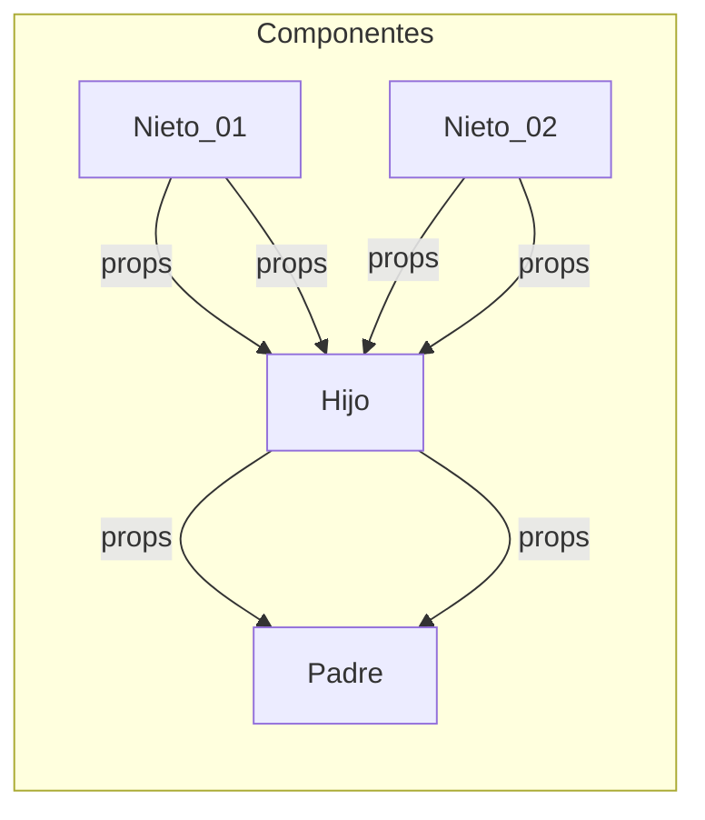

# React Desde Cero - Curso de React Con Proyectos

> Estefania Cassingena Navone
> Inicio: `17-09-2023`
> Final: ``


## 1. Conceptos básicos de React
### React 

**Biblioteca** de JavaScript de código abierto (open source) diseñada para crear interfaces de usuario. 

Biblioteca 
Conjunto de implementaciones o subprogramas que podemos usar en nuestro código. 

Ventajas  
- Fácil de aprender y usar.
- Componentes reutilizables.
- Crear aplicaciones dinámicas.
- Buen desempeño. 

#### Componente 

Parte de la interfaz de usuario que es independiente y reusable. 

- Funcionales: Conciso de leer e implementar   
	Función de JavaScript/ES6 que retorna un elemento de React (JSX)

```js
function Saludo(props) {
  return <h1>¡Hola, {props.nombre}!</h1>;
}
```  
	Caracteristicas: 
	- Debe retornar un elemento de React (JSX).
	- Debe comenzar con una letra mayúscula. 
	- Puede recibir valores si es necesario (props). 

	Props:   
	Argumentos que puede recibir un componente de React.



- De clase: Se usaba y se usa en la actualidad

```js
```

## 2. Descargar e instalar Node.js
## 3. JavaScript XML (JSX)
## 4. Estructura básica de una aplicación de React


## Proyecto 01: Clon de testimonios de freeCodeCamp

## Proyecto 02: Contador de clics 

## Proyecto 03: Calculadora 

## Proyecto 04: Aplicación de tareas 

## Componentes de clase 

## Adaptar los primeros dos proyectos con componentes de clase

### Clon de testimonios 

### Contador de clics 