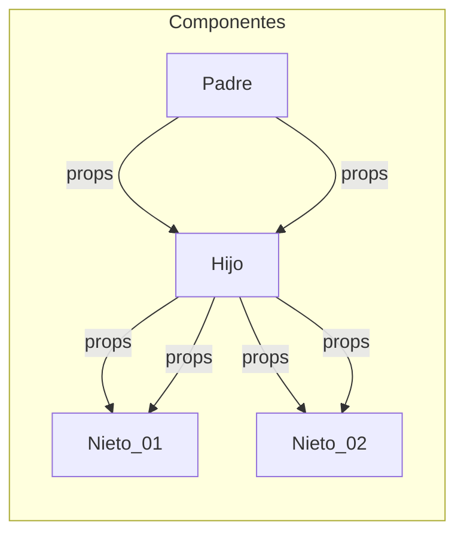
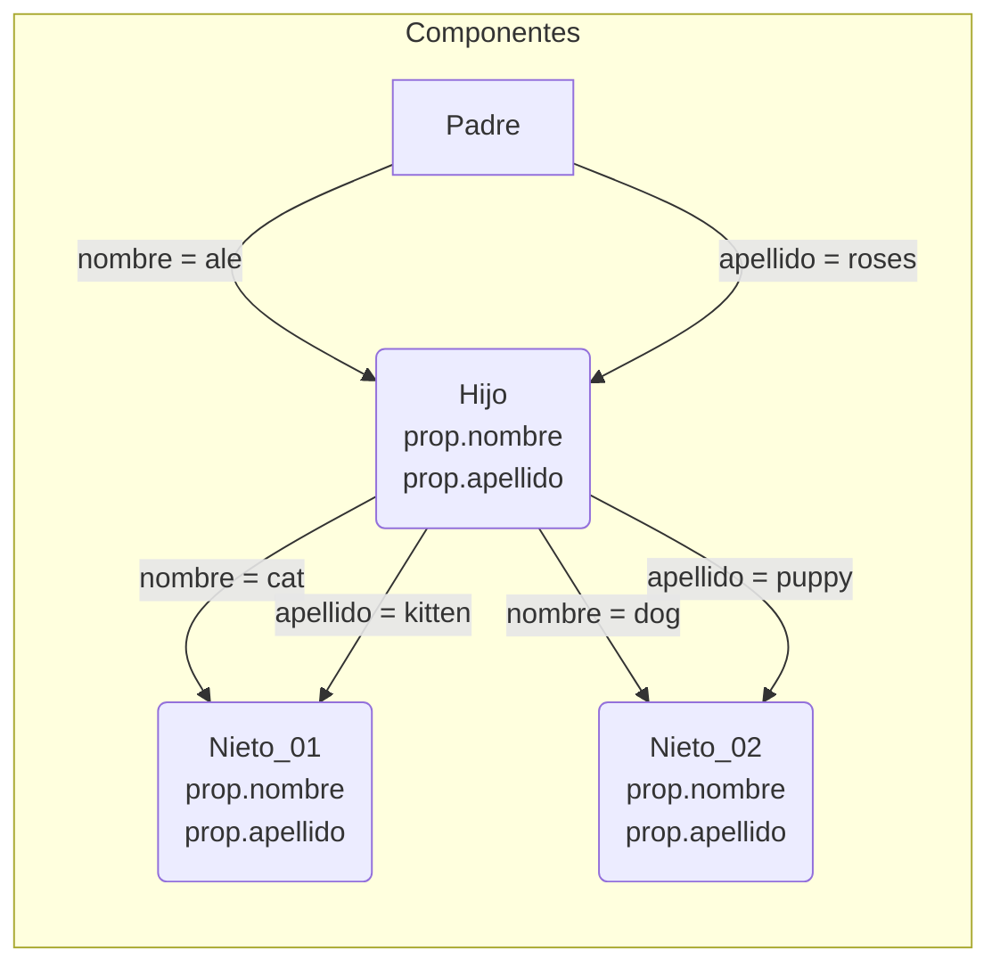

# React Desde Cero - Curso de React Con Proyectos

> Estefania Cassingena Navone  
> Inicio: `17-09-2023`  
> Final: ``

## 1. Conceptos básicos de React
### React 

**Biblioteca** de JavaScript de código abierto (open source) diseñada para crear interfaces de usuario. 

Biblioteca 
Conjunto de implementaciones o subprogramas que podemos usar en nuestro código. 

Ventajas  
- Fácil de aprender y usar.
- Componentes reutilizables.
- Crear aplicaciones dinámicas.
- Buen desempeño. 

### Componente 

Parte de la interfaz de usuario que es independiente y reusable. 

- Funcionales: Conciso de leer e implementar   
	Función de JavaScript/ES6 que retorna un elemento de React (JSX)

```js  👀👇
function Saludo(props) { 👀👇
  return <h1>¡Hola, {props.nombre}!</h1>;
}
```  
	Caracteristicas: 
	- Debe retornar un elemento de React (JSX).
	- Debe comenzar con una letra mayúscula. 
	- Puede recibir valores si es necesario (props). 

- De clase: Se usaba y se usa en la actualidad  
	Clase de ES6 (JavaScript moderno) que retorna un elemento JSX. 

```js         👀👇      👀👇
class Saludo extends React.Component {
  render() { 👈👀👆       👆👀👇
    return <h1>¡Hola, {this.props.nombre}!</h1>;
  }
}
```
	Caracteristicas: 
	- Debe extender React.Component.
	- Debe tener un método render() para retornar un elemento de JSX.
	- Puede recibir valores si es necesario (props). 

### Props:   

Argumentos que puede recibir un componente de React. Se usa la notación de `.` para poder acceder a las propiedades que le pasemos al componente `Saludo` esto debido a que se comporta como un objeto.

	📌 Los props solo pueden ser enviados de padre a hijo (cascada).





En React, cuando utilizas la sintaxis `prop.apellido` estás accediendo a una propiedad (prop) llamada "apellido" que ha sido pasada a ese componente como un dato desde su componente padre.

### Estado (State): 

Representación en JavaScript del conjunto de propiedades de un componente y sus **valores actuales**. Propiedades no se refiere a los props, sino a información que se representa sobre el componente. 

¿Por qué Componentes de Clase?   
Anteriormente, usábamos componentes de clase para poder trabajar con "estados" de nuestro componente. 

En versiones anteriores de React (anteriores a 16.8), no podíamos hacerlo en componentes funcionales. 

Luego llegaron los `Hooks`...

Ahora sí podemos asignar y actualizar el estado de un componente funcional en React con los hooks. 

### Hooks

Función especial que te permite trabajar con estados en componentes funcionales y otros aspectos de React. 

Esto sin escribir un componente de clase. Esto nos permite escribir código mucho más conciso y fácil de entender. 

### Event Listener 

Función en JavaScript que es ejecutada cuando ocurre un evento específico. También podemos referirnos a esta función como "Event Handler" 

## 2. Descargar e instalar Node.js

[Node.js](https://nodejs.org/es/download) es un entorno de ejecución para JavaScript construido con V8, motor de JavaScript de Chrome. 

Luego de hacer la instalación verifica la versión instalada: 

```bash
node -v
```

[Documentación de React](https://react.dev/)

## 3. JavaScript XML (JSX)

Extensión de React para la sintaxis de JavaScript.   
Nos permite describir en JavaScript cómo  se verán los componentes usando una estructura similar a HTML. 

Ventajas:  
- Estructura más fácil de visualizar.
- Errores y advertencias más útiles. 

📌 JSX en opcional. 

```jsx
const element = <h1>¡Hola, Mundo!</h1>;
```

```jsx
import React from 'react';
import '../hojas-estilo/Contador.css';

function Contador({ numClics }) {
  return (
    <div className="contador"> ✨😲
      {numClics}
    </div>
  );
}

export default Contador;
```

### Elemento

Unidades más pequeñas en React. Definen lo que se ve en la pantalla. 

	Elementos vs. Componentes   
	Los componentes en React están hechos de elementos JSX (div, h1, image). 

```jsx
// root es manejado por React DOM
<div id="root">¡Hola, Mundo!</div>;
```

	React DOM  
	Paquete que facilita la interacción y actualización del DOM en aplicaciones React. 

	DOM (Document Object Model)  
	Es una representación en el navegador de todos los elementos que conforman una página o aplicación web. 


	Con JSX, puedes crear y usar cualquier elemento HTML.   
	- <div>
	- 
	- <a>
	- <header>
	- <nav>
	- <p>
	- <h1>
	- <button>
	- <h2>

¿Cómo reconocerlos?  
En JSX, los elementos HTML se representan con etiquetas en letras **minúsculas**. 

En cambio, los componentes definidos por el usuario comienzan con una letra **mayúscula**. 

```jsx
<div className="contenedor">
  <Pantalla input={input}/>;
  <div className="fila">
    <Boton manejarClic={agregarInput}>1</Boton>;
    <Boton manejarClic={agregarInput}>2</Boton>;
    <Boton manejarClic={agregarInput}>3</Boton>;
  </div>
</div>;
```

	Atributos  
	Puedes agregar atributos a tus elementos en JSX para especificar ciertas características. Pero... algunos atributos se escriben de forma distinta si los comparamos con HTML. 

```html
  👀👇 HTML
<h1 class="titulo-azul"></h1>;
```

```jsx
   👀👇 JSX (camelCase)
<h1 className="titulo-azul"></h1>;
```

`class` es una palabra reservada en JavaScript que podemos usar para crear una clase. Por eso necesitamos escribir este atributo de forma distinta en JSX. 

```html
  👀👇 HTML
<label for="css">CSS</label>;
```

```jsx
   👀👇 JSX (camelCase)
<label htmlFor="css">CSS</label>;
```

El atributo `style` acepta un objeto JavaScript con propiedades CSS escritas en `camelCase`. 

```html
👀👇 CSS
background-image
background-color
font-family
```

```jsx
👀👇 JSX
backgroundImage
backgroundColor
fontFamily
```

Dando Styles directamente en JS

```jsx
// Objeto JavaScript {}
const estiloDiv = {
  color: 'yellow',
  backgroundColor: 'black'
}
```

```jsx
   👀👇
<div style={estiloDiv}>¡Hola, Mundo!</div>;
```

Otra alternativa... 

```jsx
   👀👇                  👀👇
<div style={{color: 'yellow'}}>¡Hola, Mundo!</div>;
```

📌 El primer par de llaves nos permite insertar JavaScript como en el caso anterior que insertamos una variable. El segundo par de llaves interno permite definir un objeto de JavaScript (CSS). 

### Atributos del DOM reconocidos por React

React reconoce y utiliza varios atributos del DOM para trabajar con componentes y gestionar su estado. Algunos de los atributos más comunes reconocidos por React son:

- `className` (equivalente a `class` en HTML): Se utiliza para asignar una clase CSS al elemento.
- `style`: Permite aplicar estilos en línea al elemento utilizando un objeto de estilos en JavaScript.
- `id`: Asigna un identificador único al elemento.
- `onClick`: Define una función que se ejecuta cuando el elemento es clicado.
- `onChange`: Define una función que se ejecuta cuando el valor del elemento cambia, como en los elementos de formulario.
- `disabled`: Deshabilita el elemento para evitar interacciones.
- `value`: Establece el valor del elemento, como en los campos de entrada (`input`) y áreas de texto (`textarea`).
- `placeholder`: Muestra un texto temporal en un campo de entrada o un área de texto hasta que se introduce un valor.
- `src`: Define la ruta o URL de la fuente de una imagen, video, audio, etc.
- `alt`: Proporciona texto alternativo para ser mostrado si el elemento no se puede visualizar.

A continuación, te presento una tabla clasificando los atributos del DOM reconocidos y utilizados por React:

|Clasificación|Atributos del DOM|
|---|---|
|Control de Formulario|accept, autoComplete, autoFocus, capture, checked, disabled, form, formAction, formEncType, formMethod, formNoValidate, formTarget, inputMode, max, maxLength, min, minLength, multiple, name, noValidate, pattern, placeholder, readOnly, required, size, step, value|
|Eventos|onClick, onChange, onDoubleClick, onFocus, onBlur, onKeyDown, onKeyUp, onKeyPress, onMouseEnter, onMouseLeave, onScroll|
|Presentación|className, style, hidden, id, tabIndex|
|Multimedia|alt, controls, crossOrigin, loop, muted, poster, preload, src|
|Enlaces|href, hrefLang, rel, target|
|Tablas|colSpan, headers, rowSpan, scope|
|Formato de Contenido|content, dir, lang, media, mediaGroup, spellCheck, title|
|Otros|accessKey, allowFullScreen, allowTransparency, async, cellPadding, cellSpacing, challenge, charSet, cite, contextMenu, coords, data, dateTime, defer, download, draggable, encType, frameBorder, height, high, httpEquiv, icon, inputMode, integrity, is, keyParams, keyType, kind, label, list, low, manifest, marginHeight, marginWidth, minLength, optimum, playsInline, profile, radioGroup, reversed, role, rows, sandbox, seamless, selected, shape, sizes, srcDoc, srcLang, srcSet, start, summary, type, useMap, width, wmode, wrap|

Esta tabla clasifica los atributos del DOM reconocidos por React en diferentes categorías según su funcionalidad. Cada atributo se encuentra asociado a la clasificación correspondiente.

## 4. Estructura básica de una aplicación de React

Al igual que en HTML, los elementos pueden ser anidados en JSX para formar estructuras más complejas. 

```jsx
<div className="contenedor">
  <Pantalla input={input}/>;
  <div className="fila">
    <Boton manejarClic={agregarInput}>1</Boton>;
    <Boton manejarClic={agregarInput}>2</Boton>;
    <Boton manejarClic={agregarInput}>3</Boton>;
  </div>
</div>;
```

### Renderizar componentes 

```jsx
// root es manejado por React DOM
<div id="root"></div>;
```

En la estructura inicial tendremos un archivo HTML que va a tener un `div` este elemento tendrá un `id="root"` que va a actuar como la raíz de nuestra aplicación, será el contenedor principal de todos los componentes y elementos que creemos. 

Para agregar elementos al `div` anterior lo podemos hacer de la siguiente manera: 

```jsx
Variable 👀👇 para referirnos al Paquete
import ReactDOM from 'react-dom'; 👈👀
// Elemento a mostrar
const element = <h1>¡Hola, Mundo!</h1>;

👀👇
ReactDOM.render(
  element,
  document.getElementById('root')
);
```

### Self-Closing Tags 

Elemento que solo posee una etiqueta de apertura, ya que no contiene texto u otros elementos. 

```jsx
;
```

### JavaScript en JSX

Cuando veamos las llaves `{JS}` inmediatamente debemos pensar que dentro tenemos código JavaScript. 

```jsx
let adjetivo = "Interesante";
<p>React es {adjetivo}</p>;
```

Puedes escribir cualquier expresión válida de JavaScript entre las llaves y su valor será reemplazado. 

```jsx
<p>El resultado es: {5 * 6}</p>;
```

Usando métodos:  
```jsx
let nombre = "Ale";
<p>Su nombre es: {nombre.toUpperCase()}</p>;
```

## Proyecto 01: Clon de testimonios de freeCodeCamp

`Arrastra` la carpeta en donde vas a trabajar los proyectos y `suéltala` dentro de una ventana de Visual Studio Code totalmente limpia. También puedes ubicar la carpeta en la que vas a trabajar y darle clic derecho `Abrir con Code`. 

Abrimos la terminal `Ctrl + ñ` de Visual Studio Code y ejecutamos:    

```bash
// Crea una nueva carpeta para el proyecto
npx create-react-app mi-app

// Crea el proyecto en la misma carpeta
npx create-react-app .
```

Al finalizar te debe salir el siguiente mensaje: 

```bash
Success! Created my-app at C:\react\freeCodeCamp\my-app
Inside that directory, you can run several commands:

  npm start 👈👀✨
    Starts the development server.

  npm run build
    Bundles the app into static files for production.

  npm test
    Starts the test runner.      

  npm run eject
    Removes this tool and copies 
build dependencies, configuration files
    and scripts into the app directory. If you do this, you can’t go back!

We suggest that you begin by typing:

  cd my-app 👈👀✨
  npm start 👈👀✨

Happy hacking!
```

Ahora desde la terminal nos movemos a la carpeta creada, la cual tiene nuestro proyecto inicial y lo abrimos con Visual Studio Code. 

```bash
cd my-app/
code ./ -r
```

Ahora, debes ver la siguiente estructura de carpetas y archivos: 

```bash
├── node_modules
├── package-lock.json
├── package.json
├── public
│   ├── favicon.ico
│   ├── index.html 👈👀✨
│   ├── logo192.png
│   ├── logo512.png
│   ├── manifest.json
│   └── robots.txt
└── src
    ├── App.css
    ├── App.js
    ├── App.test.js
    ├── index.css
    ├── index.js
    ├── logo.svg
    ├── reportWebVitals.js
    └── setupTests.js
```

Veamos que tiene nuestro proyecto:  
```bash
npm start
```

Esto abrirá nuestro proyecto en el navegador usando `localhost:3000` esto quiere decir que nuestra PC está actuando como un servidor local para poder acceder a los archivos de la aplicación y mostrar sus resultados. 

Puedes ver más sobre el contenido de los archivos de nuestro proyecto en estos apuntes hechos anteriormente: 

[Carpetas y Archivos de la clase](https://github.com/aleroses/Platzi/blob/master/DW/3-avanzado/1.react.js/react.js.md#carpetas-y-archivos-de-la-clase)

### Empezar proyecto de testimonios 

Tengo la siguiente estructura y dentro de la carpeta `freeCodeCamp` crearé un nuevo proyecto y al final se verá algo así. 

```bash
.
├── freeCodeCamp
│   └── my-app
│   └── testimony 👈👀✨
```

Creamos el proyecto: 
```bash
npx create-react-app testimony 👈👀
cd testimony/
code ./ -r
```

### Identificar los Componentes

Creamos algunos archivos como `src > components > Testimony.js` y `src > imagenes` a la que le agregamos las imágenes a usar, estas las podemos descargar aquí [repo: testimonios-freecodecamp](https://github.com/estefaniacn/testimonios-freecodecamp/tree/master/src/imagenes).

Debemos tener los siguientes archivos:  
```bash
.
├── node_modules
├── package-lock.json
├── package.json
├── public
│   ├── index.html
│   ├── manifest.json
│   └── robots.txt
└── src
    ├── App.css
    ├── App.js
    ├── components 👈👀👇
    │   └── Testimony.js
    ├── imagenes 👈👀👇
    │   ├── testimonio-emma.png
    │   ├── testimonio-sarah.png
    │   └── testimonio-shawn.png
    ├── index.css
    ├── index.js
    └── stylesheets 👈👀👇
        └── Testimonio.css
```

Ejecutamos el proyecto:  
```bash
npm start
```

#### ✨ Configurar Indentación o Espaciado:    

Presiona `F1` busca la opción `Indent Using Spaces` y elige `2`. También puedes acceder desde la parte inferior del editor, aparece `Space: 4` le das clic y cambias a `2`, ya que es un estándar. 

Adicional puedes buscar `Convert Indentation to Spaces` para que cada indentación hecha con el tabulador se transforme a espacios, en este caso a 2 espacios. Esto nos ayuda a que no se distorsione el código cuando lo subamos a GitHub. 

#### Extensión React Developer Tools

Utiliza las Herramientas de Desarrollo de React (React Developer Tools) **para inspeccionar componentes de React, editar props y estado, e identificar problemas de rendimiento**.

[Extensión React Developer Tools](https://chrome.google.com/webstore/detail/react-developer-tools/fmkadmapgofadopljbjfkapdkoienihi?hl=es)


📌 La extensión en los archivos `jsx` es igual a `js`, no hay diferencia.


### Código del proyecto Testimonios 

`public > index.html`   
```html
<body>
  <noscript>You need to enable JavaScript to run this app.</noscript>
  <div id="root"></div> 👈👀
</body>
```

`src > index.js`
```jsx
import React from "react";
import ReactDOM from "react-dom/client";
import "./index.css";
import App from "./App";

const root = ReactDOM.createRoot(document.getElementById("root"));
root.render(
  <React.StrictMode>
    <App /> 👈👀 // Componente
  </React.StrictMode>
);
```

`src > App.js`
```jsx
import "./App.css";
// Puedes agregar u omitir la extensión.js 👈👀👇
import { Testimonio } from "./components/Testimony";

function App() { 👈👀 // Componente usado en el index.js
  return (
    <div className="App">
      <h1>Esto es lo que dicen nuestros alumnos sobre FreeCodeCamp:</h1>
      <div className="contenedor-principal">
        <Testimonio
          nombre="Shawn Wang"
          pais="Singapur"
          imagen="shawn"
          cargo="Ingeniero de Software"
          empresa="Amazon"
          testimonio="Da miedo cambiar de carrera. Solo gané la confianza de que podía programar trabajando a través de los cientos de horas de lecciones gratuitas en freeCodeCamp. Dentro de un año tuve un trabajo de seis cifras como ingeniero de software. freeCodeCamp cambió mi vida."
        />
        <Testimonio
          nombre="Sarah Chima"
          pais="Nigeria"
          imagen="sarah"
          cargo="Ingeniera de Software"
          empresa="ChatDesk"
          testimonio="FreeCodeCamp fue la puerta de entrada a mi carrera como desarrollador de software. El plan de estudios bien estructurado llevó mis conocimientos de programación de un nivel de principiante total a un nivel muy seguro. Era todo lo que necesitaba para conseguir mi primer trabajo de desarrollador en una empresa increíble."
        />
        <Testimonio
          nombre="Emma Bostian"
          pais="Suecia"
          imagen="emma"
          cargo="Ingeniero de Software"
          empresa="Spotify"
          testimonio="Siempre he tenido problemas para aprender JavaScript. He tomado muchos cursos, pero el curso de freeCodeCamp fue el que se quedó. Estudiar JavaScript, así como estructuras de datos y algoritmos en freeCodeCamp me dio las habilidades y la confianza que necesitaba para conseguir el trabajo de mis sueños como ingeniero de software en Spotify."
        />
      </div>
    </div>
  );
}

export default App;
```

`src > components > Testimony.js`
```jsx
import React from "react";
import "../stylesheets/Testimonio.css";

// export function Testimonio(){} 👈👀 también se puede
function Testimonio(props) {
  return (
    <div className="contenedor-testimonio">
      
      <div className="contenedor-texto-testimonio">
        <p className="nombre-testimonio">
          <strong>{props.nombre}</strong> en {props.pais}
        </p>
        <p className="cargo-testimonio">
          {props.cargo} en <strong>{props.empresa}</strong>
        </p>
        <p className="texto-testimonio">"{props.testimonio}"</p>
      </div>
    </div>
  );
}

// Exportación por defecto
// export default Testimonio; 👈👀

// Exportación nombrada
export { Testimonio }; 👈👀

```

☘ Reto: Separar los datos o testimonios, quizá en un objeto `{ }` o array `[ ]` en su propio archivo y por último actualizar el `alt` de cada imagen según corresponda. 

## Proyecto 02: Contador de clics 

```bash
pwd
  /c/react/freeCodeCamp 👈👀
npx create-react-app click-contador
cd click-contador
code ./ -r
ctrl + ñ 👈👀✨
npm start
```

📌 Para matar un proceso en la CLI, usar `Ctrl + c`.

Ahora debemos importar la imagen a usar, pero primero la descargamos de [repo: contador-de-clicks](https://github.com/estefaniacn/contador-de-clics-freecodecamp/blob/master/src/imagenes/freecodecamp-logo.png)

### Código 

Para este proyecto necesitamos la siguiente estructura: 

```bash
.
├── node_modules
├── package-lock.json
├── package.json
├── public
│   ├── index.html
│   ├── manifest.json
│   └── robots.txt
└── src
    ├── App.css
    ├── App.js
    ├── components 👈👀👇
    │   ├── Button.js
    │   └── Contador.js
    ├── images 👈👀👇
    │   └── freecodecamp-logo.png
    ├── index.css
    ├── index.js
    └── stylesheets 👈👀👇
        ├── Contador.css
        └── Button.css
```

`public > index.html`  

```html
<body>
  <noscript>You need to enable JavaScript to run this app.</noscript>
  <div id="root"></div> 👈👀✨
</body>
```

`src > index.js > `
```jsx
import React from "react";
import ReactDOM from "react-dom/client";
import "./index.css";
import App from "./App";

const root = ReactDOM.createRoot(document.getElementById("root")); 👈👀
root.render(
  <React.StrictMode>
    <App /> 👈👀
  </React.StrictMode>
);
```

`src > App.js`  
```jsx
import "./App.css";
import { Button } from "./components/Button";
import { Contador } from "./components/Contador";
import freeCodeCampLogo from "./images/freecodecamp-logo.png";
import { useState } from "react";

function App() {
  const [numClics, setNumClics] = useState(0);

  const manejarClic = () => {
    setNumClics(numClics + 1);
  };

  const reiniciarContador = () => {
    setNumClics(0)
  };

  return (
    <div className="App">
      <div className="freecodecamp-logo-contenedor">
        
      </div>
      <div className="contenedor-principal">
        <Contador numClics={numClics} />
        <Button texto="Clic" esBotonDeClic={true} manejarClic={manejarClic} />
        <Button
          texto="Reiniciar"
          esBotonDeClic={false}
          manejarClic={reiniciarContador}
        />
      </div>
    </div>
  );
}

export default App;
```

`src > components > Contador.js`
```jsx
import React from "react";
import "../stylesheets/Contador.css";

function Contador({ numClics }) {
  return <div className="contador">{numClics}</div>;
}

export { Contador };
```

`src > components > Button.js`
```jsx
import React from "react";
import '../stylesheets/Button.css'

function Button({ texto, esBotonDeClic, manejarClic }) {
  return (
    <button
      className={esBotonDeClic ? "boton-clic" : "boton-reiniciar"}
      onClick={manejarClic}
    >
      {texto}
    </button>
  );
}

export { Button };
```

### Nombrar eventos y funciones 

En React, hay algunas convenciones comunes para nombrar eventos y las funciones que manejan esos eventos. Aquí tienes algunas convenciones populares:

1. Eventos: Los nombres de los eventos se escriben en minúsculas y siguen la convención camelCase. Por ejemplo, "onClick", "onChange", "onSubmit", etc.

2. Funciones manejadoras de eventos: Las funciones que manejan los eventos generalmente se nombran utilizando el prefijo "handle" seguido del nombre del evento en camelCase. Por ejemplo, "handleClick", "handleChange", "handleSubmit", etc.

3. Eventos en componentes: Cuando agregas un controlador de eventos a un elemento en un componente, generalmente se utiliza la forma abreviada de la sintaxis de arrow function o se enlaza el contexto en el constructor o mediante la función `bind`. Por ejemplo:

```jsx
class MyComponent extends React.Component {
  handleClick = () => {
    // Lógica del evento
  }

  render() {
    return (
      <button onClick={this.handleClick}>Click aquí</button>
    );
  }
}
```

Estas convenciones no son obligatorias, pero son ampliamente utilizadas y ayudan a mantener un código más legible y consistente en proyectos de React. Recuerda que lo más importante es mantener una convención que se ajuste a tu equipo y ser coherente en su aplicación a lo largo del código.

### Prettier (extensión)

Para agregar automáticamente los puntos y comas al guardar usando `Ctrl + s` puedes usar **Prettier**. Además, permite personalizar algunas otras cosas, te dejo mis [Apuntes Prettier](https://github.com/aleroses/Platzi/blob/master/DW/1-basico/3-prework/entorno-windows/vsc/prettier.md)

### `import React from "react";`

En versiones actuales de React ya no es necesario el `import React from "react";` solo debemos importar los hooks que vayamos a usar. 

## Proyecto 03: Calculadora 

```bash
cd ..
npx create-react-app calculator
cd calculator/
code ./ -r
npm start
```

### `isNaN` 

En JavaScript, la función `isNaN` se utiliza para comprobar si un valor es NaN (Not-a-Number) o no. NaN es un valor especial en JavaScript que representa la falta de un valor numérico válido.

La sintaxis de `isNaN` es la siguiente:

```javascript
isNaN(valor)
```

Donde `valor` es el valor que se desea comprobar si es NaN o no.

La función `isNaN` devuelve `true` si el valor pasado como argumento es NaN, y devuelve `false` si el valor es un número válido o cualquier otro tipo de dato.

Aquí tienes algunos ejemplos de cómo se puede utilizar `isNaN`:

```javascript
console.log(isNaN(123));        // false, 123 es un número válido
console.log(isNaN('456'));      // false, '456' se puede convertir a un número
console.log(isNaN('abc'));      // true, 'abc' no se puede convertir a un número
console.log(isNaN(true));       // false, true se convierte a 1, que es un número válido
console.log(isNaN(undefined));  // true, undefined no se puede convertir a un número
console.log(isNaN(null));       // false, null se convierte a 0, que es un número válido
```

Es importante tener en cuenta que `isNaN` intentará convertir el valor a un número antes de realizar la comprobación. Si el valor no se puede convertir a un número, se considerará como NaN.

### Propiedad `flex`

La propiedad `flex` admite diferentes combinaciones de valores. La forma completa de la propiedad `flex` es la siguiente:

```css
flex: <flex-grow> <flex-shrink> <flex-basis>;
```

Aquí tienes una descripción de cada valor:

- `<flex-grow>`: Define cómo se distribuye el espacio adicional entre los elementos flex. Es un número que indica la proporción en la que el elemento debe crecer en relación con los demás elementos flex. Por ejemplo, si un elemento tiene `flex-grow: 2` y otro tiene `flex-grow: 1`, el primero crecerá el doble que el segundo cuando haya espacio disponible.

- `<flex-shrink>`: Indica cómo se reduce el tamaño de los elementos flex cuando el espacio disponible es insuficiente. Es un número que determina la proporción en la que el elemento debe encogerse en relación con los demás elementos flex. Por ejemplo, si un elemento tiene `flex-shrink: 2` y otro tiene `flex-shrink: 1`, el primero se reducirá el doble que el segundo cuando no haya suficiente espacio.

- `<flex-basis>`: Establece el tamaño inicial del elemento antes de que se distribuya el espacio adicional o se reduzca su tamaño. Puede ser un valor en píxeles (`px`), porcentaje (`%`), `auto` u otros valores válidos para dimensiones CSS. Por defecto, es `auto`, lo que significa que el tamaño se determina según el contenido del elemento.

Por lo tanto, `flex: 1 1` es una forma abreviada de establecer tanto `flex-grow` como `flex-shrink` en 1, mientras que `flex-basis` se deja en su valor predeterminado (`auto`). Esto es útil cuando se desea que los elementos flex se expandan y se contraigan de manera equitativa.

Sin embargo, también puedes especificar valores diferentes para `flex-grow`, `flex-shrink` y `flex-basis` según tus necesidades. Por ejemplo:

```css
.container {
  display: flex;
}

.item {
  flex: 2 0 100px;
}
```

En este caso, el elemento tendrá un `flex-grow` de 2, un `flex-shrink` de 0 y un `flex-basis` de 100 píxeles.

Recuerda que `flex: 1 1` es simplemente una opción común y conveniente para establecer valores iguales para `flex-grow` y `flex-shrink` sin especificar `flex-basis`. Sin embargo, puedes personalizar los valores según tus requisitos específicos.

### Propiedad `user-select `

La propiedad CSS `user-select` se utiliza para controlar si los usuarios pueden seleccionar texto en elementos HTML y cómo se puede realizar la selección. Esta propiedad es útil cuando deseas restringir o permitir la selección de texto en ciertas partes de tu página web.

La sintaxis básica del `user-select` es la siguiente:

```css
elemento {
  user-select: valor;
}
```

Donde `elemento` es el selector del elemento HTML al que deseas aplicar la propiedad `user-select`, y `valor` es uno de los siguientes:

- `none`: No se permite la selección de texto dentro del elemento ni sus descendientes. El texto no se puede resaltar ni copiar.

- `auto`: La selección de texto está permitida dentro del elemento y sus descendientes. Es el valor predeterminado del navegador.

- `text`: Se permite la selección de texto dentro del elemento y sus descendientes. El texto se puede resaltar y copiar.

- `all`: Se permite la selección de texto dentro del elemento y sus descendientes. Además, el texto se resalta de manera visualmente distintiva para indicar que se puede seleccionar.

Aquí tienes un ejemplo de cómo se puede utilizar `user-select` en CSS:

```css
p {
  user-select: none;
}

div.highlightable {
  user-select: text;
}

span.select-all {
  user-select: all;
}
```

En este ejemplo, los elementos `p` tienen la selección de texto desactivada (`user-select: none`). Los elementos `div` con la clase `.highlightable` permiten la selección de texto (`user-select: text`). Y los elementos `span` con la clase `.select-all` no solo permiten la selección de texto, sino que también resaltan visualmente el texto seleccionable (`user-select: all`).

Es importante destacar que la propiedad `user-select` no brinda una protección de seguridad real contra la copia de contenido. Es posible que los usuarios avanzados o aquellos que deshabiliten los estilos CSS puedan seleccionar el texto independientemente de la configuración de `user-select`.


5:00

`src > components > `
```jsx
```

## Proyecto 04: Aplicación de tareas 

## Componentes de clase 

## Adaptar los primeros dos proyectos con componentes de clase

### Clon de testimonios 

### Contador de clics 